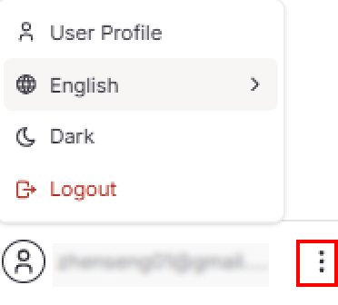
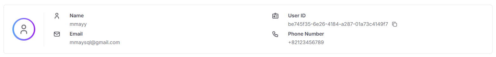
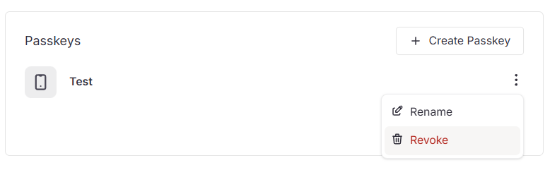
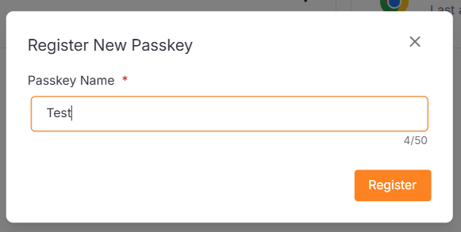
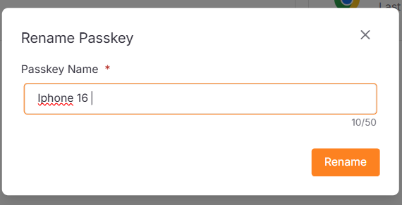
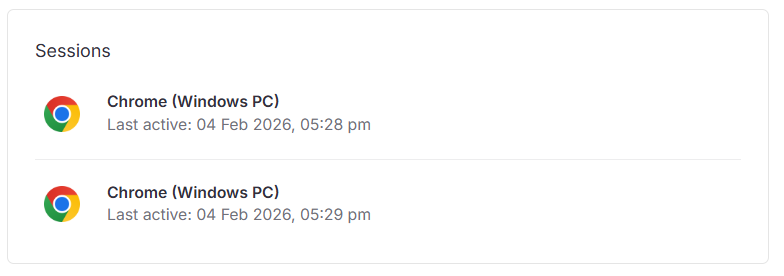

## Overview

The Side Menu is the secondary navigation component for the e-Commerce integration system.

| Actions                   | Description                                |
|---------------------------|--------------------------------------------|
| **User Profile** 👤       | Manage user profile, passkeys and sessions |
| **Switch Company** 🔄     | Switch between multiple company accounts   |
| **Language Selection** 🌐 | Change language                            |
| **Theme Toggle** 🌙       | Change light or dark theme                 |

## User Profile

The User Profile page displays your account information.

| Field            | Description                        |
|------------------|------------------------------------|
| **Name**         | Your display name                  |
| **Email**        | Your registered email address      |
| **User ID**      | Unique identifier for your account |
| **Phone Number** | Contact phone number               |

### Update User Profile

1. Click the **Edit Profile** button.

   

2. Update the fields and click **Save**.

   

## Passkeys

Manage your registered passkeys for secure authentication.

### Register New Passkey

1. Click **Create Passkey** button.

   

2. Enter a **Passkey Name** to help you identify this device later.

   

3. Click **Register**, then complete the authentication prompt on your device.

   

### Rename Passkey

1. Click the **More** icon and select **Rename**.

2. Rename your passkey and click **Save**.

   

### Revoke Passkey

1. Click the **More** icon and select **Revoke** to remove the passkey immediately.

## Sessions

View your active login sessions across different devices and browsers.

### Logout Sessions

1. Click on the session.

   

2. Click **Confirm** to revoke.

   
