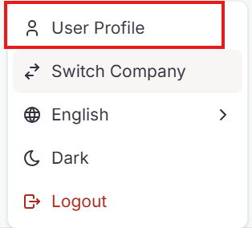
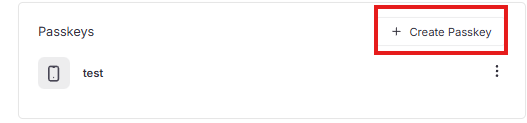
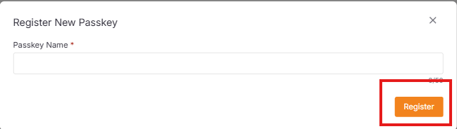
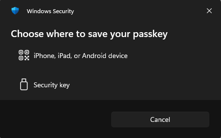

The side menu is the secondary navigation component for the e-Commerce integration system.

## Profile Actions

1. **User Profile** 👤
   - **Register Passkey** & **Manage Session**
   - **View** and **Edit** personal profile information

2. **Switch Company** 🔄
   - Switch between multiple company accounts
   - Back to **Company List Page**

3. **Language Selection** 🌐
   - Change language of X-Store

4. **Theme Toggle** 🌙
   - Toggle between light and dark themes
   - Persists user preference

---

## User Profile

The User Profile page displays your account information and security settings.

### Profile Information

| Field | Description |
|-------|-------------|
| **Name** | Your display name |
| **Email** | Your registered email address |
| **User ID** | Unique identifier for your account |
| **Phone Number** | Contact phone number |

### Passkeys

Manage your registered passkeys for secure authentication.

- Click **+ Create Passkey** to register a new passkey
- View existing passkeys with actions menu

### Sessions

View your active login sessions across different devices and browsers.

---

## Update User Profile

Edit your profile information from the User Profile page.

### Editable Fields

Click **Save** to apply changes or **Cancel** to discard.

---

## Register New Passkey

Create a new passkey for passwordless authentication.

### Steps to Register

1. Click **+ Create Passkey** from the User Profile page
2. Enter a **Passkey Name** (required, max 50 characters)

3. Click **Register** to complete the process

4. Choose where to save the passkey
5. Follow your device's authentication prompt

---
