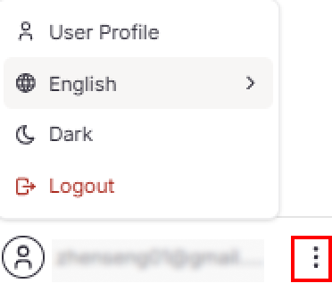

# Side Menu Navigation

The side menu is the primary navigation component for the e-Commerce integration system. It provides quick access to all major features and settings within the application.

### User Profile Section
#### Profile Actions

1. **User Profile** 👤
   - **Register Passkey** & **Manage Session**
   - **View** and **Edit** personal profile information

2. **Switch Company** 🔄
   - Switch between multiple company accounts
   - Back to **Company List Page**

3. **Language Selection** 🌐
   - Change language of EStore

4. **Theme Toggle** 🌙
   - Toggle between light and dark themes
   - Persists user preference

---

