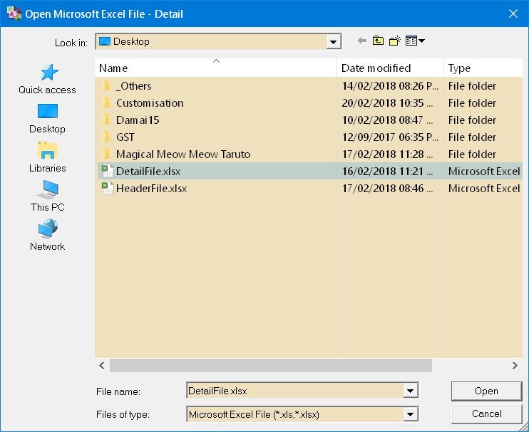
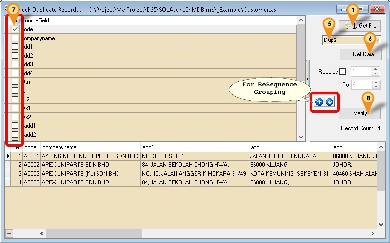
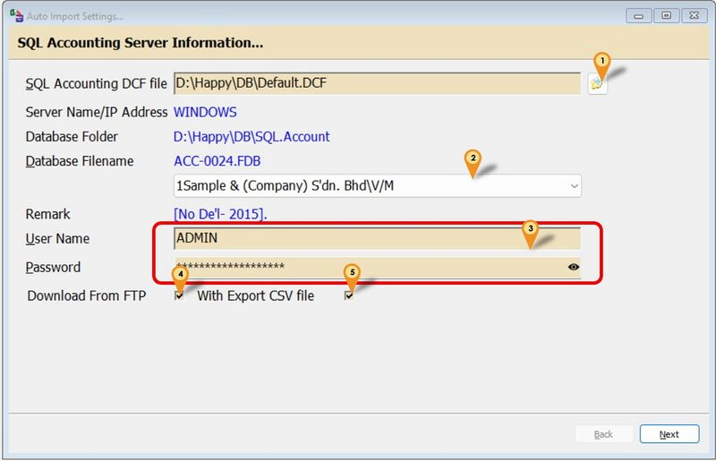
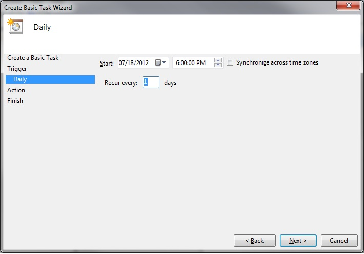
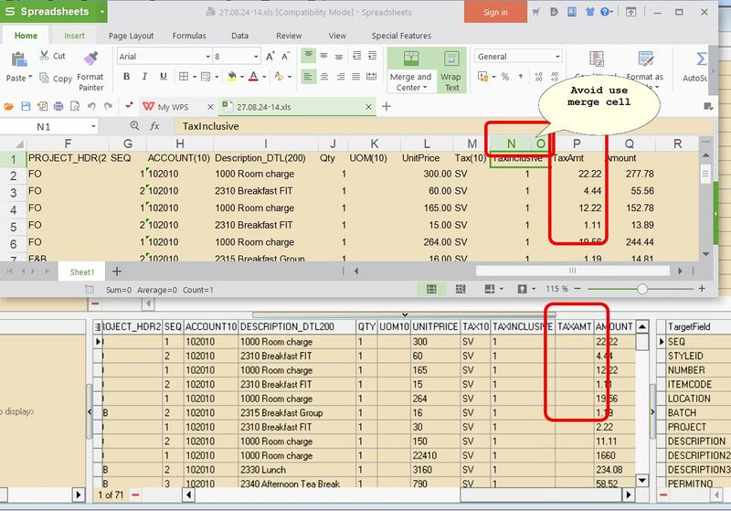

:::info[Download]
Click [here](https://download.sql.com.my/customer/Fairy/SQLAccXLSnMDBImp-setup.exe) to download the XLS n MDB import utility program.
:::

Whether you are setting up **SQL Account** for the first time or need to migrate financial data from other systems using **Microsoft Excel (XLS)** or **CSV** files, this page provides a straightforward solution.

Here, you'll find a detailed guide on how to effectively and effortlessly import your data into your **SQL Accounting** system.

**You can import:**

- Master file (e.g. Debtors, Creditors & Item List)
- Transactions
- Nestle Transactions
- Yeos Transactions
- Coca-Cola Transactions
- GSK Transactions

**Pros**

- Easy to generate
- About 80% of modules is covered.
- Support GST/SST/E-Invoicing
- FREE import for Master file.
- Support Schedule Auto Download from Simple FTP - Only available in Version 5.10.6.32 & above
- Support Schedule Auto Import for Excel/CSV/TXT - Only available in Version 5.10.6.32 & above
- Support import CSV/TXT(`Bar(|)`,`Comma(,)`,`Semi Comma(;)`,`Tilde(~)`) Format - Only available in Version 5.10.9 & above
- Support import Json Format - Only available in Version 5.11.10.43 & above
- No rows limit (but recommended max 500 rows per file as more records, more hard & time consumption to check if have error)

**Cons**

- Is Batch update.
- There is a cost for End User and Dealer for Transaction import. Only Free if each file record less then 100 rows.
- Unable to import Serial Number

**Pros (UE Only) - (Deprecated)**

- Easy to generate
- Able update Stock Information.
- Can do New/Insert/Edit/Update action

**Cons (UE Only) - (Deprecated)**

- There is a cost for End User and Dealer. Only Free if each file record less then 100.
- Only Cover Maintain Stock Item.

## Requirement

- Firebird Server
- SQL Accounting
- Microsoft Excel or Access

## Example Template

- Updated 16 Jun 2025
- [Example Template-SQLAcc-ImportExcel](https://docs.google.com/spreadsheets/d/1TcFVqH1VCJ5SjHAt2VCHIeTTcQVUjtIBxLaZGGM0E5k/edit#gid=1780239004)
- [Sample output](https://download.sql.com.my/customer/Fairy/Example-CSV.zip)

:::info

**Tips for Programmer to Export Transaction**
01. Use INNER JOIN SQL to join the Master & Detail table
02. Export to Excel, txt or CSV file

:::

:::info

**Tips for Yeos Transaction Import**
User might had to adjust some data in the excel file
01. Remove the 1st row(i.e 1st row must be a title of the column)
02. PRD Qty & Gross AMT column need * -1 (only for Credit Note) or can use
    [My Excel for Credit Note/Payment is in Negative Value, can it be import?](Http://google.com)

**Tips for Coca-Cola Transaction Import**
User might had to at Coca-Cola system before export
01. Group the ARTNUM
02. Net the AMTSUBJECTTOGST & GSTAMT column
It might had rounding issue after import
(i.e. excel not match with Tax Invoice Issue from coca-cola)

**Tips for GSK Transaction Import**
01. User might had to convert the file to excel file
02. Export File by Document Type (i.e. Invoice 1 file & Credit Note 1 file)
:::

## Things to Consider

- Float, Currency & Integer type Must not had , (comma) or Currency Symbol & Default Value is 0 not empty
- No Formula in the cell
- No Merge cell is use
- No Hidden column
- Avoid use Unicode Character for Row 1 (Header)
- Date Format should be in dd/mm/yyyy (entry time in Excel as dd/mm/yyyy) - Updated 14 Nov 2013

 

- Below is the column type can/can't import

- Try just use Alphanumeric of the **Worksheet Name**

- Make sure the **Key of Records** is properly Sorted

- Special Character (for csv or txt output only)

| User Input            | Text Output                     |
|-----------------------|----------------------------------|
| SalesOrder            | `SalesOrder`                    |
| Sales Order 5' 12"    | `"Sales Order 5' 12""`           |
| SalesOrder6'13"       | `"SalesOrder6'13""`              |
| SalesOrder6" x 13"    | `"SalesOrder6"" x 13""`          |
| Sales Order           | `"Sales Order"`                 |
| Sales Order 5' 12     | `"Sales Order 5' 12"`            |
| Sales Order 12"       | `"Sales Order 12""`              |
| Sales;Order 12        | `"Sales;Order 12"`               |

:::info
For Easy Export you can use " for all output value
Eg `AL`,`161924123243970563`
:::

## Import Program

- Version (5.19.19.104) - 02 Aug 2025
- Version (4.5.4.37) - 01 Jun 2022 (UE Only) - (Deprecated)
- Evaluation Limit : 100 rows Records per file (Except Master File with not limit)
- [SQLAccXLSnMDBImp-setup.exe](https://download.sql.com.my/customer/Fairy/SQLAccXLSnMDBImp-setup.exe)
- MD5 : `A03B8F018B92822D4D3CC59680D9B812`

## Steps

### Master Data

Below is example for import Stock Item...

01. Click 1. Get File button
02. Select the File type (eg Microsoft Excel)

03. Select the File file wanted to import
04. Click **Open**

05. Click the combo box (Circle in Red) to select the Worksheet/Table in the file
06. Click **2. Get Data** button to load the file.
07. Drag the available column at the **SourceField** & drop to the **TargetField**.
08. For Detail Part (Circle in Green) (Eg Click on the UOM tab).
09. Click **New** button.
10. Drag the available column at the **SourceField** & drop to the **TargetField** at detail part.
11. Click **Save** after Done (only for Detail Part).
12. Click **Post To A/c** button if all done mapping.

:::info
Blue Circle - Is use to let system know Start from which row till End which row to import.
Orange Circle - The Worksheet/Table records.
:::

## Transaction Data

Below is example for import Customer Invoice...

01. Click 1. Get File button
02. Select the File type (eg Microsoft Excel)

    

03. Select the File file wanted to import
04. Click Open

    

05. Click the combo box (Icon 5) to select the Worksheet/Table in the file
06. Click 2. Get Data button to load the file.
07. Tick the Is Opening Transactions to import opening balance (Available for AR & AP Module Only).
08. Drag the available column at the SourceField & drop to the TargetField.
09. Click 3. Verify button.
10. Click 4. Post To A/c button if confirm all data is Ok.

:::info
Do you realise there is an arrow near the **Verify** button?
In the arrow there is an Option **A.Load Setting...,** this to load previously mapped fields
:::

## Transactions Data - Get File 3

- This Option only for Excel
- Only available in Version 4.6.3.19 & above

01. Click arrow at the 1. Get File button
    

02. Select Get File 3... & system will prompt 2 dialog like below
    

03. Select the Excel Header File.
    

04. Select the Excel Detail File.
    

05. Click the combo box to select the Worksheet/Table for each Header & Detail file
06. Click the combo box to select the Key Field to link both Header & Detail file
07. Click **4. Get Data** button
    

08. Enter the Merge File name.
09. Click Save button.

## Options

- Only available in Version 4.3.2.14 & above

### Check Duplicate Records

Menu: Tools | Check Duplicate Records...

This Function is to check the duplicate records for the selected file
01. Follow from Step [1 to 6](#transaction-data) as above.
    
02. Tick the Column(s) to Group
03. Click 3. Verify... button
    

### Split Memo to Columns

Menu: Tools | Split Memo to Columns...

This option is to Split the memo (Data more then 1 row in the cell) into individual Columns.
01. Follow from Step [1 to 6](#transaction-data) as above.
    
02. Set Number of Column(s) to split (Default is 4).
03. Select the Column to be Split
04. Click **5. Split** button.
    
05. Scroll to the right. Highlight in Yellow is the newly Columns Created.
06. Click 6. Export Excel(*.xls) to export out the Result.

### Split String to Columns

Menu: Tools | Split String to Columns...

This option is to Split the Long String into individual Columns (Max. 60 Character each Column).

- Only available in Version 5.10.10.42 & above

01. Follow from Step [1 to 6](#transaction-data) as above.
    
02. Set Number of Column(s) to split (Default is 4).
03. Select the Column to be Split
04. Click 5. Split button.
    
05. Scroll to the right. Highlight in Yellow is the newly Columns Created.
06. Click 6. Export Excel(*.xls) to export out the Result.

### Convert Rows to Columns

Menu: Tools | Convert Rows to Columns...

Only available in Version 4.3.2.15 & above
01. Follow from Step [1 to 6](#transaction-data) as above.
    
02. Set Number of Column(s) to split (Default is 4).
03. Select the Column to be Convert
04. Click 5. Convert button.
    
05. Scroll to the right. Highlight in Yellow is the newly Columns Created.
06. Click 6. Export Excel(*.xls) to export out the Result.

:::info
System will use
The 1st column in excel as a Key of Grouping.
The empty row as "Reset/End of" Record.
:::

## Auto Import

- Only available
        - in Version 4.9.6.31 & above.
        - for Registered import Database.
        - in **Firebird Server Setting** (Standalone can't Auto Import)

- Excel Filename must be **BIZOBJECT.YYYYMMDDHHMMSS.xlsx** eg SL_IV.20190214101508.xlsx
- Must only 1 Sheet in Excel File.
- Must **Manually Import for 1st time** use to make sure is success mapping. - Auto Import base on last mapping import

### Import Setting

Menu: File | Auto Import Settings...

01. Select SQL Accounting DCF file
02. Select SQL Accounting Database to import & export
03. Enter the SQL Accounting User Name & Password
04. Select/Tick to Enable Download From FTP (available in Version Build 32 & above)
05. Select/Tick to Enable With Export CSV File (available in Version Build 85 & above)
06. Click Next

    

    The following Steps if Download From FTP is Enable/Tick/Selected

07. Enter the Host/IP Address for FTP
08. Enter the FTP Port No
09. Enter the FTP User Name & Password
10. Enter the FTP Folder to download From
11. Select the Action to Do After Download
12. Click Test Connection...
13. Click Next

    | Action                                                   | Description                                                                                                                |
    |----------------------------------------------------------|----------------------------------------------------------------------------------------------------------------------------|
    | Delete the file(s) in FTP Folder                          | Will delete the file(s) after download                                                                                      |
    | Move to Archive/YYYYMMDD Folder                           | Will Auto Create YYYYMMDD & move to this folder after done download   Make sure in the FTP folder had the folder Archive (eg download/Archive) |
    | Leave it As It (I will self Manually Delete or Move it)    | Do nothing after Download                                                                                                   |

:::info

The file will download to the Pending Folder which is set at the Last Steps

:::

    

14. Select the Biz Object Type/Document Type to Import
15. Click Next

    

16. Select the Pending folder where Excel files keep to import to SQL Accounting
17. Select the Done folder to move after done import the Excel file

    | Field                  | Description                                                         |
    |------------------------|----------------------------------------------------------------------|
    | Include SubFolder File(s) | This option is for User who have More than 1 system                 |
    | Export Log File           | To Auto Export out for Log file to the selected folder             |
    | Last Import Date          | Last Import Date and Time. System will auto update                |
    | Keep Last Log Line        | To show last how many line for Log                                 |

17. Click Next

    

18. Select Export folder
19. Select Last Date To
20. Click + to add
21. Enter Description, SQL Query & Export File Name
22. Click Check for Save

| Parameter         | Description                                                                                                           |
|-------------------|-----------------------------------------------------------------------------------------------------------------------|
| Last Date To      | Data End Date to Export From SQL Accounting. System will use this Date + 1 Eg To Export 12 Nov 2018 just set the date as 11 Nov 2018 |
| Text Export...    | To manually export selected Record Query                                                                              |
| Description       | Description for the Query                                                                                            |
| SQL Query         | A Query to Export Data                                                                                               |
| Export File name  | A CSV file name                                                                                                      |

:::info

- Make sure the SQL Query Statement not so complicated as it might cause slow export.
- The Filename will auto add .YYYYMMDDHHMMSS

:::

**Windows Schedule**

01. Open Windows *Control Panel | Administrative Tools | Task Scheduler*

    

02. Click *Action | Create Basic Task...*

    

03. Enter Task *Name* (eg SQL Excel Export) & Click Next

    

04. Select Daily & Click Next

    

05. Set the *Start Date & Time* to Start

06. Set 1 for *Recur every* field & Click Next

    

07. Select *Start a program* & Click Next

    

08. Click Browse button & find the SQLAccXLSnMDBImp.exe (Default at *C:\\eStream\\Utilities\\SQLAccXLSnMDBImp*)

09. Set the Add arguments(optional) as -Auto

10. Set the Start in(optional) path to the Exe folder (eg. *C:\\eStream\\Utilities\\SQLAccXLSnMDBImp*) & Click Next

    

11. Tick the option *Open the Properties dialog for this task when I click Finish*

12. Click Finish

    

13. Select the option *Run whether user is logged on or not*

14. Click *Triggers* tab at top

    

15. Click Edit... button

    

16. Change the time to run

17. Click OK 2 times

    

18. Enter the window User Name & Password

19. Click Ok

## Mini Data Modification Utilities

This utilities is to help user runtime to modify the data before begin import

Steps

01. Follow from **Step 1 to 4** as above

    

    

02. Select the column to be Modify & Right Click

03. Select the Option you wanted to modify

| Option/Function | Description |
| --- | --- |
| \*-1 All Data... | Change the Value from Negative to Positive Value & vise versa |
| Convert YYYYMMDD to DD/MM/YYYY... | Change the Value Date format from YYYYMMDD to DD/MM/YYYY |
| Truncate String... | Reduce the Value field size to specific field size |
| Copy Cell Value... | Copy the Selected row Cell Value |
| Remove Comma... | Remove the , |
| Remove All Positive Value Data... | Delete all Value which is More then 0 |
| Remove All Negative Value Data... | Delete all Value which is Less then 0 |
| Remove Others Characters... | Delete any characters given in the selected Column |

## Video

- [Import Excel - Stock](https://www.youtube.com/watch?v=i-tBbE2Kh4o)
- [Import Excel - Maintain Customer](https://www.youtube.com/watch?v=r2AXy9VJiUQ)
- [Import Excel - GL Account](https://www.youtube.com/watch?v=-kfqNlVP0o4)
- [Import Excel - Transactions](https://www.youtube.com/watch?v=UOo_ztOvavk)

## faq

1. [Why the system take so long to Get Data from excel where in excel just few records?](#why-the-system-take-so-long-to-get-data-from-excel-where-in-excel-just-few-records)
2. [Prompt Error external table is not in the expected format when try Get Data from Excel.](#prompt-error-external-table-is-not-in-the-expected-format-when-try-get-data-from-excel)
3. [My excel date format is in YYYYMMDD format, how I convert it to dd/MM/yyyy?](#my-excel-date-format-is-in-yyyymmdd-format-how-i-convert-it-to-ddmmyyyy)
4. [My excel date format is in dd-mmm-yyyy with time format, how I convert it to dd/MM/yyyy?](#my-excel-date-format-is-in-dd-mmm-yyyy-with-time-format-how-i-convert-it-to-ddmmyyyy)
5. [Can I import without Tax Amount (i.e. SQL Account auto Calculate the Tax Amount)?](#can-i-import-without-tax-amount-ie-sql-account-auto-calculate-the-tax-amount)
6. [Why My Excel data shown as eg 5% but once I Get File become 0.05?](#why-my-excel-data-shown-as-eg-5-but-once-i-get-file-become-005)
7. [How to add file link in the Attachments Fields?](#how-to-add-file-link-in-the-attachments-fields)
8. [My Excel for Credit Note/Payment is in Negative Value, can it be import?](#my-excel-for-credit-notepayment-is-in-negative-value-can-it-be-import)
9. [In My Excel Only had SSM or GST No. for Customer/Supplier can it be import?](#in-my-excel-only-had-ssm-or-gst-no-for-customersupplier-can-it-be-import)
10. [What is the Company Code Search Sequence?](#what-is-the-company-code-search-sequence)
11. [Can system Auto Set Tax code if my Excel don't had tax code column?](#can-system-auto-set-tax-code-if-my-excel-dont-had-tax-code-column)
12. [Prompt "Error Unexpected error from external database driver (1)" when Get file from excel](#prompt-error-unexpected-error-from-external-database-driver-1-when-get-file-from-excel)
13. [Prompt "Provider cannot be found. It may not be properly installed" when Get file from excel](#prompt-provider-cannot-be-found-it-may-not-be-properly-installed-when-get-file-from-excel)
14. [My excel String size is longer then SQL, how I can reduce it?](#my-excel-string-size-is-longer-then-sql-how-i-can-reduce-it)
15. [My excel Don't had account code if got ItemCode can it be import?](#my-excel-dont-had-account-code-if-got-itemcode-can-it-be-import)
16. [My excel only had Barcode can it be import?](#my-excel-only-had-barcode-can-it-be-import)
17. [What is the Item Code Search Sequence?](#what-is-the-item-code-search-sequence)
18. [Why it keep only load lst 100 records even I had registered?](#why-it-keep-only-load-lst-100-records-even-i-had-registered)
19. [My CSV data is 00123 but after get data become 123 (missing 00)?](#my-csv-data-is-00123-but-after-get-data-become-123-missing-00)
20. [What is the Proper Steps to Import BOM?](#what-is-the-proper-steps-to-import-bom)
21. [Can I Import Payment/Credit Note without Knock off Information?](#can-i-import-paymentcredit-note-without-knock-off-information)
22. [Why after verify all detail Status shown ok but Header Still untick?](#why-after-verify-all-detail-status-shown-ok-but-header-still-untick)
23. [Why After Import to the Note/Attachment/Description3 data is truncated to 286 characters?](#why-after-import-to-the-noteattachmentdescription3-data-is-truncated-to-286-characters)
24. [Prompt "Access violation at address xxxxxx in module...." when Get file from excel](#prompt-access-violation-at-address-xxxxxx-in-module-when-get-file-from-excel)
25. [How to prevent Import Price Tag with empty row?](#how-to-prevent-import-price-tag-with-empty-row)
26. [How to convert the cell value so I can sum using formula in excel?](#how-to-convert-the-cell-value-so-i-can-sum-using-formula-in-excel)
27. [Can I Reimport for Same Transactions?](#can-i-reimport-for-same-transactions)
28. [What is alternative for FTP?](#what-is-alternative-for-ftp)
29. [How to add Excel Import Shortcut in SQL Accounting?](#how-to-add-excel-import-shortcut-in-sql-accounting)
30. [How to enter Multi Line for More Description in Excel?](#how-to-enter-multi-line-for-more-description-in-excel)
31. [How to enter Multi Line for More Description in csv/txt?](#how-to-enter-multi-line-for-more-description-in-csvtxt)
32. [How to convert Excel to CSV file?](#how-to-convert-excel-to-csv-file)
33. [How to Load CSV file?](#how-to-load-csv-file)
34. [I have problem to export field name with ( and ) can I ignore it?](#i-have-problem-to-export-field-name-with--and--can-i-ignore-it)
35. [Why the Auto Mapping is not correctly map?](#why-the-auto-mapping-is-not-correctly-map)
36. [I have more then 1 3rd party to import, can I create folder for each party?](#i-have-more-then-1-3rd-party-to-import-can-i-create-folder-for-each-party)
37. [Can I use SQL Accounting Auto Generate DocNo?](#can-i-use-sql-accounting-auto-generate-docno)
38. [How to Convert text number to number in Excel?](#how-to-convert-text-number-to-number-in-excel)
39. [Can I import without UnitPrice (i.e. SQL Account auto Calculate the UnitPrice)?](#can-i-import-without-unitprice-ie-sql-account-auto-calculate-the-unitprice)
40. [Can System Auto Knock off for Customer Payment Import?](#can-system-auto-knock-off-for-customer-payment-import)
41. [Can I reimport Customer/Supplier by just update few fields?](#can-i-reimport-customersupplier-by-just-update-few-fields)
42. [How to load last Save Field Mapping?](#how-to-load-last-save-field-mapping)
43. [Why after load excel some column had no data but my excel had?](#why-after-load-excel-some-column-had-no-data-but-my-excel-had)
44. [How to enter multi IV number for CN FromDoc field in excel?](#how-to-enter-multi-iv-number-for-cn-fromdoc-field-in-excel)
45. [Scheduler Log show Auto Post List Had update. Please Resetup the Auto Import Settings](#scheduler-log-show-auto-post-list-had-update-please-resetup-the-auto-import-settings)

### Why the system take so long to Get Data from excel where in excel just few records?

This happen when there is the problem in Excel Worksheet.

Try below steps

1. Press *CTRL + Home*

2. Press *CTRL + A* (To Select All)

3. Press *CTRL + C* (To Copy Selected)

4. Press *Shift + F11* (To inserts a New Worksheet into the active Workbook)

5. Press *CTRL + V* (To Paste)

6. Save the Excel & Try again on New Worksheet

[[FAQ]](#faq) [[top]](#requirement)

### Prompt Error external table is not in the expected format when try Get Data from Excel

Try save the file to other name using **File | Save As** in Excel

[[FAQ]](#faq) [[top]](#requirement)

### My excel date format is in YYYYMMDD format, how I convert it to dd/MM/yyyy?

Can try use this formula *\=DATE(LEFT(A2,4),MID(A2,5,2),RIGHT(A2,2))*

\* In Version 4.5.3.18 & above had function call **Convert YYYYMMDD to DD/MM/YYYY...** can help to convert it before import.

Steps

01. Follow from **Step 1 to 4** as above

    

02. Select the column to be convert & Right Click

    

03. Select **Convert YYYYMMDD to DD/MM/YYYY...**

04. Continue Step 5 to 6 for other column

05. Done can continue norm **Step 5 to 12**

[[FAQ]](#faq) [[top]](#requirement)

### My excel date format is in dd-mmm-yyyy with time format, how I convert it to dd/MM/yyyy?

Can try use this formula *\=TEXT(DATEVALUE(TEXT(A41,"dd-mmm-yyyy")),"dd/mm/yyyy")*

[[FAQ]](#faq) [[top]](#requirement)

### Can I import without Tax Amount (i.e. SQL Account auto Calculate the Tax Amount)?

Yes with Version *Build 10 & above*, just

Don't Map the fields

- **Amount**

- **TaxAmt**

- **TaxInclusive**

Just Map Fields

- **Qty**

- **UnitPrice**

- **Tax**

[[FAQ]](#faq) [[top]](#requirement)

### Why My Excel data shown as eg 5% but once I Get File become 0.05?

It because Excel will auto convert the 5% to 0.05 in data.

Solution :

Use either one of the excel formula below:

- *\=CONCATENATE(E1\*100,"%")*

OR

- *\=TEXT(E1,"0.00%")*

[[FAQ]](#faq) [[top]](#requirement)

### How to add file link in the Attachments Fields?

Just Add *File.Your Link file*

Eg With 2 Attachments file in 1 cell

*File.*[https://cdn.bulbagarden.net/upload/3/36/648Meloetta-Pirouette.png_](https://cdn.bulbagarden.net/upload/3/36/648Meloetta-Pirouette.png)

*File.*[https://cdn.bulbagarden.net/upload/6/63/Pokk%C3%A9n_Pikachu_Libre.png_](https://cdn.bulbagarden.net/upload/6/63/Pokk%C3%A9n_Pikachu_Libre.png)

[[FAQ]](#faq) [[top]](#requirement)

### My Excel for Credit Note/Payment is in Negative Value, can it be import?

No you can't import the document amount with Negative Value.

- In Version 4.3.2.14 & above had function call **\*-1 All Data** can help to convert to positive before import.

Steps

01. Follow from **Step 1 to 4** as above

    

02. Select the column to be convert & Right Click

    

03. Select **\*-1 All Data**

04. Continue Step 5 to 6 for other column

05. Done can continue norm **Step 5 to 12**

[[FAQ]](#faq) [[top]](#requirement)

### In My Excel Only had SSM or GST No. for Customer/Supplier can it be import?**

Yes using Build 16 & above.

Just map your SSM or GST No to the **Code** Field.

See below Other available Fields can map

| Available SQL Accounting Field | Available Import Build |
| --- | --- |
| SSM/Reg No | 16  |
| GST No | 16  |
| Remark | 19  |
| Biz Natural | 30  |
| Company Name 2 | 31  |
| Note | 34  |

### What is the Company Code Search Sequence?

It will search as following sequence (Available in Build 34 & above)

- Code
- CompanyName2
- RegisterNo (Version 781 & Below)
- BRN (Version 782 & Above)
- BRN2 (Version 782 & Above)
- GSTNo
- BizNature
- Remark
- Note

[[FAQ]](#faq) [[top]](#requirement)

### Can system Auto Set Tax code if my Excel don't had tax code column?

Yes using Version 16 & above

Just make sure **Default Value** field is Empty

[[FAQ]](#faq) [[top]](#requirement)

### Prompt "Error Unexpected error from external database driver (1)" when Get file from excel

This is due to Windows Security update [KB4041681](https://support.microsoft.com/en-us/help/4041681/windows-7-update-kb4041681)  
Solution 1

Can try use **Get File 2...** under the arrow down button at **Get File...** button

Solution 2

01. Save the Excel file to xlsx

02. Install [Microsoft Access Database Engine 2010 Redistributable](https://www.microsoft.com/en-us/download/details.aspx?id=13255&751be11f-ede8-5a0c-058c-2ee190a24fa6=True) (AccessDatabaseEngine.exe)

03. Reboot the PC.

[[FAQ]](#faq) [[top]](#requirement)

### Prompt "Provider cannot be found. It may not be properly installed" when Get file from excel

Solution 1

Can try use **Get File 2...** under the arrow down button at **Get File...** button

Solution 2

01. Install [Microsoft Access Database Engine 2010 Redistributable](https://www.microsoft.com/en-us/download/details.aspx?id=13255&751be11f-ede8-5a0c-058c-2ee190a24fa6=True) (AccessDatabaseEngine.exe - 32 bits)

02. Reboot the PC.

[[FAQ]](#faq) [[top]](#requirement)

### My excel String size is longer then SQL, how I can reduce it?

Can try use this formula *\=LEFT(A2,30)* (eg for get 1st 30 character from A2)

- In Version 4.6.3.19 & above had function call **Truncate String...** can help to reduce it before import.

Steps

01. Follow from **Step 1 to 4** as above

    

02. Select the column to be convert & Right Click

    

03. Select **Truncate String...**

    

04. Enter the **New size**

05. Continue Step 5 to 6 for other column

06. Done can continue norm **Step 5 to 12**

[[FAQ]](#faq) [[top]](#requirement)

### My excel Don't had account code if got ItemCode can it be import?

Yes just make sure Empty the Default Value for **Account** field so system can Auto Get from Maintain Stock Group

[[FAQ]](#faq) [[top]](#requirement)

### My excel only had Barcode can it be import?

Yes using Build 26 & above

Just map your Barcode to the **ItemCode** Field.

| Available SQL Accounting Field | Available Import Build |
| --- | --- |
| Barcode | 26  |
| Customer/Supplier Item Code | 26  |
| Remark 1 | 30  |
| Remark 2 | 30  |
| Shelf | 30  |
| Description 2 | 31  |
| Note | 31  |

### What is the Item Code Search Sequence?

It will search as following sequence (Available in Build 34 & above)

- ItemCode
- Description2
- Remark1
- Remark2
- Shelf
- BarCode
- Alternative Code (Available in Build 70 & above)
- CompanyItemCode
- Note

[[FAQ]](#faq) [[top]](#requirement)

### Why it keep only load lst 100 records even I had registered?

Make sure you set the Value before you Click **Get File**

[[FAQ]](#faq) [[top]](#requirement)

### My CSV data is 00123 but after get data become 123 (missing 00)?

Make sure you Double Quoted the value eg "00123"

### What is the Proper Steps to Import BOM?

[[FAQ]](#faq) [[top]](#requirement)

01. Import all Finish Goods & Raw Material Item code using Stock | Maintain Stock Item...&

    Make sure ItemType for Finish Goods is Set to B

02. Import using Stock | Maintain Stock Item - BOM...

[[FAQ]](#faq) [[top]](#requirement)

### Can I Import Payment/Credit Note without Knock off Information?

Yes just set the column & Default Value for **DocType**, **KODocNo** & **KOAmt** to empty

[[FAQ]](#faq) [[top]](#requirement)

### Why after verify all detail Status shown ok but Header Still untick?

This happen when there is the problem in Excel Worksheet.

Try below steps

1. Press *CTRL + Home*

2. Press *CTRL + A* (To Select All)

3. Press *CTRL + C* (To Copy Selected)

4. Press *Shift + F11* (To inserts a New Worksheet into the active Workbook)

5. Press *CTRL + V* (To Paste)

6. Save the Excel & Try again on New Worksheet

[[FAQ]](#faq) [[top]](#requirement)

### Why After Import to the Note/Attachment/Description3 data is truncated to 286 characters?

Make sure In Your Excel Header name is using **Note/Description3/Attachment**

[[FAQ]](#faq) [[top]](#requirement)

### Prompt "Access violation at address xxxxxx in module...." when Get file from excel

Open the excel try delete few column at the end of excel (see example below)

[[FAQ]](#faq) [[top]](#requirement)

### How to prevent Import Price Tag with empty row?

Make sure your Excel consist of

- Price Tag Qty
- Price Tag UOM (don't share same UOM for other field mapping for same Item code)

[[FAQ]](#faq) [[top]](#requirement)

### How to convert the cell value so I can sum using formula in excel?

Can try use this formula *\=Value(A2)*

[[FAQ]](#faq) [[top]](#requirement)

### Can I Reimport for Same Transactions?

Yes for Version 5.16.10.62 & above

01. Right Click Here & Tick the option Auto Replace for Duplicate

02. Click Get file & Select Excel Sheet

03. Click Get Data

04. Click Verify

05. Click Post To A/c

[[FAQ]](#faq) [[top]](#requirement)

### What is alternative for FTP?

You can use like

- [Google Drive](https://www.google.com/drive/download/)
- [One Drive](https://www.microsoft.com/en-my/microsoft-365/onedrive/download)

[[FAQ]](#faq) [[top]](#requirement)

### How to add Excel Import Shortcut in SQL Accounting?

You may refer [here](https://download.sql.com.my/customer/Fairy/Excel-Import-46.gif) for steps

[[FAQ]](#faq) [[top]](#requirement)

### How to enter Multi Line for More Description in Excel?

You can enter it all in 1 cell

[[FAQ]](#faq) [[top]](#requirement)

### How to enter Multi Line for More Description in csv/txt?

- In Version 5.19.19.87 & above you can just insert **#13** as return character

eg ...|ERICSSON A10118s|Line 1#13Line 2#13Line 3|1|...

[[FAQ]](#faq) [[top]](#requirement)

### How to convert Excel to CSV file?

[[FAQ]](#faq) [[top]](#requirement)

### How to Load CSV file?

[[FAQ]](#faq) [[top]](#requirement)

### I have problem to export field name with ( and ) can I ignore it?

Yes you can just ignore the ( and )

eg **Code(10)** can just export as Code10

[[FAQ]](#faq) [[top]](#requirement)

### Why the Auto Mapping is not correctly map?

Make sure the column position you export out is same as our template column position

[[FAQ]](#faq) [[top]](#requirement)

### I have more then 1 3rd party to import, can I create folder for each party?

Yes can for Build 70 & above. Below is Example to setup 3 diff POS System

In the Auto Import

- **Pending Folder** - Select the Root folder where have more then 1 3rd party
- Tick/Select **Include SubFolder File(s)**

[[FAQ]](#faq) [[top]](#requirement)

### Can I use SQL Accounting Auto Generate DocNo?

Yes can for Build 70 & above. Just Prefix `<New>`n in the DocNo field for each set where n is number. Example below is for 2 Invoice number

[[FAQ]](#faq) [[top]](#requirement)

### How to Convert text number to number in Excel?

[[FAQ]](#faq) [[top]](#requirement)

### Can I import without UnitPrice (i.e. SQL Account auto Calculate the UnitPrice)?

Yes with Version *Build 79 & above*, just

Don't Map & Set Empty For Default Value for the fields

- **UnitPrice**

- **DISC**

- **TaxAmt**

- **TaxInclusive**

- **Amount**

[[FAQ]](#faq) [[top]](#requirement)

### Can System Auto Knock off for Customer Payment Import?

Yes with Version *Build 74 & above*, just tick the option

[[FAQ]](#faq) [[top]](#requirement)

### Can I reimport Customer/Supplier by just update few fields?

Yes using the Customer&Supplier Master_New template

Make sure in your excel min 2 columns

- Code
- CompanyName

Below is steps how to import for update Maintain Customer Remark Field only

[Click ME for steps](https://download.sql.com.my/customer/Fairy/Steps-Excel-Import-57.gif) for video

[[FAQ]](#faq) [[top]](#requirement)

### How to load last Save Field Mapping?

[[FAQ]](#faq) [[top]](#requirement)

### Why after load excel some column had no data but my excel had?

This happen if 1 of the column is merge cell

[[FAQ]](#faq) [[top]](#requirement)

### How to enter multi IV number for CN FromDoc field in excel?

[[FAQ]](#faq) [[top]](#requirement)

### Scheduler Log show Auto Post List Had update. Please Resetup the Auto Import Settings

May click the Reset Lit button in the Auto Import Setting...

[[FAQ]](#faq) [[top]](#requirement)

## Template History New/Updates/Changes

**Update 16 Jun 2025**

- Add StockList_Barcode template

**Update 15 May 2025**

- Add Postcode_City_State list

**Update 09 May 2025**

- Update CashBookEntry_PV_OR some missing Note

**Update 03 May 2025**

- Update IDTYPE Parameter
- Update CashBookEntry_PV_OR template by add E-Invoice Fields

**Update 28 Apr 2024**

- Fixed Stock Assembly & Disassembly Detail Qty Column Not correct.

**Update 14 Dec 2024**

- Update ST_Batch template for field ISActive fieldname & value

**Update 12 Nov 2024**

- Change Fieldname From EIVDateTime to EIV_UTC to support SQL Acc Version 5.2024.1001.858 & above

**Update 14 Aug 2024**

- Add SUBMISSIONTYPE & TAXEXEMPTIONREASON for Sales & Purchase
- Remove IRBM_SELFBILLED for Sales & Purchase template

**Update 24 Jul 2024**

- Highlight with color for E-Invoicing fields
- Add some Example for E-Invoicing fields

**Update 22 Jul 2024**

- Add New Field for E-Invoicing at Sales&Purchase template

**Update 08 Jul 2024**

- Add Country Tab list for Country field

**Update 02 Jul 2024**

- Add New Field for E-Invoicing at Customer&Supplier Master_New & Stock List template

**Update 14 Jun 2024**

- Add More Example for StockList
- Update Note For StockList and Sales & Purchase

**Update 08 Jun 2024**

- Update Note on Sales & Purchase
- Update CC field with field length & Sample Data in Sales & Purchase

**Update 01 Dec 2023**

- Add StockList_Category Template

**Update 18 Nov 2023**

- Update ChartOfAccount_GL FieldName not correct for auto mapping

**Update 13 Nov 2023**

- Update Sales & Purchase for Transfer Status Fields

**Update 25 Oct 2023**

- Add GL Stock & PD_JO (Job Order Template)
- Update STAS_STDS template with note & fixed error sample value

**Update 09 Oct 2023**

- Update Note on some field which Can't Empty

**Update 03 Oct 2023**

- Change some field from Compulsory to Optional

**Update 25 Aug 2023**

- Update Bank Giro List

**Update 13 Dec 2022**

- Update StockItem_BOM Missing Column & data not sorting

**Update 25 Nov 2022**

- Add new Customer&Supplier Master Format
- Add Maintain Shipper Format

**Update 28 Oct 2022**

- Fixed Payment Example Not Correct KO DocNo

**Update 18 Oct 2022**

- Add Example rounding for Sales & Purchase

**Update 06 Oct 2022**

- Add More sample for Journal Voucher
- Add Note for Journal Voucher

**Update 01 Jun 2022**

- Add Batch Delete format
- Add Currency With Detail format

**Update 14 Apr 2022**

- Add ST_Item_Alt format

**Update 19 Oct 2021**

- Update ARAP_Deposit Data to match Sample data
- Add ARAP_CN_KO Format
- Add ARAP_Deposit_Refund Format
- Add ARAP_Deposit_Forfeit Format

**Update 05 Oct 2021**

- Update StockList Missing Isbase column & Required field for RATE1

**Update 11 Sep 2021**

- Add Price Tag Example for Stock List Template

**Update 18 Aug 2021**

- Add Enable Import Stock Item Matrix Profile Template

**Update 03 Apr 2021**

- Add GL_Budget Template
- Add AR_CustomerBranch Template

**Update 14 Dec 2020**

- Add StockLit_PriceTagARAP Template
- Update StockGroup, ST_ITEM_TPL, ST_Batch, Tariff & StockItem_BOM Template no mention field size

**Update 14 Aug 2020**

- Update ChartOfAccount_GL - Add More Example & Notes

**Update 04 Jul 2020**

- Update MaintainSupplier_Giro - Update to Match with Testing Company
- Add StockList_UOMnPrice Template

**Update 03 Jun 2020**

- Split Stock Issue & Stock Receive Template

**Update 26 May 2020**

- Add Stock Assembly & Disassembly Template
- Add more example for CashBookEntry_PV_OR
- Add Customer Deposit Template

**Update 15 May 2020**

- Move file to Google Drive

**Update 12 Feb 2020**

- Update Sales & Purchase Tab Information to Match with Testing Company

**Update 03 Jan 2020**

- Add Point Format

## Program History New/Updates/Changes

**Build 104**

- Fixed Verify Shown invalid Account code when No Value.
- Fixed Export not filter untick records.

**Build 103**

- Fixed Export parameter should not case sensitive.
- Fixed Picture corrupted when do replace Stock Item when field not map.
- Add #9 for Tab Delimiter csv import & Export.
- Add Replace Header Only...Option.

**Build 102**

- Upgrade to Version 5.19.20.
- Fixed Verify Outstanding Qty not correct due to rounding issue.
- Fixed unable to email using GMail.
- Enable Download from sFTP.
- Enable Auto Generate DocNo using prefix `<New>` for Customer/Supplier Payment.
- Enable import Stock Item Barcode only.
- Enable Upload to sFTP for Export CSV.

**Build 101**

- Fixed Import Not follow UOM when using Barcode as Itemcode.
- Fixed verify Payment unable to find record when user change Journal type BANK/CASH to Bank/Cash.
- Fixed Customer/Supplier unable to Import GEOCOORDINATE field.
- HDR Description Default Value not import if not mapping.

**Build 100**

- Fixed Import Maintain Item - UOM & Price error due to over Quoted.

**Build 99**

- Fixed Mapping for Customer/Supplier New not correct for State Field.
- Force export out with only fieldname even is no record.
- Fixed Job Order, Stock Assembly & Disassembly missing Detail Qty column.
- Add Search for SALESTAXNO, SERVICETAXNO & TIN for customer/supplier Code.

**Build 98**

- Enable Auto Get E-Invoice Info From Maintain Customer/Supplier when data field is Empty.
- Change Register db Checking to Actual Register Info field.

**Build 97**

- Add Get File From FTP option.
- Fixed export CSV Last Export Date keep increasing.

**Build 96**

- Fixed Import error when TaxInclusive empty.
- Fixed AutoExport CSV Last export Date not save to db.
- Fixed Company Name empty in Auto Import Setting.
- Fixed data not Trim if import using csv.
- Add Clear Default Value...option.

**Build 95**

- Fixed Import Tax code error.

**Build 94**

- Fixed Import Customer payment Voucher Error due to boolean type.
- Fixed TaxInclusive not import when the value True.
- Auto Select Show Uncheck Only for GL Acc after Verify have error.

**Build 93**

- Fixed Import Opening SST Error due to typo error.
- Fixed Tax field not Automap if FieldName is Tax.
- Enable support RichText Import for UDF Memo type.
- Fixed Replace Item Code for Maintain Item prompt Access Violation.

**Build 92**

- Fixed verify error when Invalid UOM due to boolean type.

**Build 91**

- Fixed unable to load record when Json record only 1.
- Add support :LastModified filter.
- Fixed some default value not update to support 860.
- Fixed verify with transfer status error due to boolean type.

**Build 90**

- Fixed Register activation code fail.

**Build 89**

- Fix incorrect Auto Field mapping for CC & Tax.
- Enable support Transfer IV,DN,CS to CN.
- Add Save & Load From File setting for CSV Export Setting.
- Fixed Same time record not posted due to Seq.
- Enable support Version 860 & above.

**Build 88**

- Fixed IDTYPE & SUBMISSIONTYPE should not have default value for transaction.
- Fixed Replace enable verify shown Dockey Not found.
- Change Auto Get Default Account Code from DB.

**Build 87**

- Enable Support read mulitple line for csv with #13 indicator.
- Enable Auto Height For Grid Data.
- Fixed unable to EMail using GMail Setting.
- Fixed AR/AP CN KnockOff verify Status not update when CN Not found.

**Build 86**

- Add By Pass Verify... option.
- Enable Import Extra DO & GRN.
- Force always read 1st excel sheet for AutoImport.
- Add EMail Error Log file... option.
- Add Delimiter Option for CSV Export.
- Fixed CSV output should double Quoted if had character same as delimiter.
- Fixed Supplier Deposit Verify not correct.
- Fixed Maintain Customer/Supplier - New missing CURRENCYCODE field.
- Fixed TaxRate not import when mapping.

**Build 85**

- Upgrade to Version 5.19.19.
- Add Export CSV function.
- Enable mapping for DocNoSetKey field.
- Fixed Purchase not support Transfer Status.

**Build 84**

- Fix not support mix data with Some have ItemCode & Same no ItemCode.
- Fixed Scheduler still not support without Branch Info for Maintain Customer/Supplier - New option.
- Fixed file not move when Replace Option is enabled.

**Build 83**

- Fixed slow when delete for replace transactions with lot details.
- Add Grid export for Stock Item Import.
- Remove license checking for Maintain Customer/Supplier - New option.
- Auto mapping with \_DTL &\_HDR ignore \_.
- Allow import Customer/Supplier without Branch Info for Maintain Customer/Supplier - New option.

**Build 82**

- Fixed Source Field have extra record.
- Fixed Error when using JSon File.
- Fixed Auto Import Setting not Save after Set.

**Build 81**

- Fixed Convert Row To Column function still open file still use old function.
- Fixed Convert Row To Column function not working due to Column 1 empty.
- Fixed Access Violation on Get File for Maintain Customer & Supplier.
- Fixed Payment still Import Even is Untick.

**Build 80**

- Upgrade to Version 5.18.18
- Allow Import Empty Seq for Maintain Stock Item - Price Tag Import.
- Fixed GL Cash Book Data not link with docno.
- Enable Transfer Status for Sales & Purchase Module.
- Add highlighter for Error after verify.

**Build 79**

- Upgrade to Version 5.17.17.
- Add Maintain Stock Item - Category.
- Fixed Access Violation when Get Data From mdb file.
- Enable Auto get UnitPrice in SQL Acc by Not mapping UnitPrice & Set Default Value.
- Fixed Maintain Stock Item no PreVerify for Code field.
- Fixed CompanyName not check for field Mapping for Maintain Customer/Supplier Import.
- Add GL Stock Value.
- Add Job Order.
- Add Option "System Auto Detail" for Job Order, Stock Assembly & Stock Disassembly.

**Build 78**

- Fixed Verify Not correct when no Itemcode Mapping.

**Build 77**

- Upgrade to Version 5.17.16.
- Fixed Error on Function Memo to Column when split Memo row more then No of Columns.
- Add Clear Cache Data Option.
- Enable support Search Description2 for PaymentMethod Field.
- Fixed Verify UOM not same as excel when if itemcode have more the 1 UOM with Rate=1.
- Fixed ItemCode UOM sometime not correctly check.

**Build 76**

- Upgrade to Version 5.17.15.
- Fixed unable to find record if On Spot Change Code.
- Fixed import csv with long number become scientific notation.
- Fixed import csv with missing number begin with 00x.
- Add F1 shortcut for Get User Guide... function.
- Add Load Last Posted Status Information... function - For Transactions.
- Fixed Auto Import Stock Item Fail.

**Build 75**

- Enable Support Read UOM from Barcode & Stock Alt Item Table.
- Fixed Detail Description should not have Default Value.
- Fixed AR & AP KO should not show Agent & Area Mapping.
- Fixed AP Verify Error.
- Fixed Customer CN, Supplier DN & CN Default Value not correct.

**Build 74**

- Upgrade to Version 5.17.14.
- Enable Support Direct DB Connect for SQL Connect.
- Enable Auto Remember by BizType for Auto Replace.
- Fixed Error when Exit Program if the db is registered.
- Fixed Verify DocNo for Customer should excluded code.
- Fixed Default Open from Desktop else from My Document folder.
- Fixed Verify Slow.
- Add Option Auto KnockOff for Customer/Supplier Payment & Refund.

**Build 73**

- Fixed Error after done import Maintain Customer/Supplier New format.

**Build 72**

- Fixed Source Mapping Field have Extra Column.
- Fixed Get CSV with Unicode Error.
- Fixed Access Violation when posting Payment.

**Build 71**

- Fixed Import SL & PH missing detail.

**Build 70**

- Upgrade to Version 5.17.13.
- Remove 'Mapping Field can't be empty' for Stock Transfer Header Code.
- Enable Support Import Seq Field for Maintain Stock Item - BOM.
- Fixed Duplicate DocNo when Exce/CSV file data not sort by DocNo.
- Enable Read File in subfolder of pending for Auto Import.
- Add new option Include SubFolder File(s)... for Auto Import for multi 3rd Party Export to different folder.
- Enable Search AltCode for ItemCode field.
- Enable Import Maintain Shipper.
- Enable Auto Generate DocNo using prefix `<New>`.
- Fixed Stock Transfer Customer code not checking other Maintain Customer fields.
- Fixed Verify 2nd time data gone.
- Fixed Verify Empty Value for Terms should bypass.
- Add New Format for Maintain Customer & Maintain Supplier to support Replace Action.
- Combine UE Function.
- Add Option Get file(s) from FTP... for transactions import.
- Enable Replace Option for Duplicate transaction for All Maintenance (Except Maintain Account).

**Build 69**

- Add Remove Other Character(s)... function.
- Fixed Copy Cell Value not enable for single table import.
- Fixed SUOMQTY field missing from mapping.

**Build 68**

- Fixed Field Auto Mapping not check equally match column.
- Fixed Sales.Points.OPF can't Auto Import.
- Fixed Import Attachment field become RichText.
- Fixed Import GL PV & GL OR error.

**Build 67**

- Change FTP download TransferType to Binary.
- Fixed Error when download FTP file with folder.
- Add Double Click Pending & Done label to open the folder.
- Add Test FTP Download option on Right Click Pending label.

**Build 66**

- Upgrade to Version 5.16.12.
- Fixed Slow on Auto Mapping function.
- Move Select Record Range to top.
- Fixed Tab Order.
- Add Batch Delete function.
- Enable Replace Option for Item Template & Maintain Batch.
- Fixed Import Stock Template not set 'Mapping Field can't be empty' for Code field.
- Allow import Detail Maintain Currency.
- Fixed FTP download Error.

**Build 65**

- Fixed Points Verify Keep shown Invalid Customer code.
- Fixed Points Post to Account prompt Access Violation.
- Fixed Verify if Mapped field with empty data for Agent, Area, Project should by pass

**Build 64**

- Upgrade to Version 5.16.11.
- Add Import Stock Alternative.
- Add Auto Resize Prefix Main Screen Size.

**Build 63**

- Fixed Error Import Matrix Profile.
- Fixed Disc have value even Excel don't have Disc Column.

**Build 62**

- Upgrade to Version 5.16.
- Enable Replace Option for Duplicate transaction.

**Build 61**

- Fixed Add for detail Mapping override by automap.

**Build 60**

- Fixed GL Acc Verify not correctly for SpecialAccount Type.
- Add Filter for Untick Only, Tick Only & All option for GL Acc.
- Misleading information at Stock Item Filter record to record when set 501 to 1000 become 500

(conflict with to rec & max record)

[[top]](#requirement)

## Program History New/Updates/Changes (UE Only) - (Deprecated)

**Build 37**

- Upgrade to Version 4.5.4.
- Fixed Slow on Auto Mapping function.
- Move Select Record Range to top.
- Fixed Tab Order.

**Build 36**

- Upgrade to Version 4.5.3.
- Add Import Stock Alternative.
- Add Auto Resize Prefix Main Screen Size.

**Build 35**

- Upgrade to Version 4.5.
- Add option Delete Existing Data for all Import Option except Maintain Stock Item.

**Build 34**

- Fixed Add for detail Mapping override by automap.

**Build 33**

- Misleading information at Stock Item Filter record to record when set 501 to 1000 become 500 (conflict with to rec & max record)

**Build 32**

- Fixed Stock Item Not Auto Maping Field for Sub Table.
- Fixed Import Unicode for More Description become ???

**Build 31**

- Fixed More Description & Attachment not support Unicode.

**Build 30**

- Fixed Prompt Error when excel UOM Rate is empty.
