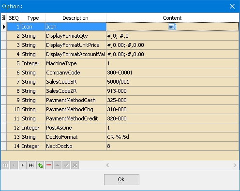
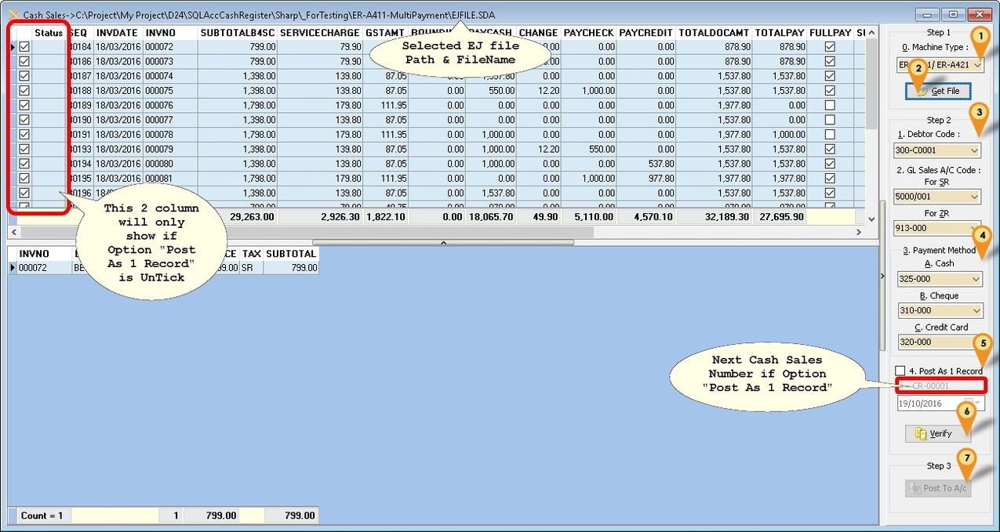

## Supported Model

Sharp

**Format 1**

- XE-A147
- XE-A137

**Format 2**

- XE-A207
- XE-A217
- XE-A307
- ER-A411/ER-A421

## Import Program

- Version (1.1.0.1) - 19 Oct 2016
- Evaluation Limit : 5 Times Posting
- [SQL Acc Cash Register setup](http://www.estream.com.my/downloadfile/Fairy/SQLAccCashRegister-setup.exe)
- MD5 : BF105B609B19CE6CA9E0186F4CD78B7F

## Setting

**Cash Register Machine**

- Below is the setting to be set in your Cash Register Machine
- Updated 19 Mar 2016
- All setting can be done at PGM mode → Setting → function text
- For Currency can be done at PGM mode → Setting → Optional → Basic system

| Description                                | Function    | Text       |
|--------------------------------------------|------------|-----------|
| Currency Symbol                             | CURRENCY TEXT | RM        |
| GST Standard Rate Symbol                    | TXBL1 SYMBOL | S         |
| GST Zero Rate Symbol                        | TXBL2 SYMBOL | Z         |
| Taxable subtotal (SubTotalWithTax)          | TAX1 ST      | GST TAX AMT |
| Taxable subtotal (SubTotalWithTax)          | TAX2 ST      | ZERO TAX AMT |
| VAT (GSTAmt)                                | VAT 1        | GST 6%    |
| VAT (GSTAmt)                                | VAT 2        | GST 0%    |
| Rounding                                    | DIFFER       | ROUNDING  |
| DocAmt                                      | Total        | ***TOTAL  |
| Total Before Service Charge                 | Subtotal     | SUBTOTAL  |
| Service Charge                              | SER.CHRG     | SER.CHRG  |
| Total After Service Charge before GST       | NET 1        | NET       |
| Cash Payment                                | CASH         | CASH      |
| Cheque Payment                              | CHECK        | CHECK     |
| Credit Card Payment                         | CREDIT       | CREDIT    |

:::caution

- All amount should be in Tax Inclusive as this is GST Rule for Simplified Tax Invoice
- You are not allow to VOID the Invoice

:::

**SQL Accounting**
May refer to Point 1 at Things To Consider Before Import/Post

**Cash Register Import**
Menu: Tools | Options...

| Function                 | Description                                              |
|--------------------------|----------------------------------------------------------|
| DisplayFormatQty         | Display Format For Quantity Field                        |
| DisplayFormatUnitPrice    | Display Format For Unit Price Field                      |
| DisplayFormatAccountValue | Display Format For Amount Field                          |
| *MachineType             | Last used Machine Type                                   |
| *CompanyCode             | Last used Customer Code                                  |
| *SalesCodeSR             | Last used Sales Code for SR                              |
| *SalesCodeZR             | Last used Sales Code for ZR                              |
| *PaymentMethodCash       | Last used Cash Payment Method Code                       |
| *PaymentMethodChq        | Last used Cheque Payment Method Code                     |
| *PaymentMethodCredit     | Last used Credit Card Payment Method Code                |
| *PostAsOne               | Posting Type                                             |
| DocNoFormat              | Document Number Format for PostAsOne = 1                 |
| NextDocNo                | Next Document Number for PostAsOne = 1                   |

:::info

- User may ignore the option with * as this can be set on Posting Screen
- For Service Charge & Rounding system will use SalesCodeSR

:::

## Step

Menu: Cash Sales...

1. Select **Machine Type**
2. Click **Get File** & browse to the folder & look for EJFILE.SDA
3. Steps 2
    Select **Debtor Code** for Debtor Field
    Select **Sales Account Code** for SR
    Select **Sales Account Code** for ZR
4. Payment Method
    Select **Payment Method Account Code** For Cash
    Select **Payment Method Account Code** For Cheque
    Select **Payment Method Account Code** For Credit Card
5. Tick Post As 1 Record if you wanted to post all transaction as 1 Cash Sales (Recommended)

    | Option        | Description                                                           |
    |---------------|------------------------------------------------------------------------|
    | True (Tick)   | System will Post to SQL Accounting As 1 Cash Sales (Recommended)       |
    | False (UnTick)| System will Post 1 by 1 InvNo to Cash Sales                            |

    Select the Date (applicable if **Post As 1 Record** is Selected)

6. Click **Verify** to check any Duplicate Cash Sales Number
7. Click **Post To A/c** button to Post.

## FAQ

### How do I know which EJ File had posted?

In Build 1 & above once the EJ had posted to SQL Acc it will automatic rename the EJ file to EJFILE-yyyy-mm-dd.sda (yyy-mm-dd is the date posted)