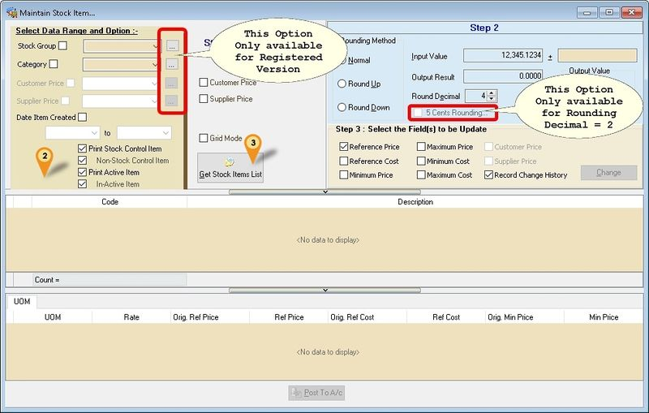
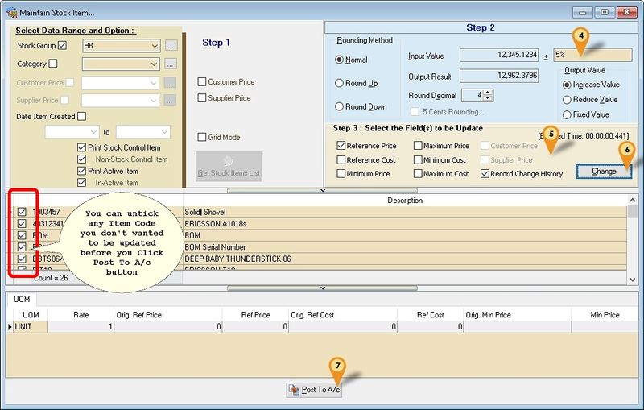
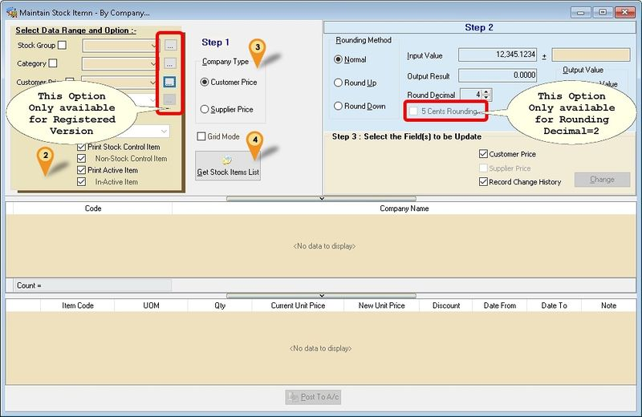
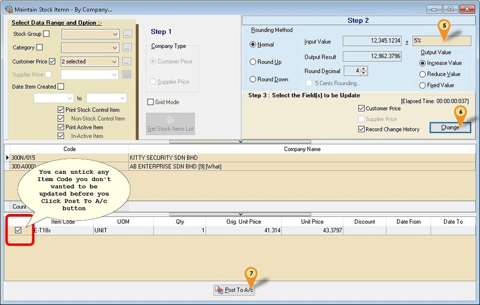
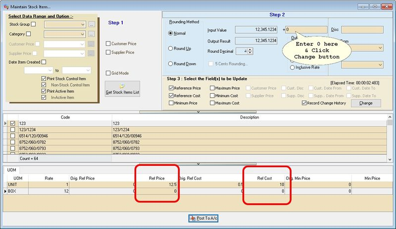

## Import Program
- Version (5.2.0.23) - 03 Feb 2025
- Evaluation Limit : Unlimited
(For Version 737 & above)

- SQLAccGlbPriceChangeV5-setup
- MD5 : 8DD462C2B440CE039DF3981896D92FB9

(For Version 736 & below)

- SQLAccGlbPriceChange-setup
- MD5 : 8C73130765BFA98A5BB59EF069422BBC

## Step-By Item Code

1.  Click Maintain Stock Item...
 

2. Select data/parameter to be update in the Steps 1 section
|Option|Description|
|---|---|
|Grid Mode|Select this if your item list is more then 10,000 record to speed up the loading data|

3. Click Get Stock Items List button
 

4. Enter the Value to change. It can be in Value and/or Percentage (%) except for Fixed Value only Value
  <table class="opts-table" role="table" aria-label="Options and descriptions">
    <thead>
      <tr>
        <th scope="col">Option</th>
        <th scope="col">Description</th>
      </tr>
    </thead>

    <tbody>
      <tr>
        <td class="cell-title">Rounding Method</td>
        <td>
          
Assuming Round Decimal is 2

          <ul>
            <li><strong>Normal</strong>: 0.1234 → 0.12</li>
            <li><strong>Round Up</strong>: 0.1234 → 0.13</li>
            <li><strong>Round Down</strong>: 0.1274 → 0.12</li>
          </ul>
        </td>
      </tr>

      <tr>
        <td class="cell-title">Input Value</td>
        <td>Sample Value</td>
      </tr>

      <tr>
        <td class="cell-title">Output Result</td>
        <td>Sample Result</td>
      </tr>

      <tr>
        <td class="cell-title">Round Decimal</td>
        <td>No. of Decimal Point</td>
      </tr>

      <tr>
        <td class="cell-title">Output Value</td>
        <td>
          <strong>Action to be taken</strong>
          <ul>
            <li><strong>Increase Value</strong>: Will add up the value based on option selected.</li>
            <li><strong>Reduce Value</strong>: Will deduct the value based on option selected.</li>
            <li><strong>Fixed Value</strong>: Will replace base on value set at Step 4 (only amount).</li>
            <li><strong>Inclusive Rate</strong>: e.g. Amount 106 &amp; user enter as 6% will become 100.</li>
          </ul>
        </td>
      </tr>
    </tbody>
  </table>

5. Select field to be update.
6. Click Change button.
7. Click Post To A/c button to update the data

:::info
Select Record Change History option if you wanted to Keep Changes History in the
Note Fields for each itemcode
:::

## Step -By Comapny Price
1. Click Maintain Stock Item - By Company...
 

2. Select data/parameter to be update in the Steps 1 section
3. Select Company Type
4. Click Get Stock Items List button
 

5. Enter the Value to change. It can be in Value and/or Percentage (%) except for Fixed Value only Value
6. Click Change button.
7. Click Post To A/c button to update the data

:::info	
It use Customer/Supplier Price Tag (Company Column)
:::

## FAQ
### Can I self enter/change the price by item code?
Yes, just enter 0 in Step 4 & Change the Value in the grid (Circle in Red)
 