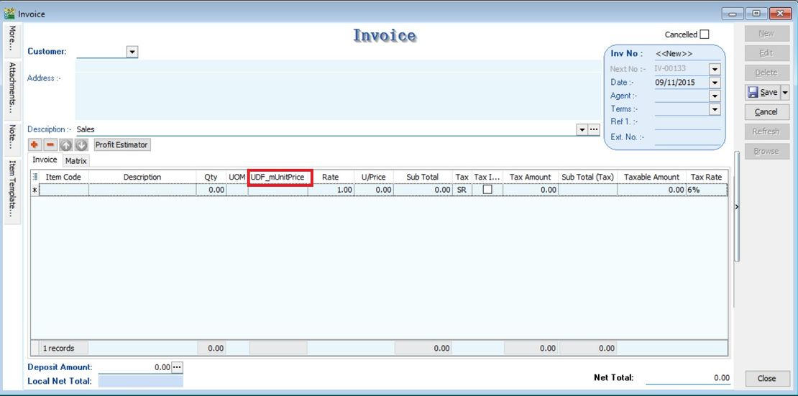
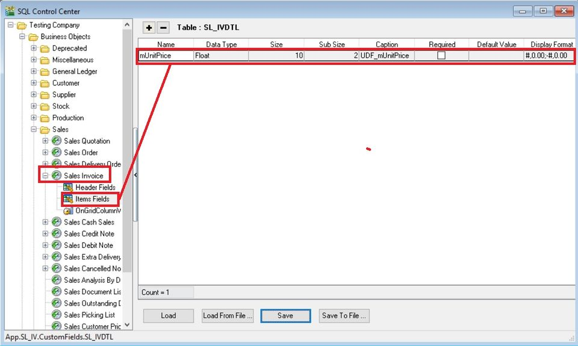
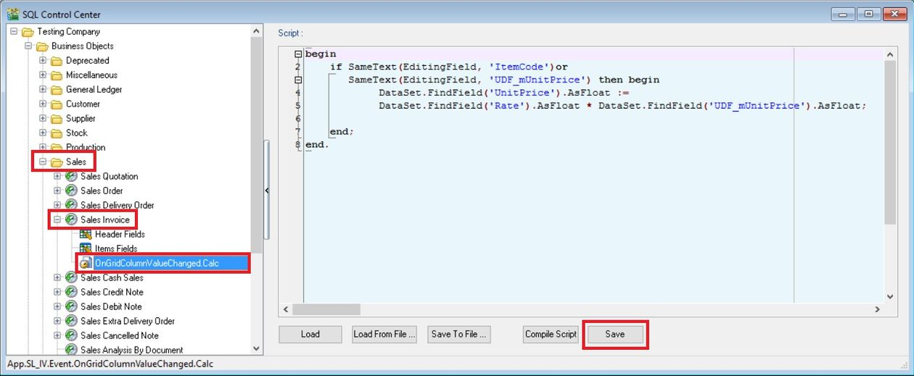
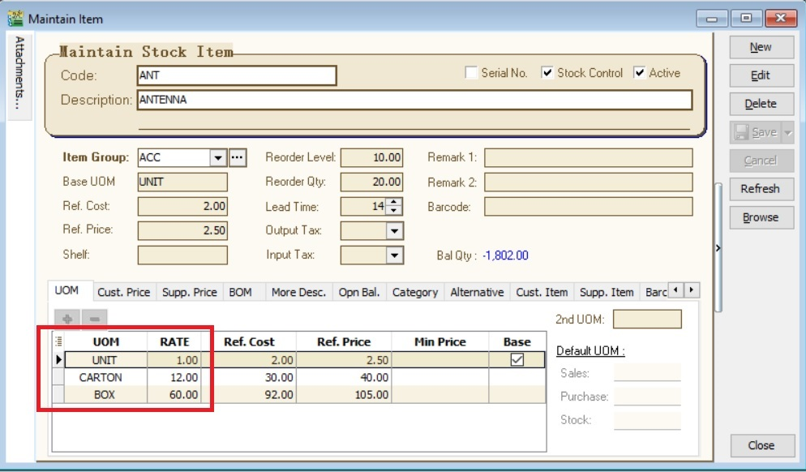
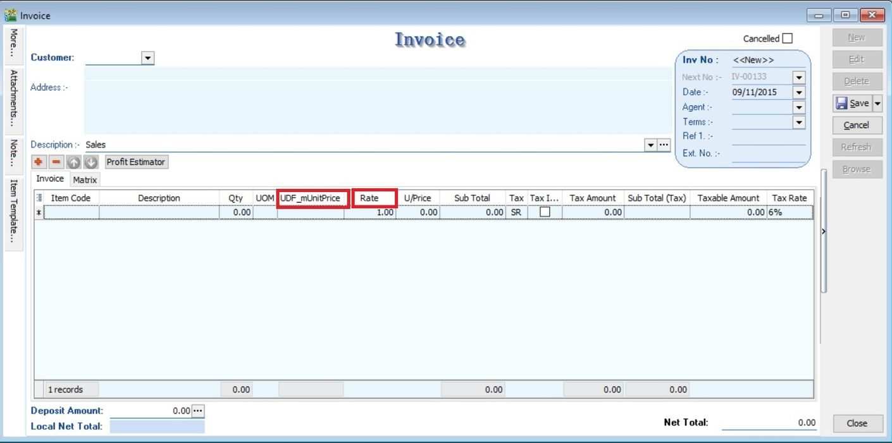
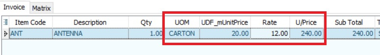

## Assignment : To Create the Unit Price Calculation
- Create the DIY field such as UDF_mUnitPrice in Sales documents (eg. sales invoice)
- Purpose: User will key-in the base unit price to convert into new unit price based on the UOM rate in Maintain Stock Item.



- Calculation for Unit Price := UDF_mUnitPrice x Rate

## Steps
### Insert DIY Field
01. Click Tools | DIY | SQL Control Center...
02. At the left panel look for Sales Invoice.
03. Point to Items Fields.
04. On the right panel, insert the DIY field as per the TABLE below.

| Name        | Data Type | Size | SubSize | Caption       | Required       | Default Value | Display Format    |
|-------------|-----------|------|---------|---------------|----------------|---------------|------------------|
| mUnitPrice  | Float     | 10   | 2       | UDF_mUnitPrice| FALSE (Untick) | BLANK         | #,0.00;-#,0.00   |



05. Click Save.
06. Update operation successful message. Click OK.
07. DONE

### Insert DIY Script
01. Click Tools | DIY | SQL Control Center...
02. At the left panel look for Sales Invoice .
03. Right Click the Sales Invoice.


04. Select New Event.


05. Enter any name (eg Calc) in the Name field (Only Alphanumeric & no spacing).
06. Select OnGridColumnValueChanged for Event field.
07. Click OK.
08. Click the Calc (name create at Step 5 above) on the left panel.



09. Copy below script & paste to the Right Panel (Script Section).

```sql
begin
    if SameText(EditingField, 'ItemCode')or
       SameText(EditingField, 'UDF_mUnitPrice') then begin
            DataSet.FindField('UnitPrice').AsFloat :=
            DataSet.FindField('Rate').AsFloat * DataSet.FindField('UDF_mUnitPrice').AsFloat;

    end;
end.
```

10. Click Save button.

:::warning
Avoid update the same existing field name Unit Price. You have to create different name ie. UDF_mUnitPrice.
:::

## Result Test
01. Go to Stock | Maintain Stock Item...
02. Edit the item code ANT.
03. Insert additional UOM with different RATE, eg. 1 CARTON = 12 UNITS and 1 BOX = 60 UNITS.




04. Create new sales invoice from Sales | Invoice...
05. Call out the columns name UDF_mUnitPrice and Rate.




06. Insert and select the item code ANT.
07. Select the UOM to CARTON. Rate will be changed to 12.
08. Input the value into UDF_mUnitPrice. U/Price will be calculated from your DIY script formula (UDF_mUnitPrice x Rate).



