## Assignment : How to get the data from Master Table into entry form?
- Create the DIY fields such as UDF_PCS, UDF_CTN in Maintain Stock Item; and
- UDF_Price in Sales Documents (eg. sales invoice).
- Purpose is:

```bash
 Get UDF_PCS & UDF_CTN from Maintain Item to Sales Invoice Detail UDF_Price
 # If selected itemcode UOM is PCS then use UDF_PCS
 # if selected itemcode UOM is CTN then use UDF_CTN 
 # if selected itemcode UOM not PCS or CTN then default is 1 
```

- Calculation for Unit Price := UDF_Price * UDF_Rate

## Steps
### Insert DIY Field
01. Click Tools | DIY | SQL Control Center...
02. At the left panel look for Stock | Stock Item .
03. Point to Stock Items Fields.
04. On the right panel, insert the new field as per the table below.

| Name | Data Type | Size | SubSize | Caption   | Required       | Default Value | Display Format       |
|------|-----------|------|---------|-----------|----------------|---------------|----------------------|
| PCS  | Float     | 10   | 2       | UDF_PCS   | FALSE (Untick) | BLANK         | #,0.00;-#,0.00       |
| CTN  | Float     | 10   | 2       | UDF_CTN   | FALSE (Untick) | BLANK         | #,0.00;-#,0.00       |

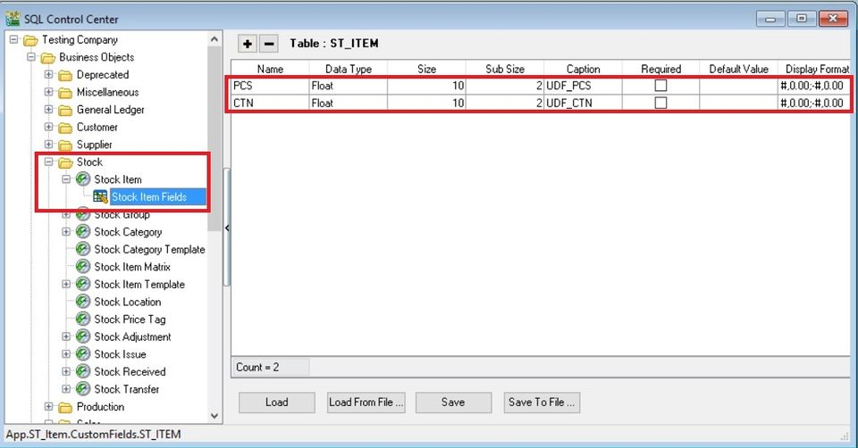

05. Click Save.
06. Update operation successful message. Click OK.
07. Next...
08. At the left panel look for Sales | Sales Invoice.
09. Point to Items Fields.
10. On the right panel, insert the new field as per the table below.

| Name  | Data Type | Size | SubSize | Caption    | Required       | Default Value | Display Format       |
|-------|-----------|------|---------|------------|----------------|---------------|----------------------|
| Price | Float     | 10   | 2       | UDF_Price  | FALSE (Untick) | BLANK         | #,0.00;-#,0.00       |
| Rate  | Float     | 10   | 2       | UDF_Rate   | FALSE (Untick) | BLANK         | #,0.00;-#,0.00       |

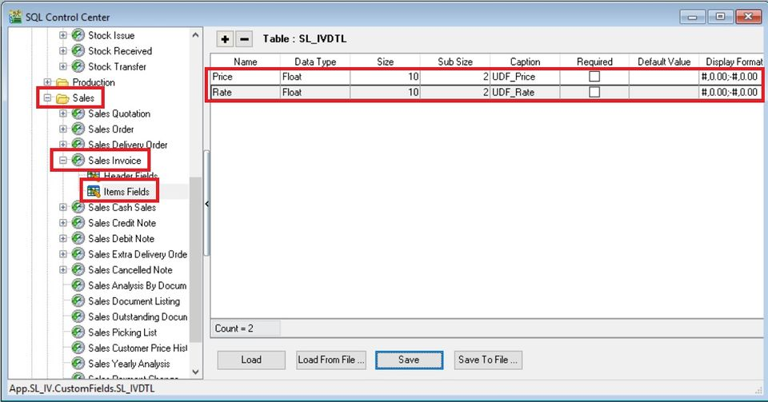

11. Click Save.
12. Update operation successful message. Click OK.
13. DONE.

## Create Quick Form
01. Click Tools | DIY | SQL Control Center...
02. At the left panel look for Stock | Stock Item .
03. Right click on te Stock Item.
04. Select New Quick Form Design.

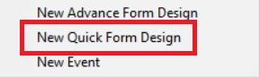

05. Enter the new name as EXTRA. Click OK.

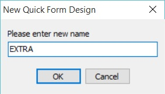

06. Click on the EXTRA follow by Customize button.
07. Drag the UDF_CTN adn UDF_PCS from right to the place marked X. See the screenshot below.

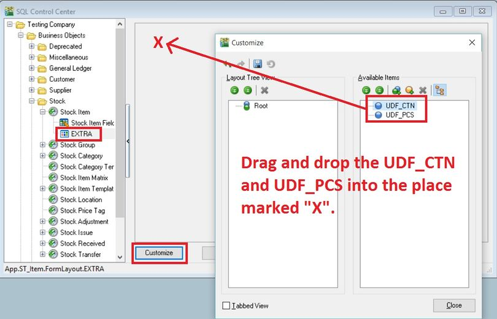

08. Both the UDF fields will be under the Root. Click CLOSE.


09. Click SAVE.

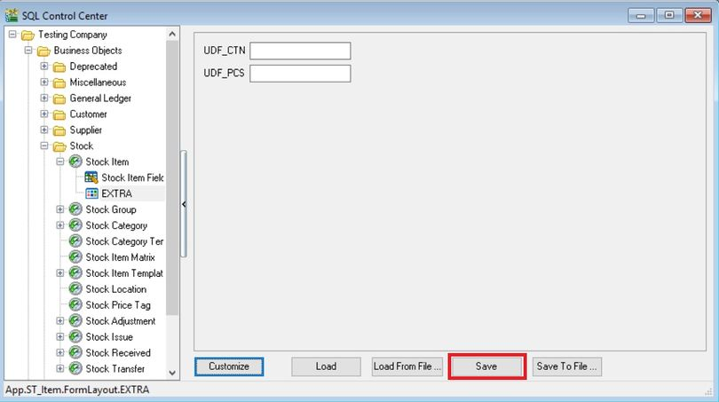

10. DONE.

### Insert DIY Script
01. Click Tools | DIY | SQL Control Center...
02. At the left panel look for Sales Invoice .
03. Right Click the Sales Invoice.


04. Select New Event.

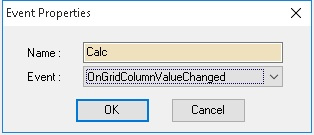

05. Enter any name (eg Calc) in the Name field (Only Alphanumeric & no spacing).
06. Select OnGridColumnValueChanged for Event field.
07. Click OK.
08. Click the Calc (name create at Step 5 above) on the left panel.

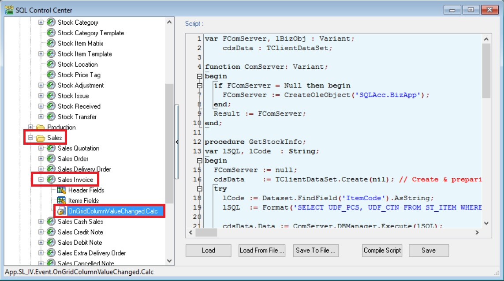

09. Copy below script & paste to the Right Panel (Script Section).

```sql
var FComServer, lBizObj : Variant;
    cdsData : TClientDataSet;
 
function ComServer: Variant;
begin
  if FComServer = Null then begin
    FComServer := CreateOleObject('SQLAcc.BizApp');
  end;
  Result := FComServer;
end;
 
procedure GetStockInfo;
var lSQL, lCode  : String;
begin
  FComServer := null;
  cdsData    := TClientDataSet.Create(nil); // Create & preparing Component
  try
    lCode := Dataset.FindField('ItemCode').AsString;     
    lSQL  := Format('SELECT UDF_PCS, UDF_CTN FROM ST_ITEM WHERE Code=%s',[QuotedStr(lCode)]);
 
    cdsData.Data := ComServer.DBManager.Execute(lSQL);
  finally
    lBizObj    := null;
    FComServer := null;
  end;
end;
 
begin
  if SameText(EditingField, 'ItemCode') or
     SameText(EditingField, 'UOM') or
     SameText(EditingField, 'UDF_Rate') then begin
     try
       GetStockInfo;
       if Dataset.FindField('UOM').AsString = 'PCS' then
         Dataset.FindField('UDF_Price').AsFloat := cdsData.FindField('UDF_PCS').AsFloat else
       if Dataset.FindField('UOM').AsString = 'CTN' then
         Dataset.FindField('UDF_Price').AsFloat := cdsData.FindField('UDF_CTN').AsFloat else
         Dataset.FindField('UDF_Price').AsFloat := 1;
 
       Dataset.FindField('UnitPrice').AsFloat := Dataset.FindField('UDF_Price').AsFloat *
                                                 Dataset.FindField('UDF_Rate').AsFloat;
     finally
       cdsData.Free;
     end;
  end;
end.
```

10. Click Save button.

:::warning
Avoid update the same existing field name Unit Price and "Rate". You have to create different name ie. UDF_Price and UDF_Rate.
:::

## Result Test
01. Go to Stock | Maintain Stock Item...
02. Create a new item code called PEN.
03. Update the UOM tab. See the screenshot below.

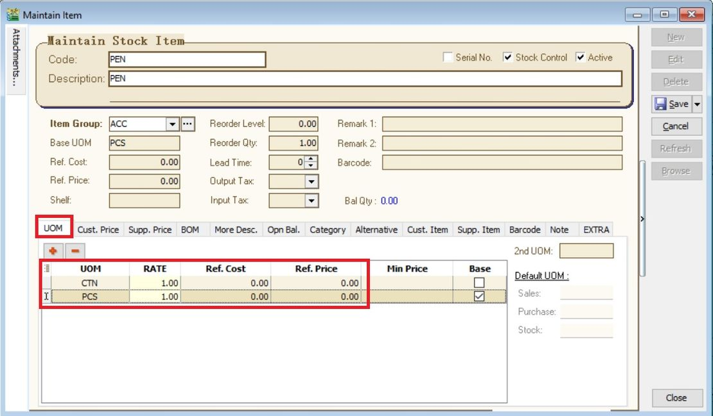

04. Click on EXTRA tab.
05. Input the UDF_CTN and UDF_PCS value.

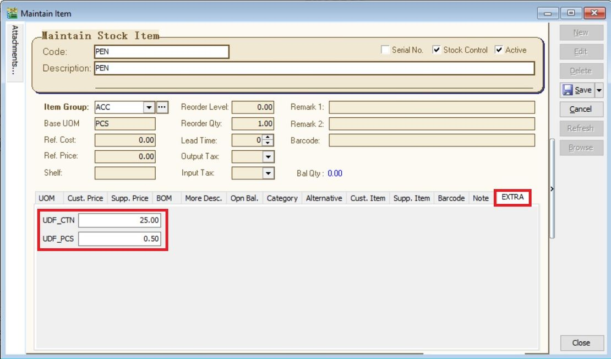

06. Create new sales invoice from Sales | Invoice...
05. Call out the columns name UDF_Price and UDF_Rate.

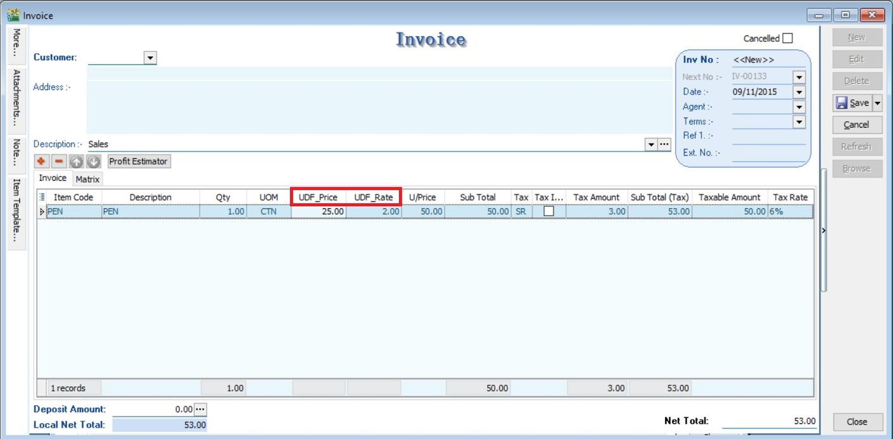

06. Insert and select the item code PEN.
07. Select the UOM to CTN.
08. UDF_Price will be changed to 50.00 (based on the UDF_CTN set for PEN).
09. Input the value into UDF_Rate. U/Price will be calculated from your DIY script formula (UDF_Price x UDF_Rate).

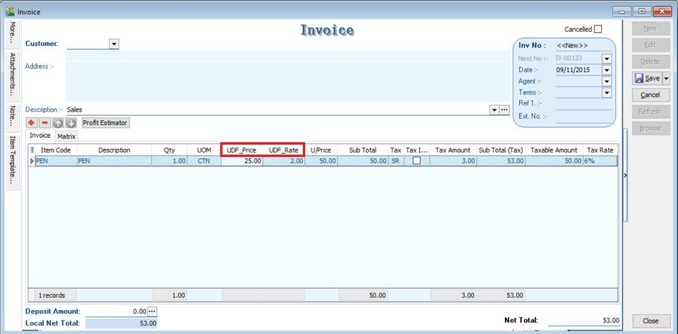
