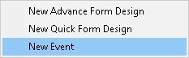
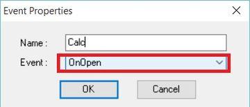
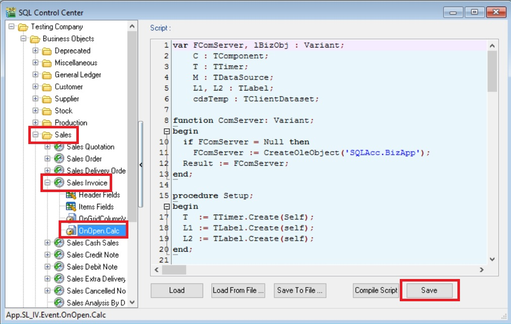
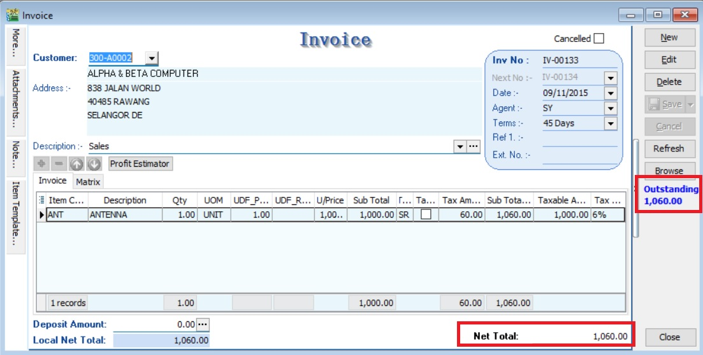
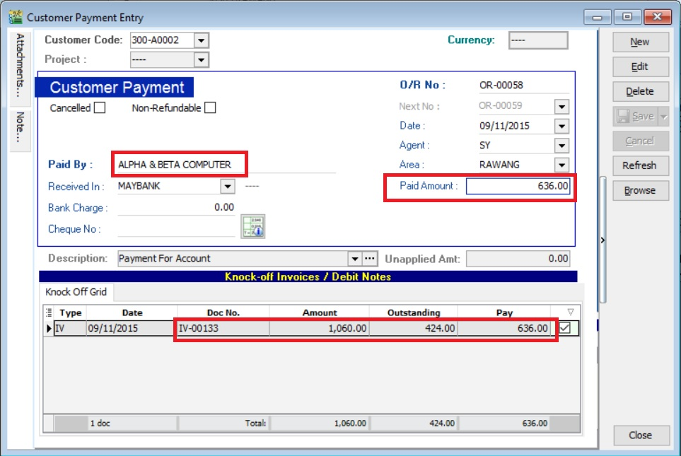
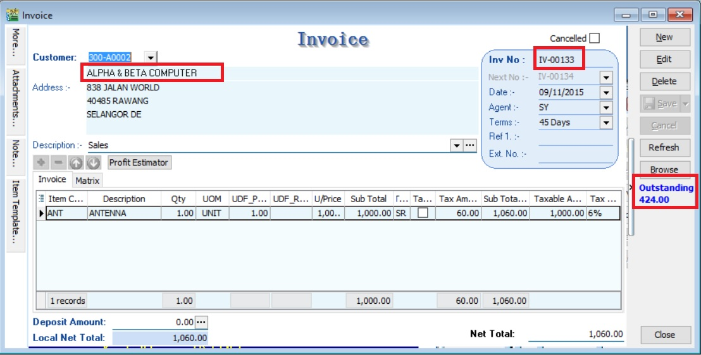

## Assignment : How to get Outstanding IV amount & show below the Browse button at Sales Invoice?
- This assignment no need to create any DIY fields
- Purpose is to display the total outstanding balance for the customer selected at the Invoice


## Steps
### Insert DIY Field
01. Click Tools | DIY | SQL Control Center...
02. At the left panel look for Sales Invoice .
03. Right Click the Sales Invoice.



04. Select New Event.



05. Enter any name (eg Calc) in the Name field (Only Alphanumeric & no spacing).
06. Select OnOpen for Event field.
07. Click OK.
08. Click the Calc (name create at Step 5 above) on the left panel.



09. Copy below script & paste to the Right Panel (Script Section).

```sql
var FComServer, lBizObj : Variant;
    C : TComponent;
    T : TTimer;
    M : TDataSource;
    L1, L2 : TLabel;
    cdsTemp : TClientDataset;
 
function ComServer: Variant;
begin
  if FComServer = Null then 
    FComServer := CreateOleObject('SQLAcc.BizApp');
  Result := FComServer;
end;
 
procedure Setup;
begin
  T  := TTimer.Create(Self);
  L1 := TLabel.Create(self);
  L2 := TLabel.Create(self);
end;
 
procedure DocInfo;
var lSQL, lDocNo : String;
begin
  lDocNo := M.Dataset.FindField('DocNo').AsString;
 
  FComServer := null;
  cdsTemp := TClientDataset.Create(nil);
  lSQL := Format('SELECT (DocAmt - PaymentAmt) OS FROM AR_IV '+
                 'WHERE DocNo=%s ',[QuotedStr(lDocNo)]);
 
  try
    cdsTemp.Data := ComServer.DBManager.Execute(lSQL);
  finally
    FComServer := null;
  end;
end;
 
procedure OnTimer(Sender: TObject);
var AState : TDataSetState;
begin
  AState := M.DataSet.State;
  if AState = dsBrowse then begin
    DocInfo;
    L2.Caption := '';
    try
      L2.Caption := FormatCurr('#,0.00;-#,0.00', cdsTemp.FindField('OS').AsFloat); 
    finally
      cdsTemp.Free;
    end;
  end;       
end;
 
begin
  M := TDataSource(Self.FindComponent('dsDocMaster'));   
  C := Self.FindComponent('frDataSetButton1');             
 
  if Assigned(C) then begin
    T.Enabled  := True;
    T.Interval := 1000; // = 1 sec
    T.OnTimer  := @OnTimer;  
 
    with L1 do begin
      Parent     := TWinControl(C);
      Width      := 66;
      Left       := 6;
      Top        := 200;
      Caption    := 'Outstanding';
      Font.Color := clBlue;
      Font.Style := [fsBold];
    end;    
    with L2 do begin
      Parent     := TWinControl(C);
      Width      := 66;
      Left       := 6;
      Top        := 215;
      Caption    := 'DocNo';
      Font.Color := clBlue;
      Font.Style := [fsBold];
    end;     
  end;   
end.
```
10. Click Save button.

## Result Test
01. Create a new sales invoice, eg. Invoice Amount = Rm1060.00



02. Make a payment amount = Rm636.00 and knock-off with the invoice created in step 01.



03. You can get the document outstanding balance (Rm1060.00 - Rm636.00 = Rm424.00) at Sales Invoice.



