This Customisation is for simple calculation for the management property which normally monthly charge Maintenance, Sinking Fund & etc.

[Sample Database](https://download.sql.com.my/customer/Fairy/ACC%20BK-%5BRecurring%5D.zip)

## History New/Updates/Changes

02 Jun 2025

Add Option to Post as IV for Customer Due & Payment.
23 Jan 2025

Add Use Full Age Option for Late Charge Qty in Customer Due Listing.
Enable Save Setting for Customer Due Listing using Note Field for ItemCode OVERDUE.
Enable Recurring without Filter by Company Category
Add 0Sales Debit Note 9-Late Charges format.
Add 0Sales Invoice 8 (SST 2)-Aging-Recurring-Maintenance format.
Add 0Sales Invoice 8 (SST 2)-Aging-Recurring-Meter format.
Add 0Sales Invoice 8 (SST 2)-Aging-Recurring-Meter-PrcRange format.
Add 0Sales Invoice 8 (SST 2)-Recurring-Meter-PrcRange format.
Exclude posting if amount = 0 when generate DN.

11 Aug 2022

Add Tick/UnTick All Option for Gen/B In Maintain Customer.
Fix sometime prompt error when using Price Range.
Add With 5 Cents Rounding Options for Customer Due Listing.
Add T.O/S Amt label (Total Outstanding Amount) in Sales Invoice.
Fixed Header Description for Total Amount Not Correctly Sum when using Price Range.
Add Prompt for Open Sales Invoice after done Posting.
Add With 5 Cents Rounding & With DN Options for Customer Payment.
Add Prompt for Open Sales Debit Note after done Posting.
Add UDF_LastReading & UDF_CurrReading at Sales Invoice for Price Range use.
Fixed Error due to system override when using Min Charge only for utilities.
Fixed Display Format for utilities should be in 4 decimal point
Enable Optional to use Maintain Customer Agent & Terms when using zProfile code for Agent & Terms
Fixed SQLAcc auto exit when Click Generate in Lastest SQL Acc Version.
15 Apr 2019

Add Option Include Zero Qty for Utilities
Fixed Unable Recurring For Document Listing after upgrade to 776
Fixed Utilities will shown Discount 1 when PriceTag discount is empty
22 Mar 2019

Add Process Status on Recurring SQFT in Maintain Customer
Fixed Min. Charge not working for Lead Time 0 & 1
28 Jan 2019

Move Footer Count to Company Name
Increase Form width to 1024
Remove all Tax Code in Sample Data
Add Use Doc Tax Code option for Doc Listing
Allow Multi range price for Utility
04 Oct 2018

Fixed Amount not correct if Qty = Min Charge Amt Qty
15 Aug 2018

Reduce the Doc & Item Project Length at Customer Payment
Set to 0 if using both Rebate & Min Charge if below Min Charge amount
11 Jul 2018

Allow more then 1 Stock Group for SQFT in Maintain Customer
Add UDF_UseSQFT in QT Detail - True Qty = UDF_BuildUp(Maintain Customer)
Add UDF_UseARPrice in QT Detail - True UnitPrice = UDF_UPSQFT(Maintain Customer)
Add Last Payment Date, Amount & Outstanding Information in Invoice Detail Screen
Add Document & Item Project selection Posting for Customer Due
15 Feb 2018

Generate by SQFT by Customer
Add Cust Local - Payment Listing (GST 1) - Knock Off Doc No Set - Cross
Add Sales Customer Price History - ItemCode - Cross
Allow to change Header Description for DN Overdue
Set Default TaxRate 0% for Payment DN overdue
21 Mar 2017

Change Header Description for Posting DN to Late Payment Charges for
25 Jan 2017

Add Pre-Post DN at Customer Payment.
Add Sales Document Listing Recurring.
16 Sep 2016

Fixed access violation error if No Record Found prompt.
12 Jan 2016

Enable GAS Reading
25 Dec 2015

* Add 0Sales Invoice 7 (GST 2)-Recurring-Maintenance Report
* Add 0Sales Invoice 7 (GST 2)-Recurring-Meter Report
* Enable GAS Reading
* Allow Select Multi DocNo Set for Different Reading
* Fixed bug LeadTime=0 - Will being override by Rebate when is below Min Charge (i.e. will set to 0 if less then Min Charge)
* Fixed Cust Statement 06 Mths 1 Report Not shown Address 1 & take too much space at footer
26 Sep 2015

* Remove 5 Cent rounding Script & use build in 5 Cent rounding
* Fixed Customise Statement report not follow company profile information
* Set Customer Payment UDF_PostDN Default Value = False
12 Aug 2015

* Fixed Posting Overdue DN should excluding the GST amount from the calculation

## Modules Required

* General Ledger, Customer, Supplier
* Sales, Purchase
* DIY Field
* DIY Script
* Multiple Pricing (Price Tag)
* Multiple Document Number Set

## Tutotial Video

[Recurring](https://www.youtube.com/watch?v=DLShuxExZi8&t=27s)

## Settings

### Maintain User

*Menu: Tools | Maintain User...*

Untick the Access Right for Prompt Replace Unit Price Dialog under **Group : Sales**

### Maintain Customer

*Menu: Customer | Maintain Customer...*

* Below fields MUST had Value (minimum is 0 not empty or Null)

* UDF_WaterReading
* UDF_ElectricReading
* UDF_GasReading
* UDF_IWKReading
* Price Tag

* Minimum UDF Fields Required

| **Name**          | **Data Type** | **Size** | **Sub Size** | **Caption**              | **Required** | **Default Value** | **Display Format**        |
|-------------------|---------------|----------|--------------|--------------------------|--------------|-------------------|---------------------------|
| WaterReading      | Float         | 10       | 4            | UDF_WaterReading         | False        | 0                 | #,0;-#,0                  |
| ElectricReading   | Float         | 10       | 4            | UDF_ElectricReading      | False        | 0                 | #,0;-#,0                  |
| GasReading        | Float         | 10       | 4            | UDF_GasReading           | False        | 0                 | #,0;-#,0                  |
| IWKReading        | Float         | 10       | 4            | UDF_IWKReading           | False        | 0                 | #,0;-#,0                  |
| UseARPrice        | Boolean       |          |              | Use Maintain Customer Price | False     | False             |                           |
| UPSQFT            | Float         | 10       | 4            | Unit Price/SQFT          | False        | 0                 | #,0.00;-#,0.00            |
| BuildUp           | Float         | 10       | 4            | Build Up (sf)            | False        | 0                 | #,0.00;-#,0.00            |
| WaterLastDate     | Date          |          |              | UDF_WaterLastDate        |              |                   |                           |
| ElectricLastDate  | Date          |          |              | UDF_ElectricLastDate     |              |                   |                           |
| GasLastDate       | Date          |          |              | UDF_GasLastDate          |              |                   |                           |
| IWKLastDate       | Date          |          |              | UDF_IWKLastDate          |              |                   |                           |

:::success  NOTE :
UseARPrice & UPSQFT is use for Recurring by square feet (SQFT)
UseARPrice
True = the Unit Price is by Customer
False = the Unit Price is from Maintain Item Ref Price
The Item Code List is filter by Stock Group Code LIKE MAINTENANCE%
:::

### Quotation

*Menu: Sales | Quotation...*

* DocNo Format := CompanyCategoryCode;Type;

```cs
 eg
 B-Shop;Main;  => For Maintenance
 B-Shop;Water; => For Water Billing
 B-Shop;Park;  => For Car Park
```

* For Meter Reading (eg Water, Electric & etc), Detail can be empty cause system will auto APPEND the itemcode

:::note

* Master Description if using

* 1.Generate Maintenance it will use the Quotation Master Description.
* 2.Generate Meter Reading (eg Water, Electric & etc), it will shown how much the meter usage
[Master Description (MMM YYYY) - CurrentReading - PreviousReading=Usage@UnitPrice].
* 2.Generate Meter Reading with "Include Grid Detail Info." Option tick it will use the Quotation Master Description.
* UDF_UseSQFT

* True := Qty = UDF_BuildUp from Maintain Customer
* False := Qty = Quotation Qty
* UDF_UseARPrice

* True := UnitPrice = UDF_UPSQFT from Maintain Customer
* False := UnitPrice = Quotation UnitPrice

:::

Quotation - SQFT

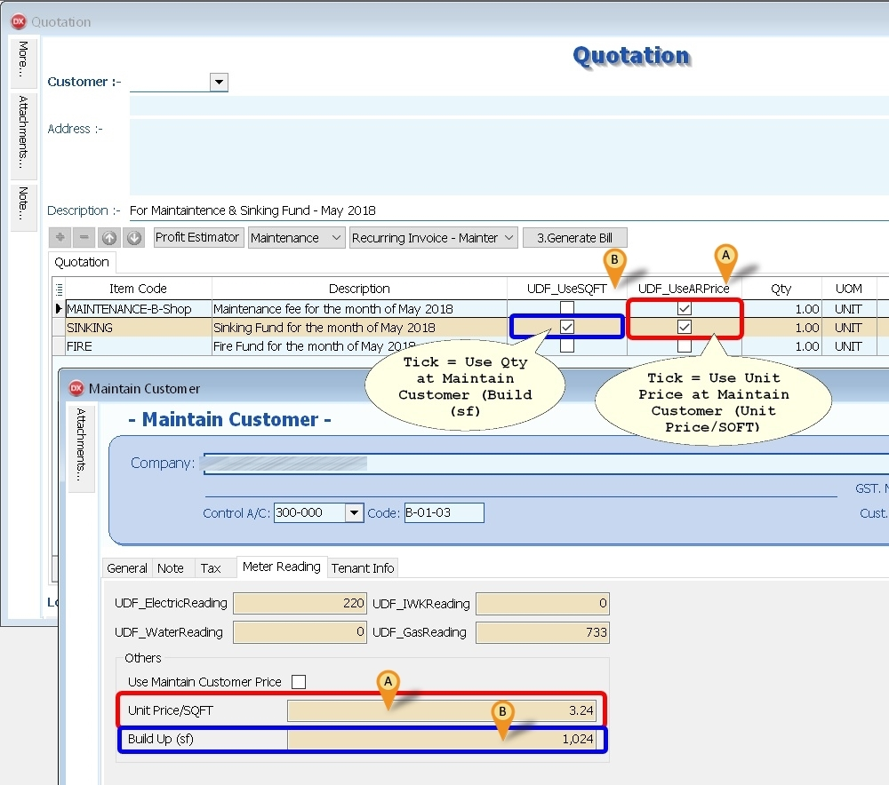

Quotation - Utilities - Price Range

Below Example is for Price Range Water Reading

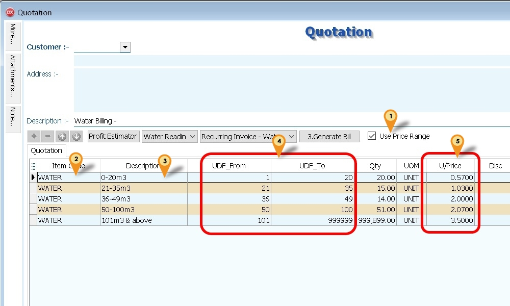

1. Tick Use Price Range
2. Select Item Code (eg WATER for Water Reading)
3. Enter the Description to be shown in Invoice for Each Range
4. Enter the Range UDF_From & UDF_To
5. Enter the Unit Price

:::success NOTE :
For Last Range the UDF_To may enter as 999999 (6 digit of 9 (max))
:::

* List Field to be copy from Quotation to Invoice

| **Master Fields** | **Detail Fields** |
|-------------------|-------------------|
| DocNoEx           | Number            |
| DocDate           | ItemCode          |
| Terms             | Description       |
| Agent             | Description2      |
| Description       | Description3      |
| DocRef1           | Remark1           |
| DocRef2           | Remark2           |
| DocRef3           | Location          |
| DocRef4           | Project           |
| Project           | DeliveryDate      |
| Validity          | Qty               |
| DeliveryTerm      | UOM               |
| CC                | UnitPrice         |
|                   | Tax               |
|                   | Disc              |

* Minimum UDF Fields Required (Header Fields)

| **Name**    | **Data Type** | **Caption**     | **Required** | **Default Value** |
|-------------|---------------|-----------------|--------------|-------------------|
| DocNoSet    | Integer       | UDF_DocNoSet    | False        | 0                 |
| Type        | Integer       | UDF_Type        | False        | 0                 |
| IsPrcRange  | Boolean       | UDF_IsPrcRange  | False        | False             |
| IncZero     | Boolean       | UDF_IncZero     | False        | False             |

* Minimum UDF Fields Required (Item Fields)

| **Name**     | **Data Type** | **Caption**      | **Required** | **Default Value** | **Display Format** |
|--------------|---------------|------------------|--------------|-------------------|--------------------|
| From         | Integer       | UDF_From         | False        | 0                 | #,0;-#,0           |
| To           | Integer       | UDF_To           | False        | 0                 | #,0;-#,0           |
| UseSQFT      | Boolean       | UDF_UseSQFT      | False        | False             |                    |
| UseARPrice   | Boolean       | UDF_UseARPrice   | False        | False             |                    |

### Invoice

*Menu: Sales | Invoice...*

* Minimum UDF Fields Required (Items Fields & Headers Fields)

| **Name**      | **Data Type** | **Size** | **Sub Size** | **Caption**        | **Required** | **Default Value** | **Display Format** |
|---------------|---------------|----------|--------------|--------------------|--------------|-------------------|--------------------|
| LastReading   | Float         | 10       | 4            | UDF_LastReading    | False        | 0                 | #,0;-#,0           |
| CurrReading   | Float         | 10       | 4            | UDF_CurrReading    | False        | 0                 | #,0;-#,0           |

### Debit Note

*Menu: Sales | Debit Note...*

* Minimum UDF Fields Required (Items Fields)

| **Name**   | **Data Type** | **Size** | **Caption**   | **Required** | **Default Value** | **Display Format**   |
|------------|---------------|----------|---------------|--------------|-------------------|----------------------|
| IVDocNo    | String        | 20       | UDF_IVDocNo   | False        |                   |                      |
| IVDocDate  | Date          |          | UDF_IVDocDate |              |                   |                      |
| IVDueDate  | Date          |          | UDF_IVDueDate |              |                   |                      |
| IVDocAmt   | Currency      |          | UDF_IVDocAmt  | False        | 0                 | #,0.00;-#,0.00       |
| IVOSAmt    | Currency      |          | UDF_IVOSAmt   | False        | 0                 | #,0.00;-#,0.00       |

### Stock Item

*Menu: Stock | Maintain Stock Item...*

* Item Code to be create

* WATER
* ELECTRIC
* GAS
* IWK
* RTN5Cents => For Rounding Mechanism
* OVERDUE => For Overdue Charge (Just set at Ref Price & enter 0.1 for 10% pa)
* MINCHARGE => For Utilities Price Range
* REBATE => For Utilities Price Range

* Price Tag => For Different UnitPrice for Meter Reading (eg WATER, ELECTRIC & etc)

    Use Disc column as Rebate & Min Charge => Format := Rebate+MinCharge
eg

### Lead Time Setup

| **Lead Time** | **Type**          | **Description**                 | **Input Value** |
|---------------|-------------------|---------------------------------|-----------------|
| 0             | Both              | Rebate 11.75 & MinCharge 5      | 11.75+5         |
| 1             | Rebate Only       | Rebate 12.30 & MinCharge 0      | 12.30+0         |
| 2             | Min Charge Only   | Rebate 0 & MinCharge 5          | 0+5             |

* Lead Time => 0: Both, 1: Rebate Only, 2: Min Charge Only
* For MinCharge make sure it had Value else set at 1

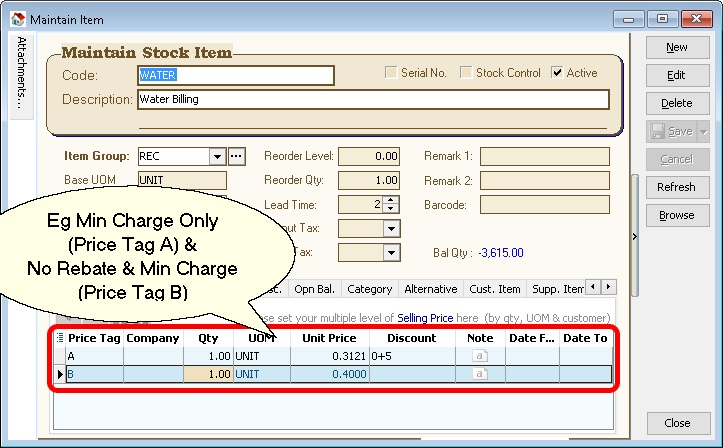

:::success How System calculate Min. Qty for Min. Charge?

* Using above example => Min. Qty := 5 / 0.3121 = 16.0205
* if the Qty is below or equal 16.0205 then Amount will Reset to 5
:::

### Customer Payment

*Menu: Customer | Customer Payment...*

* Auto Generate Sales DN for overdue IV if UDF_PostDN (in [DIY Fields](../../usage/tools/guide#maintain-diy)) Default Value is set to True (Default is False)
* Only Knock-off to DN will not regenerate DN again if overdue
* Formula for Age

```vb
Age := CurrentWorkingDate - Knock off Invoice Due Date
```

* Formula For Qty

```vb
if Age < DayOf(CurrentWorkingDate) then
      Qty := Age else
      Qty := DayOf(CurrentWorkingDate);
```

* Formula for UnitPrice

```vb
Unit Price := Rate/365 * Knock off amount (Excluding GST)
```

* Minimum UDF Fields Required (Header Fields)

| **Name**  | **Data Type** | **Size** | **Caption**   | **Required** | **Default Value** |
|-----------|---------------|----------|---------------|--------------|-------------------|
| PostDN    | Boolean       |          | UDF_PostDN    | False        | False             |
| TaxRate   | String        | 10       | UDF_TaxRate   | False        | 0%                |

### Customer Due Listing

*Menu: Customer | Print Customer Due Document...*

* Auto Generate Sales Debit Note for overdue Invoice & Debit Note (can untick the option if don't wanted to be included before click Apply button)
* It will Generate 1 Customer Code 1 Sales Debit Note
* The rate is from Ref Price of OVERDUE itemcode (just enter 0.1 for 10% pa)
* Formula Qty

```vb
if Age < DaysInAMonth(edDueDate.Date) then
      Qty := Age else
      Qty := DaysInAMonth(edDueDate.Date);
```

* Formula UnitPrice

```vb
Unit Price := Rate/365 * Outstanding amount (Excluding GST)
```

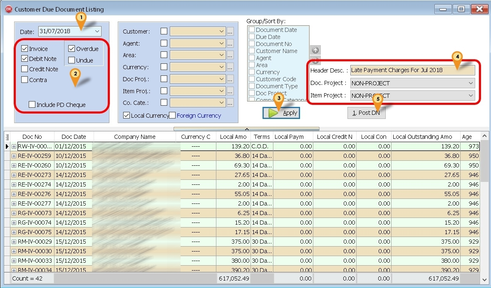

1. Set the Date to generate Overdue
2. Tick the following option

    * Invoice
    * Debit Note (if you wanted to include in calculation overdue)
    * Overdue

3. Click Apply button
4. Select & Enter the DN Information
5. Click 1. Post DN button

:::success NOTE :
For more accurate calculation for Unit Price, try set the Unit Price to 4 Decimal points
:::

### Sales Document Listing

*Menu: Sales | Print Sales Document Listing...*

* Is a batch

* Delete Document
* Copy From 1 Document type & Paste To Same or Other Document Type

Base on the parameter selected & result shown in the grid

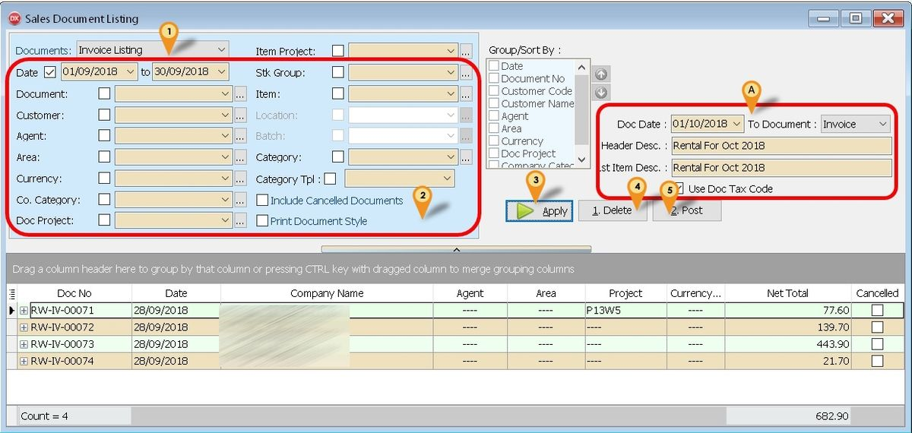

### Batch Delete Document

Below is example to delete Invoice

1. Select Invoice Listing
2. Select Range Date or any parameter you prefer
3. Click Apply button
4. Click Delete button

:::warning
Only Select follow filter

* Date
* Customer
* Agent
* Area
* Company Category
* Doc. Project

:::

### Batch Copy & Paste Document

Below is example to Copy from Invoice to Invoice

1. Select Invoice Listing
2. Select Range Date or any parameter you prefer
3. Click Apply button
4. In the section A (See icon A)

5. Click Post button

## Steps

### Maintain Customer

*Menu: Customer | Maintain Customer...*

Generating Maintenance - SQFT

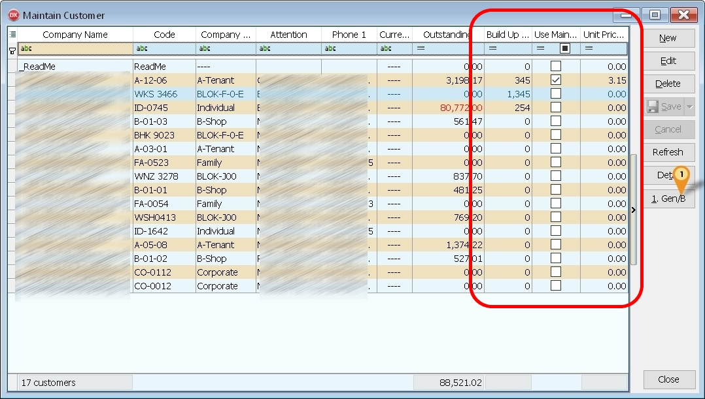

1. Click 1. Gen/B button.

    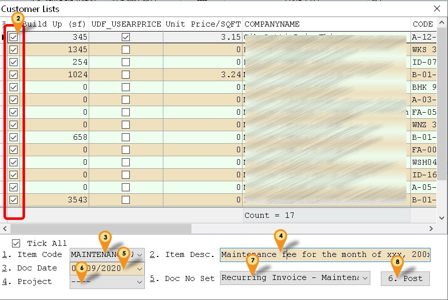

2. Untick any Customer you don't wanted to Generate
3. Select the Item Code.
4. Enter the Item Description.
5. Enter the Document Date.
6. Select Project (Optional)
7. Select Document Number Set to use
8. Click Post to generate

:::success If system prompt "Do you want to set "xxxxxx" as your default document running number set?"
Just click Yes to avoid keep prompt again
:::

:::warning
Make sure the Build Up (sf), Use Maintain Customer Price & Unit Price/SQFT Column
is shown at Browse Screen before Click the Gen/B button
:::

### Quotation

*Menu: Sales | Quotation...*

#### Generating Maintenance

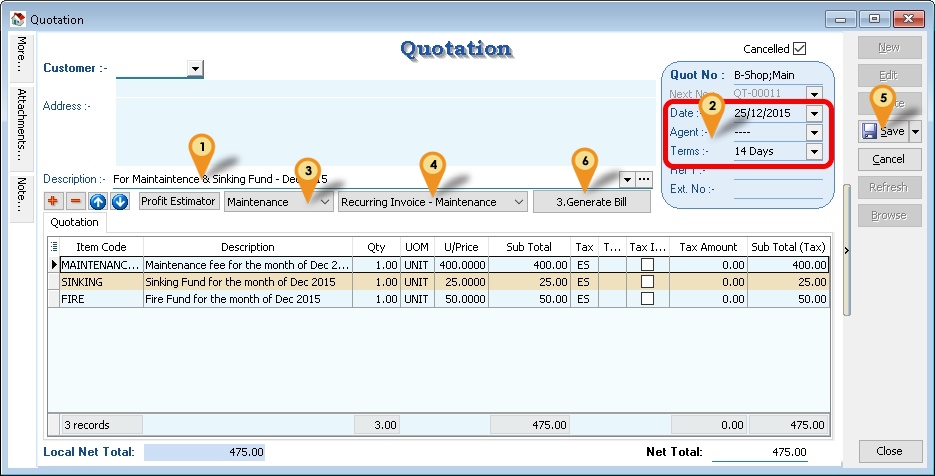

1. Enter/Change the Description to be shown in Sales Invoice & Customer Statement
2. Enter/Change the Date & Terms & other Information in Detail
3. Select Recurring Type (i.e. Maintenance).
4. Select Document Number Set to use.
5. Click Save button.
6. Click 3. Generate Bill button.

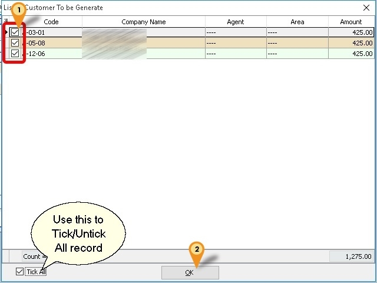

1. Untick any Customer you don't wanted to Generate
2. Click Ok button to generate

:::success The above steps also applicable for **Generating Maintenance for SQFT**
:::

#### Generating Meter Reading

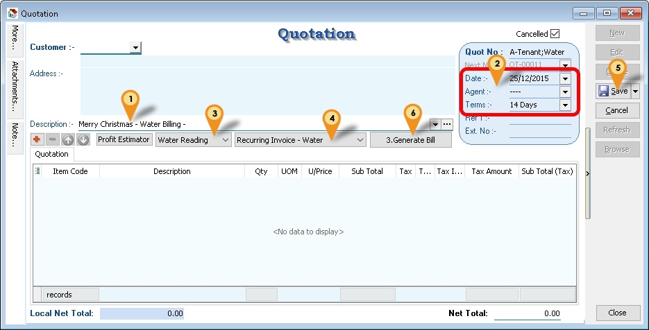

1. Enter/Change the Description to be shown in Sales Invoice & Customer Statement
2. Enter/Change the **Date & Terms** & other Information in Detail
3. Select Recurring Type (i.e. Water Reading).
4. Select **Document Number Set** to use.
5. Click Save button.
6. Click **3. Generate Bill** button.

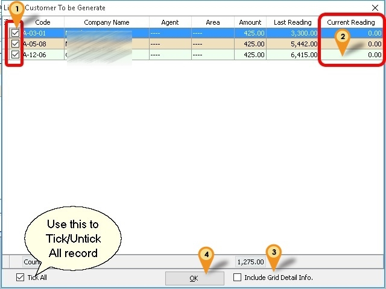

1. Untick any Customer you don't wanted to Generate
2. Enter the Current Reading for each Customer

3. Tick **Include Grid Detail Info**. (optional & available if Use Price Range is UnTick)
    * if you wanted combine **Generate Maintenance**
    * Must use the **Generate Maintenance** Template(Quotation)

4. Click Ok button to generate

:::success If system prompt "Do you want to set "xxxxxx" as your default document running number set?"
Just click Yes to avoid keep prompt again
:::

### Customer Payment

*Menu: Customer | Customer Payment...*

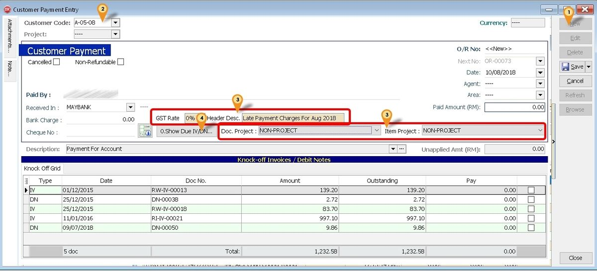

Below is example for **Generating Due Interest** from Customer Payment

1. Click New button
2. Select Customer Code
3. Enter & Select the DN Information
4. Click **0. Show Due IV/DN...** button

    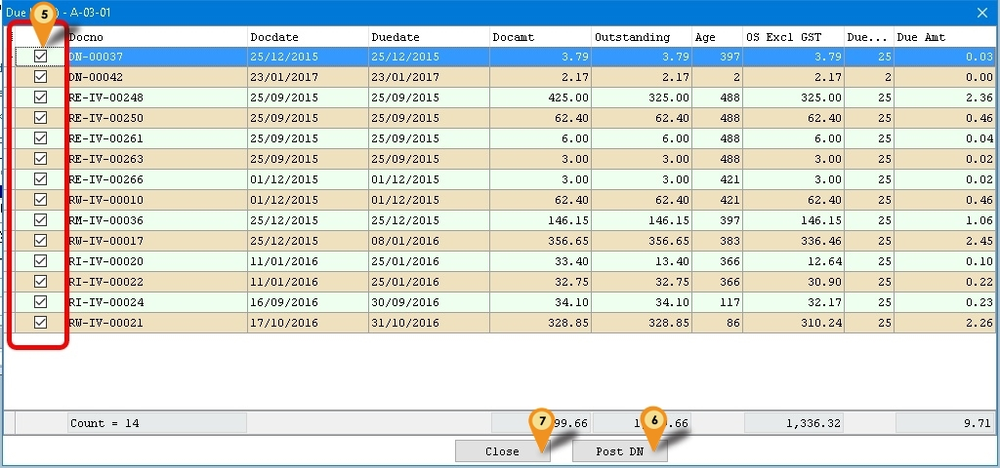

5. May untick which don't wanted to include the Due Interest Calculation.
6. Click **Post DN** Button to Post/Generate Due Interest DN
7. Click **Close**

:::warning
Make sure the **UDF_PostDN** Default is Set to **False** else will double posting
:::

:::success  NOTE:
The Age calculate to System Working Date.

The UnitPrice is round to 4 Decimal Point.

The GST Rate field is use to Pre-Calculate the Due Amount before posting Only.

The GST rate is still base on the GST Tax code you set in Maintain Item or Tools | option or Maintain Customer.
:::

## Recurring FAQ

### Where to Generate the Cust Local - Payment Listing (GST 1) - Knock Off Doc No Set - Cross report?

*Menu : Customer | Print Customer Document Listing... | Customer Payment Listing*_

### How the Column Description shown in Cust Local - Payment Listing (GST 1) - Knock Off Doc No Set - Cross report?

*Menu : Tools | Maintain Document Number...*

It use

* Description field as Caption
* First 2 Character Format field as Grouping (eg Format RE-IV-%.5d it will group by RE)

### Where to Generate the Sales Customer Price History - ItemCode - Cross report?

*Menu : Sales | Print Print Sales Price History...*

Select Customer in Group/Sort By : Option

### My company not using Rebate & Min. Charge. What Input Value I need to set?

Just set the Discount Value to 0+0

### How is the Rebate & Min.Charge is Work?

Default System will Calculate the Min. Charge then Only Rebate

### Can I use Maintain Customer Agent/Terms code instead use Quotation Agent/Terms code?

Yes can just Create & set the Code as zProfile for Agent and/or Terms

### Can I use Maintain Customer Agent/Terms code instead of using Quotation Agent/Terms code?

Yes can just Create & set the Code as zProfile for Agent and/or Terms

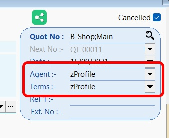

### Why at Maintain Customer Gen/B I can't select the Itemcode?

Make sure you had Stock Group begin with MAINTENANCE & all itemcode is set to this Stock Group
