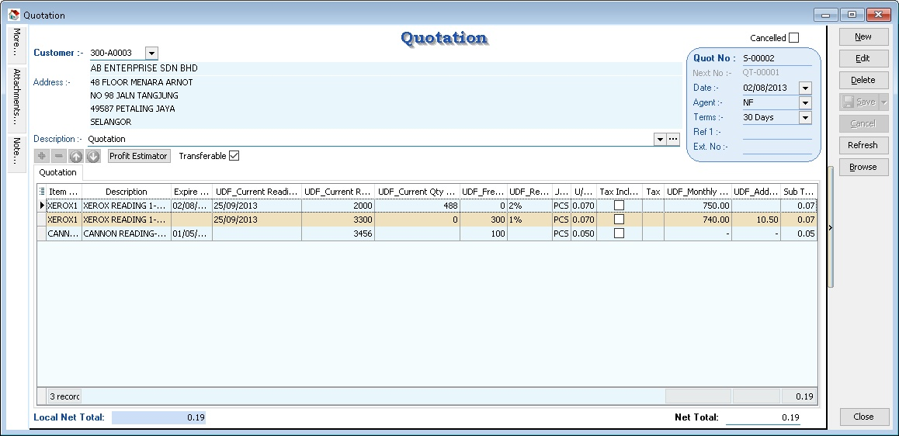
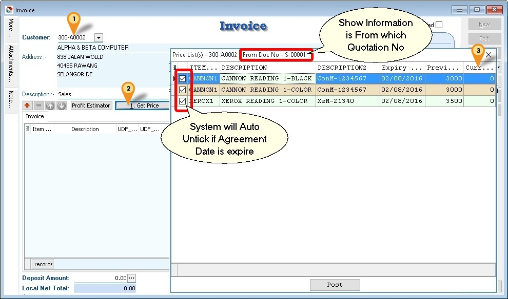

This Customisation is for the company who provide service on photocopier Machine

[Sample Database](https://download.sql.com.my/customer/Fairy/ACC%20BK-%5BPhotocopier%5D.zip)

History New/Updates/Changes

Fixed zitemcode sometime not deleted after save.
Add Copy Description2 & Project info from QT.
28 Aug 2025

Fixed Tax code not copy to Invoice
Add report format Sales Invoice 8 (SST 2)-For Package
20 Aug 2025

Add Itemcode zRental
Add Option for No Check Expire Agreement at Quotation
Remove Use of UDF_MthlyCharge & UDF_AddFees
Add Use itemcode zRental & zAddFees
Change use From using IV DocDate to IV DeliveryDate for Current Reading-Date
07 Apr 2025

Add Option At QT for Rebate Round Up/Round Down
12 Sep 2018

Enable support by Packages for Free & Spoil Qty/Copies
Enable support Min Charges
22 May 2018

Fixed Invoice Seq keep moving
29 Mar 2018

Fixed Unable to save Invoice if document is transfer from other Document when had GST
08 Mar 2018

Should allow append Current Reading same as previous Reading.
22 Feb 2018

Fixed Current Reading less then previous Should not append.
Enable copy Quotation Detail Fields

- Description3
- Remark1
- Remark2
- Project
- Location
- Disc
- Tax
- TaxInclusive
19 Oct 2015

Fixed upgrade to Version 721 error.
03 Jul 2015

Fixed Unable to save Invoice if document is transfer from other Document

## Modules Required

- DIY Script
- DIY Field

## Settings

### Sales Quotation

*Menu: Sales | Quotation...*

- 1 Quotation is for 1 Customer Profile
- Can Keep a lot of Machine (unlimited)
- Use Doc No S-XXXX as the Setting - To avoid mix with actual use of Quotation
- Can use same itemcode for Different Reading

- Minimum UDF Fields Required (Header Fields)

| **Field**          | **Description**                                                |
|---------------------|----------------------------------------------------------------|
| **UDF_RebateRoundUD** | Rebate Calc to Round Up or Round Down; Tick: Round Down; UnTick: Round Up |

- Minimum UDF Fields Required (Item Fields)

| **Field**          | **Description**                              |
|---------------------|----------------------------------------------|
| **Delivery Date**   | Contract Expiry Date                         |
| **UDF_CMR**         | Current Meter Reading                        |
| **UDF_DOCDATE**     | Current Reading Date; Norm is Invoice Date   |
| **UDF_QTY**         | Current Qty Charge                           |
| **UDF_REBATE**      | Rebate Qty or %                              |
| **UDF_MTHLYCHARGE** | Fixed Monthly Charges                        |
| **UDF_FREEQTY**     | Free Qty                                     |
| **UDF_ADDFEE**      | Additional Fixed Fee Charges                 |

- Minimum UDF Fields Required (Header Fields)

| **Name**        | **Data Type** | **Size** | **Sub Size** | **Caption**         | **Required** | **Default Value** | **Display Format** |
|------------------|---------------|----------|--------------|---------------------|--------------|-------------------|--------------------|
| **RebateRoundUD** | Boolean       |          |              | UDF_RebateRoundUD   | False        | 0                 | False              |

- Minimum UDF Fields Required (Items Fields)

| **Name**       | **Data Type** | **Size** | **Sub Size** | **Caption**                 | **Required** | **Default Value** | **Display Format**   |
|----------------|---------------|----------|--------------|-----------------------------|--------------|-------------------|----------------------|
| **CMR**        | Integer       |          |              | UDF_Current Reading         | False        | 0                 | #,0;-#,0             |
| **DocDate**    | Date          |          |              | UDF_Current Reading-Date    | False        |                   |                      |
| **Qty**        | Integer       |          |              | UDF_Current Qty Charge      | False        | 0                 | #,0;-#,0             |
| **Rebate**     | String        | 50       |              | UDF_Rebate                  | False        |                   |                      |
| **MthlyCharge**| Currency      |          |              | UDF_Monthly Charge          | False        | 0                 | #,0.00;-#,0.00       |
| **FreeQty**    | Integer       |          |              | UDF_Free Qty                | False        | 0                 | #,0;-#,0             |
| **AddFees**    | Currency      |          |              | UDF_AddFees                 | False        | 0                 | #,0.00;-#,0.00       |

### Maintain Stock Item

*Menu: Stock | Maintain Stock Item...*

- Need to keep 2 itemcode for 1 same item(physically)

- 1 for Norm Itemcode with Stock Control
- 1 for Non-Stock ItemCode for Meter Reading
- See example MACH_CANNON1(Norm Itemcode) & CANNON1(Meter Reading)

- Below is for By Packages Only

| **ItemCode**  | **Description**     | **Quotation Detail Field Used**       |
|---------------|---------------------|---------------------------------------|
| **zFreeQty**  | For Free Qty        | UDF_FreeQty & UnitPrice               |
| **zSpoil**    | For Spoil Copies    | UDF_Rebate & UnitPrice                |
| **zMinCharge**| Minimum Charges     | UnitPrice                             |

### Sales Invoice

*Menu: Sales | Invoice...*

- Will Check Expiry Date - Auto Untick the selection if Expired
- Auto Get Previous Meter Reading & Monthly Charge
- Will update Current Meter Reading, Current Qty Charge to Sales Quotation By ItemCode

| **Field**          | **Description**                                                                 |
|--------------------|---------------------------------------------------------------------------------|
| **No. of Copies**  | `Current Meter Reading - Previous Meter Reading`                                |
| **Rebate**         | `It can be in % or Qty`                                                         |
| **Qty Charges**    | `No. of Copies - FOC Qty - (No. of Copies * Rebate)`                            |
| **Amount Charges** | `(Qty Charges * Unit Price) + Add Fees + Monthly Charge (if No. of Copies > FOC Qty); Add Fees + Monthly Charge (if No. of Copies <= FOC Qty)` |

- Below is the field relation between Sales Quotation & Sales Invoice

| **Invoice Field**  | **Quotation Field**                          |
|---------------------|----------------------------------------------|
| **ItemCode**        | ItemCode                                     |
| **Description**     | Description                                  |
| **Description2**    | Description2                                 |
| **Description3**    | Description3                                 |
| **Remark1**         | Remark1                                      |
| **Remark2**         | Remark2                                      |
| **Project**         | Project                                      |
| **Location**        | Location                                     |
| **UDF_PMR**         | UDF_CMR                                      |
| **UDF_CMR**         | Meter Reading enter by user                  |
| **UDF_Rebate**      | UDF_Rebate                                   |
| **UDF_FreeQty**     | UDF_FreeQty                                  |
| **UDF_MthlyCharge** | UDF_MthlyCharge                              |
| **UDF_AddFees**     | UDF_AddFees                                  |
| **UOM**             | UOM                                          |
| **UDF_UnitPrice**   | UnitPrice                                    |
| **Disc**            | Disc                                         |
| **Tax**             | Tax                                          |
| **TaxInclusive**    | TaxInclusive                                 |
| **UDF_PMRDate**     | UDF_DocDate                                  |
| **UDF_Qty**         | Calculated based on formula above            |
| **Amount**          | Calculated based on formula above            |
| **UDF_FromDocNo**   | DocNo                                        |

- Minimum UDF Fields Required (Header Fields)

| **Name**        | **Data Type** | **Size** | **Sub Size** | **Caption**       | **Required** | **Default Value** | **Display Format** |
|-----------------|---------------|----------|--------------|-------------------|--------------|-------------------|--------------------|
| **RebateRoundUD** | Boolean       |          |              | UDF_RebateRoundUD | False        | 0                 | False              |

- Minimum UDF Fields Required (Items Fields)

| **Name**       | **Data Type** | **Size** | **Sub Size** | **Caption**                 | **Required** | **Default Value** | **Display Format**     |
|----------------|---------------|----------|--------------|-----------------------------|--------------|-------------------|------------------------|
| **PMR**        | Integer       |          |              | UDF_Previous Reading        | False        | 0                 | #,0;-#,0               |
| **CMR**        | Integer       |          |              | UDF_Current Reading         | False        | 0                 | #,0;-#,0               |
| **FreeQty**    | Integer       |          |              | UDF_FreeQty                 | False        | 0                 | #,0;-#,0               |
| **Rebate**     | String        | 50       |              | UDF_Rebate                  | False        |                   |                        |
| **MthlyCharge**| Currency      |          |              | UDF_Monthly Charge          | False        | 0                 | #,0.00;-#,0.00         |
| **SubTotal**   | Currency      |          |              | UDF_SubTotal                | False        | 0                 | #,0.00;-#,0.00         |
| **Qty**        | Float         | 10       | 4            | UDF_Current Qty Charge      | False        | 1                 | #,0;-#,0               |
| **UnitPrice**  | Float         | 10       | 4            | UDF_UnitPrice               | False        | 0                 | #,0.000;-#,0.000       |
| **AddFees**    | Currency      |          |              | UDF_AddFees                 | False        | 0                 | #,0.00;-#,0.00         |
| **FromDocKey** | Integer       |          |              | UDF_FromDocKey              | False        | 0                 |                        |
| **FromDtlKey** | Integer       |          |              | UDF_FromDtlKey              | False        | 0                 |                        |
| **PMRDate**    | Date          |          |              | UDF_PMRDate                 | False        |                   |                        |
| **FromDocNo**  | String        | 20       |              | UDF_FromDocNo               | False        |                   |                        |

## Steps

*Menu: Sales | Invoice...*

1. Select Customer.
2. Click 1. Get Price button.
3. Enter the Current New reading for each machine
4. Click Post button after done.

## FAQ

### How I list out all the Expired Agreement?

1. Click Sales | Outstanding Sales Document Listing.
2. Untick Doc Date
3. Tick Delivery Date
4. Enter the Range Date
5. Click Apply

### How system check the Expire Date?

    It will Auto Tick if Expire Date > CurrentWorkingDate OR Expire Date is Empty

### How system calculate the Minimum Charges?

    System will use Balancing Method to Calculate the Minimum Charges.
    Eg Min. Charge RM 300

    A. Machine Usage RM 6.86
    B. Free Copy RM 2.50
    C. Spoil Copy RM 0.14
    D. Total before Min Charges (A - B - C) RM 4.22
    E. Min. Charge (RM 300 - D) RM 295.78
