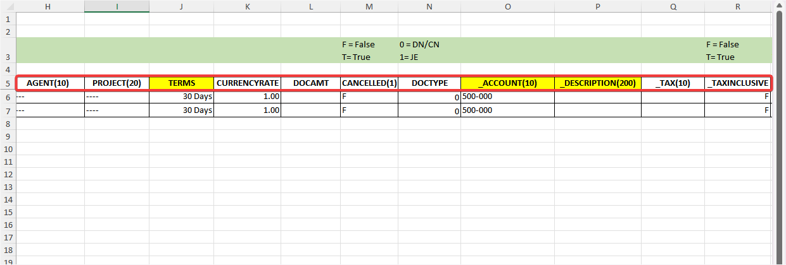
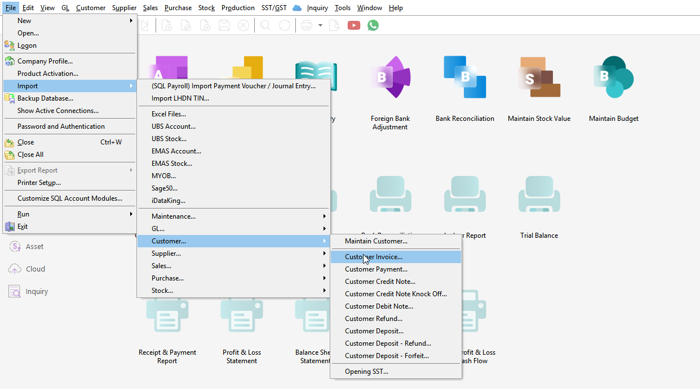
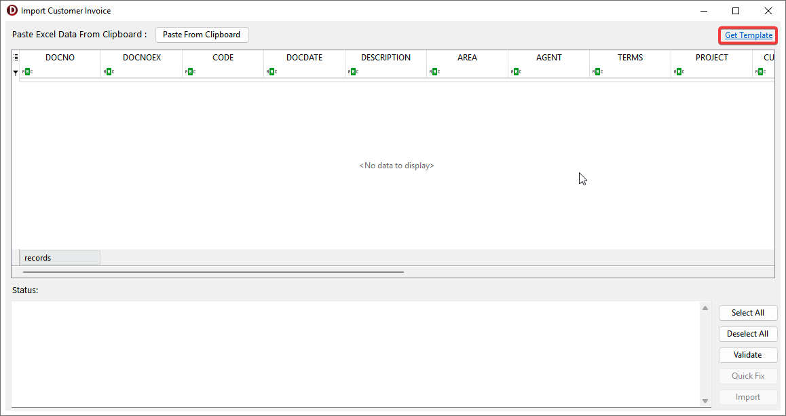
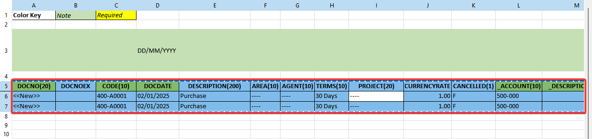
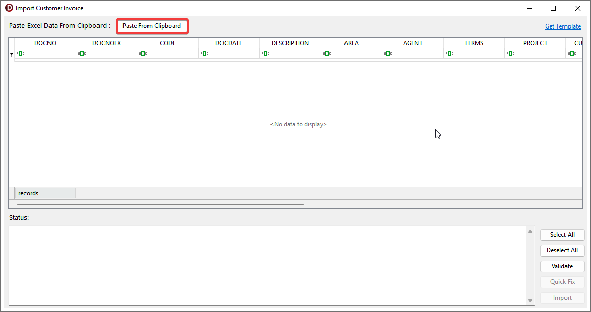
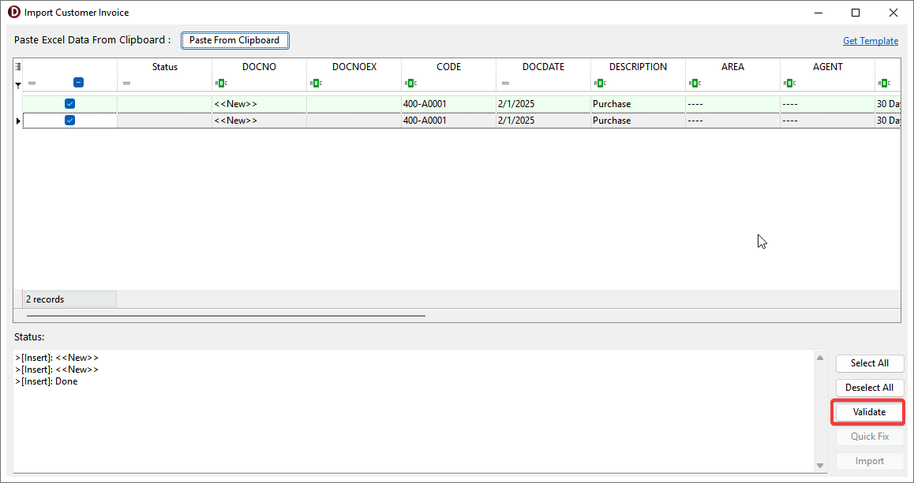
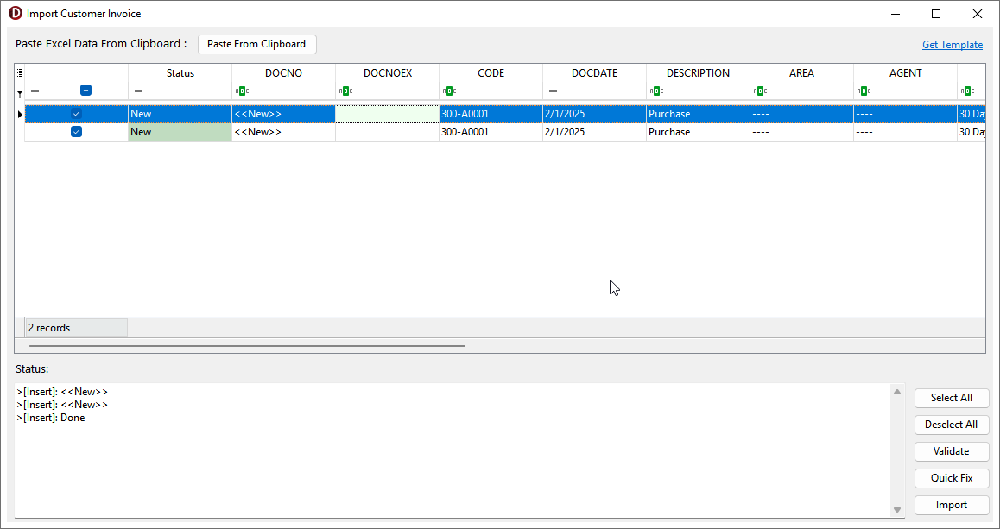
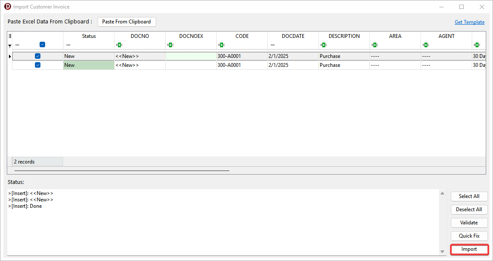

import '@src/css/sidebar.css';
import { YtLayout } from '@src/components/yt-layout';

Clipboard Import allows users to import master and transaction data by simply copy and paste from Excel. It supports both inserting new records and updating existing ones.

## Video Guide

<YtLayout
    videoId="LBAQw9rl5TM"
/>

## About Excel Template

The first row is field name and number inside the bracket is the field size. Field that starts with '_' (underscore) represents the detail table.

:::warning
Do not modify the field name. Modifying them may result in import errors.
:::

## Usage

### Import Steps

1. Go to **File** > **Import** > and select the table

    

2. Click **Get Template** and starts preparing data

    

3. Select and **Copy (Ctrl + C)** the table in Excel, including with field name

    

3. Click **Paste from Clipboard**

    

4. **Validate** the imported data

    

5. The status will show **New**, **Update** or **Error**

    

    :::info
    **New**: Inserts master and detail records.  
    **Update**: Udpates the master table and appends the detail records.  
    **Error**: You can **edit** the grid then **Select All** and click **Validate** again or use **[Quick Fix](#quick-fix)**.
    :::

6. Click **Import**

    :::warning
    During the import process, it is advisable to wait patiently until the import is complete. Performing other actions may cause the application to become unresponsive
    :::

    

### Quick Fix

Quick Fix helps you automatically fix errors, such as missing values. It can create missing items (like Agent or Area) or let you select a default value for empty field.

1. After **Validate**, record with *Error* status will be unticked. Click **Select All** or tick records that need to be fixed

    :::tip
    Quick Fix only works for records with an Error status.
    :::

    

2. Click **Quick Fix**

    

3. For empty value error, select a default value

    

4. Error is fixed

    

### Auto Generate DocNo

Use **`<<New>>n`** in the DocNo field for each set where *n* is a number

## Additional Information

1. Customer / Supplier branch's detail will be updated when *BranchName* already exist.

2. First customer / supplier branch type is *Billing*. Ensure billing details always in the first record during import.

3. Import GL Account requires fresh DB.