## Mamee

Is External Shareware Program which to import Mamee Text or CSV file to

- Sales Invoice
- Sales Credit Note
- Sales Debit Note (Non Product Related Only)

## Limitation (Mamee)

- Fixed Tax Code SR (i.e. all transaction is SR)
- Only support Mamee Product Related file (i.e. file with end HDR or DTL eg INVHDR or INVDTL)

## Mamee Specification

### Format 1 (Mamee)

- 03 Dec 2015
- [Mamee Example File](http://www.estream.com.my/downloadfile/Fairy/Mamee-ExampleFile.zip)

### Format 2 (Mamee)

- 22 Nov 2017
- [Mamee Example File 2](http://www.estream.com.my/downloadfile/Fairy/Mamee-ExampleFile2.zip)

## Import Program (Mamee)

- Version (2.4.0.5) - 08 Dec 2017
- Evaluation Limit : 100 Records per file
- [SQL Account Mamee Import Setup](http://www.estream.com.my/downloadfile/Fairy/SQLAccMameeImp-setup.exe)
- MD5 : `BA72428486784AFC3655601294BE83FD`

### History New/Update/Changes (Mamee)

--Build 5--

- Upgrade to Version 2.4.
- Upgrade to New Compiler.
- Add Format 2 import.
--Build 4--

- Upgrade to Version 1.3.
- Add Maintain Non-Product GL Function.
- Enable Import Non-Product Sales CN & DN Import
--Build 3--

- Upgrade to Version 1.2.
- Error in matching Agent
- Amount not excluding Disc Amount after Import.
- Add Link to SQL Acc. File | Run.
- Rearrange Detail column
- Fix Detail not Sort by Seq
- Set Disc to 2 Decimal Point.
--Build 2--

- Error on Maintain Agent if Record More then 1
--Build 1--

- Upgrade to Version 1.1
- Add Maintain Agent Function.
- Enable Use Census Number field as SQL Acc Customer Code.

## Field Mapping - Header (Mamee)

### Produc Related - Format 1 (Mamee Header)

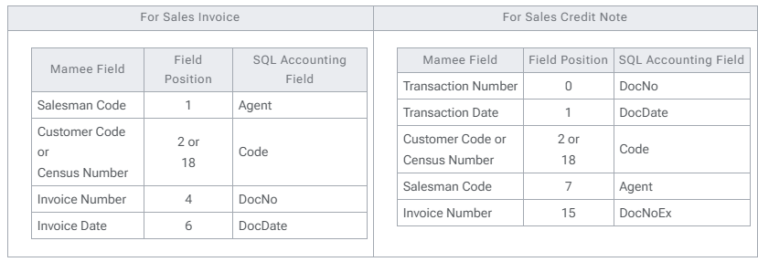

### Product Related - Format 2 (Mamee Header)

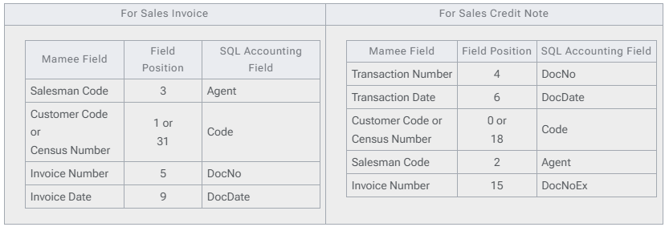

## Field Mapping - Detail (Mamee)

### Product Related - Format 1 (Mamee Detail)

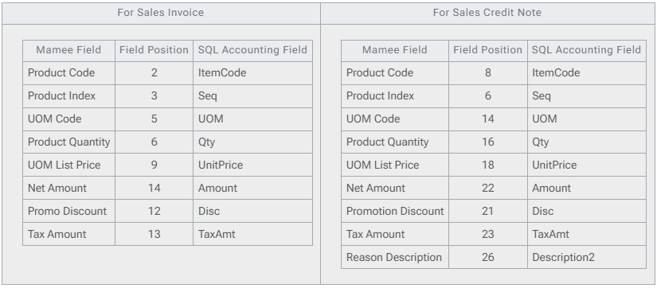

### Product Related - Format 2 (Mamee Detail)

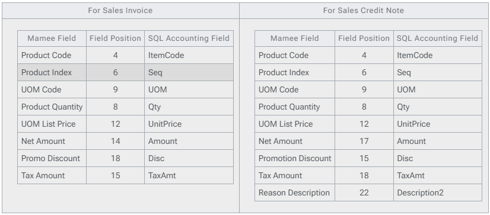

### Non-Product Related (Mamee Header)

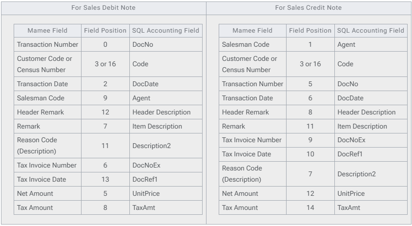

## Setting (Mamee)

### In SQL Accounting (Mamee)

Make sure this option is Tick under Tools | Options | Customer

- One Cent Different Rounding (Local Currency Fields) for all AR/SL Documents (Recommended)

### In Mamee Import

Menu : Tools | Options...

| **Options** | **Description** |
|--------------|-----------------|
| **MameeCustomerCodeAsCode** | `0` : Mamee Census Number check against SQLAcc Customer Code Field `1` : Mamee Customer Code same as SQLAcc Customer Code Field **(Recommended)** |
| **MameeSalesmanCodeAsAgent** | `0` : Mamee Salesman Code will use Mamee Import Agent List `1` : Mamee Salesman Code same as SQLAcc Agent Code **(Recommended)** |
| **FormatType** | `1` : Format 1 `2` : Format 2 |

Menu : Tools | Maintain Agent...

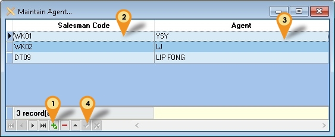

| Options       | Description                 |
|---------------|-----------------------------|
| Saleman Code  | Mamee Salesman Code         |
| Agent         | SQL Accounting Agent Code   |

01. Click the + button
02. Enter the Mamee Salesman Code
03. Select the SQL Accounting Agent Code
04. Click Tick to Save
Menu : Tools | Maintain Non-Product GL...

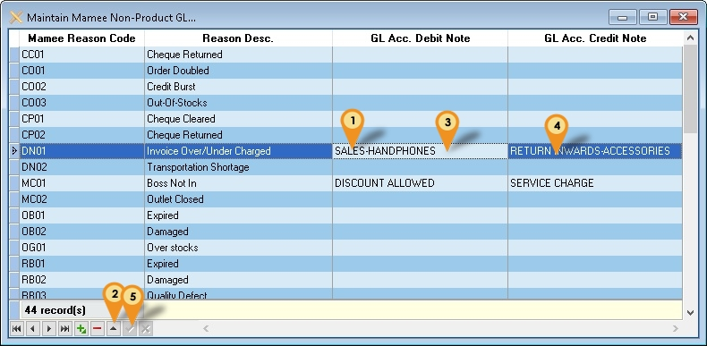

| Options               | Description                                      |
|-----------------------|--------------------------------------------------|
| Mamee Reason Code     | Mamee Reason Code                                 |
| Reason Desc.          | Mamee Reason Description                          |
| GL Acc. Debit Note    | SQL Accounting GL Account Code for Debit Note     |
| GL Acc. Credit Note   | SQL Accounting GL Account Code for Credit Note    |

01. Select the record
02. Click Edit (the up arrow)
03. Select the GL Code for Debit Note
04. Select the GL Code for Credit Note
05. Click Tick to Save

## Steps (Mamee)

### Product Related (Mamee)

Below steps is example to import Sales Invoice

01. Click **Product | Invoice...**

    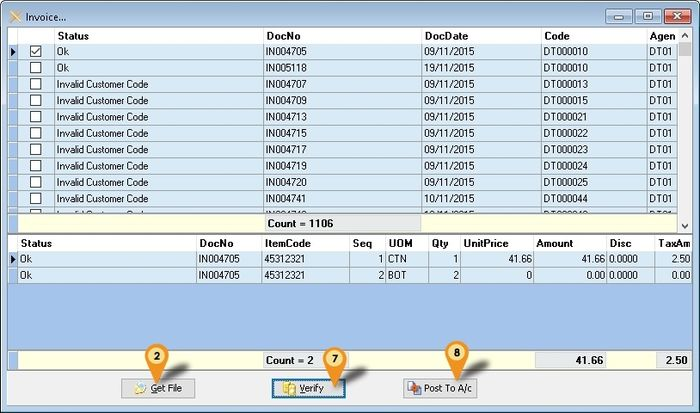

02. Click **Get File** button & system will prompt 2 dialog like below

    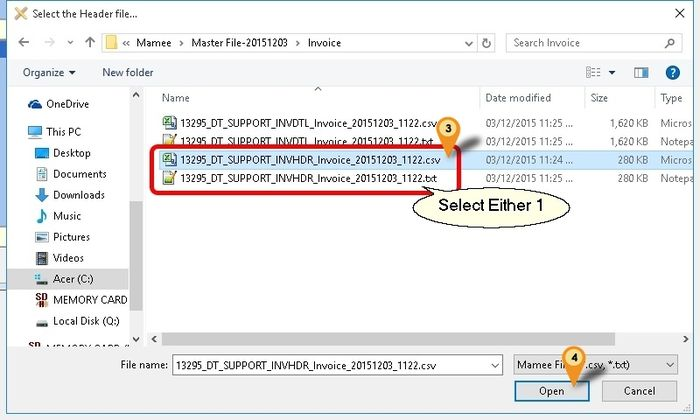

03. Select the Mamee Invoice **Text/CSV** Header File
04. Click **Open**

    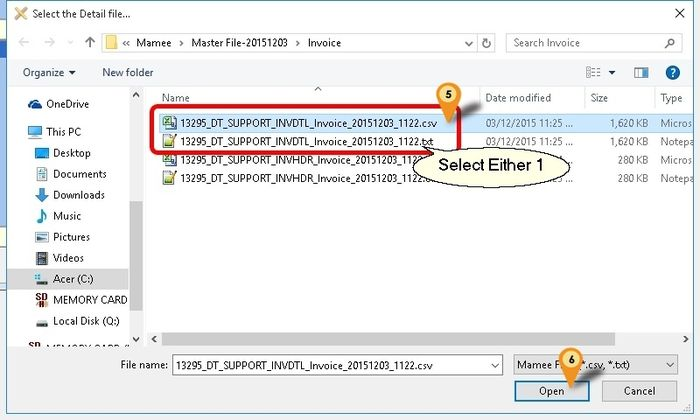

05. Select the Mamee Invoice Text/CSV Detail File
06. Click **Open**
07. Click **Verify** button to check the data with SQL Accounting Data
08. Click **Post To A/c** button if confirm all is ok to post to SQL Accounting

:::info
Record(s) will only **Post** if the **Check Box** is Tick & **Status** is Ok
:::

### Non-Product Related (Mamee)

Below steps is example to import Sales Credit Note

01. Click **Non-Product | Credit Note...**

    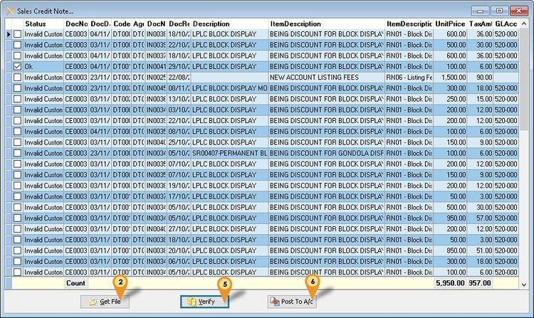

02. Click **Get File** button & system will prompt dialog like below

    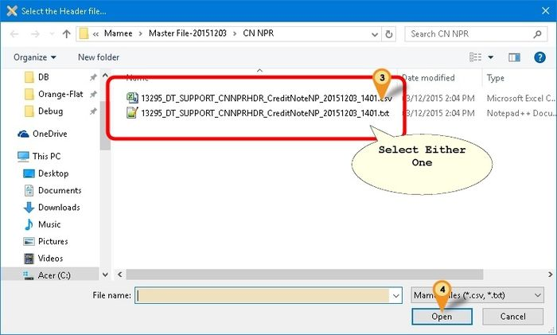

03. Select the Mamee Non Product Credit Note Text/CSV File
04. Click **Open**
05. Click **Verify** button to check the data with SQL Accounting Data
06. Click **Post To A/c** button if confirm all is ok to post to SQL Accounting

## F&N

Is External Shareware Program which to import F&N Text file to

- Sales Invoice
- Sales Credit Note
Export E-Invoice to F&N - Available in Build 18 & Above

- Sales Invoice
- Sales Credit Note

## Limitation (F&N)

- TaxCode with DS will not import.

## F&N Specification

- 17 Jun 2015 - ESD soft-drink
- [FN Acct Integration Refrences-20150617](https://download.sql.com.my/customer/Fairy/FN-Acct_Integration_Reference-20150617.zip)

- 15 Aug 2016 - ESD Online
- [FN-Acct Integration Refrences-20160815](https://download.sql.com.my/customer/Fairy/FN-Acct_Integration_Reference-20160815.zip)

## Import Program (F&N)

- Version (3.5.0.23) - 18 Dec 2024
- Evaluation Limit : 50 Records per file
- [SQL Account F&N Import Setup](https://download.sql.com.my/customer/Fairy/SQLAccFNImp-setup.exe)
- MD5 : `F8114AE694FB966D93082A3FEC57D17C`

### History New/Update/Changes (F&N)

--Build 23--

- Remove Check UOM from Option.
- Add check UOM base on FnN UOM.
--Build 22--

- Fix partly support Version 860 & above.
- Add show Outlet Name.
--Build 21--

- Enable support Version 858 for Export E-IV.
- Enable support Version 860 & above.
--Build 20--

- Fixed Export E-IV for CN apply error.
- Fixed Export E-IV dateTimeValidated formatting not correct.
--Build 19--

- Enable Import E-Invoice Info from FnN.
- Fixed Export E-IV header delimiter not correct.
--Build 18--

- Upgrade to Version 3.6.
- Add FnN to Header Field CC as indicator Import from FnN.
- Remove L tax code from import.
- Set Default Open FnN ESD Online Files format.
- Add E-Invoicing Export function.
--Build 17--

- Fixed Use UOMList not working.
--Build 16--

- Add Import Remark to DeliveryTerm Field for CSV format.
--Build 15--

- Add Auto Set to Outlet_ID2 if Debtor_Code2 is empty for CSV format.
- Add Get User Guide Option.
--Build 14--

- Upgrade to Version 3.5.
- Enable support Running In Windows Limited User.
- Fixed Verify Detail Error not untick the Master when itemcode not found.
- Fixed Verify Not Check Item Code UOM.
- Fixed Scrollbar not visible.
--Build 13--

- Upgrade to Version 3.4.
- Add Project & Location Lookup for Posting.
--Build 12--

- Add Outlet_ID2 to shown in Grid.
--Build 11--

- Upgrade to D25 Compiler.
- Upgrade to Version 3.3.
- Remove Import Debtor_Name2.
--Build 10--

- Upgrade to XE10 Compiler.
- Upgrade to Version 3.2
- Add Link to SQL Acc. File | Run.
- Add OutletID=Maintain Customer Code
- Add ESD Online - CSV Format
--Build 9--

- Fix unable to import docamt is 0 even is no DS Code.
- Fix Status no dropdown list.
- Fix Detail not Verify.
--Build 8--

- Fix Get File Error when record is without tax code.
--Build 7--

- Fix CN Get File Error.

## Field Mapping - Header (F&N)

- As at 17 Jun 2015 - ESD soft-drink - Fixed Length Format

| FnN Field   | Field Position | Field Size | SQL Accounting Field                 |
|-------------|--------------:|----------:|---------------------------------------|
| Invoice_Date| 1             | 10        | DocDate                               |
| Invoice_ID  | 11            | 10        | DocNo                                 |
| Gross Amount| 41            | 10        | DocAmt                                |
| Outlet_ID   | 71            | 10        | Maintain Customer Remark or Code      |

- As at 15 Aug 2016 - ESD Online - CSV Format

| FnN Field        | Field Position | Field Size | SQL Accounting Field                          |
|------------------|--------------:|----------:|------------------------------------------------|
| Invoice_Date     | 0             | 10        | DocDate                                        |
| Invoice_ID       | 1             | 15        | DocNo                                          |
| Total_Gross_Amount | 4           | 10        | DocAmt                                         |
| Debtor_Code2     | 9             | 10        | Customer Code                                  |
| Debtor_Name2     | 10            | 150       | Customer Name Not valid for Build 11 & above |
| Outlet_ID2       | 11            | 10        | Display Only                                   |
| Remark           | 12            | 200       | Delivery Term Available in Build 16 & above |

## Field Mapping - Detail

- As at 17 Jun 2015 - ESD soft-drink - Fixed Length Format

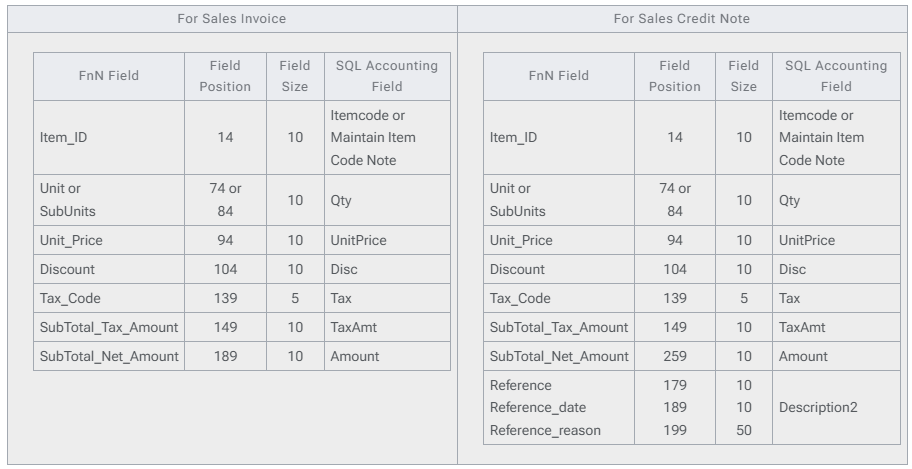

- As at 15 Aug 2016 - ESD Online - CSV Format

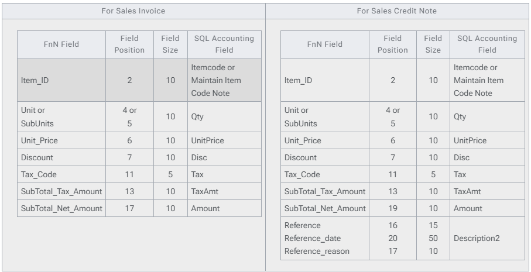

## Setting (F&N)

### In SQL Accounting (F&N)

01. May refer to Point 2 at Things To Consider Before Import/Post
02. Make sure this option is Tick under Tools | Options | Customer

- Perform Tax/Local Amount Rounding

### In F&N Import

| Options          | Description                                                                                                                       |
|-------------------|-----------------------------------------------------------------------------------------------------------------------------------|
| UOMList           | List of UOM available in F&amp;N (Normally is CTN &amp; PCS)                                                                      |
| DocNoAsDocNo      | 0 : F&amp;N DocNo will post to SQLAcc DocNoEx Field 1 : F&amp;N DocNo will post to SQLAcc DocNo Field (Recommended)             |
| FNCodeAsItemCode  | 0 : F&amp;N ItemCode will check against SQL Accounting \| Maintain Item \| Note Field 1 : F&amp;N Itemcode same as SQL Accounting Itemcode (Recommended) |
| FNUOMAsUOM        | 0 : F&amp;N ItemCode will check against UOMList 1 : F&amp;N Itemcode UOM same as SQLAcc Itemcode UOM (Recommended)              |
| OutletIDAsCompCode| For ESD soft-drink – Fixed Length Format Only 0 : F&amp;N Outlet ID will check against SQL Accounting \| Maintain Customer \| Remark Field 1 : F&amp;N Outlet ID same as SQLAcc Customer Code (Recommended) |

## Steps (F&N)

### Import Invoice/Credit Note (F&N)

Below steps is example to import Sales Invoice
01. Click Sales | Invoice...
02. Click Get File button & system will prompt 2 dialog like below

    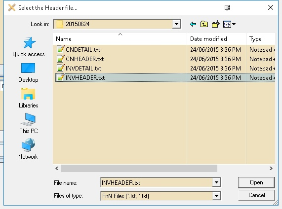

03. Click Files of Type & select the FnN File Format type
04. Select the F&N Invoice Text Header File

    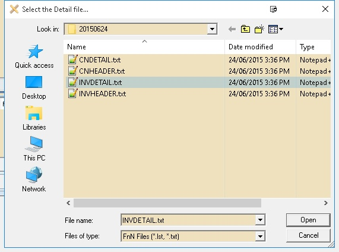

05. Select the F&N Invoice Text Detail File

    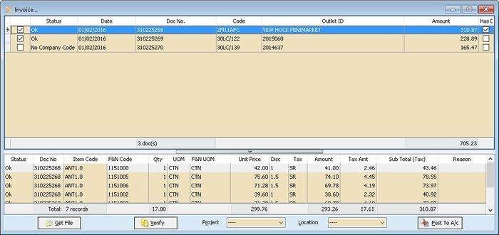

06. Click Verify button to check the data with SQL Accounting Data
07. Select Project & Location (if Required)
08. Click Post To A/c button if confirm all is ok to post to SQL Accounting

:::caution
Remember to check the data with Has Deemed Supplies column which is Tick as system will by pass posting
:::

### Export E Invoice/Credit Note (F&N)

    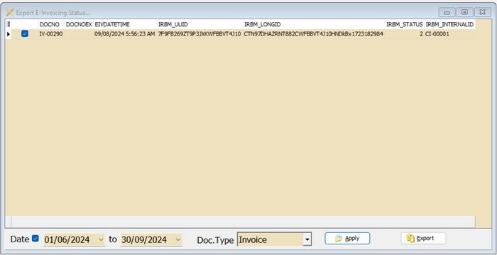

01. Click Export E-Invoice Status...
02. Select Range Date (E-Invoice Submission date)
03. Select DocType (eg Invoice)
04. Click Apply
05. Click Export

## Unilever

Is External Shareware Program which to import Unilever CSV file to

- Sales Order
- Sales Invoice
- Sales Credit Note

## Unilever Specification

- 07 Feb 2018
- [Unilever Import Structure-20180207](http://www.estream.com.my/downloadfile/Fairy/UnileverImp-Structure-20180207.zip)
- 25 Sep 2017
- [Unilever Import Structure-20170925](http://www.estream.com.my/downloadfile/Fairy/UnileverImp-Structure-20170925.zip)

## Import Program (Unilever)

- Version (1.3.0.12) - 05 Apr 2025
- Evaluation Limit : 100 Records per file
- SQLAccUnileverImp-setup.exe
- MD5 : `44F7A21D88D3EA4F4C1D7CF0571FFD5D`

### History New/Update/Changes (Unilever)

--Build 12--

- Fixed Get SO for Old Format no data.
--Build 11--

- Upgrade to Version 1.3.
- Add Option to Import as Sales Order.
- Add Get User Guide option.
--Build 10--

- Enable Support Version 860 & above.
--Build 9--

- Add Copy Cell Value Function.
- Add Auto Add Rounding for DocAmt &lt;&gt Total Detail Amount.
--Build 8--

- Fixed Find Company Code not Correct if almost same Retail Code.
- Fixed Setting loss after uninstall.
--Build 7--

- Upgrade to Version 1.2.
- Enable Support if Unilever using Both Cases and Pieces for 1 row by Convert to Smallest UOM for Cases.
--Build 6--

- Add ZRL & SR TaxCode Option
--Build 5--

- Fix Header DocNo not match with Detail DocNo
--Build 4--

- Verify DocNo not correct for Old Format import
- Amount should deduct Discount before append
--Build 3--

- Upgrade to Version 1.1.
- Add back Old Format Import with auto add 00 in-front of DocNo before Post to Account.
--Build 2--

- Fixed UnitPrice 0 when After Post to Account.
--Build 1--

- Update New Format.
--Build 0--

## Field Mapping - Header (Unilever)

- 25 Sep 2017

| Unilever Field   | Field Position | Field Size | SQL Accounting Field |
|------------------|--------------:|----------:|----------------------|
| **INVH_Type**    | 1            | 2         | 01 – Sales Invoice 02 – Sales Credit Note |
| **INVH_No**      | 3            | 10        | DocNo |
| **INVH_Retailer**| 17           | 8         | Code or Maintain Customer Remark |
| **INVH_Date**    | 26           | 19        | DocDate |
| **INVH_Total**   | 141          | 21        | Amount Before Discount |
| **INVH_Discount**| 162          | 21        | Discount Amount |

- 07 Feb 2018

| Unilever Field   | Field Position | Field Size | SQL Accounting Field |
|------------------|--------------:|----------:|----------------------|
| **INVH_Type**    | 1            | 2         | 01 – Sales Invoice 02 – Sales Credit Note |
| **INVH_No**      | 3            | 12        | DocNo |
| **INVH_Retailer**| 19           | 8         | Code or Maintain Customer Remark |
| **INVH_Date**    | 28           | 19        | DocDate |
| **INVH_Total**   | 143          | 21        | Amount Before Discount |
| **INVH_Discount**| 164          | 21        | Discount Amount |

## Field Mapping - Detail (Unilever)

- 25 Sep 2017

| Unilever Field  | Field Position | Field Size | SQL Accounting Field |
|-----------------|--------------:|----------:|----------------------|
| **INVR_No**     | 3            | 10        | DocNo |
| **INVR_Product**| 13           | 8         | Item Code or Maintain Item Code Note |
| **INVR_Cases**  | 26           | 22        | Qty (UOM = CA) |
| **INVR_Pieces** | 48           | 22        | Qty (UOM = PCS) |
| **INVR_Amount** | 70           | 21        | Amount |
| **INVR_Discount**| 91          | 21        | Discount |
| **INVR_TAXRate**| 133          | 22        | 0 Tax Code = ZRL 6 Tax Code = SR |
| **INVR_TAXTotal**| 155         | 21        | GST Amount |

- 07 Feb 2018

| Unilever Field   | Field Position | Field Size | SQL Accounting Field |
|------------------|--------------:|----------:|----------------------|
| **INVR_No**      | 3            | 12        | DocNo |
| **INVR_Product** | 15           | 8         | Item Code or Maintain Item Code Note |
| **INVR_Cases**   | 28           | 22        | Qty (UOM = CA) |
| **INVR_Pieces**  | 50           | 22        | Qty (UOM = PCS) |
| **INVR_Amount**  | 72           | 21        | Amount |
| **INVR_Discount**| 93           | 21        | Discount |
| **INVR_TAXRate** | 135          | 22        | 0 Tax Code = ZRL 6 Tax Code = SR |
| **INVR_TAXTotal**| 157          | 21        | GST Amount |

- Unit Price will not import & will auto Assign by SQL Accounting due to Unilever file don't had Pieces Price & UOM Rate

## Setting (Unilever)

### In SQL Accounting (Unilever)

01. May refer to Point 2 at Things To Consider Before Import/Post
02. Make sure this option is Tick under Tools | Options | Customer

    - Perform Tax/Local Amount Rounding

03. Menu: Stock | Maintain Stock Item...

- Item Code to be create
  - Rounding

### In Unilever Import (Unilever)

This can be see under Tools | Options

| Options              | Description |
|----------------------|------------|
| **UOM_Cases**        | UOM for Cases in SQL Accounting Default is CA |
| **UOM_Pieces**       | UOM for Pieces in SQL Accounting Default is PCS |
| **RetailAsCompCode** | 0 : Unilever Retail Code will check against SQL Accounting &#124; Maintain Customer &#124; Remark Field 1 : Unilever Retail Code same as SQL Accounting Customer Code (Recommended) |
| **UnileverCodeAsItemCode** | 0 : Unilever Item Code will check against SQL Accounting &#124; Maintain Item &#124; Note Field 1 : Unilever Item Code same as SQL Accounting Item Code (Recommended) |
| **TaxCodeZRL**       | Tax code for 0% |
| **TaxCodeSR**        | Tax Code other than 0% |

## Steps (Unilever)

Below steps is example to import Sales Invoice

01. Click Sales | Invoice...
02. Click Get File button & system will prompt 2 dialog like below

    

03. Select the Unilever Invoice Text Header File

    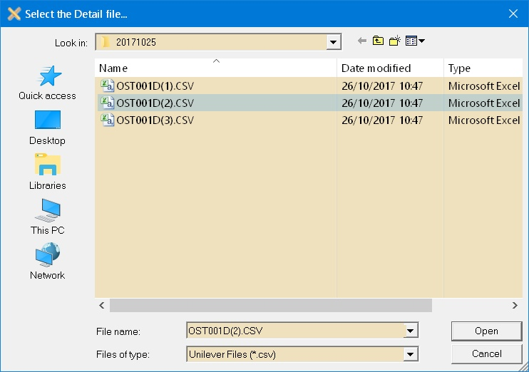

04. Select the Unilever Invoice Text Detail File

    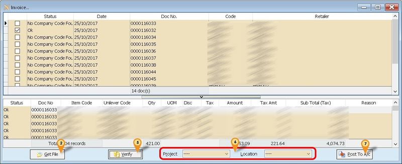

05. Click Verify button to check the data with SQL Accounting Data
06. Select Project & Location (if Required)
07. Click Post To A/c button if confirm all is ok to post to SQL Accounting

## Dryper

Is External Shareware Program which to import & Export Dryper excel file to

**Import**

- Sales Order or Sales Invoice
- Purchase Order or Purchase Invoice
**Export**
- Sales Credit Note

## Dryper Specification

- 15 Jan 2019
- [Dryper Specification-20190115](https://download.sql.com.my/customer/Fairy/Dryper_Spec-20190115.zip)

## Import Program (Dryper)

- Version (1.1.0.3) - 29 Jan 2021
- Evaluation Limit : 100 Records per file
- [SQLAccDryperImp-setup](https://download.sql.com.my/customer/Fairy/SQLAccDryperImp-setup.exe)
- MD5 : `5D18B0207C9C12168D0394855EA378ED`

### History New/Update/Changes (Dryper)

--Build 3--

- Enable Support Version 782 & above (New ROC).
- Fixed DocNo Not able to select.
- Fixed Unable to Batch Highlight DocNo.
- Fixed Import Prompt Date Error.
- Add Shortcut Get User Guide.
--Build 2--

- Add Option SL-UseDryperItemDesc & PH-UseDryperItemDesc.
- Add Option SL-UseDocNoEx & PH-UseDocNoEx.
- Fixed Setting will loss on Uninstall.
--Build 1--

- Upgrade to Version 1.1.
- Add Option for use CustomerCode or ExternalReferenceNo2 for SQL Accounting Customer Code.
- Add Check Box at DocNo & remove Check Box in Data Grid
- Add Import PO & PI.
- Add Checking for BizNature & CompanyName2 field for Customer/Supplier Code
- Remove Import DocNoEx for ExternalReferenceNo2
- Add Checking for Description2 & Note field for Item Code.
- Fixed unable to register.
--Build 0--

## Field Mapping (Dryper)

### Sales Order or Sales Invoice (Dryper Mapping)

| Dryper Field – SO | Dryper Field – IV | SQL Accounting Field |
|-------------------|-------------------|----------------------|
| **SalesOrderCode** | **SalesInvoiceCode** | DocNo |
| *Either 1 below* | *Either 1 below* | |
| CustomerCode | CustomerCode | Code |
| ExternalReferenceNo2 | ExternalReferenceNo2 | RegisterNo / GSTNo / Remark / CompanyName2 |
| **OrderDate** | **InvoiceDate** | DocDate |
| **ItemCode** | **ItemCode** | *Either 1 below* |
| | | Code Remark1 Remark2 Shelf Barcode |
| **ItemName** | **ItemName** | Item Description |
| **Quantity** | **Quantity** | Qty |
| **UOM** | **UOM** | UOM |
| **UnitPrice** | **UnitPrice** | UnitPrice |
| DiscountRate where LineType = 1 | DiscountRate where LineType = 1 | Disc |
| **TotalTaxAmount** | **TotalTaxAmount** | TaxAmt |
| **NetAmount** | **NetAmount** | Amount |
| **RoundingAmount** | **RoundingAmount** | Will Append as New itemcode RTN5Cents |

### Purchase Order or Purchase Invoice (Dryper Mapping)

| Dryper Field – PO | Dryper Field – PI | SQL Accounting Field |
|-------------------|-------------------|----------------------|
| **PurchaseOrderNo** | **InvoiceNo** | DocNo |
| *Either 1 below* | *Either 1 below* | |
| CreditorCode | CreditorCode | Code |
| SupplierCode | SupplierCode | RegisterNo / GSTNo / Remark / CompanyName2 |
| **ItemCode** | **ItemCode** | *Either 1 below* |
| | | Code Remark1 Remark2 Shelf Barcode |
| **ItemName** | **ItemName** | Item Description |
| **POQuantity** | **Quantity** | Qty |
| **UOM** | **UOM** | UOM |
| **UnitCost** | **UnitPrice** | UnitPrice |
| **NetAmount** | **NetAmount** | Amount |
| **OrderDate** | **GRNDate** | DocDate |

### Customer Credit Note - Export (Dryper Mapping)

| Dryper Field      | SQL Accounting Field        |
|-------------------|-----------------------------|
| **CompanyCode**   | Hard Coded as 1             |
| **DistributorCode** | Field To Enter in Export Program |
| **BranchCode**    | Field To Enter in Export Program |
| **CustomerCode**  | Customer Code               |
| **DocumentNo**    | DocNo                       |
| **DocumentDate**  | DocDate                     |
| **TotalAmount**   | DocAmt                      |
| **PaidAmount**    | DocAmt                      |
| **Status**        | Hard Coded as 1             |
| **CreatedBy**     | Hard Coded as SYSTEM        |
| **CreatedTimestamp** | DocDate                  |

## Setting (Dryper)

### In SQL Accounting (Dryper Setting)

01. May refer to Point 2 at Things To Consider Before Import/Post

### In Dryper Import (Dryper Setting)

This can be see under Tools | Options

| Options                  | Description |
|--------------------------|------------|
| **UseCustomerCode**      | 0 : Import will use Dryper ExternalReferenceNo2 Field as Customer Code 1 : Import will use Dryper CustomerCode Field as Customer Code |
| **UseSupplierCode**      | 0 : Import will use Dryper CreditorCode Field as Supplier Code 1 : Import will use Dryper SupplierCode Field as Supplier Code |
| **SL-UseDryperItemDesc** | 0 : Import will use SQL Accounting Item Description For Sales Import 1 : Import will use Dryper Item Description For Sales Import |
| **PH-UseDryperItemDesc** | 0 : Import will use SQL Accounting Item Description For Purchase Import 1 : Import will use Dryper Item Description For Purchase Import |
| **SL-UseDocNoEx**        | 0 : Import will Map Dryper DocNo to SQL Accounting DocNo For Sales Import 1 : Import will Map Dryper DocNo to SQL Accounting DocNoEx For Sales Import |
| **PH-UseDocNoEx**        | 0 : Import will Map Dryper DocNo to SQL Accounting DocNo For Purchase Import 1 : Import will Map Dryper DocNo to SQL Accounting DocNoEx For Purchase Import |

## Sales Order or Sales Invoice (Dryper Setting)

Below is example for import Sales Invoice...
Menu: Sales | Invoice...

01. Click 1. Get File button

    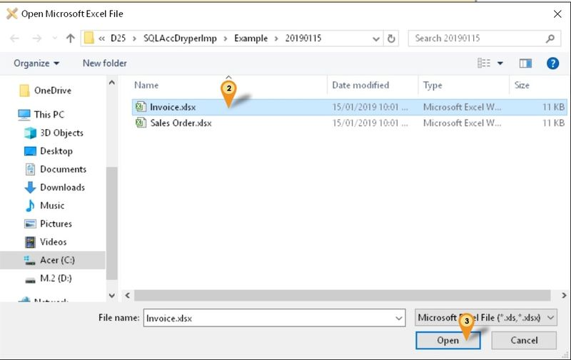

02. Select the File file wanted to import
03. Click Open

    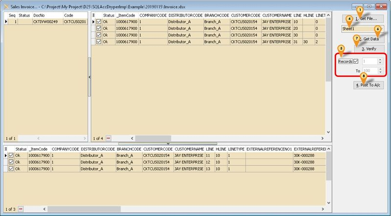

04. Select the Excel Sheet (if more then 1)
05. Set No of record to Load (only available for Registered user)
06. Click 2. Get Data button
07. Click 3. Verify button
08. Click 4. Post To A/c button

## Customer Credit Note - Export (Dryper Setting)

Menu: Customer | Customer Credit Note - Export...
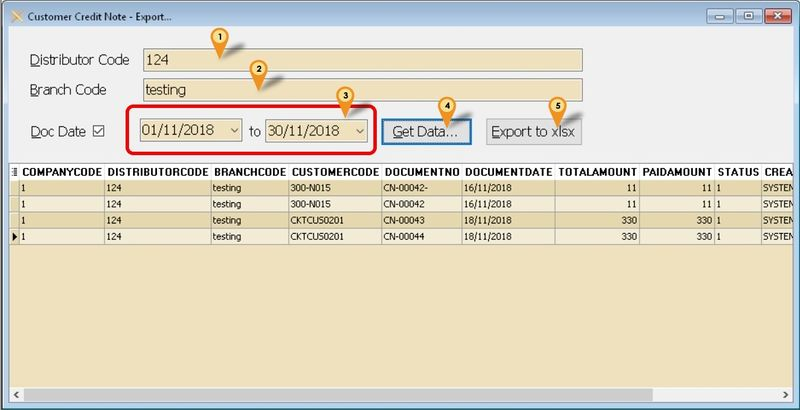

01. Enter the Distributor Code (Provided by Dryper)
02. Enter the Branch Code (Provided by Dryper)
03. Select Range Date To export
04. Click Get Data... to get the Data from SQL Accounting
05. Click Export to xlsx to export out

## FAQ (Dryper)

### How it look like if Dryper had 3 level of discount?

Once Import it will look like below

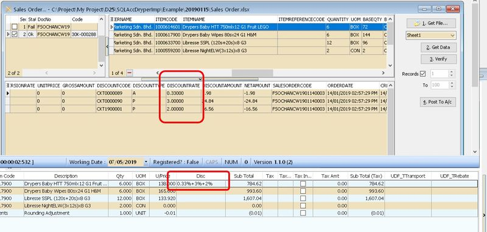

## SLPH

Is External Shareware Program which Convert Sales to Purchase Module or vice versa which exported from SQL Accounting
Normally is use to Export Data From SQL Accounting Database A from Document Type A (Eg Sales Invoice) & Import to SQL Accounting Database B as other Document Type (Eg Purchase Invoice)

## Limitation (SLPH)

- Only support 1 Company Code (i.e. 1 batch 1 Company Code)
- Both Source & Target must had Same Itemcode

## Import Program (SLPH)

- Version (5.2.1.10) - 20 Aug 2025
- [Download Link](https://download.sql.com.my/customer/Fairy/SQLAccSLPHV5-setup.exe)
- MD5 : `7ECC58CCBA8B04A00E2F5582D234CE14`

### History New/Update/Changes (SLPH)

--Build 10--

- Fixed Tax Code empty after verify.
- Fixed TaxInclusive not Import.
--Build 9--

- Fixed Get File no records when in SQL Connect.
--Build 8--

- Fixed Get File Error due to SEQ field.
Add Get User Guide... Option.
--Build 7--

- Upgrade to Version 5.2.1.
- Enable Quick Customise Layout for Grid.
- Empty Item Code should by pass from Verify.
- Allow User Override Header Description.
- Enable Support Unicode
--Build 6--

- Fixed Import Sales/Purchase CN & DN Error.
--Build 5--

- Upgrade to Version 5.2.
- Add Option Use My Maintain Supplier/Customer Information for Sales/Purchase Import.
- Enable support Running In Windows Limited User.
--Build 4--

- Fixed Shown TaxCode Even Original no TaxCode.
--Build 3--

- Fix TaxRate Not Import
- Fixed Import Customer/Supplier prompt bad variance type.
--Build 2--

- Enable Support Version 5 SQL Accounting
- Add Maintain Tax
--Build 1--

- Fix unable to register Database

## Setting (SLPH)

### In SQL Accounting (SLPH)

01. May refer to Point 2 at Things To Consider Before Import/Post
02. Make sure this option is Tick under Tools | Options | Customer
    - Perform Tax/Local Amount Rounding

### In SLPH Import

Menu : Tools | Maintain Tax

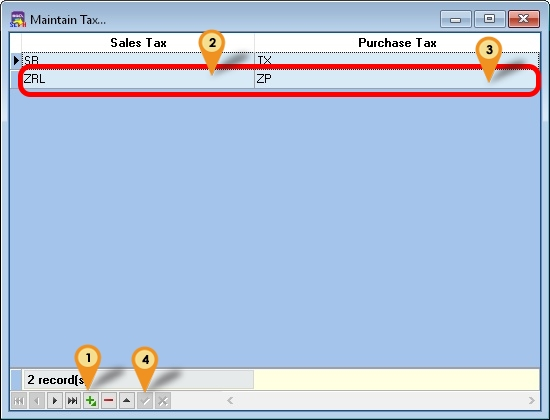

01. Click New/Edit to Insert or update
02. Select Sales Tax Code
03. Select Purchase Tax Code
04. Click Post/Save

## Steps (SLPH)

Menu : Purchase | Purchase Invoice...
Below steps is example to import Purchase Invoice

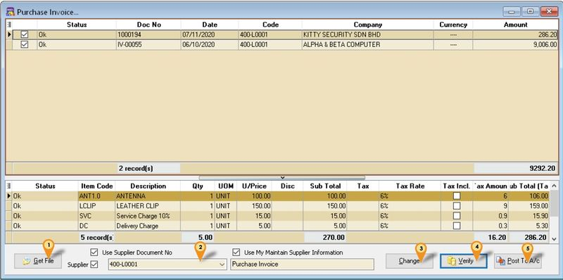

01. Click Get File button
02. Select Supplier Code to update
03. Click Change Button
04. Click Verify button
05. Click Post to A/c Button

| Option | Description |
|--------|------------|
| **Use Supplier Document No** | Tick : Will follow DocNo in the XML UnTick : Auto Assign New Document Number In SQL Accounting |
| **Use My Maintain Supplier Information** | Tick : Will follow Maintain Supplier Information UnTick : Will follow Document Supplier Information |
| **Purchase Invoice (Below Use My Maintain Supplier Information Option)** | Empty it : Will follow Document Header Description With Value : Will follow the value entered in this field for Header Description |
