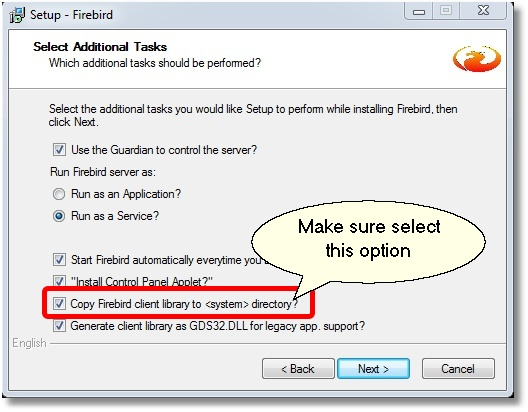
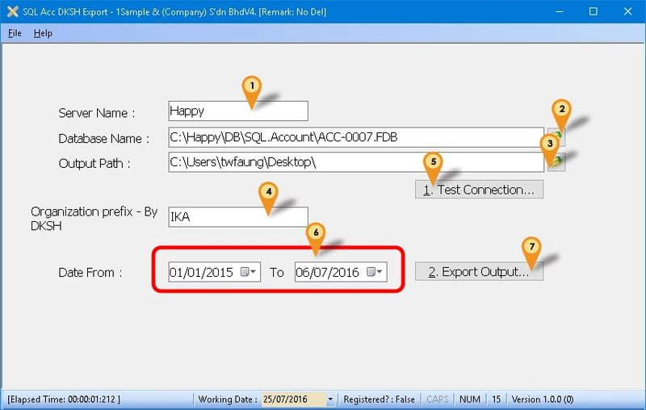
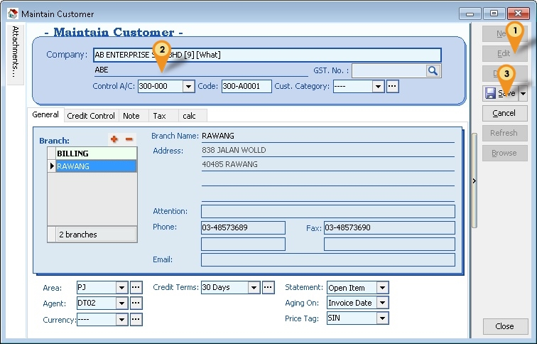
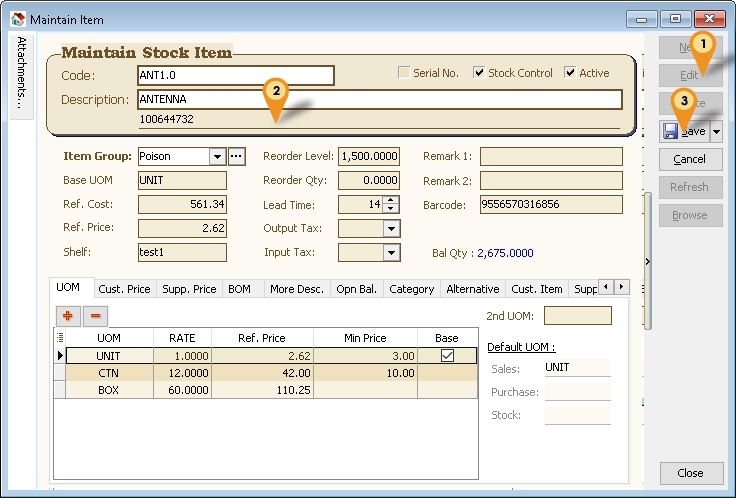

## Introduction

Is External Shareware Program which Export Data for DKSH System.
Document Type Export

- Maintain Customer - Cust.txt
- Maintain Item - Item.txt
- Maintain Agent - Salesman.txt
- Sales Invoice - InvDtl.txt
- Sales Credit Note - CN_Dtl.txt

## Limitataion

- 1 Computer only can export 1 Company Database only

## DKSH Specification

- 03 Jun 2016
- [DKSH Manage Sales Integration Specification](http://www.estream.com.my/downloadfile/Fairy/DKSH_ManageSales_Integration_Spec.zip)

## Export Program

- Version (1.1.0.4) - 06 Jun 2017
- Evaluation Limit : 30 Times Export
- [SQLAcc DKSHE Export Setup](http://www.estream.com.my/downloadfile/Fairy/SQLAccDKSHExport-setup.exe)
- MD5 : `1DDE4D72A1808F0DA0CAA27094B7C821`

## Settings

### Firebird

During Installation of Firebird make sure the option (see Below picture) is selected

### Export Program Setting

01. Enter the Server Name or IP Address.
02. Click the button & select the Database to be export out.
03. Select the Output Path folder (where DKSH file to be exported to).
04. Enter the Organization prefix provide by DKSH.
05. Click Test Connection to make sure is successfully Connected.

    Below steps is to export data

06. Select Date Range data to Export.
07. Click Export Output... button to export the data.

## SQL Accountin

### Maintain Customer

Menu: Customer | Maintain Customer...

01. Click Edit
02. Enter the **DKSH Outlet Type** at CompanyName2
03. Click *Save*

### Stock Item

Menu: Stock | Maintain Stock Item...

01. Click Edit
02. Enter the **DKSH Product Code** at *Description2*
03. Click Save

## Program History New/Updates/Changes

--Build 4--

- Upgrade to Version 1.1.
- Upgrade to XE25.
- Fixed Export still locking even is registered.

--Build 3--

- Fixed Export Slow.
- Add Export Status.

--Build 2--

- Fixed Register Fail.

--Build 1--

- Item missing RefPrice field.
- Remove , for Currency field.

--Build 0--
