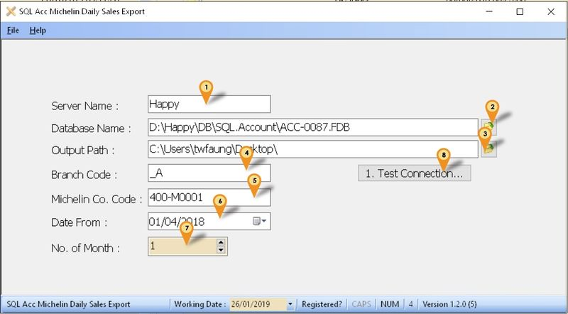

## Introduction

Is External Shareware Program which Export Daily Sales for Michelin System.
Document Type Export (Only 1 text file)

- Sales Invoice
- Sales Cash Sales
- Sales Debit Note
- Sales Credit Note

## Limitataion

- 1 Computer only can export 1 Company Database only

## Michelin Export Specification

- 11 May 2016
- [Michelin Export Specification](http://www.estream.com.my/downloadfile/Fairy/MICHELIN_WEBMAX.zip)

## Export Program

- Version (1.2.0.8) - 13 May 2020
- Evaluation Limit : 30 Times Export
- [SQLAccMichelinExport-setup](http://www.estream.com.my/downloadfile/Fairy/SQLAccMichelinExport-setup.exe)
- MD5 : `64541BCDE1FE677BD001E820B5ADA865`

## Settings

### Firebird

During Installation of Firebird make sure the option (see Below picture) is selected

### Export Program Setting

01. Enter the Server Name or IP Address
02. Click the button & select the Database to be export out.
03. Select the Output Path
04. Enter the Branch Code (optional) given by Michelin (may leave it empty if unavailable)
05. Enter the Supplier Code for Michelin
06. Select the Start Date to export (ONLY for 1st time use & make sure not more then 1(min)/2(max) month(s) from now)
07. Select Number of Month to generate (min 0 & max 1).
08. Click Test Connection to make sure is successfully Connected.

### Windows Schedule

01. Open Windows Control Panel | Administrative Tools | Task Scheduler.

    

02. Click Action | Create Basic Task...

    

03. Enter Task Name (eg SQL Acc Michelin Export) & Click Next.

    

04. Select Daily & Click Next.

    

05. Set the Start Date & Time to Start.
06. Set 1 for Recur every field & Click Next.

    

07. Select Start a program & Click Next.

    

08. Click Browse button & find the SQLAccMichelinExportSchedule.exe (Default at C:\eStream\Utilities\SQLAccMichelinExport).
09. Set the Start in(optional) path to the Exe folder (eg. C:\eStream\Utilities\SQLAccMichelinExport) & Click Next.

    

10. Tick the option Open the Properties dialog for this task when I click Finish.
11. Click Finish.

    

12. Select the option Run whether user is logged on or not.
13. Click Triggers tab at top.

    

14. Click Edit... button.

    

15. Change the time to run.
16. Click OK 2 times.

    

17. Enter the window User Name & Password.
18. Click Ok.

### SQL Accounting

    

01. Click Stock | Maintain Stock Item...
02. Look for the Michelin Item Code.
03. Click **Edit**.
04. Click **Supp. Item** tab.
05. Click **+** button.
06. Select the **Supplier Code** for Michelin.
07. Enter the Michelin Item Code.
08. Click **Save**.
09. Repeat **Step 2** till **Step 8** for other Michelin Item Code.

### Program History New/Updates/Changes

--Build 8--

- Fixed Prompt Access Violation on Export.

--Build 7--

- Enable support Version 875.782 & above for REGISTERNO field Only.

--Build 6--

- Date Not reset on 6th days.

--Build 5--

- Add No. of Month Option.

--Build 4--

- Fixed only export 50 due after fix bug in build 3.

--Build 3--

- Fixed Unable to Export if Description too long.

--Build 2--

- Upgrade Compiler.
- Upgrade to Version 1.2.
- Add Branch Code Field.

--Build 1--

- Fixed Tab Sequence problem.
- Add filter by Supplier Code.
- Date Reset On 4th Months.

--Build 0--
