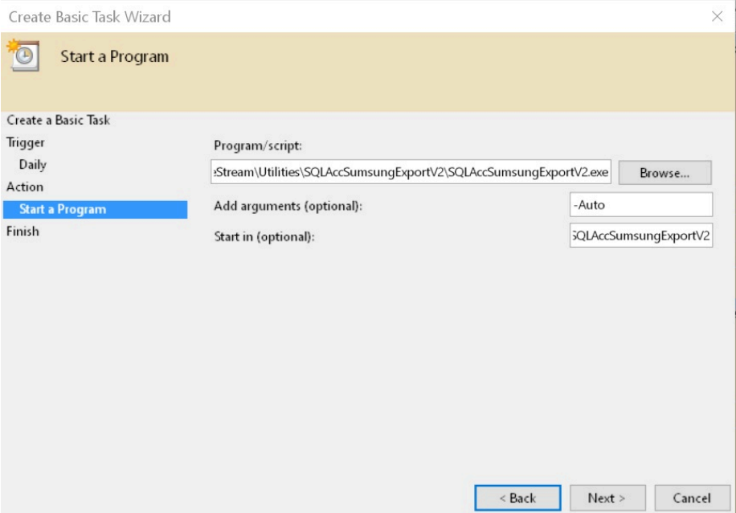

## Introduction

Is External Shareware Program which Export Daily Sales for Samsung System.
Document Type Export (Total 2 Text files)

- Sales Delivery Order
- Sales Invoice
- Sales Cash Sales
- Sales Debit Note
- Sales Credit Note
- Stock Physical Worksheet

## Limitataion

- 1 Computer only can export 1 Company Database only
- Build 2 & above can

## Samsung Export Specification

- 28 Dec 2016
- [Samsung-20161228.zip](https://download.sql.com.my/customer/Fairy/Samsung-20161228.zip)

## Modules Require

- Serial Number

## Export Program

- Version (2.0.2.15) - 27 Feb 2025
- Evaluation Limit : 30 Times Export
- [SQLAccSamsungExport-setup.exe](https://download.sql.com.my/customer/Fairy/SQLAccSamsungExport-setup.exe)
- MD5 : `A3F809D610D92A44662A9AE7D2D3A3B1`

## Settings

### Export Program Setting

01. Select SQL Accounting DCF file.
02. Select SQL Accounting Database to export.
03. Click **Test Connection**.
04. Click Next.

    

    | Field                | Description |
    |-----------------------|-------------|
    | **Samsung Co. Code** | - Samsung Company Code given by Samsung |
    | **Default (----) Location Code** | - Default Location code (----) in SQL Accounting for Samsung (Default HQ) |
    | **RA MCS ID Type**   | - Information for RA MCS ID Type in SQL Accounting |
    | **Exclude Customer Info...** | - Tick: Will not Export CompanyName & Phone1   - Untick: Will Export with CompanyName & Phone1 |

05. Select Information to filter If you wanted.
06. Enter the **Samsung Code** (Provided by Samsung).
07. Click Next.

    

08. Select Output folder.
09. Select Last Export Date.
10. Click Export Data to Export.

### Windows Schedule

01. Open Windows Control Panel | Administrative Tools | Task Scheduler.

    

02. Click Action | Create Basic Task...

    

03. Enter Task Name (eg SQL Acc Sumsung Export) & Click Next

    

04. Select Daily & Click Next.

    

05. Set the Start Date & Time to Start.
06. Set 1 for Recur every field & Click Next.

    

07. Select Start a program & Click Next.

    

08. Click Browse button & find the **SQLAccSumsungExportV2.exe** (Default at
C:\eStream\Utilities\SQLAccSumsungExportV2).
09. Set the Add arguments(optional) as -**Auto**.
10. Set the Start in(optional) path to the Exe folder (eg.
C:\eStream\Utilities\SQLAccSumsungExportV2) & Click Next.

    

11. Tick the option Open the Properties dialog for this task when I click Finish
12. Click Finish

    

13. Select the option *Run* whether user is logged on or not
14. Click *Triggers* tab at top

    

15. Click Edit... button

    

16. Change the time to run
17. Click OK 2 times

    

18. Enter the window User Name & Password
19. Click Ok

### Program History New/Updates/Changes

--Build 15--

- Fixed unable to connect to db in SQL Connect.

--Build 14--

- Enable support Version 860 & above.

--Build 13--

- Fixed MCS_INV_ output Default (----) Location Code not follow user setting.

--Build 12--

- Fixed sometime not correct Location Code.

--Build 11--

- Upgrade to Version 2.0.2 .
- Add Option Exclude Customer Info.
- Add Option Default (----) Location Code.

--Build 10--

- Add Export Sales DO.

--Build 9--

- Fixed MCS_SALES_xxx Default location code not set to HQ.

--Build 8--

- Upgrade to Version 2.0.1.
- Add Option for MCS ID type.

--Build 7--

- Fixed Show Access violation when Auto Run.

--Build 6--

- Fixed Auto Run Unable to Call SQLAcc in Window 7.
- Fixed Auto Run Button Caption not correct after finish.
- Fixed Auto Run Not Force Kill SQLAcc Before & after export.

--Build 5--

- Fixed MCS_INV data not group by Location & project.

--Build 4--

- Upgrade to Version 2.
- Add Filtering Location & Item Project.

--Build 3--

- Fixed click 2nd time Test output prompt error.
- History New/Updates/Changes.
- Fixed Schedule not running.

--Build 2--

- Support Export more then 1 Serial Number Output.
- Fixed spelling error.

--Build 1--

- MCS_SALES_xxx should take Agent Description.
- Filename for Stock should be MCS_INV_xxx.
- Stock Column incorrect position.

--Build 0--
