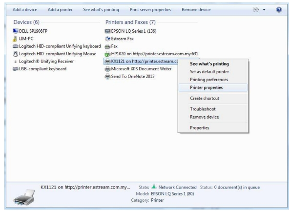
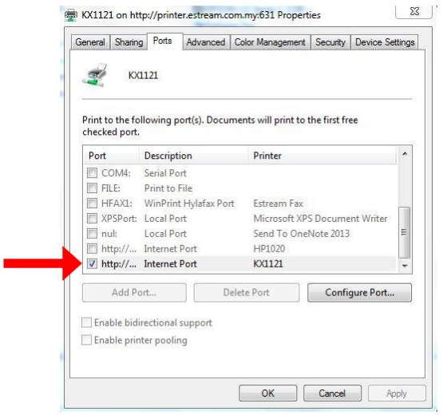
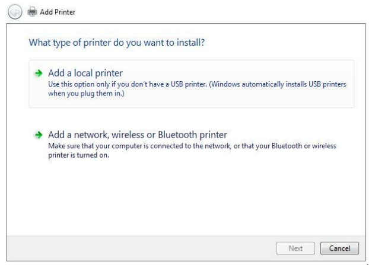
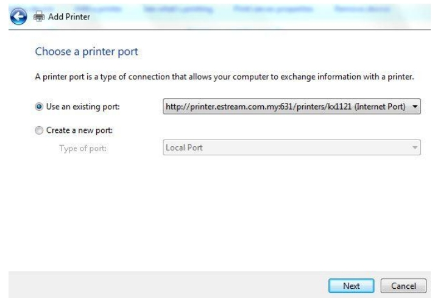
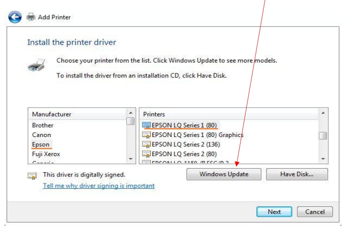
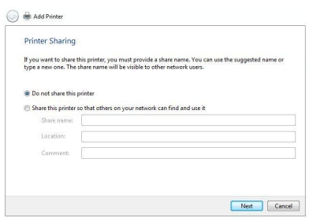
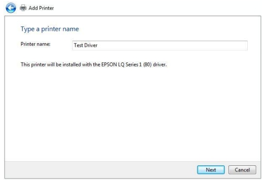
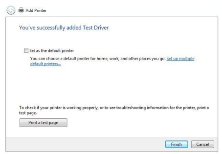
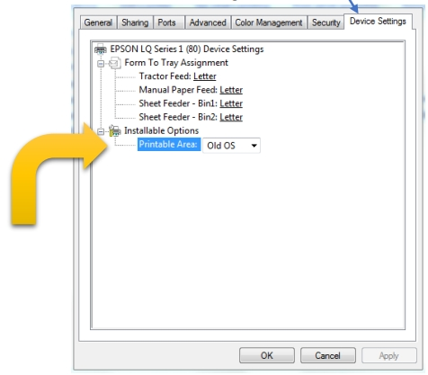

:::info
If you're experiencing issues where the preview is fine but the printout is missing parts of the content or is out of position, follow these steps. If you have a different printer, you can use this guide as a reference to add the corresponding driver for your printer.
:::

## Panasonic

1. Check the Port of your printer

   

   

2. Press "**Add a printer**" and select "**Add a local printer.**"

   

3. Choose the port of your printer respectively.

   

4. Select manufacturer and printer

   * **Select Manufacturer :** Epson

   * **Select Printer :** EPSON LQ SERIES 1 (80)

   :::info

   If you cant find the EPSON LQ SERIES 1 (80), please press "Windows Update" and select again.

   :::

   

5. Type in the printer name you desire.

   

6. Press "**Next**" if you don’t want to share this printer.

   

7. Finish the setup.

   

Lastly, go to your **Printer Properties** | **Device Settings** | **Installable Options** | **Printable Area** | **Old OS**.

You are done. Congratulations!

