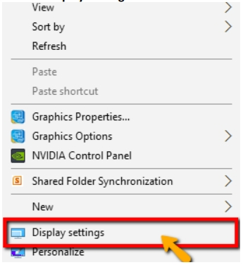
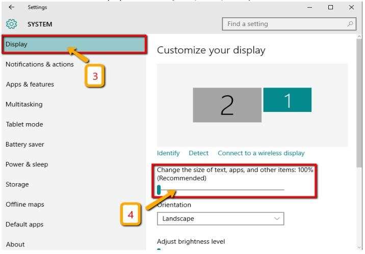
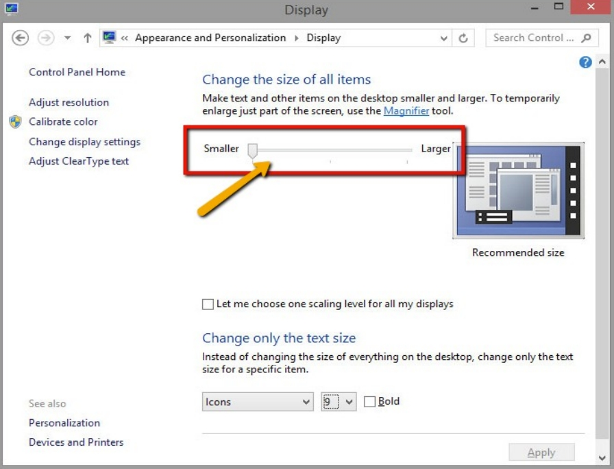
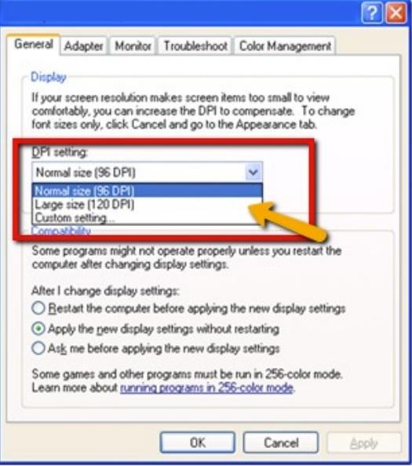
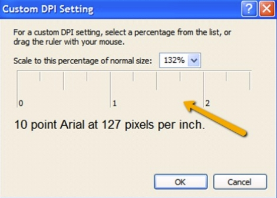

## For Windows 10

1. Right click on an empty area of your Desktop

2. Click on **Display Settings**

   

3. Click on **Display** tab

4. Slide the indicator to the display size desired (125%/ 150%/ 200%)

   

   :::note

   **Restart PC** or **Sign Out and Log in** for the function to take complete effect.

   :::

## For Windows Vista, 7, 8

1. Right click on an empty area of **Desktop**

2. Click on **Personalize**

3. On the bottom left side, click on **Display**

4. Slide the indicator to the display size desired (125%/ 150%/ 200%)

   

## For Windows XP

1. Right click on an empty area of Desktop

2. Click on **Properties**

3. Click on **Display** tab

4. Click on **Advanced**

5. Choose the screen size desired or Click on **Custom Setting** to customize the screen size by dragging the indicator

    
