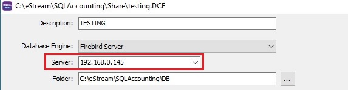
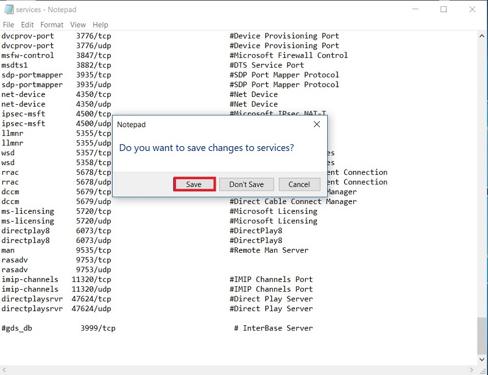

## Common Causes

### 1. Firebird not installed in main PC/Server

Install the firebird in main PC/Server. Click to [Firebird](docs/getting-started/multi-user-setup.md#firebird-installation) installation guide.

### 2. Invalid IP address of main PC/Server

1. Run the command prompt.

2. Type **ipconfig** and hit ENTER key.

    

3. Ensure the IP Address is correct in Database Group setting.

    

### 3. Firewall has blocked the port number (3050)

Add the port number 3050 as exception in any anti-virus firewall.

### 4. Windows system file has altered to other port number (eg. 3999)

#### Check the port number has set to other than 3050

1. Run the command prompt.
2. Type **netstat** and hit ENTER key.
3. Local address will be ended with 3999. See screenshot below.

#### Change the port number to 3050

1. To search the command prompt, type **CMD**.

    

2. **Run as Administrator** (Right click on command prompt). Must run as administrator.

    

3. At command line **c:\WINDOWS\system32>** , type **cd drivers\etc**

    

4. Hit **ENTER** key.

5. Follow by type **notepad services**.

    

6. Hit ENTER key.

7. Find (Ctrl+F) the keyword **3999/tcp**.

    

8. Disable the line by insert #. Example: **gds_db** to **#gds_db**

9. Close the notepad and save the setting.

    
