## Instruction to Setup

For example: version 4 (728) and version 5 (743)

1. Open setup 728

   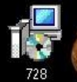

2. Check the version from the last 3-digit number, and click **Next**

   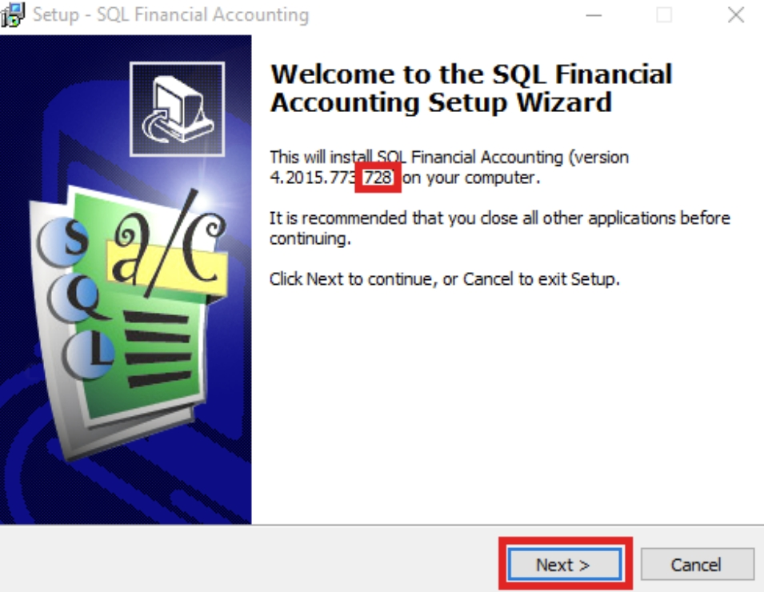

3. Click "**I accept the agreement**" and click **Next**

   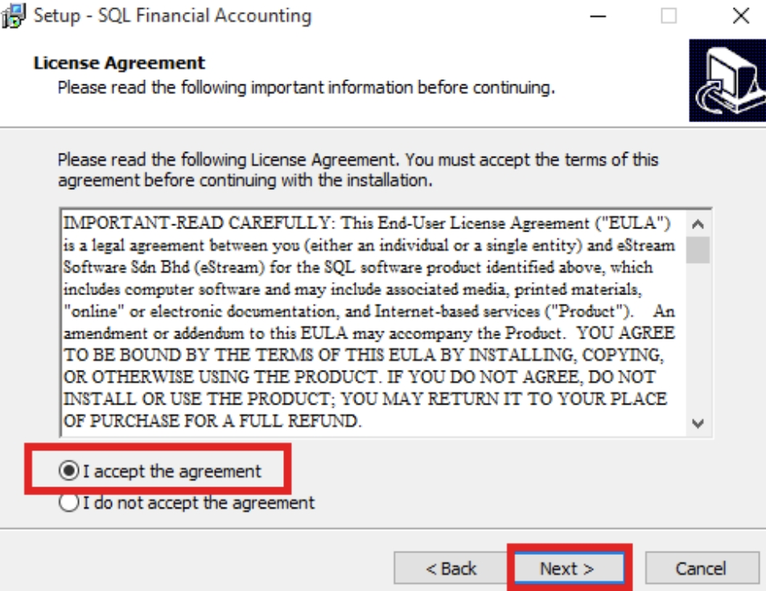

4. Make sure the link is as below and click **Next**:

   **C:\eStream\SQLAccounting728**

   :::note
   If for version 743, please change the number behind to 743
   :::

   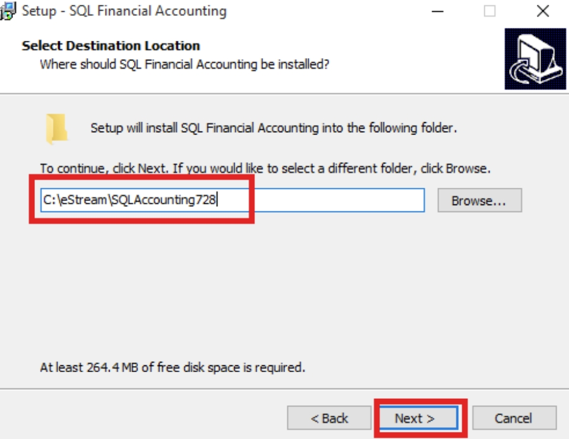

5. Make sure the 3 directory is as shown in the picture below, and click **Next**

   :::tip
   If for version 743, please change the number behind to 743
   :::

   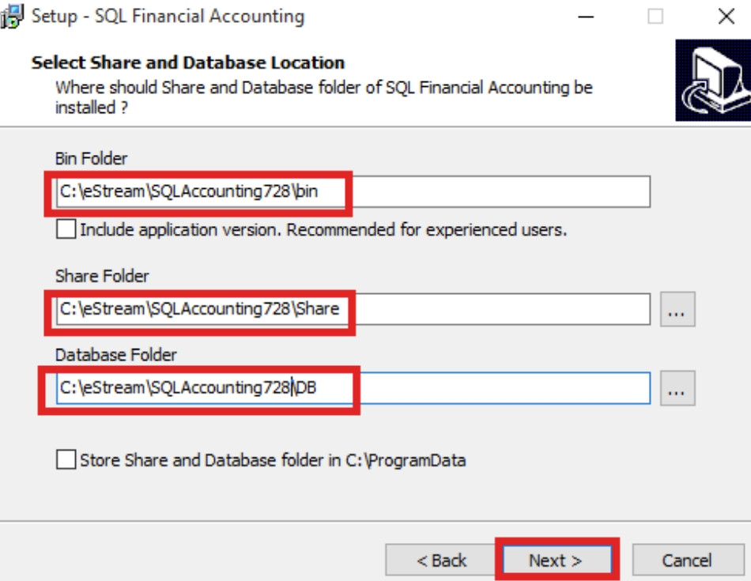

6. Click on **Install**

   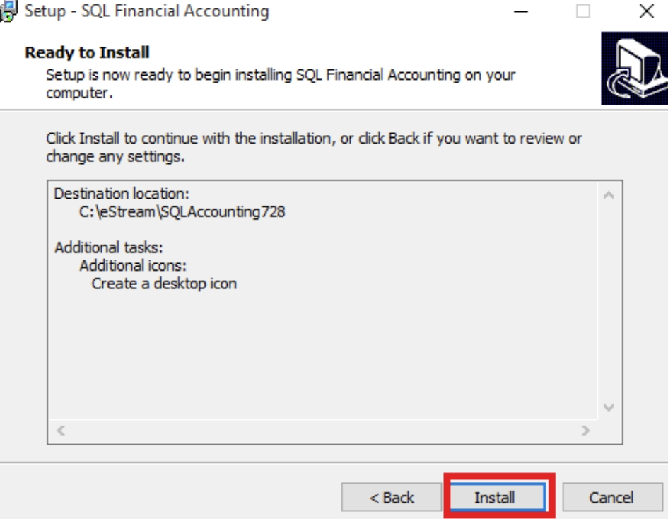

7. Click on **Finish**

   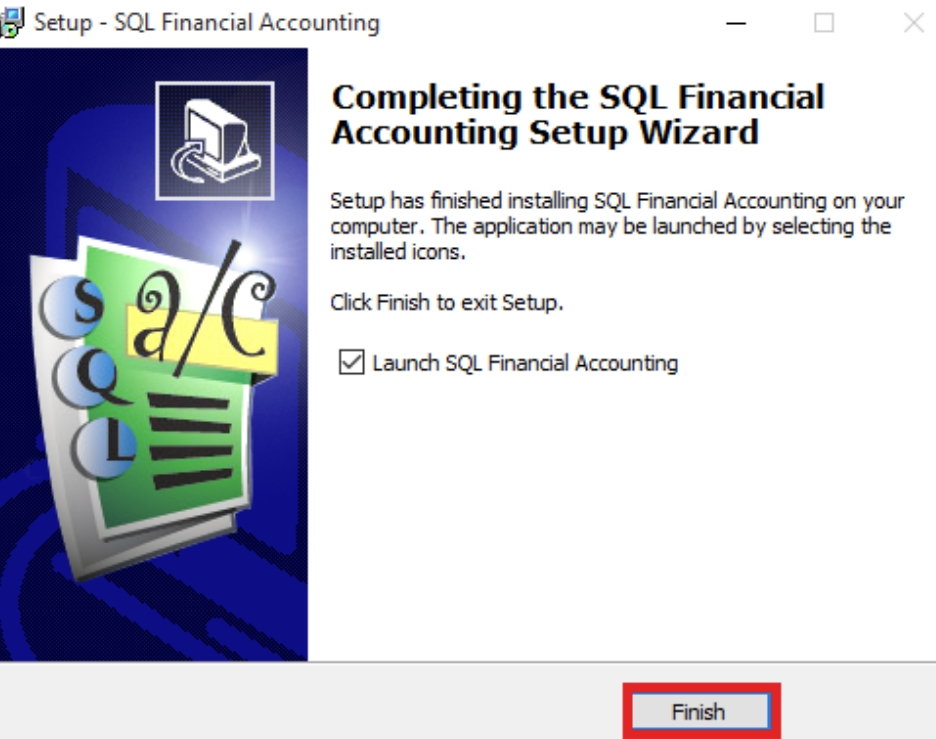

8. Click on Custom Settings

   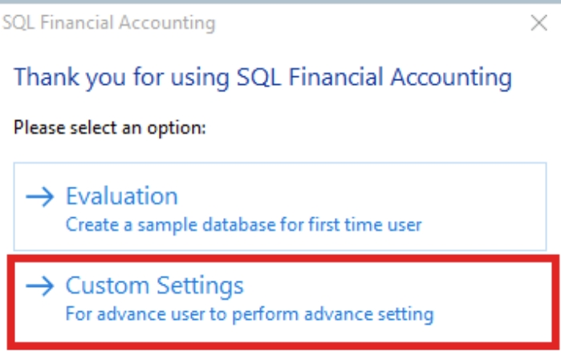

   :::note
   If installing version 743, after Launch, it will show as shown in the picture below, please click on Back to Database Group.
   :::

   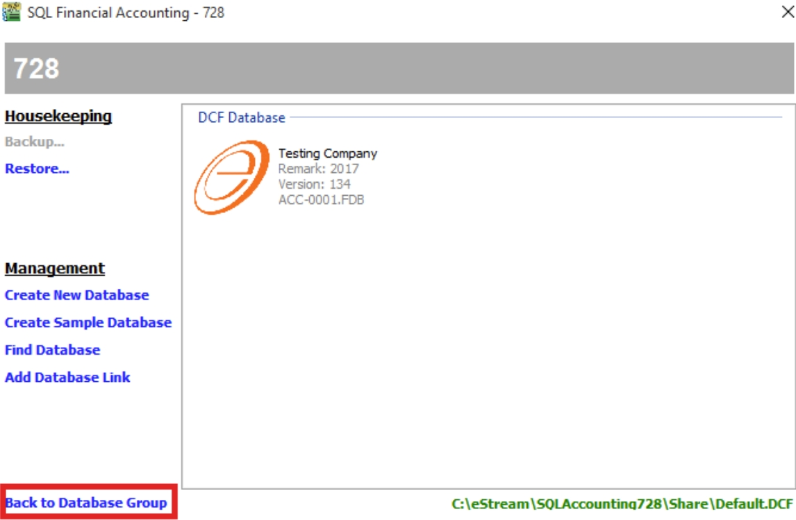

9. Click on Create Group

   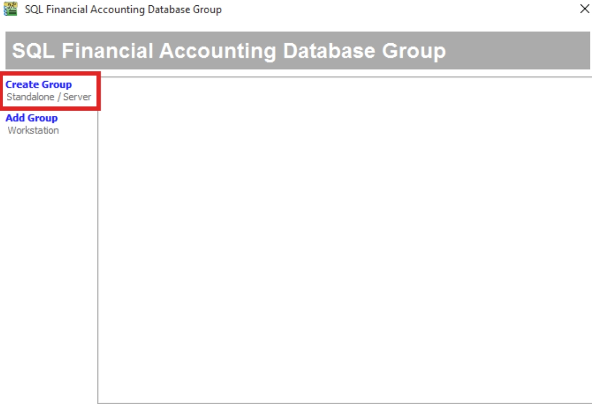

10. Save in Share Folder

      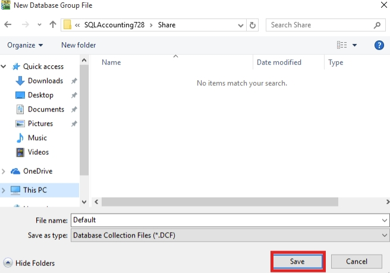

11. Make sure the folder directory is the same as shown in the picture below, and click on Test Connection. Lastly, click OK.

    :::note
    If version 743, then the directory will be C:\eStream\SQLAccounting743\DB
    :::

    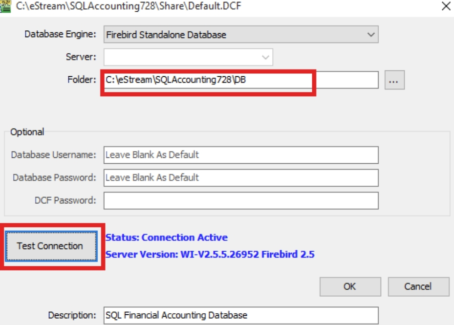

12. Repeat Step 1 to Step 11 for version 743 installation

13. In version 728, rename the DCF group to 728. Click on the Firebird icon once, then it will show as shown in the picture below and allow renaming.

    :::note
    If version 743, then rename to 743.
    :::

    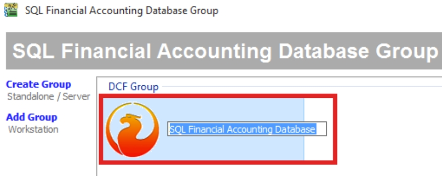

    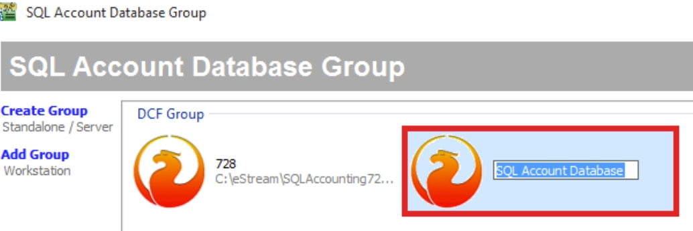

    The final result will be shown like the picture below.

    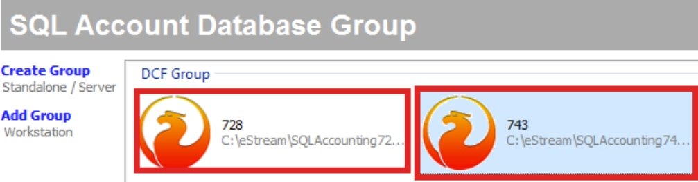

14. In version 728, right-click on DCF (728), and click on Create Desktop Shortcut.

    :::note
    If in version 743, then right-click on DCF(743), choose Create Desktop Shortcut.
    :::

    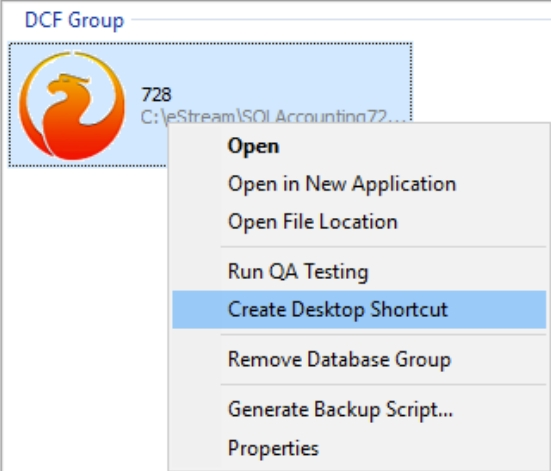

15. After done for both versions, on the Desktop, you will see 2 icons, and please rename the icons to the number of versions for easier recognition.

    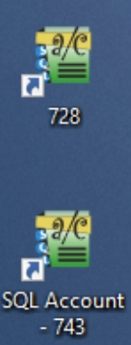
