## Steps & Instruction

:::note SITUATION
After cloning master data, we want to delete a customer (AR) or a supplier (AP).
:::

1. Must be done at the server PC, and all users must log out first

2. [Click me to the patch file list](http://www.sql.com.my/document) and download the patch file

   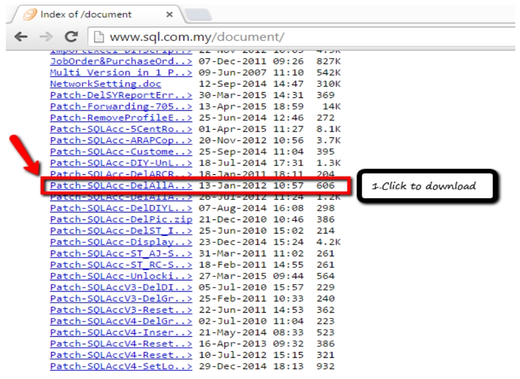

3. Open the downloaded patch (For example, if you want to delete a supplier)

   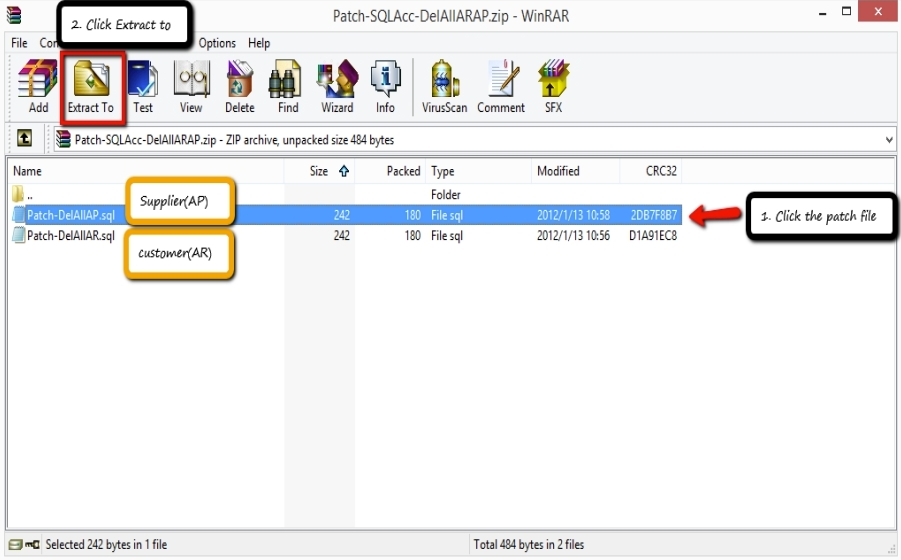

   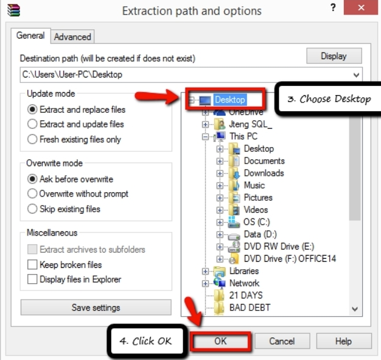

4. [Click me to utility website](http://www.sql.com.my/utility) and download diagnosis

   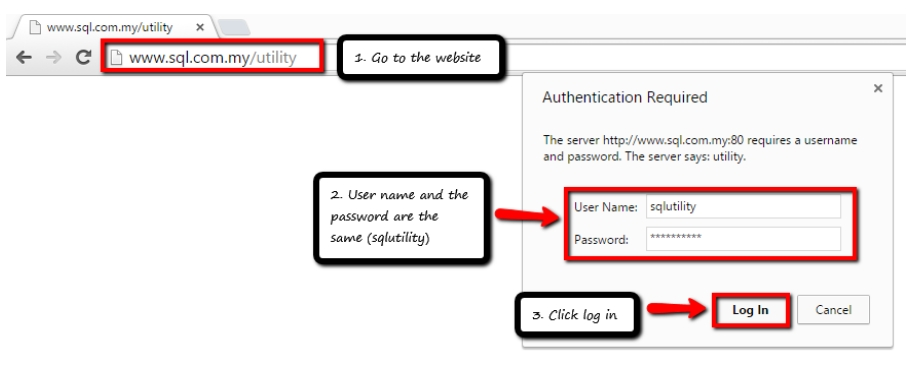

   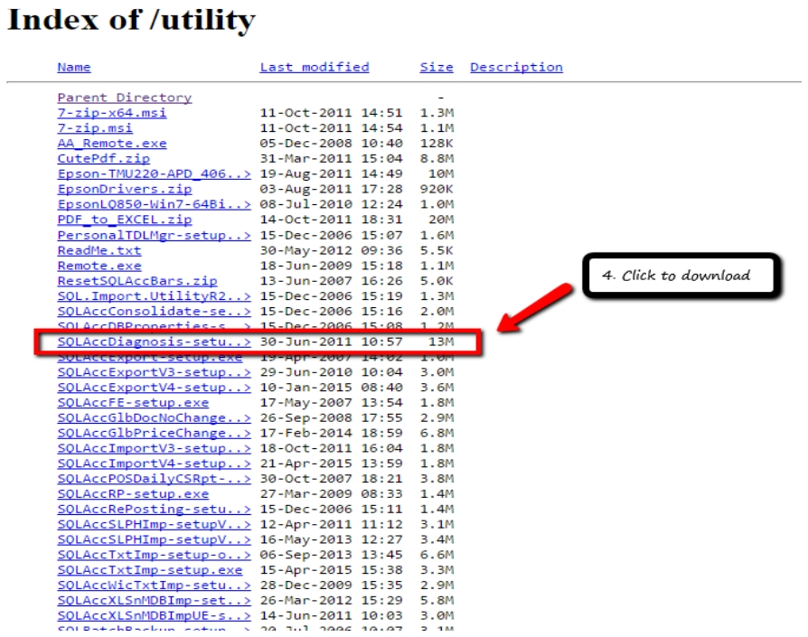

   After download completed, click on the setup:

   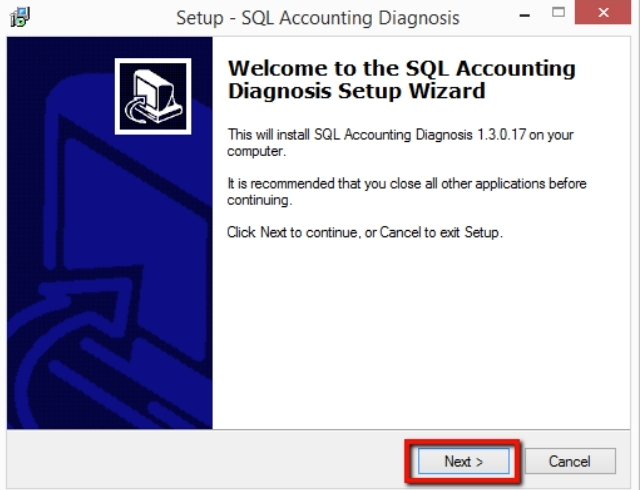

   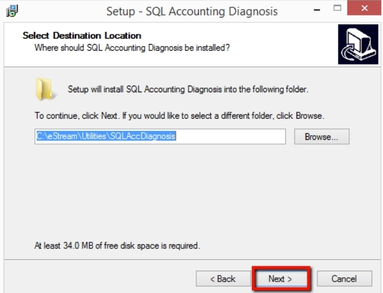

   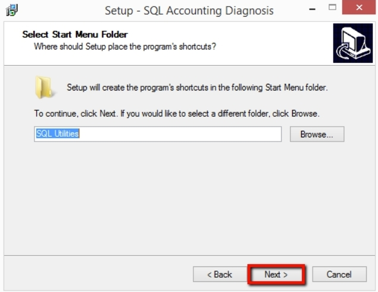

   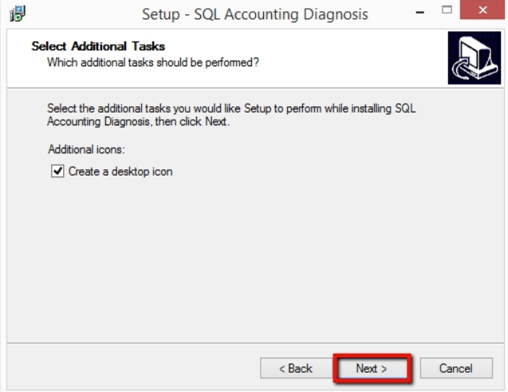

   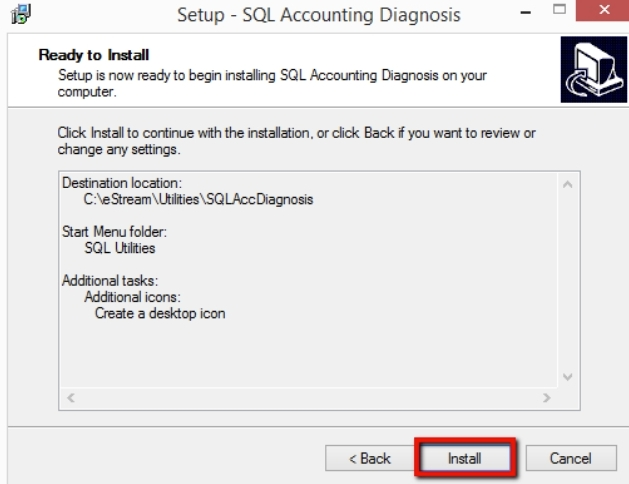

   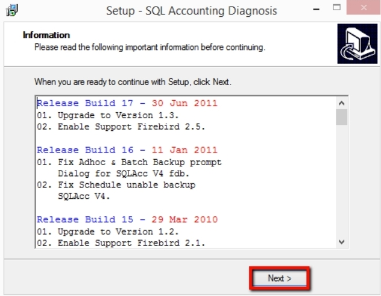

   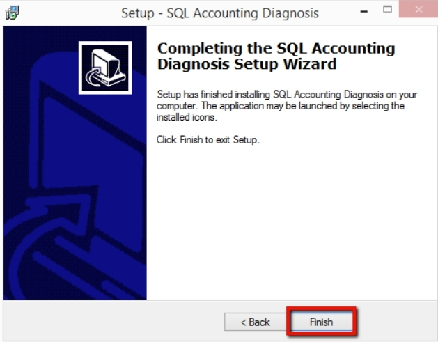

5. Open SQL Accounting Diagnosis

   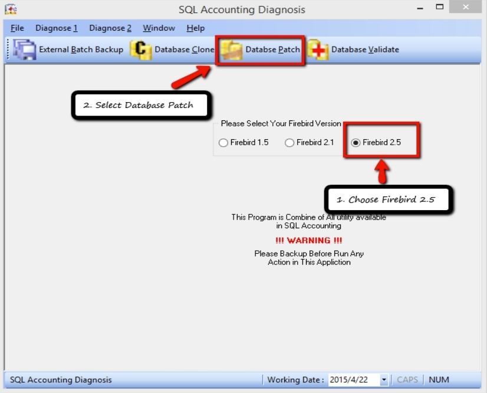

   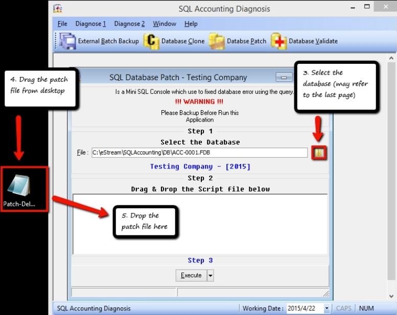

   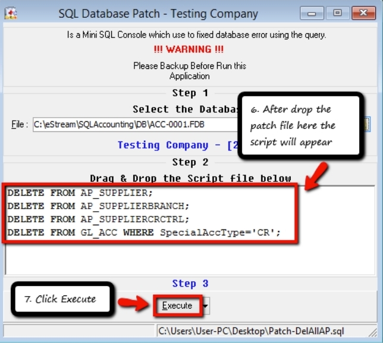

   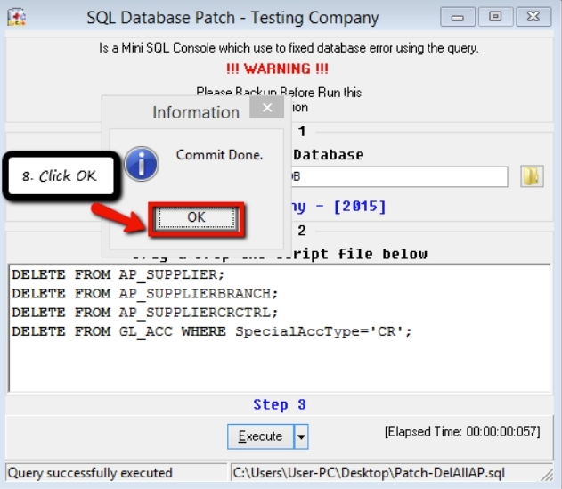

---

## Tips

   :::note Attention
   If you don’t know which database to choose, you may refer here
   :::

   1. Click on `⚙️`

      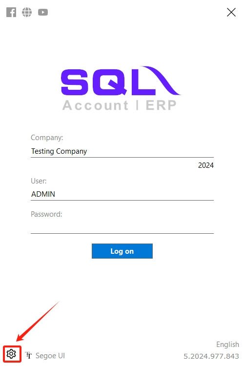

   2. You can identify the database by checking the Database ID (For example, ACC-003.FDB)

      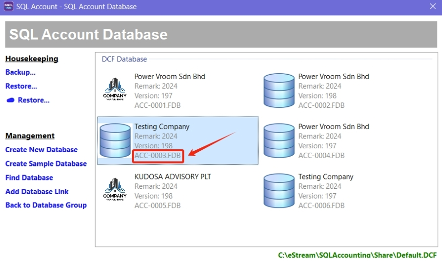
