## Steps & Instruction

:::note
Download & Install SQL Accounting Diagnosis from [**This Link**](http://www.sql.com.my/utility/SQLAccDiagnosis-setup.exe)

User & password to access to above link = sqlutility
:::

1. Find below icon on your desktop after installing SQL Accounting Diagnosis

   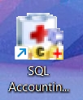

2. Choose Firebird 2.5 and click on **Database Validate**

   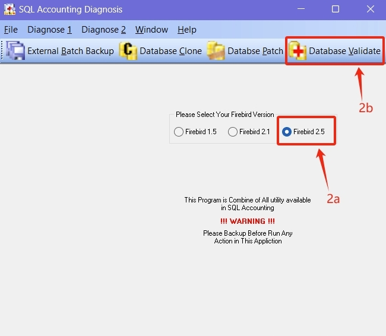

3. Click on the yellow color folder to select your database

   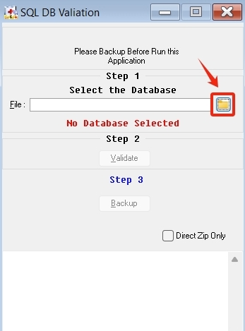

4. Select your database

   1. Go to your DB Folder (refer to step **5 vi** on how to check where your DB Folder is located)

   2. Select your FDB (refer to step **5 ii** on how to check which FDB you should select)

   3. Click on Open

   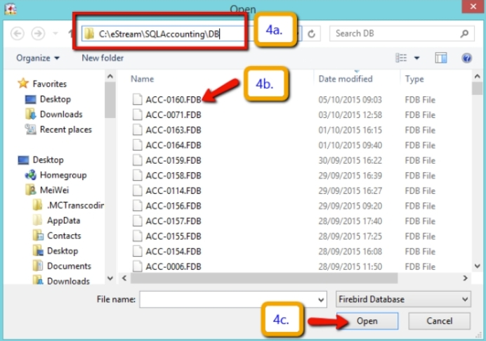

5. Go to SQL Financial Accounting

   1. Click on the ⚙️ button in the logon screen

      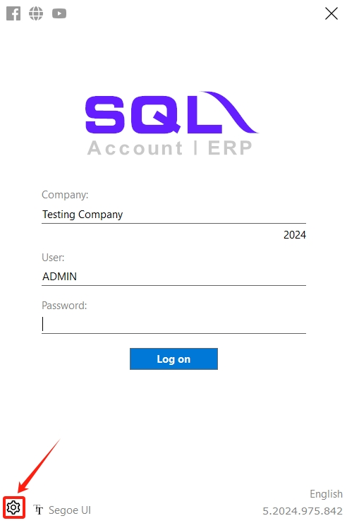

   2. Check your ACC-XXXX.FDB

      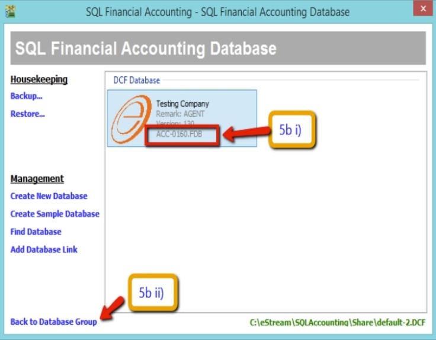

   3. Click on back to the database group

   4. Right-click on the Firebird group

   5. Go to properties

      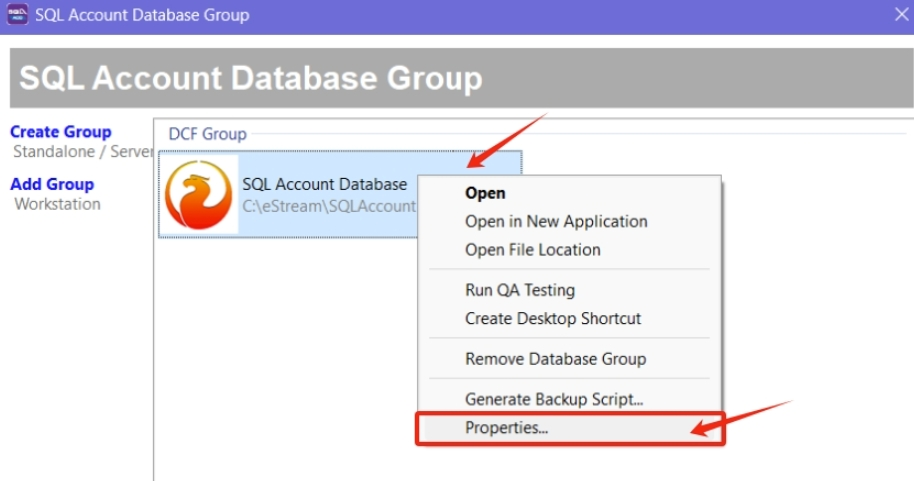

   6. Check on the DB Folder

      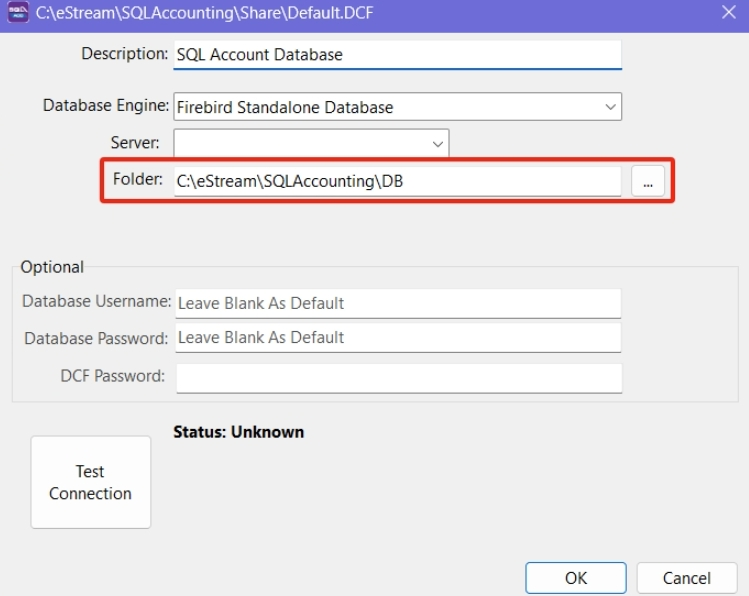

6. After selecting your correct ACC-XXXX.FDB, click on **Validate** and make sure you get the message “**Database Validation Complete**” as shown on the right screen. Then, click **ok**.

   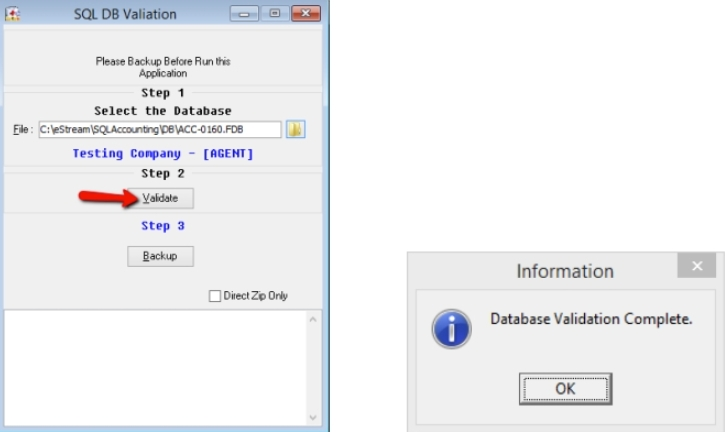

   :::info
   If you don’t get “Database validation complete” and get an error “bad parameter,” please contact the helpdesk to fix this database.
   :::

7. Click on Backup if you get “database validation complete” > select **Desktop** > Click on **OK** > Click **ok** for Backup Successful.

   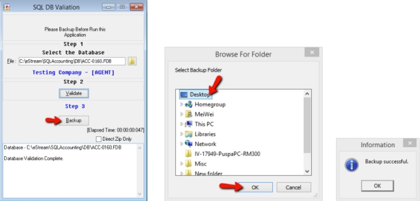

8. Restore database

   1. Restore your database as usual > Click on the ⚙️ button

      

   2. Click on Restore

      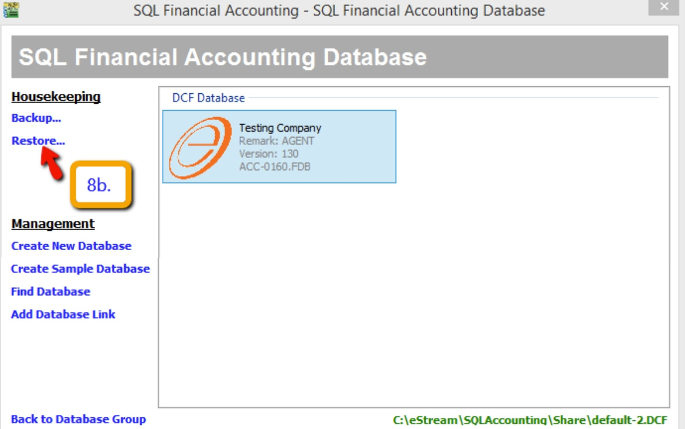

   3. Click on the 3 dot button

      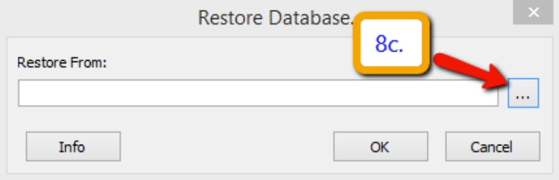

   4. Select the backup file on the desktop > Open > Click on **OK** > Click on **OK**

      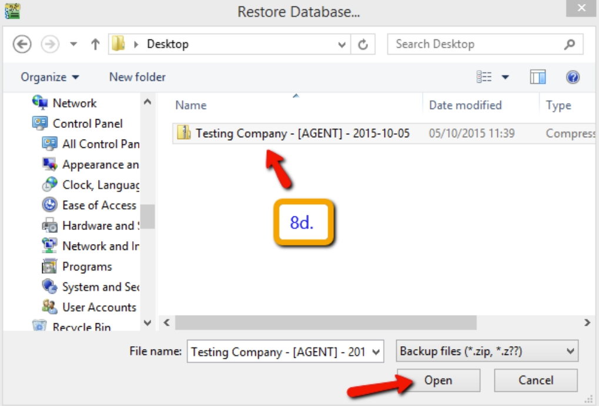

      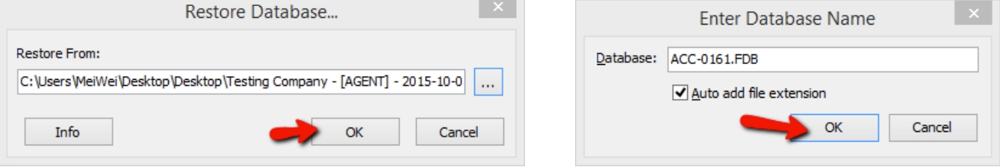

   5. Click on **OK**

      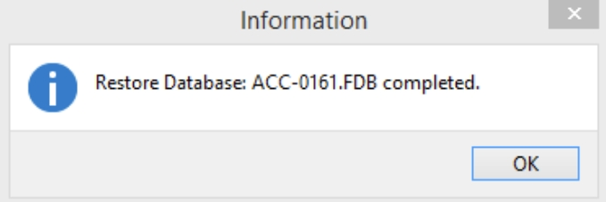

9. After the restore, you will see two databases with the same name. On the left side, ACC-0160.FDB is the old (refer to step **5 ii**). And on the right side, ACC-0161.FDB is the new file you restored (refer to step **8 iv**).

   For the old database, you can right-click on it either to drop the link or delete the database:

   - **Drop link**: Temporary hide, in the future you can click “Find Database” in the left panel to call it back.

   - **Delete Database**: Permanently delete, no way to call it back.

   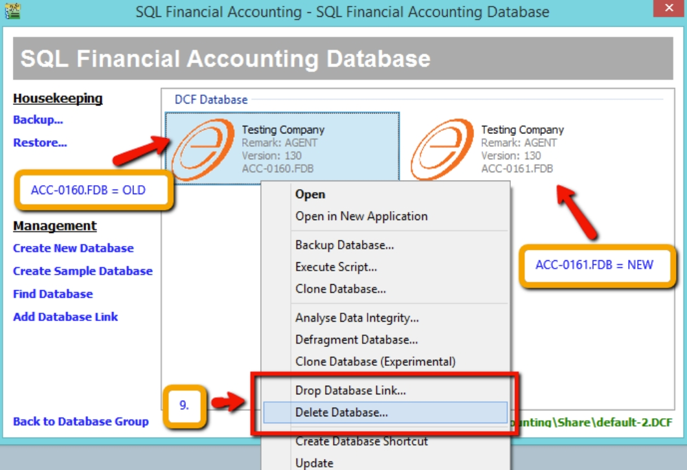
