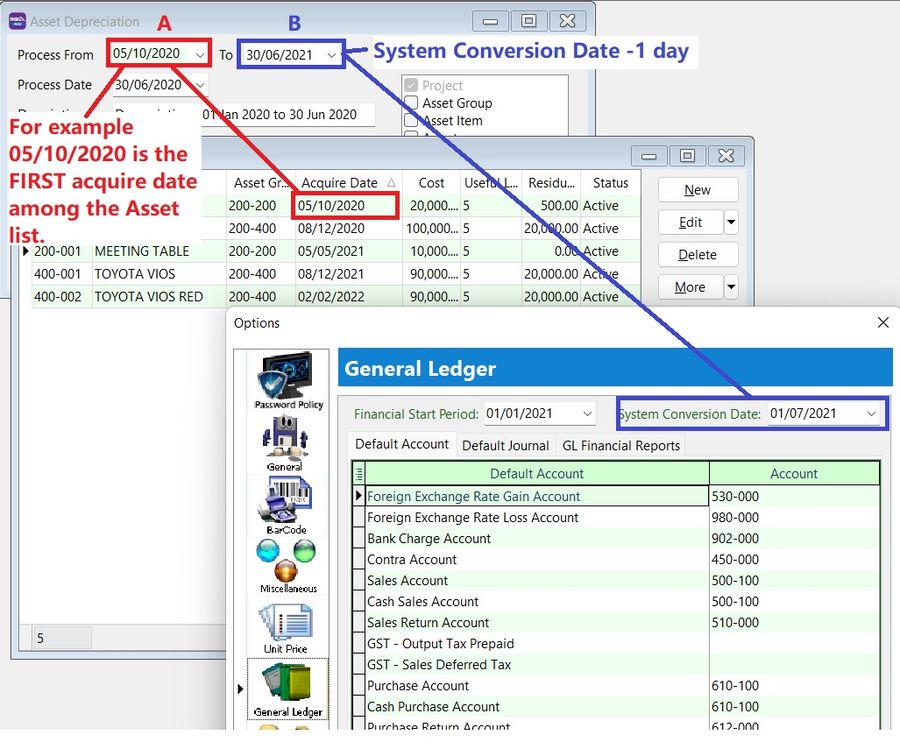
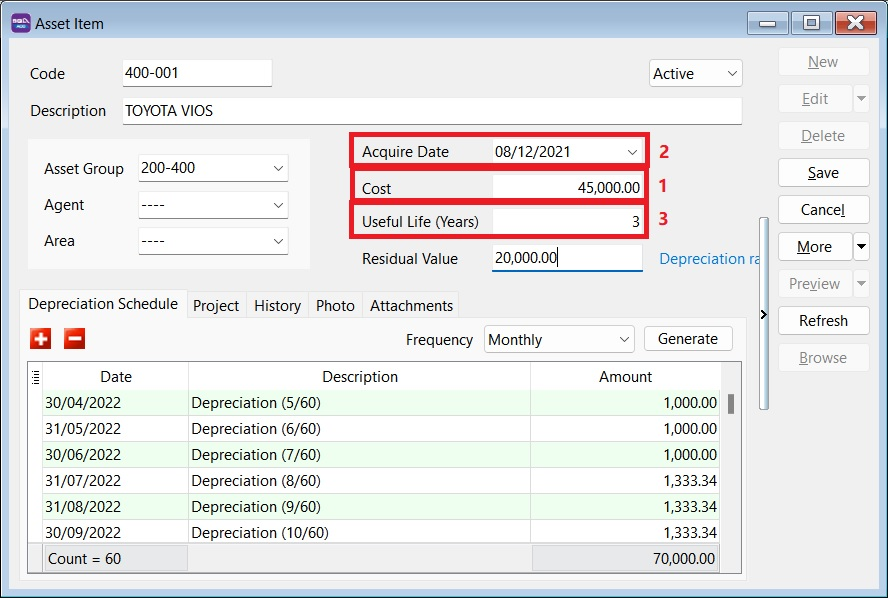
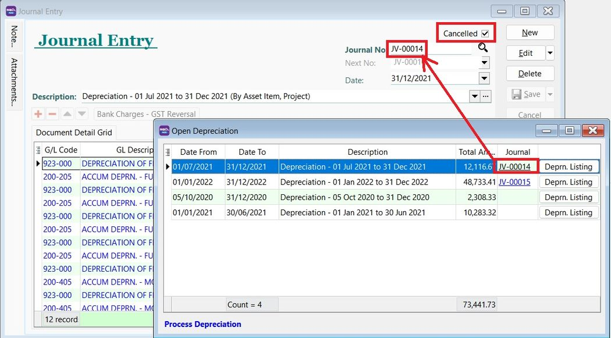
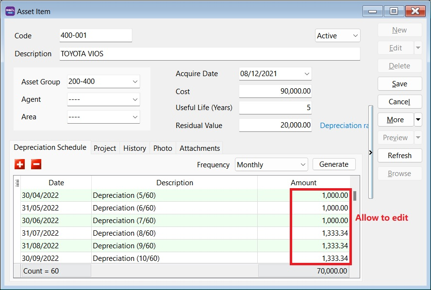
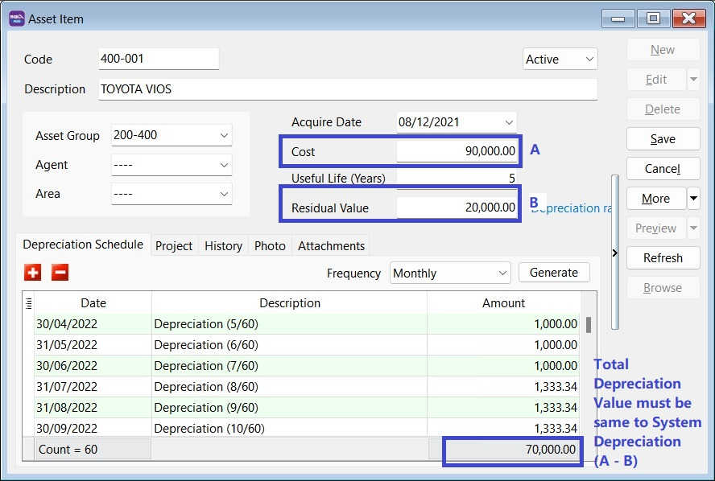
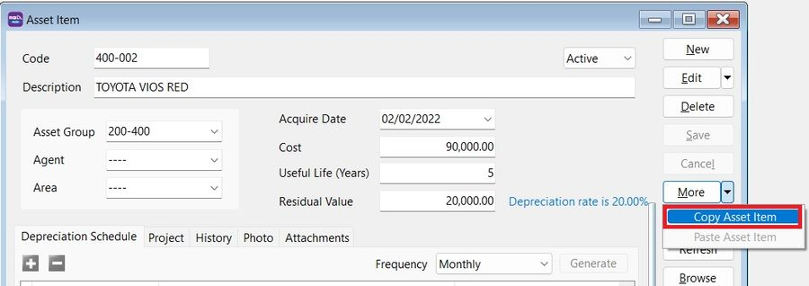
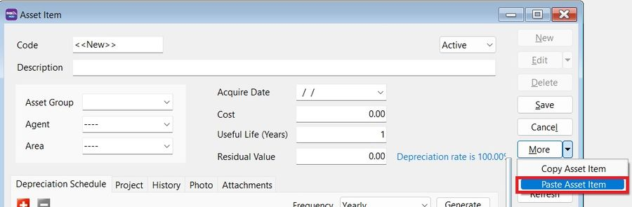
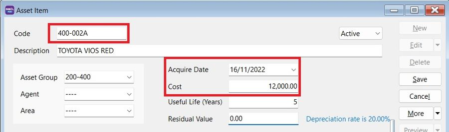

## How to process Asset Opening and tally with the GL Maintain Opening Balance

### Process Opening Depreciation

*Menu: Asset | Process Depreciation...*

    You are allowed to process Asset Opening Depreciation BEFORE System Conversion Date.

:::note Tips:
A - FIRST acquire date of the asset
B - System Conversion Date -1 day
:::

## I have posted the depreciation until December 2021. How do I record my new asset?

### Method 1 : Use the Last Asset Net Book Value from Balance Sheet

Maintain the Asset Item as below:

1. Key in the Cost as *Net Book Value* (as at 31/12/2021).
2. Acquire Date, eg. 01/01/2022
3. Useful life = *Balance of useful life* to be depreciate
4. Start Process Depreciation from 01/01/2022

### Method 2: Follow Original Cost and Acquire Date

Maintain the Asset as below :

1. Key in the Cost as *Original Cost*
2. Acquire Date set as *Original Purchase Date*
3. Useful life = *Full useful life*
4. Process Depreciation until 31/12/2021.

5. Tick *Cancelled* to the Journal posted from Step 4

## If the depreciation value differs from my previous Journal, can I edit the depreciation value calculated in Maintain Asset Item?

Yes, you can change the depreciation value in Maintain Asset Item (Depreciation Schedule).

## Can the amortization of Intangible Assets such as licenses, be managed in the Asset Module?

Yes, it can. Maintain it as you would a __Tangible Asset__ (Fixed Asset).

For __Intangible Asset__ (eg. goodwill, license), the __amortization calculation__ uses the __straight line method__ , which can be selected in the Asset Group. The calculation involves subtracting the asset's anticipated salvage or book value from its cost and dividing the result by the total number of years it will be used.

## Can I import the asset list using Excel instead of manually key-in?

Yes, you can. The asset import function is available in SQL Account version 5.2022.948.826

Refer to [Import-Asset Master List](../../usage/asset/guide#importing-asset-master-list)

## How do I handle additional cost for the Fixed Asset?

Create new asset code to handle additional cost, eg.:

| __Asset Code__ | __Description__            | __Remark__          |
|----------------|-----------------------------|---------------------|
| MV-0001        | TOYOTA VIOS - BZZ 999       | Initial Purchase    |
| MV-0001A       | TOYOTA VIOS - BZZ 999       | Additional Cost     |

:::info
    Do not mix the depreciation value of the original asset and the additional cost.
:::

### Quick Steps

1. Copy the existing asset code.

    

2. Create new asset.
3. Click on More | Paste Asset Item.

    

4. *Change the asset code* by inserting any characters to differentiate it
    - Acquire date = Date the additional cost was incurred.
    - Cost = Additional Cost

    

## Should the cost in Maintain Asset Item be key-in in local currency or the original currency (eg. purchase in USD)?

The cost should be key-in as the __Local value__. The depreciation value will then be calculated and posted in the local currency.
