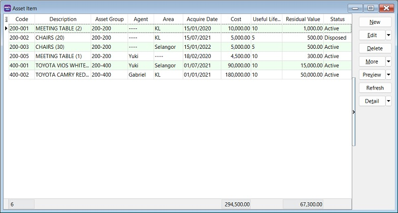
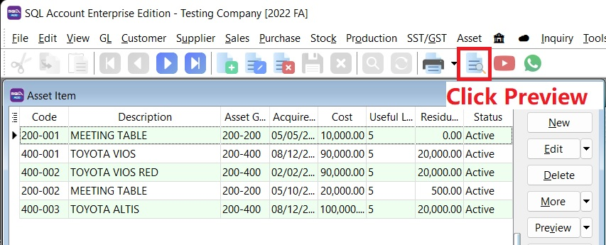
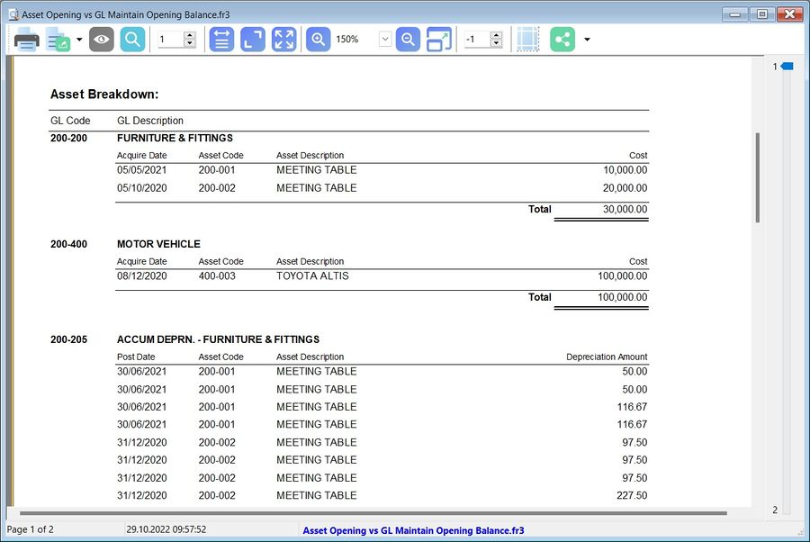

## Asset

:::note Fixed Asset Module
This is a **paid module**.
:::

## Maintain Asset Group

*Menu: Asset | Asset Group...*

Group the asset items based on the following considerations.

1. Type of assets, eg. Motor Vehicle, Furniture, etc;
2. GL Account mapping.

   

### Asset Group

| **Field Name**         | **Explanation & Properties**                                                                 |
|-------------------------|-----------------------------------------------------------------------------------------------|
| **Code**                | Input the new Asset Group Code. **Field type:** Alphanumerical; **Length:** 20.              |
| **Description**         | Input the Asset Group description, e.g., *Furniture*, *Motor Vehicle*. **Field type:** Alphanumerical; **Length:** 200. |
| **Depreciation Method** | Select an appropriate Depreciation Method to generate the depreciation value.                 |
| **Fixed Asset**         | Select the Balance Sheet GL Account code for Fixed Asset.                                    |
| **Accum Depreciation**  | Select the Balance Sheet GL Account code for Accumulated Depreciation.                       |
| **Depreciation**        | Select the P&L GL Account for Depreciation of Asset.                                         |
| **Disposal Gain**       | Select the P&L GL Account for Gain from Disposal of Asset.                                   |
| **Disposal Loss**       | Select the P&L GL Account for Loss from Disposal of Asset.                                   |

## Maintain Asset Item

*Menu: Asset | Asset Item...*

Add new asset items.

### Asset Item

| **Field Name**          | **Field Type**   | **Length** | **Explanation**                                                                 |
|--------------------------|------------------|------------|---------------------------------------------------------------------------------|
| **Code**                 | Alphanumerical   | 20         | Input the new Asset Item Code                                                   |
| **Description**          | Alphanumerical   | 200        | Input the Asset Item description, e.g., Meeting Table, Toyota Vios, Perodua MYVI |
| **Asset Group**          | Selection        | –          | Select an appropriate Asset Group for depreciation calculation and GL Account posting |
| **Agent**                | Selection        | –          | Select who is the Agent using this Asset Item                                   |
| **Area**                 | Selection        | –          | Select where the asset is located                                               |
| **Acquire Date**         | Date             | –          | Set the acquire date for this asset                                             |
| **Cost**                 | Currency         | –          | Set the purchase cost for this asset                                            |
| **Useful Life (Years)**  | Integer/Float    | –          | Set the useful life of this asset                                               |
| **Residual Value**       | Currency/Float   | –          | Set the residual value for this asset                                           |
| **Status**               | Selection        | –          | Default is Active. Can be set to Inactive with an inactive date                 |

### Depreciation Schedule

1. Select the Frequency to generate the depreciation schedule by :-
    1. Monthly
    2. Quarterly
    3. Half Yearly
    4. Yearly

2. Click Generate button.

   

### Project

Set the depreciation allocation by Project (for Departmental/Cost Center purpose).

   

### History

Add the important remarks in the asset history. For instances:
    1. who has borrowed/ when has returned this asset?
    2. asset has been sent for repair or service...
    3. asset has been destroyed by flood

### Photo

Add the asset photo.

### Asset Item Attachments

Add the attachments for an asset

## Process Depreciation

*Menu: Asset | Process Depreciation...*

### Asset Depreciation

1. Select the process date range.

    :::note Tips:

    1. Process date range allows to select more than 1 month or 1 year to process the depreciation.
    2. Allow to process BEFORE system conversion date (No update to Maintain Opening Balance).
    :::

2. Select the Process Date.

    

    :::note Tips:
    Journal Voucher date will follow this Process Date.
    :::

3. Description will be captured in the Journal Voucher description.
4. Click Process.
5. Preview the assets depreciation value and Net Book Value (NBV) before post to Journal Voucher. Click Save to post it.

   

## Open Depreciation

*Menu: Asset | Open Depreciation...*

    Open to view the historical Depreciation Listing.

## Asset Disposal

*Menu: Asset | Asset Disposal...*

### Asset Disposal Entry

1. Click New.
2. Enter Date.
3. Select Asset wish to dispose.
4. Enter Description.
5. Enter Ref1, eg. invoice no.
6. Enter Ref2 if any.
7. Select Project. Default follow Asset Item.
8. Select Agent. Default follow Asset Item.
9. Select Area. Default follow Asset Item.

### General Tab

1. Cost, Accum Depreciation, and Net Book Value are retrieved from Maintain Asset Item automatically.
2. Key-in the **Disposal** value.
3. Select **Payment Method** to receive disposal value.
4. **(Gain)/Loss** worked out automatically.
5. Gain/Loss Account default follow from Maintain Asset. May change the **(Gain)/Loss Account** if necessary.

### More Tab

Enter detailed **Note**.

### Asset Disposal Attachments

    Add more attachment files

## Print Yearly Depreciation

*Menu: Asset | Print Yearly Depreciation...*

## Print Yearly Analysis

*Menu: Asset | Print Asset Analysis...*

### Reports Selection

1. This will analyze the asset **Cost, Accumulated Depreciation, Net Book Value (NBV)** and **Disposal Value**.
2. It allows you to choose and generate the following reports format:
Monthly (12 Months)
Quarterly (4 quarters)
Half Yearly (First Half and 2nd Half)
Yearly (5 Years)

   

### Asset Analysis vs GL Balance Sheet Report

1. At GL | Print Balance Sheet Statement..., choose the Balance Sheet Format : **This Year - 3 columns**
2. At Asset | Print Asset Analysis..., choose Report: **Yearly (5 columns)**

   

## Print Asset Disposal Listing

*Menu: Asset | Print Asset Disposal Listing...*

## Importing Asset Master List

### Preparation for Asset Master Import Excel Template

Download the [Asset Master Template](https://download.sql.com.my/customer/Asset/Asset_Master_Import.xlsx)

### Asset Master Template (xlsx)

| **Sheet Name**           | **Refer to**                                      |
|---------------------------|--------------------------------------------------|
| **FA.GROUP.OPF**          | Maintain Asset Group                              |
| **FA.ITEM.OPF**           | Maintain Asset Item                               |
| **FA.ITEM.OPF.DeprSche**  | Maintain Asset Item – Depreciation Schedule tab   |
| **FA.ITEM.OPF.Project**   | Maintain Asset Item – Project tab                 |

:::warning NOTE:
**DO NOT** rename the **sheet** name.
:::

1. FA.GROUP.OPF (Maintain Asset Group)

    | **Column**        | **Length**      | **Note**                                                                 |
    |--------------------|-----------------|--------------------------------------------------------------------------|
    | **Code**           | 20              | Asset Group Code, e.g., Furniture                                        |
    | **Description**    | 160             | Asset Group Description, e.g., Furniture & Fittings                      |
    | **DeprMethod**     | 1 (Integer)     | Depreciation Method, e.g., 1: Straight Line Method                       |
    | **AssetAcc**       | 10              | e.g., Furniture & Fittings under Non-Current Assets (B/S)                 |
    | **AccumDeprAcc**   | 10              | e.g., Accumulated Depreciation – Furniture & Fittings under Non-Current Assets (B/S) |
    | **DeprAcc**        | 10              | e.g., Depreciation account under Expenses (P&L)                          |
    | **DisposalGainAcc**| 10              | e.g., Disposal Gain account under Other Income / Expenses (P&L)          |
    | **DisposalLossAcc**| 10              | e.g., Disposal Loss account under Expenses (P&L)                         |

    - **Example :**

    | **Code**   | **Description**          | **DeprMethod** | **AssetAcc** | **AccumDeprAcc** | **DeprAcc** | **DisposalGainAcc** | **DisposalLossAcc** |
    |------------|--------------------------|----------------|--------------|------------------|-------------|---------------------|---------------------|
    | Furniture  | Furniture & Fittings     | 1              | 200-200      | 200-205          | 923-000     | 530-999             | 980-999             |
    | MV         | Motor Vehicle            | 1              | 200-400      | 200-405          | 923-000     | 530-999             | 980-999             |

2. FA.ITEM.OPF (Maintain Asset Item)

        | **Column**       | **Length**  | **Note**                                                                 |
    |-------------------|-------------|--------------------------------------------------------------------------|
    | **Code**          | 20          | Asset Code, e.g., FF-0001                                                |
    | **Description**   | 160         | Asset Description, e.g., Chairs, Table                                   |
    | **Asset Group**   | 20          | Asset Group, e.g., Furniture                                             |
    | **Agent**         | 10          | Assigned an agent if any                                                 |
    | **Area**          | 10          | Assigned an area if any                                                  |
    | **AcquireDate**   | Date        | Purchase date                                                            |
    | **Cost**          | Currency    | Purchase cost                                                            |
    | **UsefulLife**    | Float       | Useful life in years, e.g., 5 years, 3.3 years                           |
    | **DeprFrequency** | 1 (Integer) | Depreciation frequency options: 1 = Monthly, 2 = Quarterly, 3 = Half Yearly, 4 = Yearly |
    | **Residual**      | Float       | Re-sellable value                                                         |

    - **Example**

        | **Code**  | **Description**              | **Asset Group** | **Agent** | **Area** | **AcquireDate** | **Cost**   | **UsefulLife** | **DeprFrequency** | **Residual** |
        |-----------|------------------------------|-----------------|-----------|----------|-----------------|------------|----------------|-------------------|--------------|
        | FF-001    | Chairs                       | Furniture       | ----      | KL       | 13/10/2022      | 12,000.00  | 10             | 1 (Monthly)       | 100.00       |
        | FF-002    | Meeting Table                | Furniture       | ----      | KL       | 23/01/2021     | 15,000.00  | 10             | 2 (Quarterly)     | 0.01         |
        | MV-001    | TOYOTA VIOS 1.5 / RED        | MV              | YUKI      | SEL      | 17/03/2020      | 88,000.00  | 5              | 4 (Yearly)        | 30,000.00    |

3. FA.ITEM.OPF.DeprSche (Maintain Asset item-Depreciation Schedule)

    | **Column**     | **Length** | **Note**                                                                 |
    |----------------|------------|--------------------------------------------------------------------------|
    | **Code**       | 20         | Asset Code, e.g., FF-0001                                                |
    | **ScheDate**   | Date       | Scheduled depreciation posting date                                      |
    | **Description**| 160        | Depreciation description                                                 |
    | **Amount**     | Currency   | Depreciation amount based on the depreciation frequency                  |

    - **Depreciation Frequency**

    - **Monthly**

    | **Calculation**       | **Formula**                       | **Result**  |
    |------------------------|-----------------------------------|-------------|
    | No. of Rows            | Useful life × 12 months           | 5 × 12 = 60 |
    | Amount per Row (RM)    | (Cost – Residual) ÷ No. of Rows   | (88,000 – 30,000) ÷ 60 = 966.67 |

    - **Quarterly**

    | **Calculation**       | **Formula**                       | **Result**  |
    |------------------------|-----------------------------------|-------------|
    | No. of Rows            | Useful life × 4 quarters          | 5 × 4 = 20  |
    | Amount per Row (RM)    | (Cost – Residual) ÷ No. of Rows   | (88,000 – 30,000) ÷ 20 = 2,900 |

    - **Half-Yearly**

    | **Calculation**       | **Formula**                       | **Result**  |
    |------------------------|-----------------------------------|-------------|
    | No. of Rows            | Useful life × 2 half-years        | 5 × 2 = 10  |
    | Amount per Row (RM)    | (Cost – Residual) ÷ No. of Rows   | (88,000 – 30,000) ÷ 10 = 5,800 |

    - **Yearly**

    | **Calculation**       | **Formula**                       | **Result**  |
    |------------------------|-----------------------------------|-------------|
    | No. of Rows            | Useful life (years)               | 5           |
    | Amount per Row (RM)    | (Cost – Residual) ÷ No. of Rows   | (88,000 – 30,000) ÷ 5 = 11,600 |

    - **Example**

    

    - **4.FA.ITEM.OPF.Project(Maintain Asset Item-Project)**

    | **Column** | **Length** | **Note**                          |
    |------------|------------|------------------------------------|
    | **Code**   | 20         | Asset Code, e.g., FF-0001          |
    | **Project**| 20         | Project Code                       |
    | **Rate**   | Float      | Allocation percentage (%)          |

    - **Example**

    | **Code**  | **Project**  | **Rate** |
    |-----------|--------------|----------|
    | FF-001    | Project-A    | 30       |
    | FF-001    | Project-B    | 70       |
    | MV-001    | Project-A    | 100      |

### Quick Import Asset List

*Menu: File | Import | Excel Files...*

1. Click Open folder button.

    

2. Select the Asset Template excel file...

3. Click Execute (Direct Import). Click Verify if you wish to verify the excel data before import.

    

    :::note NOTE:
    Asset import function available in SQL Account version 5.2022.948.826 and above.
    :::

## Generate Asset Opening vs GL Maintain Opening Balance Report

*Menu: Asset | Maintain Asset Item...*

1. At Maintain Asset Item, click Preview button.

   

2. For instance, the **Out of Balance** result get from the comparison between Asset Opening Balance and GL Maintain Opening Balance.

   

3. With the **Asset Opening Breakdown** in the report, it helps you to ensure the asset data inputs are correctly recorded in Maintain Asset Item.

   
