## GST Count Down Timer

Is a Count Down of Submission the GST Return due. Generally it will shown 7 Days before GST Return Due.

**Example GST Count Down Timer:**

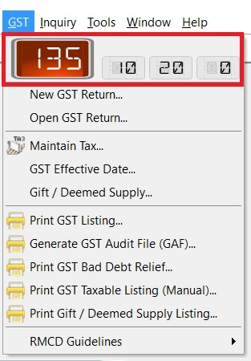

### Formula

Visible := (Return Due - Today Date - 1) < 7

### Example

Frequently : Monthly  
Next Submission : Nov 2016  
Count Down begin shown : 24 Dec 2016  
Today date : 27 Dec 2016  
Count Down Shown : 3 Days+++  

## New GST Return

To process and close the GST Returns period. You can generate the GST-03 and GAF.

### New GST Return

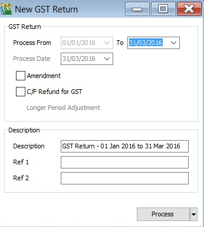

| **Field Name**                 | **Field Type** | **Explanation**                                                                 |
|--------------------------------|----------------|---------------------------------------------------------------------------------|
| Process From to                | Date           | GST Taxable Period, e.g., either monthly or quarterly.                          |
| Process Date                   | Date           | Date to process the GST Return.                                                 |
| Amendment                      | Boolean        | Ticked. In GST-03, the "Amendment" checkbox will be marked X.                   |
| C/F Refund for GST             | Boolean        | Ticked. In GST-03, Item 9 "Do you choose to carry forward refund for GST?" will be marked X in Yes checkbox. |
| Longer Period Adjustment (LPA) | Boolean        | Auto ticked according to the first tax year adjustment.                         |
| Description                    | String         | GST Return - Process From Date to Date (by default).                            |
| Ref 1                          | String         | Key-in any reference no.                                                        |
| Ref 2                          | String         | Key-in any reference no.                                                        |

### Draft GST Return

You are able to draft the GST-03 before the final GST-03 submission by process as draft.
1. Click on the arrow key down at the Process button (Y).
2. See below screenshot.

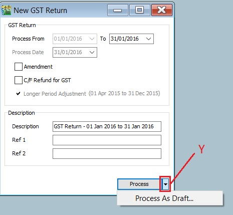

3. DRAFT Status showed for the GST Returns period.

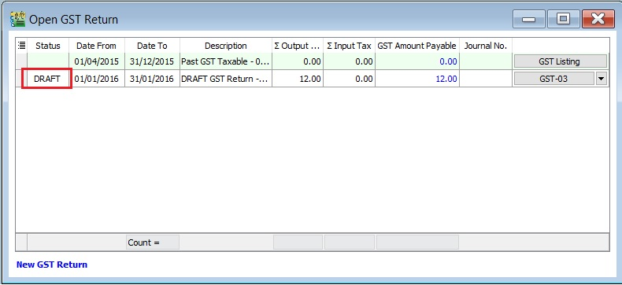

:::note
You still can amend the documents where the DRAFT GST return has generated. You can draft as many before FINAL process the GST Returns for the period.
:::

### Final GST Return

1. Click on the Process button.
2. See below screenshot.

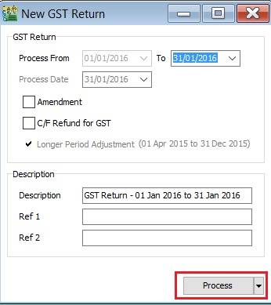

3. Final GST Return will not show the word DRAFT in the status column.

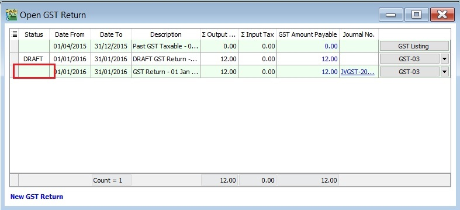

:::note
You cannot amend the documents anymore where the FINAL GST return has generated.
:::

### Extra

#### AR & AP Bad Debt Relief

1. Bad Debt Relief screen will be prompted (see the screenshot below) if the system found there are outstanding Tax Invoices has expired at 6 months.
2. Sales documents from the company with empty GST No will be unticked. You can tick the documents if you think this company is a GST Registered person.

:::note Tips:
  
To avoid to tick the documents manually for GST Registered company, please go to update the GST no at Maintain Customer.
:::

3. Press OK if get a "confirm" message prompted (see the screenshot below), it means there are some company do not have GST No.
4. If you has confirmed that the company is Non-GST Registered person then you can press YES to proceed.
5. Otherwise press NO, you have to update the GST No at Maintain Customer to confirm the company is a GST Registered person before process the GST Return.

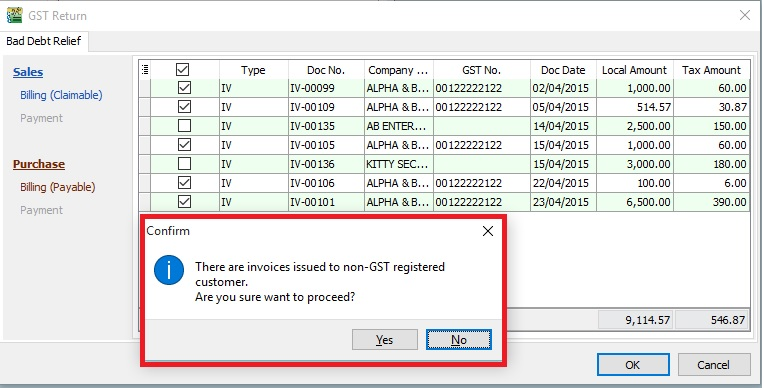  

#### Capital Goods Acquired

1. If you have get a prompt for the **GST Return - Capital Goods Acquired**, then it means there have some credit adjustment transactions for Fixed Asset Account. See below screenshot.

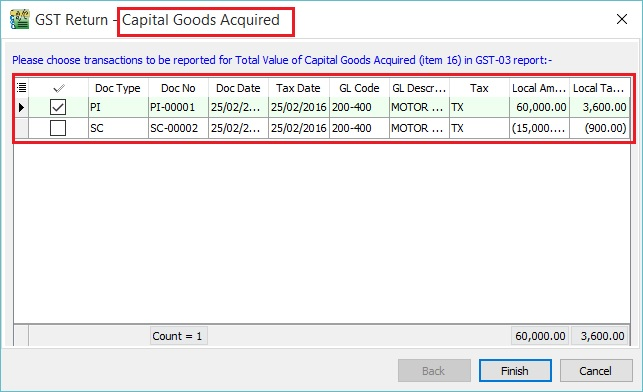  

2. Tick on the transactions line to take in the credit adjustment (eg. Rm15,000.00). Otherwise, it will capture the value Rm60,000.00 in GST-03 item 16. See the screenshot below.

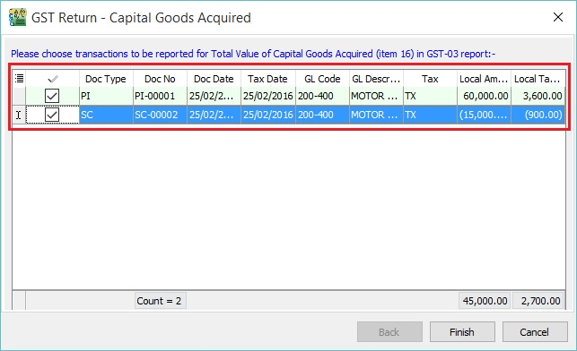  

3. It will capture the net capital goods acquired value in GST-03 item 16.

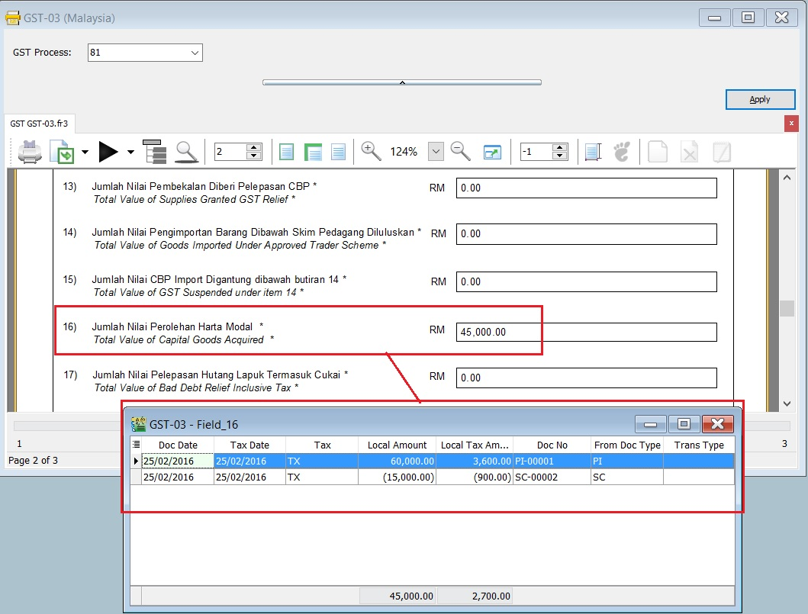  

## Open GST Return

1. See the screenshot below:

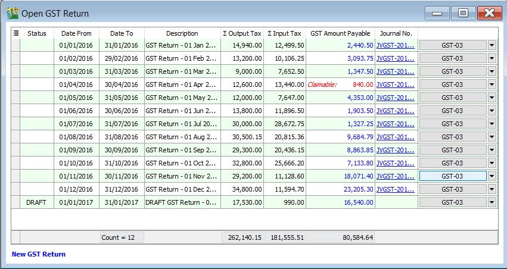  

2. You can insert more available fields.

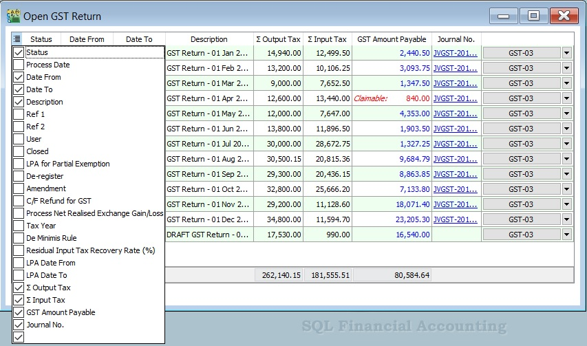  

| **Field Name**                        | **Field Type** | **Explanation**                                                                 |
|---------------------------------------|----------------|---------------------------------------------------------------------------------|
| Status                                | String         | To show the GST Return status, i.e., DRAFT, DE-REGISTER.                        |
| Process Date                          | Date           | To show process date.                                                           |
| Date From                             | Date           | To show date from.                                                              |
| Date To                               | Date           | To show date to.                                                                |
| Description                           | String         | To show the description entered.                                                |
| Ref 1                                 | String         | To show the ref 1 entered.                                                      |
| Ref 2                                 | String         | To show the ref 2 entered.                                                      |
| User                                  | String         | To display the User process the GST Return.                                     |
| Closed                                | Boolean        | Always ticked to close.                                                         |
| LPA for Partial Exemption             | Boolean        | Longer period adjustment (LPA) for partial exemption (Mixed Supplies).          |
| De-register                           | Boolean        | Ticked if the taxable period has de-register date.                              |
| Amendment                             | Boolean        | To show the GST Return has ticked this option.                                  |
| C/F Refund for GST                    | Boolean        | To show the GST Return has ticked this option.                                  |
| Process Net Realised Exchange Gain/Loss | Boolean      | No longer use because system auto handles this option.                          |
| Tax Year                              | Boolean        | Tax Year point.                                                                 |
| De Minimis Rule                       | Boolean        | - Ticked = Pass                                                                 |
|                                       |                | - Unticked = Not Pass                                                           |
| Residual Input Tax Recovery Rate (%)  | Float          | To display the IRR %.                                                           |
| LPA Date From                         | Date           | LPA date from.                                                                  |
| LPA Date To                           | Float          | LPA date to.                                                                    |
| ∑ Output Tax                          | Float          | To show the total output tax value.                                             |
| ∑ Input Tax                           | Float          | To show the total input tax value.                                              |
| GST Amount Payable                    | Float          | Net GST Payable or Claimable.                                                   |
| Journal No.                           | String         | Auto post the JVGST-XXXXX to reconcile the GST Payable and GST Claimable accounts. |
|                                       | Button         | Options button: GST-03, Print GST Listing, Generate GST Audit File (GAF).       |

:::note Tips:
You can click New GST Return in Open GST Return screen. See below the screenshot.
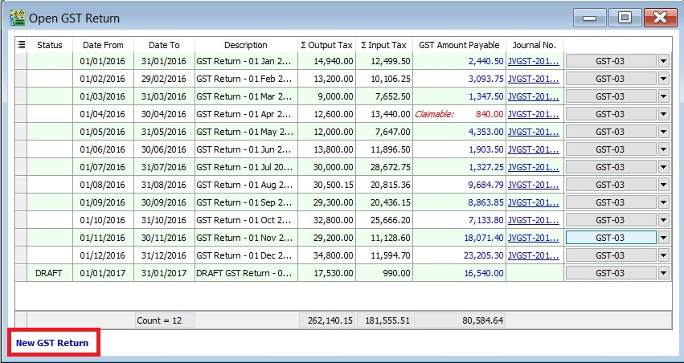  
:::

## Maintain Tax

- This to Maintain all the available tax given by Government or user can self add or modified

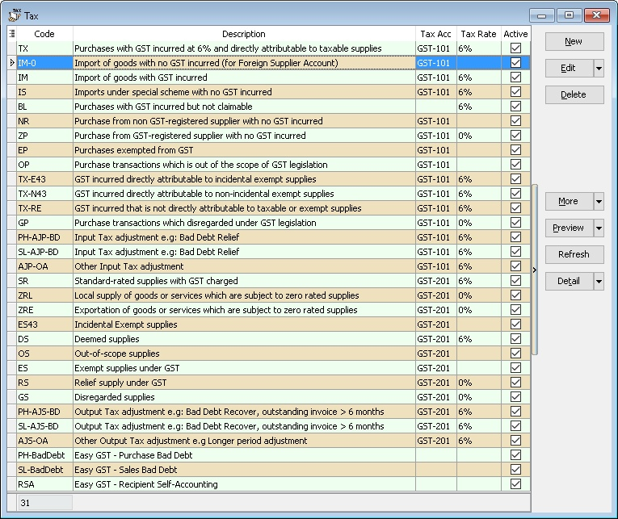  

### Create New Tax

- Screenshot below is the Maintain Tax entry form.

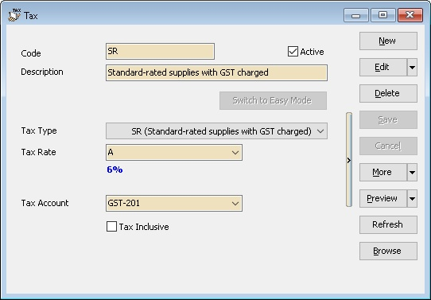 

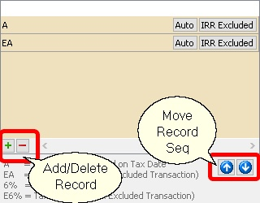 

| **Field Name**  | **Explanation & Properties**                                                                 |
|------------------|-----------------------------------------------------------------------------------------------|
| Code             | Enter the tax code to be shown in report.                                                     |
| Active           | - Checked: Active & able to select from the Tax List in data entry.  
|                  | - UnChecked: InActive & unable to select from the Tax List in data entry.                     |
| Description      | Enter the tax description.                                                                    |
| Tax Type         | Select the Tax Type for the Tax Code to be created.                                           |
| Tax Rate         | User can self-determine the rate or set Auto:  
|                  | - **A**: Auto Tax Rate. System will auto change to new rate if there is update in GST Rate (must update SQL Accounting).  
|                  | - **E**: Excluded from IRR calculation (useful for OS Tax Code & Mixed Supplies Industry).  
|                  | - **EA**: Combination of A & E.  
|                  | - **6%**: User-defined fixed rate (e.g., 6%).  
|                  | - **E6%**: Fixed rate excluded from IRR calculation.  
|                  | Default 1st row is the Default selection in data entry.                                       |
| Tax Account      | Select an appropriate GL Account from Maintain Account.                                       |
| Tax Inclusive    | - Checked: Default is Tax Inclusive.  
|                  | - UnChecked: Default is Tax Exclusive.                                                        |

### Use of Tax

- You can set the tax as default at the following
        1. GL | Maintain Account...
        2. Customer | Maintain Customer... | Tax
        3. Supplier | Maintain Supplier... | Tax
        4. Stock | Maintain Stock Item... | Output Tax/Input Tax
        5. Tools | Options | Customer | Default Output Tax
        6. Tools | Options | Supplier | Default Input Tax
- Therefore, item inserted will be automatically calculate the tax amount based on the subtotal. See below screenshot.

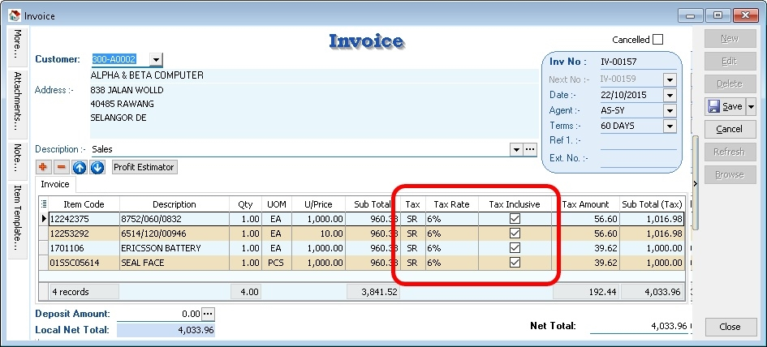 

### Default System Tax Seq

Default System Tax Seq are as follow

**For Sales & Purchase**
1) Maintain Customer/Supplier
2) Maintain Item Code
3) Tools | Options | Customer/Supplier => For Version 836.761 & below
4) Maintain Tax with IsDefault is Tick => For Version 837.762 & above

**For AR & AP**
1) Maintain Customer/Supplier
2) Maintain Account
3) Tools | Options | Customer/Supplier => For Version 836.761 & below
4) Maintain Tax with IsDefault is Tick => For Version 837.762 & above

**For GL**
1) Maintain Account

## GST Effective Date

Enable to set the GST start date (register) and end date (de-register).

### GST Effective Date

1. Below the screenshot is the Start GST wizard, you are required to set the GST Effective Date.

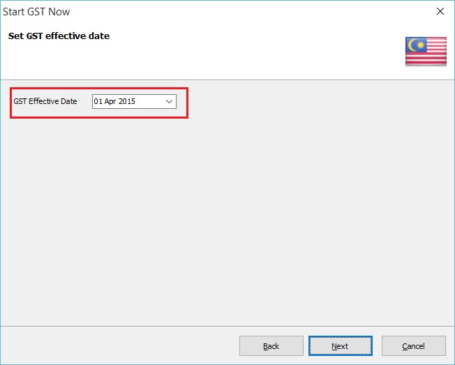 

2. You can check the GST Effective Date under the menu GST | GST Effective Date...

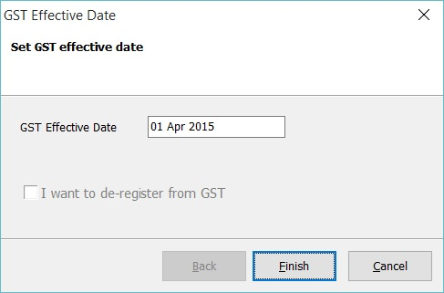 

| Field Name                   | Field Type | Explanation                           |
|-------------------------------|------------|---------------------------------------|
| GST Effective Date            | Date       | GST start date.                       |
| I want to de-register from GST | Boolean    | To set de-register date from GST.     |

### How to set De-register

1. At the GST effective date screen, tick on I want to de-register from GST.

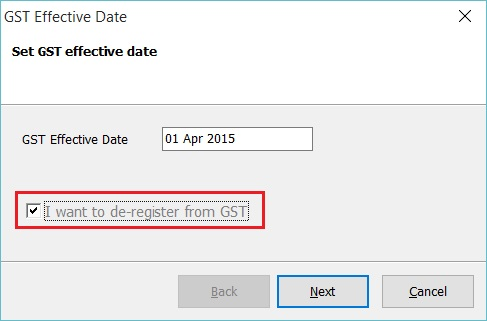 

2. Next', type-in the de-register date. Let's assume ABC Sdn Bhd ceased to be a registered person on 15 May 2016.

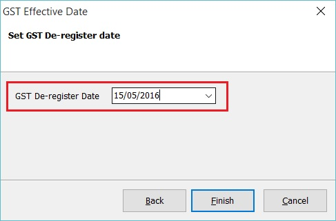 

3. Click Finish to confirm the de-register date.
4. GST De-register Date : 15 May 2016 will displayed below the GST effective date. See the screenshot below.

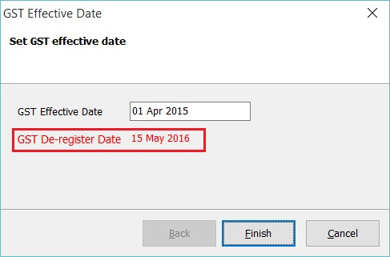 

5. Click **Finish** to exit.

:::note Tips:
You can found the De-Register markings in the GST Returns. See the screenshot below.
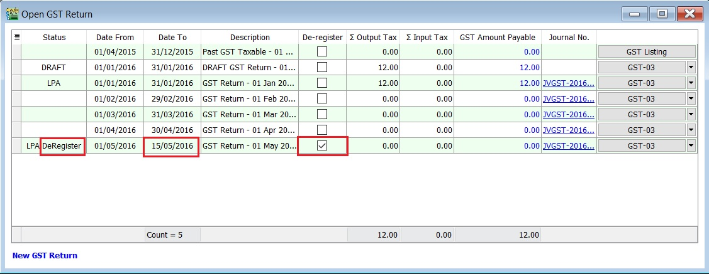 
:::

### How to cancel De-Register Date?

1. At the GST effective date screen, click on the **De-Register Date**.

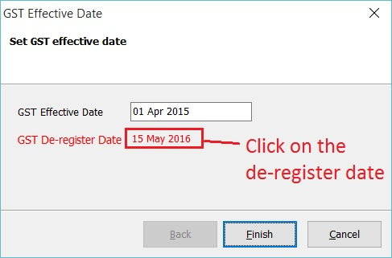 

2. Leave the De-Register date **blank** or become **d/M/yyyy**. See the screenshot below.

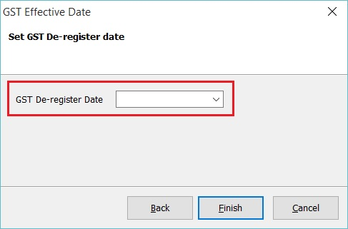 
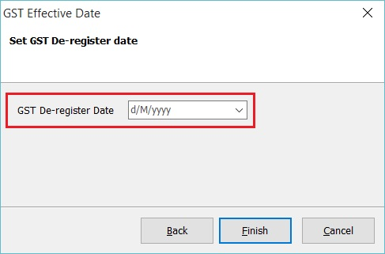 

3. Click **Finish** to confirm remove the de-register date.

## Gift / Deemed Supply

This guide will teach you to enter the gift and deemed supply in SQL Financial Accounting.

### Gift

#### Gift Rules

Goods worth not more than RM500 given FREE to the same person in the same year. **The word ‘year’ in paragraph 5(2) (a) of the First Schedule of GSTA 2014 refers to ‘tax year ‘(financial year)**.

- not a supply
- not subject to GST
- input tax is claimable
  
> **What it means year as Tax Year (Financial Year)?**  
> For example....  
GST Effective Date: 01 Apr 2015  
Financial Start Period: 01 July 2014  
>
>
> First tax year will be: 01 Apr 2015 - 30 Jun 2016 (15 months) - Gift rule Rm500 per person per tax year  
> Second tax year will be: 01 Jul 2016 - 30 Jun 2017 (12 months) - Gift rule Rm500 per person per tax year  
  
**Example 1:**  
Company XY Sdn Bhd purchased 15 hampers worth RM200/hamper to be given to each of his employees.
- every employee will get one hamper FOC.
- no need to account for output tax.
- input tax on 15 hampers = RM180.00 (6% x RM3,000.00) is claimable.
  
**Example 2:**  
Company CX Sdn Bhd has purchased a watch worth RM400.00 and gave it to one of the director’s son.
- The gift is not subject to GST because its value is less than RM500.00 (gift rule).
- input tax incurred on the purchase is claimable.
  
**Example 3:**  
A Company purchased a laptop worth RM1,500.00 and gave the laptop to a director’s son as a gift.
- GST on the laptop must be accounted for by the company as output tax.
- the value of the goods is more than RM500.00.
  
**Example 4:**  
A company purchased a laptop worth RM1,500.00 three years ago. Currently the company has given the laptop to one of his business partners. For the purpose of accounting GST, the company has to use open market value of the goods now where the value of the goods is RM450.00, i.e. the value of the goods has depreciated.
- no need to account for output tax on the gift
- the value of the goods is less than RM500.00. (Gift rule applicable)
  
**Example 5:**  
Company C rewarded RM5,000.00 to his best employee of the year.
- not subject to GST
- money is neither goods nor services
  
#### Gift Document Entry

1. Click on New.
2. Select Type : Gift.

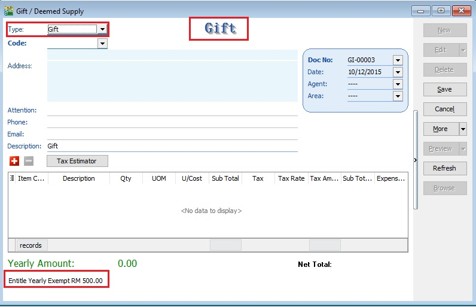 

:::note Note:
You will see this note "Entitle Yearly Exempt RM500.00" at the bottom. 
:::

3. For Gift, you must select Code : Customer Code.
4. Select Item Code: Item Code.
5. Select a preferred Expenses GL Account. User has to create a GL Account in Maintain Account.

For example,

| Item Code | Description | Qty  | UOM  | U/Cost | Sub Total | Tax | Tax Rate | Tax Amount | SubTotal (Tax) | Expenses GL Account            |
|-----------|-------------|------|------|--------|-----------|-----|----------|------------|----------------|--------------------------------|
| ANT       | ANTENA      | 1.00 | UNIT | 350.00 | 350.00    | DS  | 6%       | 0.00       | 350.00         | 999-999 GST Gift/Deemed Supply |

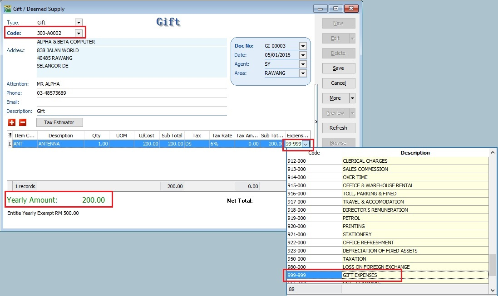 

5. **Yearly Amount** will immediately updated together with the current Gift document amount.

> **Yearly Amount** = Cumulative gift amount in the same year + current gift document amount 

6. Below screenshot is the 2nd gift document created for same company/person in the same year. **The word ‘year’ in paragraph 5(2) (a) of the First Schedule of GSTA 2014 refers to ‘tax year ‘(financial year)**.

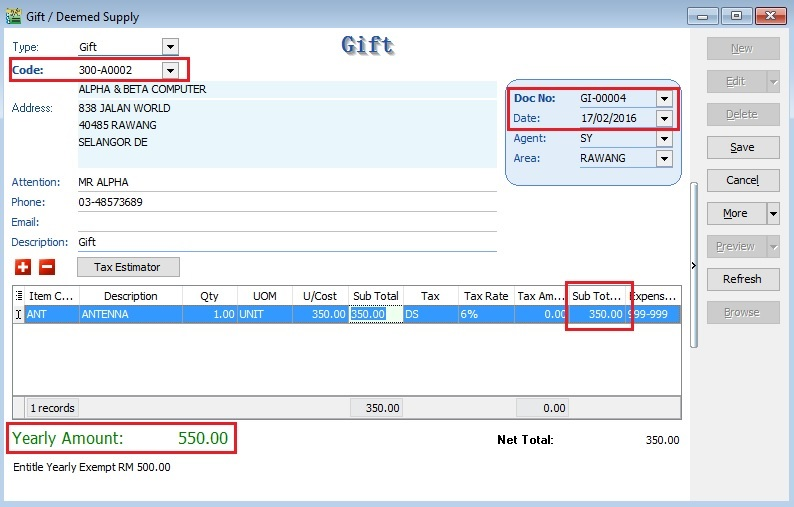 

7. System will auto calculate tax amount once exceed RM500.00

| Gift Date  | Gift   | Cost   | Tax Amount | Calculation    |
|------------|--------|--------|------------|----------------|
| 05/01/2016 | ANTENA | 200.00 | 0.00       |                |
| 17/02/2016 | ANTENA | 350.00 | 33.00      | RM550 × 6%     |

:::note Note:
The calculation of the gift is based on the Total value of the gift once exceed RM500.
:::

8. Click on Tax Estimator. You can see the GST Amount to be process to the gift.

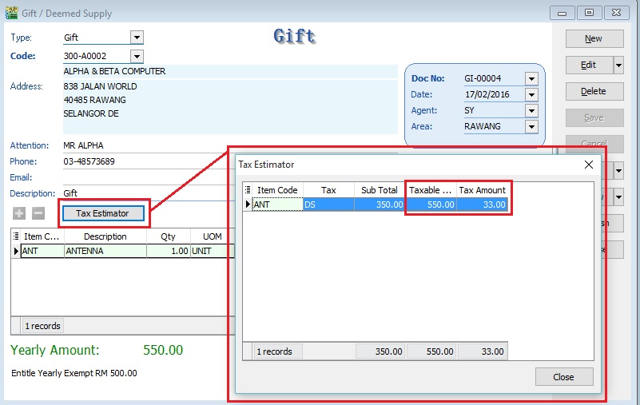 

#### Process GST Return

During process of GST-03 Return, if the system detects there are deemed supplies (DS) under gift, it will add this GST Tax under DS as output Tax.

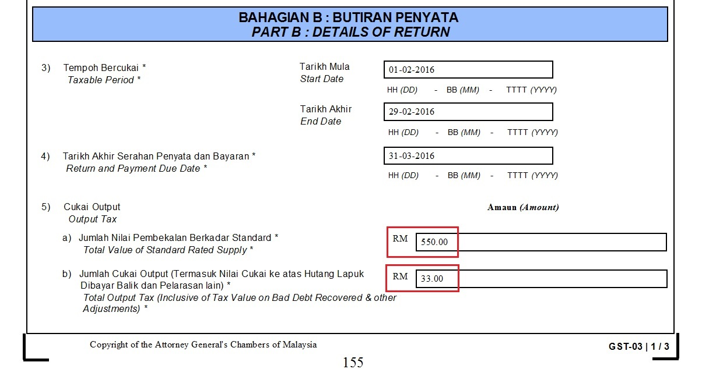 

### Deemed Supply

1. Click on **New**.
2. Select **Type** : Deemed Supply.

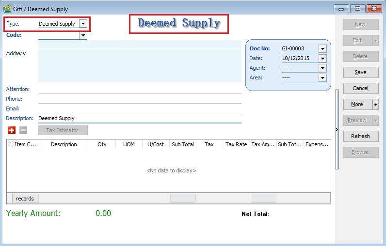 

3. For Deemed Supply, you can leave the **Code** `<<EMPTY>>`
4. Select **Item Code**: Item Code.
5. Select a preferred **Expenses GL Account**. User has to create a GL Account in Maintain Account.

For example,

| Item Code | Description | Qty  | UOM  | U/Cost | Sub Total | Tax | Tax Rate | Tax Amount | SubTotal (Tax) | Expenses GL Account            |
|-----------|-------------|------|------|--------|-----------|-----|----------|------------|----------------|--------------------------------|
| ANT       | ANTENA      | 1.00 | UNIT | 350.00 | 350.00    | DS  | 6%       | 21.00      | 371.00         | 999-999 GST Gift/Deemed Supply |

6. System will calculate tax amount instantly when you save the Deemed Supply, ie. Taxable Amount x 6%.
7. **Yearly Amount** always shown 0.00, because it is Deemed Supply.

## Print GST Listing

To generate a summary and details of the GST transactions after process the GST Returns. It is easy to cross check against with GST-03.

### GST Listing

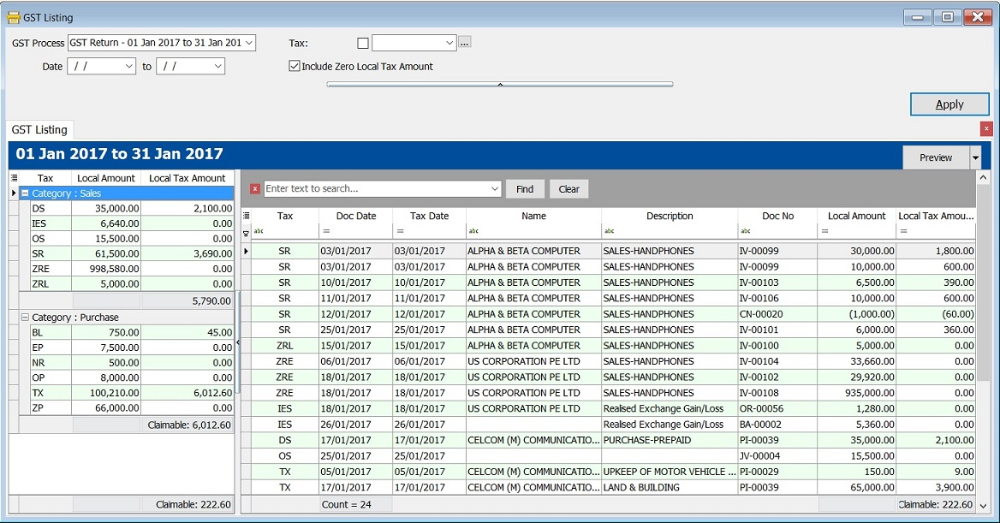 

#### GST Listing - Parameter

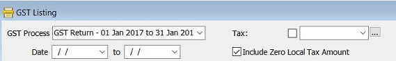 

| Parameter                    | Type    | Explanation                                        |
|------------------------------|---------|----------------------------------------------------|
| GST Process                  | Lookup  | To select the GST Process period.                  |
| Date                         | Date    | To range the date to retrieve the data after apply it. |
| Tax                          | Lookup  | To select the tax code.                            |
| Include Zero Local Tax Amount | Boolean | To show the zero local tax amount.                 |

#### GST Listing - Summary

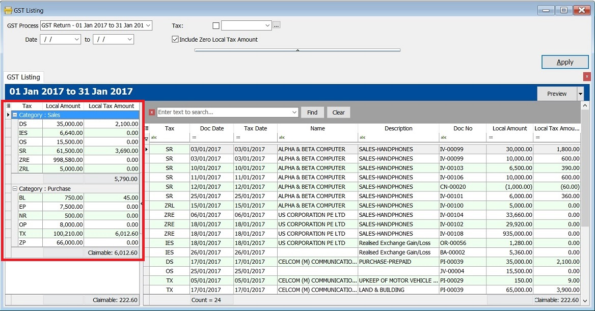 

1. **Double click** on the tax code (eg. SR) in the Summary.
2. It will auto filter the GST transactions by tax code (SR) in the Details.

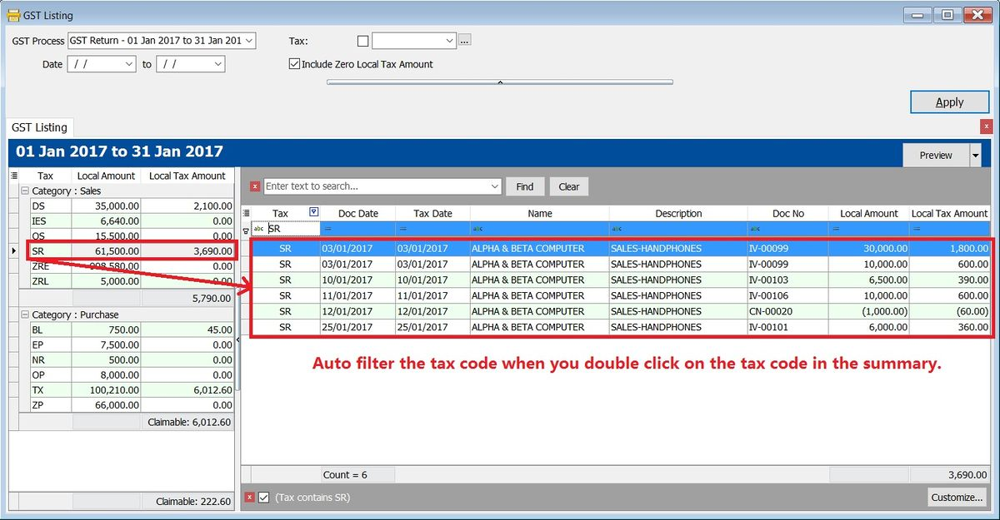 

3. **Deselect** the tax code (SR), click on the X button. See the screenshot below.

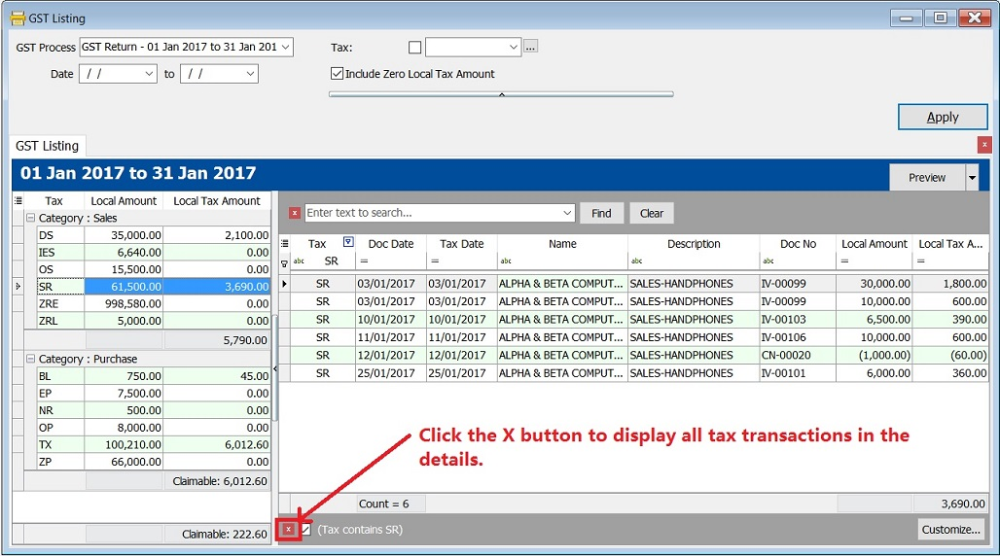 

#### GST Listing - Detail

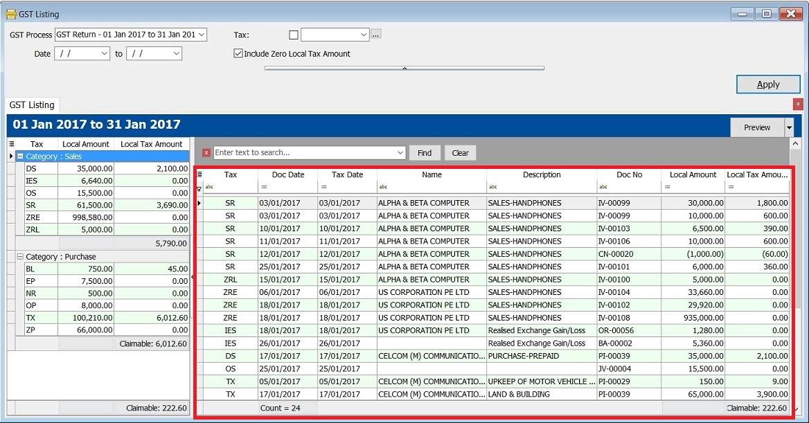 

1. **Find Panel** is very useful to search in any columns by the keywords entered by you.

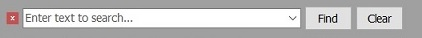 

2. It help to search the transactions contain the keywords, eg. **"UPKEEP"**, **"TX"** or **"ZP"**. You just need to enter the keywords directly with a space in between each keywords. See the screenshot below.

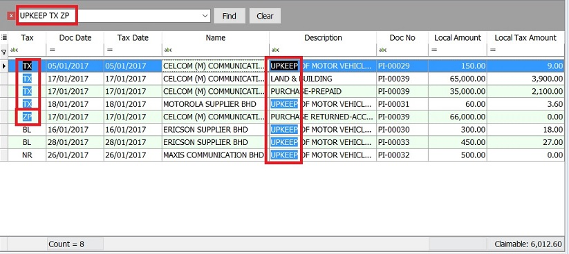 

### Find Paanel Helper

1. With this function, you can easily narrow down the search to identify the errors before the GST Returns submission.
2. Let said I wish to find the word **UPKEEP**.
3. Type the **UPKEEP** in the find panel.

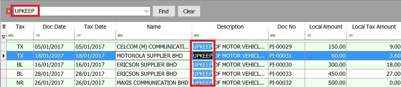 

4. If you want to **exclude** the **BL** tax code, then you have to enter as **UPKEEP -BL** in the find panel.

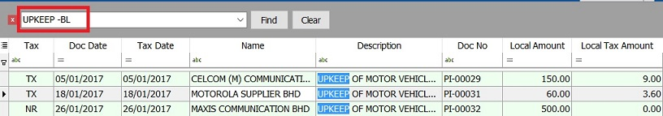 

**Explanation of Extended Search Syntax :**

| Example Search Syntax | Filter Operator | Explanation                                                                 |
|-----------------------|-----------------|-----------------------------------------------------------------------------|
| apple pineapple mango | OR              | Any transaction lines containing apple, pineapple, OR mango will be searched. |
| apple +pineapple      | AND             | Transaction lines with a combination of apple AND pineapple will be searched. |
| apple -mango          | EXCLUDE         | Transaction lines with the word apple but EXCLUDE mango. Result: apple and pineapple will be searched. |
| "pineapple apple"     | EXACT WORD      | Search for the exact words "pineapple apple".                               |

:::note NOTE:
Spacing is very important to make your search more accurate.
:::

### Reports

1. Click on **Preview**.
2. Select a report to preview or print or export.

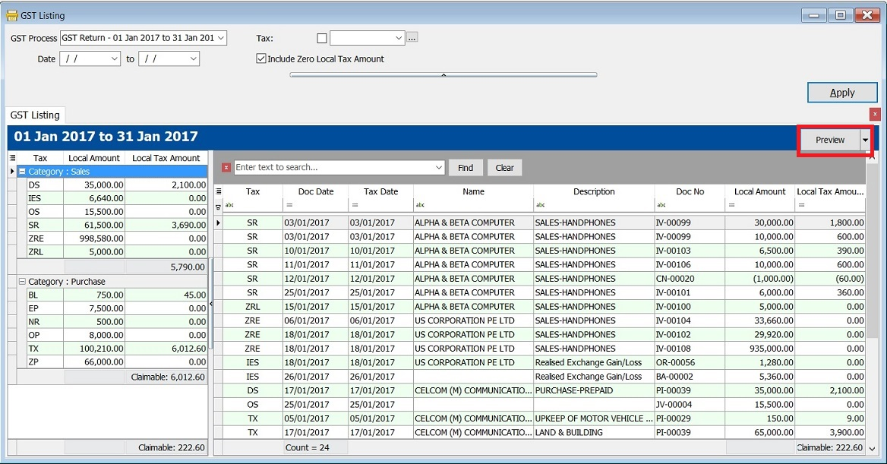 

| No. | Report Name                                                                 | Purpose                                                                                   |
|-----|------------------------------------------------------------------------------|-------------------------------------------------------------------------------------------|
| 01  | GST Detail 1                                                                 | To show the document description in GST Listing.                                          |
| 02  | GST Detail 2                                                                 | To show the document item details description in GST Listing.                             |
| 03  | GST Detail 3 - GST F5-(SG)                                                   | For Singapore GST, to show the GST-03 details in GST Listing.                             |
| 04  | GST Detail 3 - GST-03                                                        | For Malaysia GST, to show the GST-03 details in GST Listing.                              |
| 05  | GST Detail 4 - Mixed Supplies                                                | Applicable to Mixed Supplies. To show the calculations for DmR and Longer Period Adjustment. |
| 06  | GST Lampiran 2                                                               | GST detail listing for standard rated. It is upon request by RMCD.                        |
| 07  | GST Lampiran 2-with ZR                                                       | Another GST detail listing for the standard rated and zero rated separately.              |
| 08  | GST Lampiran 4 - Ringkasan Maklumat Permohanan Tuntutan Pelepasan Hutang Lapuk | Lampiran 4 as requested by Kastam Officer.                                                |
| 09  | GST Listing - Yearly GST Analysis                                            | To analyse the yearly tax amount and taxable amount.                                      |
| 10  | GST Summary Sheet - MY                                                       | GST Summary Sheet format.                                                                 |
| 11  | GST-Lampiran B-0 PT GST Bil 2B (ATS) (IS)                                    | A special GST detail listing for Approved Trader Scheme (Refer to GST-03 item 14 & 15).   |
| 12  | GST-Penyata Eksport (ZRE)                                                    | A special GST detail listing for Zero Rated Export supply (Refer to GST-03 item 11).      |
| 13  | GST-Penyata Pembekalan Dikecualikan (ES & IES)                               | A special GST detail listing for Exempted Supplies (Refer to GST-03 item 12).             |
| 14  | GST-Penyata Pembekalan Tempatan Berkadar Sifar (ZRL)                         | A special GST detail listing for Zero Rated Local supply (Refer to GST-03 item 10).       |

:::note NOTE: 
From Doc Types in GST Listing Detail are consists of:
1. _A = Unclaimable Non-Incidental Exempt Supplies (TX-N43)
2. _B = Unclaimable TX-RE 
3. _C = Annual Adjustment Non-Incidental Exempt Supplies (TX-N43)
4. _D = Annual Adjustment TX-RE
5. _X = Realised Gain Loss
:::

### Pivot Table

1. Right click on any of the grid columns.
2. From the menu, select **Pivot Table**.

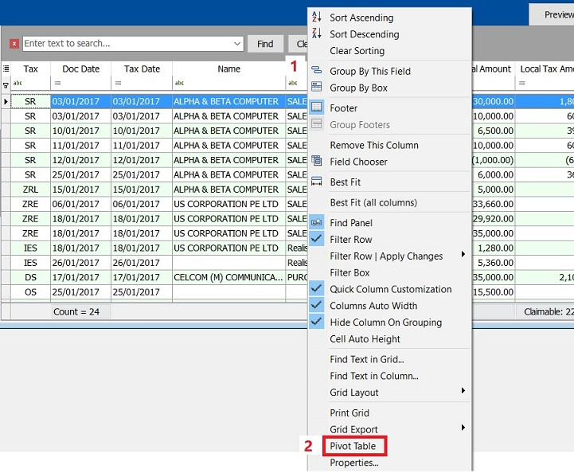 

3. At Pivot Table, there are 3 sections as below:  
   a. **Data Fields** – Data field will auto inserted when you launch the pivot table.  
   b. **Row Fields** – To structure the grouping for Rows.  
   c. **Column Fields** – To structure the grouping for Columns.

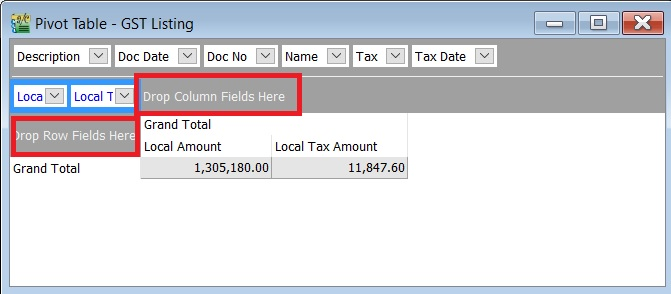 

3. Use the grid columns to structure the pivot format. See the screenshot below.

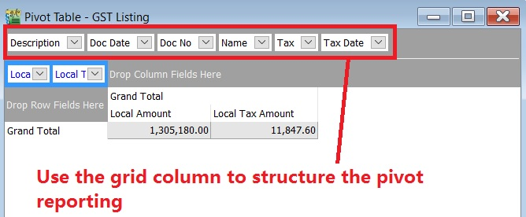 

4. Drag the grid column into Row fields or Column fields.

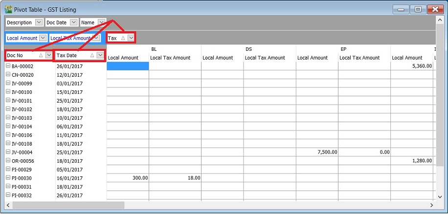 

> **Hint 1:**  
> 1. Right click on the **Row Field**
> 2. Select **Expand All**.  
> 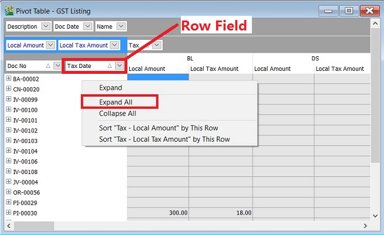 
  
> **Hint 2:**  
> 1. Right click on the grey area. 
> 2. A small menu pop out.
> 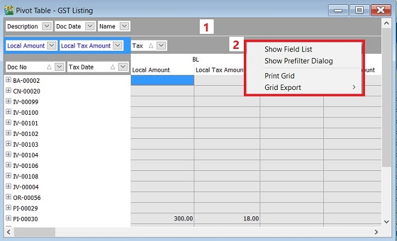   
>   a. **Show Field List** - Not really use to it.  
>   b. **Show Prefilter Dialog** - Insert filter conditions.  
>   c. **Print Grid** - To print the grid.  
>   d. **Grid Export** - To export the grid data into EXCEL, TEXT, HTML and XML.  

## Print GST - 03

To generate the GST-03 data for submission via TAP.

### GST - 03

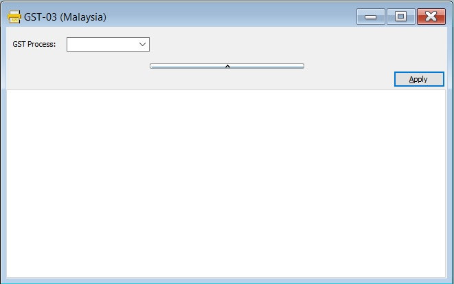   

#### GST-03-Parameter

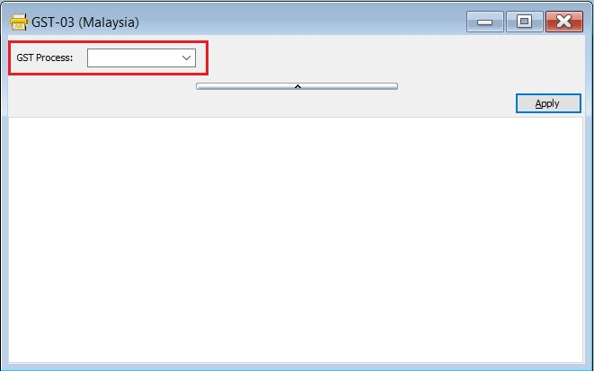 

| Parameter   | Type   | Explanation                         |
|-------------|--------|-------------------------------------|
| GST Process | Lookup | To select the GST Process Period.   |
  
See example of the **GST Process Lookup** screenshot below.

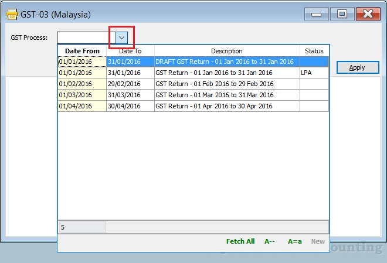 

#### GST-03 Form

1. After select the GST Process parameter, click on APPLY.
2. See the below screenshot.

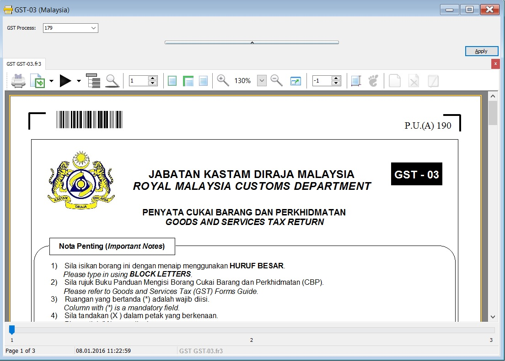 

#### GST-03 TAP Upload File

1. At the GST-03 on the screen, click on the **PLAY** button.
2. Click on **GST03_TAP**. See the below screenshot.

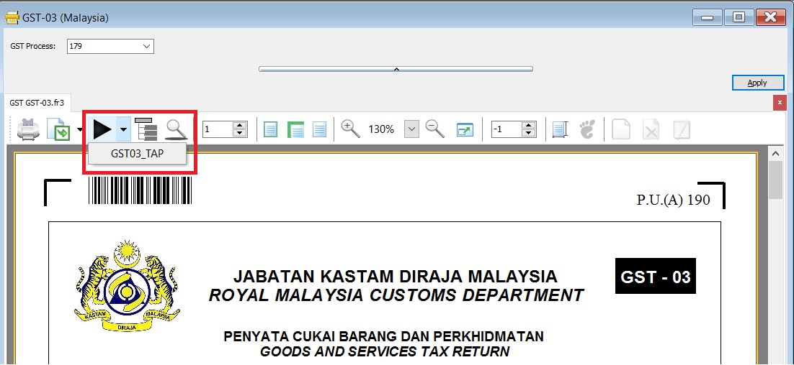 

3. Select the destination directory to save the TAP-Upload text file, eg. GST Tap Return for Oct 2015 the filename: **GSTTapReturn-201510**.
4. Click on **SAVE**.
5. See the below screenshot.

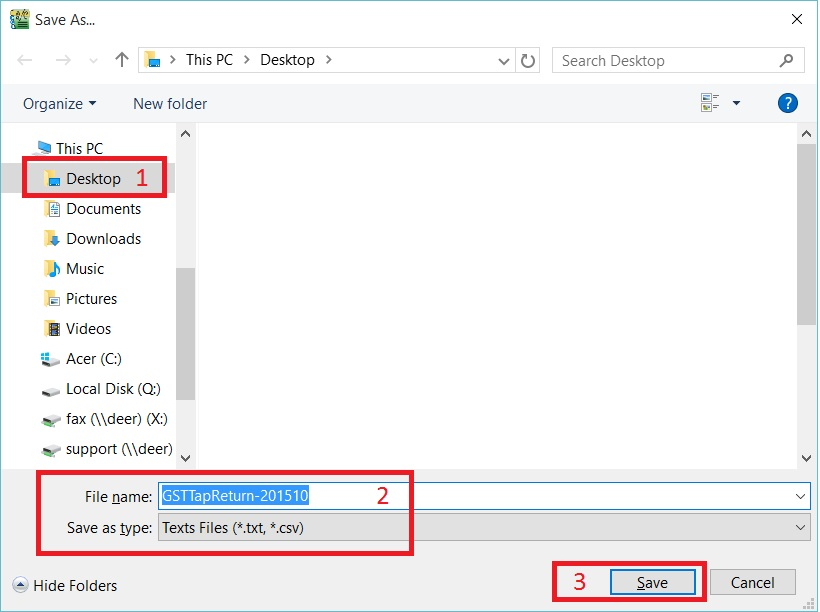 

6. Prompt the below message. Press OK to proceed to upload the file via TAP website.

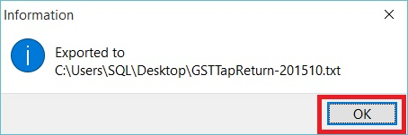 

### GST - 03 Item Details

#### PART A : DETAILS OF REGISTERED PERSON

| Item No. | Description        | Guidelines                                   |
|----------|--------------------|----------------------------------------------|
| 01       | GST No.*           | GST No from File → Company Profile...        |
| 02       | Name of Business*  | Company Name from File → Company Profile...  |

#### PART B : DETAILS OF RETURN

| Item No. | Description                                                                 | Guidelines                                                                 |
|----------|-----------------------------------------------------------------------------|----------------------------------------------------------------------------|
| 03       | Taxable Period*                                                             | GST Returns – Process date range.                                          |
| 04       | Return and Payment Due Date*                                                | Follow the RMCD due date.                                                  |
| 05a      | Output Tax – Total Value of Standard Rated Supply*                          | **SR + DS** (Taxable Amount)                                                   |
| 05b      | Output Tax – Total Output Tax (Inclusive of Tax Value on Bad Debt Recovered & other Adjustments)* | **SR + DS + AJS** (Tax Amount)                                                 |
| 06a      | Input Tax – Total Value of Standard Rate and Flat Rate Acquisitions*        | **TX + IM + TX-E43 + TX-RE**                                                   |
| 06b      | Input Tax – Total Input Tax (Inclusive of Tax Value on Bad Debt Relief & other Adjustments)* | **TX + IM + TX-E43 + TX-RE + AJP** (Tax Amount)                                |
| 07       | GST Amount Payable (Item 5b – Item 6b)*                                     | Output Tax Value > Input Tax Value                                         |
| 08       | GST Amount Claimable (Item 6b – Item 5b)*                                   | Input Tax Value > Output Tax Value                                         |
| 09       | Do you choose to carry forward refund for GST?                              | Mark **X** on YES if you have ticked C/F Refund for GST.                   |

#### PART C : ADDITIONAL INFORMATION

| Item No. | Description                                                   | Guidelines                                                                                     |
|----------|---------------------------------------------------------------|------------------------------------------------------------------------------------------------|
| 10       | Total Value of Local Zero-Rated Supplies*                     | **ZRL + NTX** (Taxable Amount)                                                                     |
| 11       | Total Value of Export Supplies*                               | **ZRE + ZDA** (Taxable Amount)                                                                     |
| 12       | Total Value of Exempt Supplies*                               | **IES + ES** (Taxable Amount)                                                                      |
|          |                                                               | Note: Net Loss in Forex (IES) = 0.00                                                           |
| 13       | Total Value of Supplies Granted GST Relief*                   | **RS** (Taxable Amount)                                                                            |
| 14       | Total Value of Goods Imported Under Approved Trader Scheme*   | **IS** (value excluding tax)                                                                       |
| 15       | Total Value of GST Suspended under item 14*                   | **IS x 6%** (value of tax)                                                                         |
| 16       | Total Value of Capital Goods Acquired*                        | **TX + TX-CG + IM** (value excluding tax)                                                          |
|          |                                                               | Note: Regardless of purchase asset value. Purchase doc/Cash Book PV/ JV using "Fixed Asset" GL Account (exclude Block Tax). |
| 17       | Total Value of Bad Debt Relief Inclusive Tax*                 | **AJP** (value including tax) – Only Debtor (106 x AJP Input Tax / 6)                              |
| 18       | Total Value of Bad Debt Recovered Inclusive Tax*              | **AJS** (value including tax) – Only Debtor (106 x AJS Input Tax / 6)                              |
| 19       | Breakdown Value of Output Tax in accordance with the Major Industries Code | Picks from GL Accounts that need MSIC Code: Sales Account, Cash Sales Account, Return Inwards, etc. |
|          |                                                               | MSIC Code is a 5-digit code representing your business nature.                                 |
|          |                                                               | Used in Form GST-03 (Item 19).                                                                 |
|          |                                                               | The total GST amount of the respective MSIC Codes will be shown.                               |
|          |                                                               | **Others** will be filled automatically if exceeding 5 MSIC codes.                                 |
|          |                                                               | Refer to list of [MSIC 2008](https://phl.hasil.gov.my/pdf/pdfam/NewBusinessCodes_MSIC2008_2.pdf).                                                                    |

#### PART D : DECLARATION

| Item No. | Description           | Guidelines                                              |
|----------|-----------------------|---------------------------------------------------------|
| 20       | Name of Authorized Person* | **User name** from **Tools -> Maintain User...**                 |
| 21       | Identity Card No.*    | **IC** (New) from **Tools -> Maintain User... (Misc tab)**      |
| 22       | Passport No.*         | **Passport** from **Tools -> Maintain User... (Misc tab)**      |
| 23       | Nationality*          | **Nationality** from **Tools -> Maintain User... (Misc tab)**   |
| 24       | Date                  | Process Date                                            |
| 25       | Signature             | Sign on GST-03 print copy.                              |

:::note Note:
Column with (*) is a mandatory field.
:::

## Generate GST Audit File (GAF)

To generate the GST Audit File (GAF) upon RMCD request.

### GST Audit File (GAF)

GST Audit File (GAF) has break into 3 parts:

1. General Ledger
2. Sales
3. Purchase

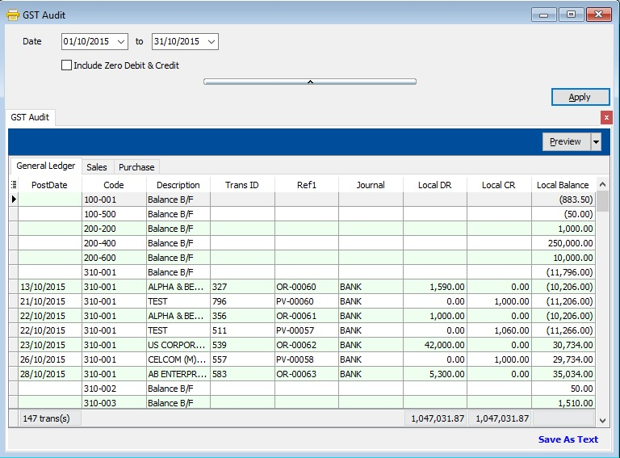 

### How to Export the GAF File

1. Select the date range.

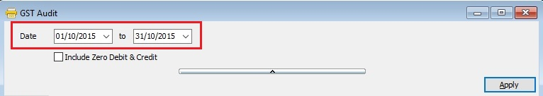 

2. Click on **APPLY**.

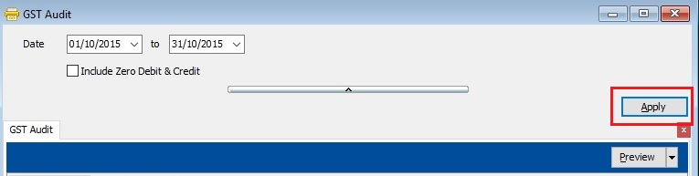 

3. Click on **Save As Text**.

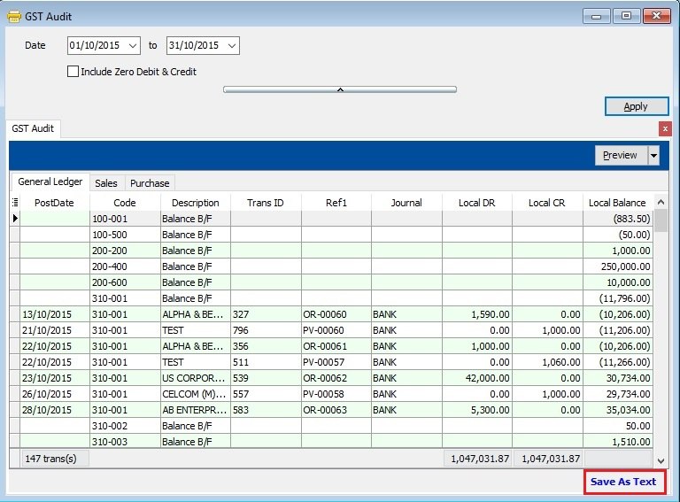 

4. Select the destination directory to save the GAF file. See the below screenshot.

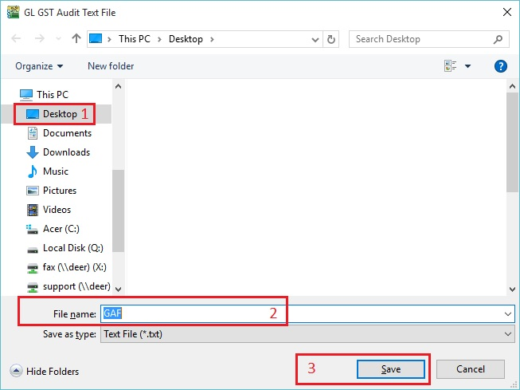 

5. File generated successfully. Press OK to exit the below message.

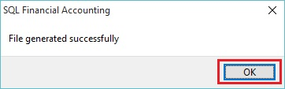 

## Print GST Bad Debt Relief

A taxable person may claim bad debt relief subject to the requirements and conditions set forth under sec.58 of the GSTA 2014 and the person has not received any payment or part of the payment in respect of the taxable supply from the debtor after the sixth month from the date of supply.

The bad debt relief may be claimed if - (amended on 28 Oct 2015 from DG Decision)  
(a) requirements under s.58 GSTA and Part X of GST Regulations 2014 are fulfilled; and  
(b) the supply is made by a GST registered person to another GST registered person

The bad debt relief shall be claimed immediately in the taxable period after the expiry of the sixth month from the date of supply. If the bad debt relief is not claimed by the supplier in the immediate taxable period immediately after the expiry of the sixth month, then the taxable person has to notify the Director General (DG) within 30 days after the expiry of the sixth month on his intention to claim at a later date.

A GST registered person who has made the input tax claim but fails to pay his supplier within six months from the date of supply shall account for output tax immediately after the expiry of the sixth month (s.38(9) GSTA).

The word ‘month’ in sec.58 refers to calendar month or complete month –
Example: Invoice issued at 15 th January 2017. For monthly taxable period, the sixth month expires at the end of June and the bad debt relief shall be claimed in July taxable period.

See below the overview of GST Bad Debt Relief system flow:

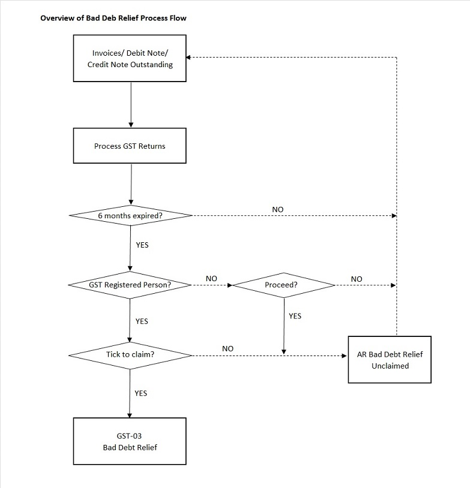 

### Check List Related to Bad Debt Relief

#### Maintain Tax

Below tax code will be AUTO used for Bad Debt Relief matter when process GST Return:

| Tax Code   | Description                                                           | Tax Acc Entry                                                                 | Explanation                            |
|------------|-----------------------------------------------------------------------|-------------------------------------------------------------------------------|----------------------------------------|
| SL-AJP-BD  | Input Tax adjustment e.g: Bad Debt Relief                             | DR GST-Claimable                                                              | For customer bad debt relief claim     |
|            |                                                                       | CR GST-Sales Deferred Tax                                                     |                                        |
| SL-AJS-BD  | Output Tax adjustment e.g: Bad Debt Recover, outstanding invoice > 6 months | DR Sales Deferred Tax                                                          | For customer bad debt relief recovered |
|            |                                                                       | CR GST-Payable                                                                |                                        |
| PH-AJP-BD  | Input Tax adjustment e.g: Bad Debt Relief                             | DR GST-Claimable                                                              | For supplier bad debt relief recovered |
|            |                                                                       | CR GST-Purchase Deferred Tax                                                  |                                        |
| PH-AJS-BD  | Output Tax adjustment e.g: Bad Debt Recover, outstanding invoice > 6 months | DR GST-Purchase Deferred Tax                                                   | For supplier bad debt relief payable   |
|            |                                                                       | CR GST-Payable                                                                |                                        |

#### Maintain Customer

1. There is one condition to determine the bad debt relief can be claimed if -
    1. **requirements under s.58 GSTA and Part X of GST Regulations 2014 arefulfilled**; and  
    2. **the supply is made by a GST registered person to another GST registered person**

2. Therefore, you need to update the GST No for your customer who is GST registered person. See the screenshot below.
3. Under the Tax tab in Maintain Customer,

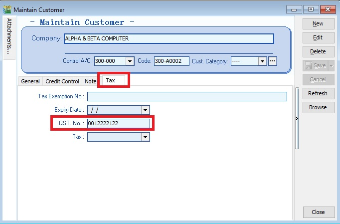 

### Process GST Returns

1. Process GST Return. For example, process from 01/10/2015 to 31/10/2015.
2. Bad Debt Relief screen will be prompted (see the screenshot below) if the system found there are outstanding Tax Invoices has expired at 6 months.
3. Sales documents from the company has empty GST No will be unticked. You can tick the documents if you think this company is a GST Registered person.

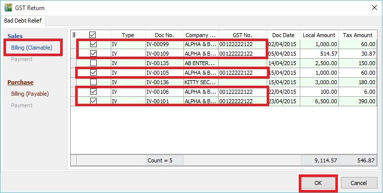 

:::note TIPS:
  
To avoid to tick the documents manually for GST Registered company, please go to update the GST no at Maintain Customer.
:::

4. Press OK if get a "confirm" message prompted (see the screenshot below), it means there are some company do not have GST No.
5. If you has confirmed that the company is Non-GST Registered person then you can press YES to proceed.
6. Otherwise press NO, you have to update the GST No at Maintain Customer to confirm the company is a GST Registered person before process the GST Return.

  

### GST Listing

Category Others will appeared in GST Listing if there is found bad debt relief (eg. AJS-BD, AJP-BD):

| Category | Description                                                             | Local Amount | Local Tax Amount |
|----------|-------------------------------------------------------------------------|--------------|------------------|
| AJS-BD   | Output Tax adjustment e.g: Bad Debt Recover, outstanding invoice > 6 months | 17,000.00    | 1,020.00         |
| AJP-BD   | Input Tax adjustment e.g: Bad Debt Relief                               | 9,114.57     | 546.87           |

### GST - 03

1. At GST Return screen, you can direct preview the GST-03 by click on the GST-03 button (see the screenshot below).

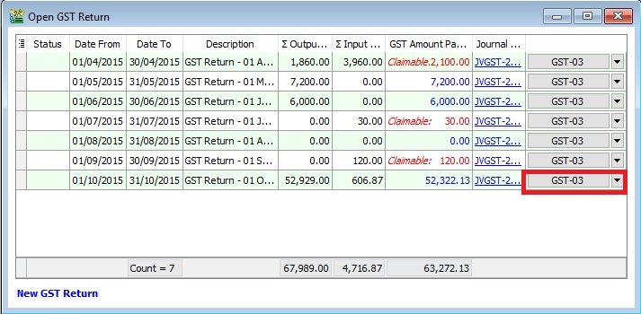  

2. GST-03 result from the above sample data:

| GST-03 # | Description                                                            | Amount   |
|----------|------------------------------------------------------------------------|----------|
| 5a       | Total Value of Standard Rated Supply                                   | 0.00     |
| 5b       | Total Output Tax (Inclusive of Tax Value on Bad Debt Recovered & other Adjustments) | 1,020.00 |
| 6a       | Total Value of Standard Rate and Flat Rate Acquisitions                | 0.00     |
| 6b       | Total Input Tax (Inclusive of Tax Value on Bad Debt Relief & other Adjustments)     | 546.87   |
| 17       | Total Value of Bad Debt Relief Inclusive Tax                           | 9,661.44 |
| 18       | Total Value of Bad Debt Relief Recovered Inclusive Tax                 | 0.00     |

### Print GST Bad Debt Relief 

1. This report is help you to analyse the GST Bad Debt Relief happenings on each invoices.

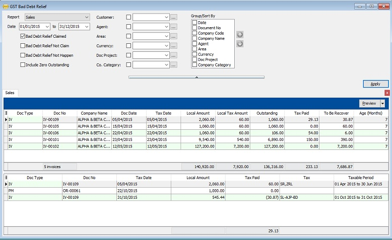  

2. Let said the IV-00109 has the following details:-

| Seq | Description                 | Amount   | Tax | Tax Amount | Amount with Tax |
|-----|-----------------------------|----------|-----|------------|-----------------|
| 1   | Sales of coconut can drinks | 1,000.00 | SR  | 60.00      | 1,060.00        |
| 2   | Sales of coconut            | 1,000.00 | ZRL | 0.00       | 1,000.00        |

3. From the below report, it tells you that the bad debt relief claimed and to be recover at **Rm30.87** for IV-00109. You can found at the detail that the bad debt relief claimed at **Taxable Period 01 Oct 2015 to 31 Oct 2015**.

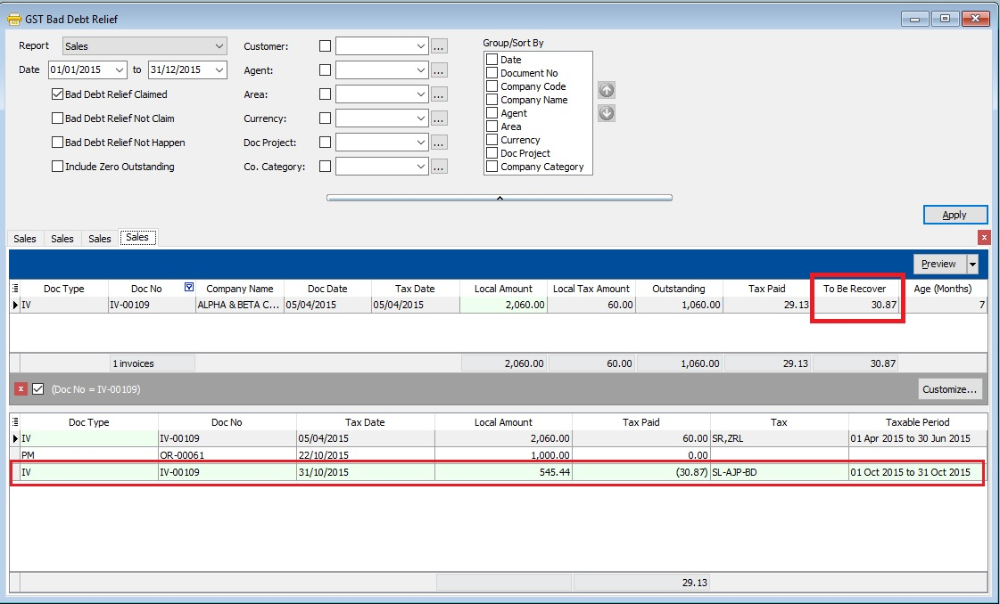  

4. After the IV-00109 has been full settlement in month Nov 2015, you will found the full tax paid **Rm60.00** and to be recover will be shown as 0. You can found at the detail that the bad debt relief recovered at **Taxable Period 01 Nov 2015 to 30 Nov 2015**.

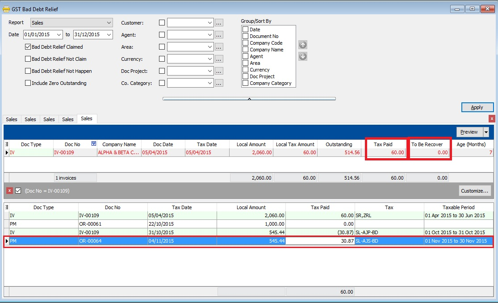 

5. There are some option can choose to apply the GST Bad Debt Relief for further checking:

#### Sales

| Checkbox                   | Explanation                                                                 |
|-----------------------------|-----------------------------------------------------------------------------|
| Bad Debt Relief Claimed     | GST bad debt relief that you HAVE TICKED to claim on outstanding invoices when process your GST returns. |
| Bad Debt Relief Not Claim   | GST bad debt relief that you DO NOT TICKED to claim on outstanding invoices when process your GST returns. |
| Bad Debt Relief Not Happen  | Outstanding invoices the GST Amount not expired at 6 months GST bad debt relief. |
| Include Zero Outstanding    | To include the outstanding invoices are zero.                              |

#### Purchase

| Checkbox                  | Explanation                                                                 |
|----------------------------|-----------------------------------------------------------------------------|
| Bad Debt Relief Paid       | GST bad debt relief have paid on the outstanding supplier invoices when process your GST returns. |
| Bad Debt Relief Not Pay    | GST bad debt relief not pay yet on the outstanding supplier invoices. It could be due to late receive the supplier invoice. |
| Bad Debt Relief Not Happen | Outstanding invoices the GST Amount not expired at 6 months GST bad debt relief. |
| Include Zero Outstanding   | To include the outstanding invoices are zero.                              |

6. Click Preview button. You can found the following report list.

| #  | Report Name                                | Usage                                                                 |
|----|--------------------------------------------|----------------------------------------------------------------------|
| 1  | GST Bad Debt Relief - Sales                | GST Bad Debt Relief Listing with detail based on the checkbox ticked. |
| 2  | GST-BM Bad Debt Relief-Unclaimed Letter 1  | Bahasa Malaysia bad debt relief unclaimed letter format 1 to Director General |
| 3  | GST-BM Bad Debt Relief-Unclaimed Letter 2  | Bahasa Malaysia bad debt relief unclaimed letter format 2 to Director General |
| 4  | GST-EN Bad Debt Relief-Unclaimed Letter 1  | English version bad debt relief unclaimed letter format 1 to Director General |
| 5  | GST-EN Bad Debt Relief-Unclaimed Letter 2  | English version bad debt relief unclaimed letter format 2 to Director General |

>**TIPS 1** : To print the **bad debt relief unclaimed letter**.
>
>1. Select the **Date Parameter** as **the GST effective date onwards**.  
>2. Tick both **Bad Debt Relief Not Claim** and **Bad Debt Relief Not Happen** to apply follow by preview.  
>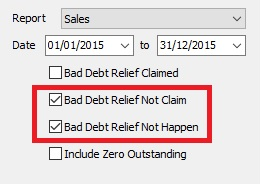  
>3. This letter applicable to customer has maintained **GST No** in Maintain Customer only.

<!------------- This is a comment to show where the GST SEPCIAL TREATMNENT IS SPLIT FROM------------------->
<!------------- This is a comment to show where the GST SEPCIAL TREATMNENT IS SPLIT FROM------------------->
<!------------- This is a comment to show where the GST SEPCIAL TREATMNENT IS SPLIT FROM------------------->
<!------------- This is a comment to show where the GST SEPCIAL TREATMNENT IS SPLIT FROM------------------->
<!------------- This is a comment to show where the GST SEPCIAL TREATMNENT IS SPLIT FROM------------------->
<!------------- This is a comment to show where the GST SEPCIAL TREATMNENT IS SPLIT FROM------------------->

## Migration System Features-How to handle the GST Past Documents Opening Balance for Customer and Supplier

How to handle the GST Past Documents Opening Balance for Customer and Supplier?

This guide will teach you the way to handle the past outstanding documents for Customer and Supplier from previous accounting system. We are ensure that the data migration part go smooth with GST matters happened in previous system likes bad debt relief and non-refundable deposit.

**Overview of the GST Past Documents for Customer and Supplier:**
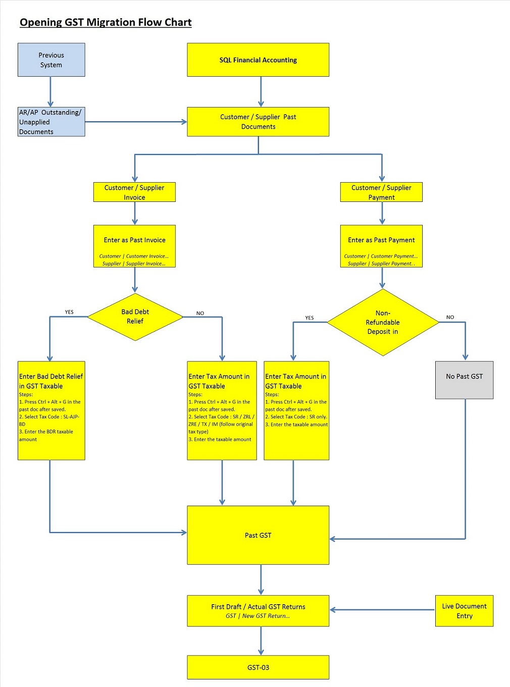  

### How to enter GST Past Documents

#### Financial Start Period and System Conversation Date 

1. Let's said the company GST reporting period is **Monthly**. Under the Tools | Options... set the following:-
**Financial Start Period** : 01 Jan 2016  
**System Conversion Date** : 01 Feb 2016 (Cut-off Date for Opening Entry)

:::note NOTE:
It is not recommended to set the System Conversion Date fall within the quarterly GST reporting period.  
Lets said the company GST reporting period is Quarterly.  
                      GST effective date : 01 April 2015  
You should set the System Conversion Date: 01 April 2016 or next quarter start date (ie. 01 July 2016).
:::

2. See below screenshot:

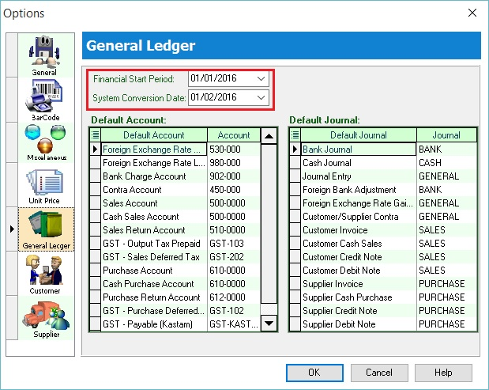  

#### GST Effective Date

1. Let's assume the company is GST registered at 01 April 2015.  
2. See below screenshot:

  

:::note Important:
It is very important to set the GST Effective Date where the GST commerce date started.  
Bad debt relief will based on the GST Effective date. 

For example,  **GST effective date set on 1 April 2015** and **system conversion date is 1 Jan 2016**.  
Pass document dated in 15 July 2015 **(it is after the GST effective date)**.  
Therefore, the Bad Debt Relief will be process in GST Returns-Jan 2016 automatically.  
:::

#### Enter the Past Documents (AR & AP)

1. Create new customer/supplier invoice.
2. Enter the **Invoice No**.
3. Enter the **Original Invoice Date**. Date before the system conversation date, the document will converted to "Past Invoice" automatically.
4. Enter the **Outstanding Invoice Balance** into Total.
5. Save it.
6. See screenshot below.

**Screenshot 1: Past Invoice:**

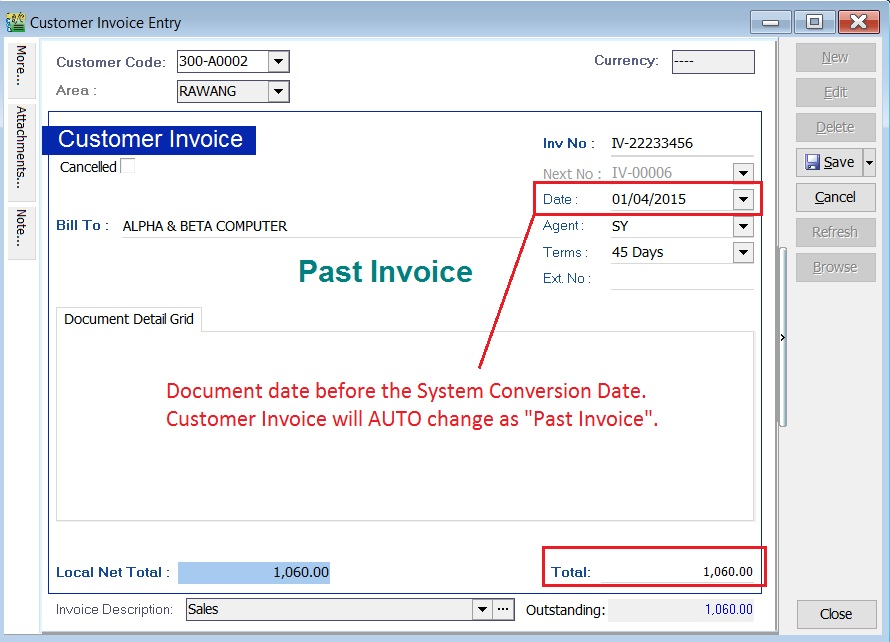  

**Screenshot 2: Past Payment:**

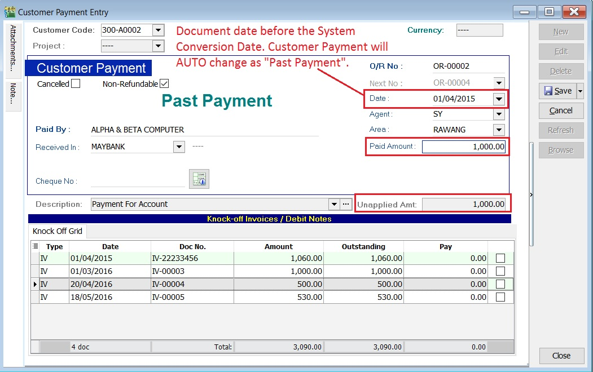  

7. Take note to the below table.

| Action                                            | Where to Enter?                                                                 |
|---------------------------------------------------|---------------------------------------------------------------------------------|
| To enter the Customer Past Tax Invoice            | a. Go to Customer / Customer Invoice...                                         |
|                                                   | b. Refer the above step 1.                                                      |
| To enter the Supplier Past Tax Invoice            | a. Go to Supplier / Supplier Invoice...                                         |
|                                                   | b. Refer the above step 1.                                                      |
| To enter the Customer Past Non-Refundable Deposit (for SR, ZRL, ZRE) | a. Customer / Customer Payment...                                               |
|                                                   | b. Refer the above step 1.                                                      |
|                                                   | c. Tick the Non-Refundable checkbox (for SR only).                              |
|                                                   | d. Untick the Non-Refundable checkbox (for ZRL & ZRE).                          |

#### Enter the GST Taxable for Past Documents (AR & AP)

1. Open the past tax invoice document.
2. **Press CTRL + ALT + G**.... You able to assign the tax code (SR / ZRL / ZRE / TX / IM...etc), the taxable amount (eg. Rm 1,000.00) and the tax amount (eg. Rm 60.00) for past document.

:::note Note:
Document must be saved before **press CTRL + ALT + G**.
:::

3. Save it.
4. See screenshot below.

**Screenshot 3: GST Taxable:**

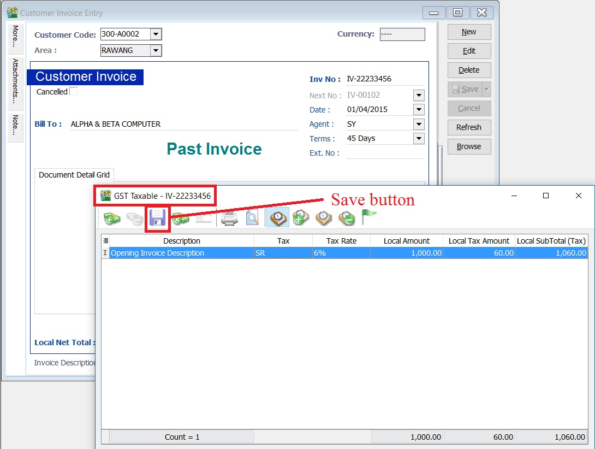  

5. Take note to the below table.

| Action                                             | Where to Enter?                                                                 |
|----------------------------------------------------|---------------------------------------------------------------------------------|
| To enter GST Taxable for the Customer Past Tax Invoice | a. Go to Customer / Customer Invoice...                                         |
|                                                    | b. Refer the above step 1.                                                      |
|                                                    | c. Tax code commonly apply to this matter is SR / ZRL / ZRE / SL_AJP-BD (for bad debt relief claimed as input tax in old system). |
| To enter GST Taxable for the Supplier Past Tax Invoice | a. Go to Supplier / Supplier Invoice...                                         |
|                                                    | b. Refer the above step 1.                                                      |
|                                                    | c. Tax code commonly apply to this matter is TX / IM / PH_AJS-BD (for bad debt relief paid as output tax in old system). |
| To enter GST Taxable for the Customer Past Non-Refundable Deposit | a. Go to Customer / Customer Payment...                                         |
|                                                    | b. Refer the above step 1.                                                      |
|                                                    | c. Tax code commonly apply to this matter is SR.                                |

#### Past Documents GST Taxable Listing

1. Select the date range to apply.

>  *date from* (GST effective date) and *date to* (before the system conversion date).

2. See screenshot below.

Screenshot 4: GST Taxable Listing:

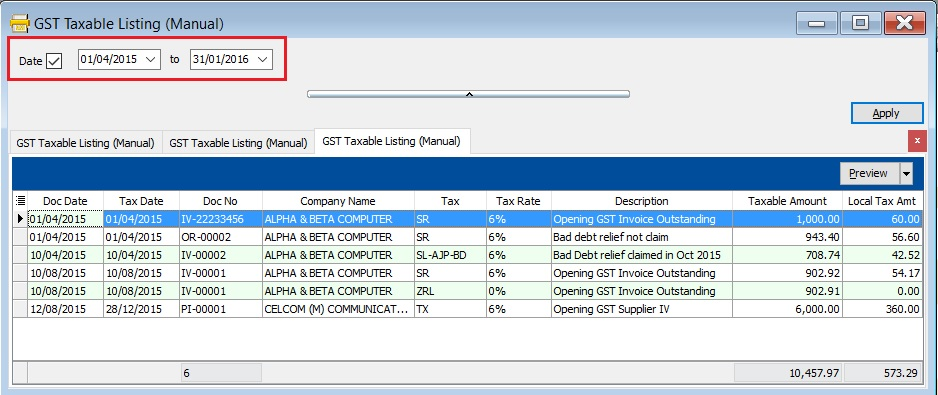  

### GST Returns

1. Select the date range. See screenshot below.

    1. Monthly (eg. 01/02/2016 - 29/02/2016)  
  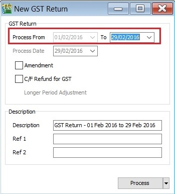  

    2. Quarterly (eg. 01/02/2016 - 30/04/2016)  
  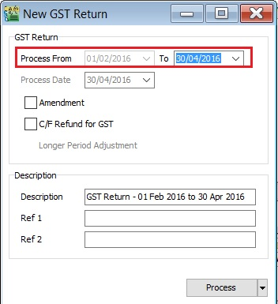 

2. Click to **Process**.

3. **Past GST transactions** will generated automatically after click **Process**. See below screenshot.

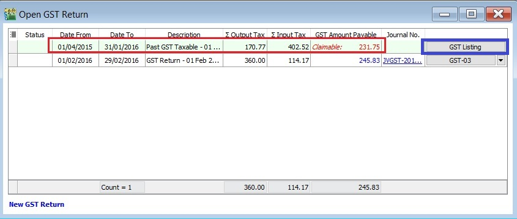 

:::note Tips:
To check the past GST listing, click on **GST Listing** button.
:::

4. Current GST Returns will be processed at the same times. See below screenshot.

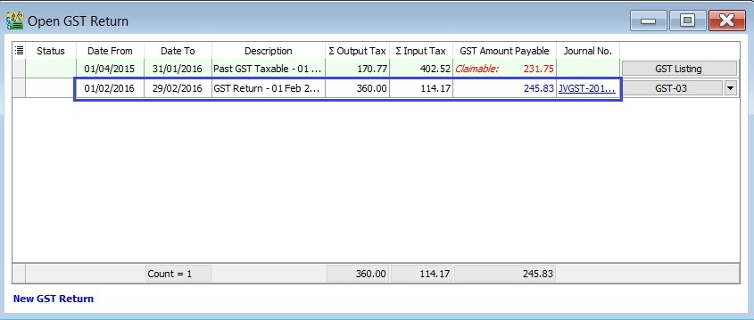 

### Special Cases 

#### Case 1: Claim bad debt relief based on the outstanding in SQL Accounting

1. Old System  
    1. invoice  
    Invoice No: **IV-00001**  
    Invoice Date: **10 Aug 2015**  
    Invoice Doc Amount: **2,060.00**  
    Invoice Details:  

    | Tax  | Local Amount | Local Tax Amount | SubTotal |
    |------|--------------|------------------|----------|
    | SR   | 1,000.00     | 60.00            | 1,060.00 |
    | ZRL  | 1,000.00     | 0.00             | 1,000.00 |
    | **Total** |              |                  | 2,060.00 |

    2. Payment  
     OR Date: **20 Aug 2015**    
     Knock-Off Amount: **200.00**    

    3. Invoice Outstanding: **1,860.00**  

2. SQL Account  
   1. Past Invoice:
    Past Invoice No: **IV-00001**
    Past Invoice Date: **10 Aug 2015**
    Past Invoice Total: **1,860.00**

   :::note NOTE:
   User should key-in the total outstanding in the Past Invoice, eg. 2,060.00 - 200.00 = **1,860.00**.
   :::

   See example of **past invoice** in below screenshot.

   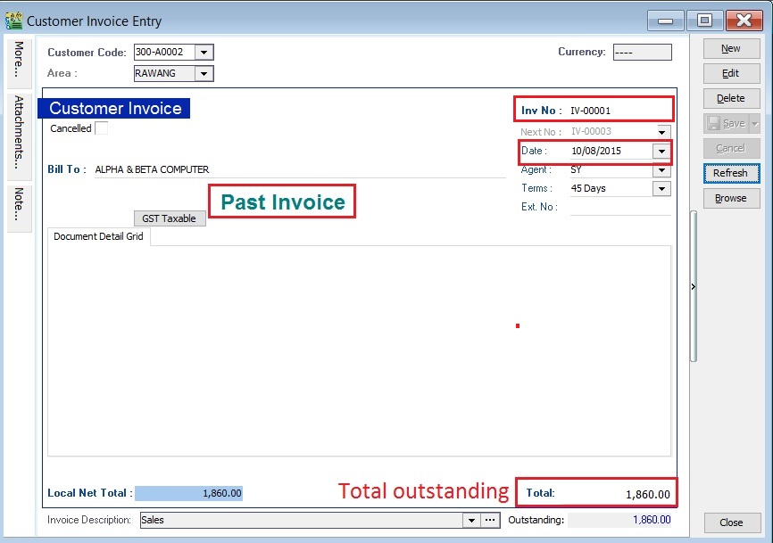  

   2. Past GST Taxable Detail:

| Tax | Taxable Amount | Local Tax Amount | SubTotal |
|-----|----------------|------------------|----------|
| SR  | 902.92         | 54.17            | 957.09   |

OR

| Tax              | Taxable Amount | Local Tax Amount | SubTotal |
|------------------|----------------|------------------|----------|
| SR               | 902.92         | 54.17            | 957.09   |
| ZRL              | 902.91         | 0.00             | 902.91   |
|  |    |               **Total Outstanding**   |   **1,860.00**        |

See example of **past GST taxable** in below screenshot.

 

#### Case 2: Bad debt relief claimed and partial recover in Old System; partial or fully recover in SQL Account

1. Old System
    1. Invoice:  

    Invoice No: **IV-00002**
    Invoice Date: **10 April 2015**
    Invoice Doc Amount: **2,060.00**
    Invoice Details:

    | Tax   | Local Amount | Local Tax Amount | SubTotal |
    |-------|--------------|------------------|----------|
    | SR    | 1,000.00     | 60.00            | 1,060.00 |
    | ZRL   | 1,000.00     | 0.00             | 1,000.00 |
    |                  |          |**Total** | **2,060.00** |

    2. Payment #1:

    OR Date: **20 April 2015**
    Knock-Off Amount: **200.00**
    Bad Debt Relief detail from outstanding invoice:

    | Tax    | Local Amount | Local Tax Amount |
    |--------|--------------|------------------|
    | AJP-BD | 902.92       | 54.17            |

    3. Payment #2:

    OR Date: **01 Nov 2015**
    Knock-Off Amount: **400.00**
    Bad Debt Recover details:

    | Tax    | Local Amount | Local Tax Amount |
    |--------|--------------|------------------|
    | AJS-BD | 194.18       | 11.65            |

    4. Invoice Outstanding: 1,460.00

2. SQL Account  
    1. Past Invoice:

    Past Invoice No: **IV-00002**
    Past Invoice Date: **10 April 2015**
    Past Invoice Total: **1,460.00**

    :::note Note:
    User should key-in the total outstanding in the Past Invoice, eg. 2,060.00 - 200.00 - 400.00= **1,460.00.**
    :::

    See example of **past invoice** in below screenshot.

    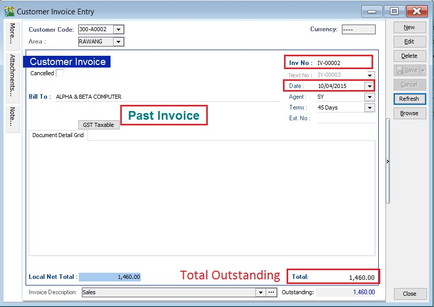 

    2. Past GST Taxable Detail:

    | Tax       | Taxable Amount | Local Tax Amount | SubTotal |
    |-----------|----------------|------------------|----------|
    | SL-AJP-BD | 708.74         | 42.52            | 751.26   |

:::note NOTE: 
User no need to key-in the payment #1 and payment #2 in SQL Account.  
Outstanding Taxable amount = 902.92 (Payment #1) - 194.18 (Payment #2) = **708.74**  
Bad debt relief not recover = 54.17 (Payment #1) - 11.65 (Payment #2) = **42.52**  
**Any current payment knock-off to the above invoice will automatically treat as bad debt recover in next taxable period**.  
:::

See example of **past GST taxable** in below screenshot.

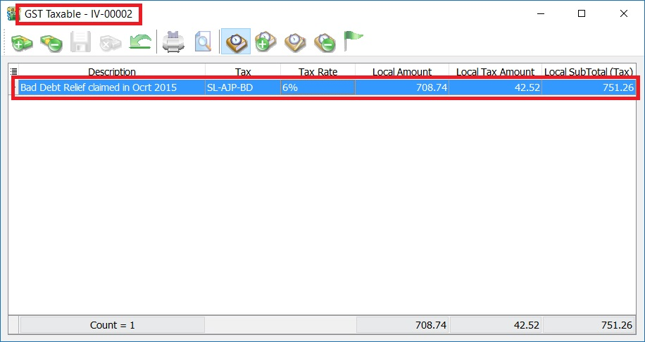 

## GST - Payment to RMCD

1. Net GST Payable is the total GST amount to be paid to RMCD.
2. Net GST Claimable is the total GST amount to be claimed or refund from RMCD.

### Payment to RMCD

1. Click on the **New** follow by select select **Payment Voucher**.
2. Enter the **ROYAL MALAYSIA CUSTOMS DIRAJA' into** Pay To field.
3. At the detail, select GL Code: **GST-KASTAM**.
4. Enter the description to describe the GST Payable for the period, eg. **GST Payable - Jan 2016**.
5. Based on the GST Returns, enter the GST amount payable **(Rm836.04)** into the **Amount** column.

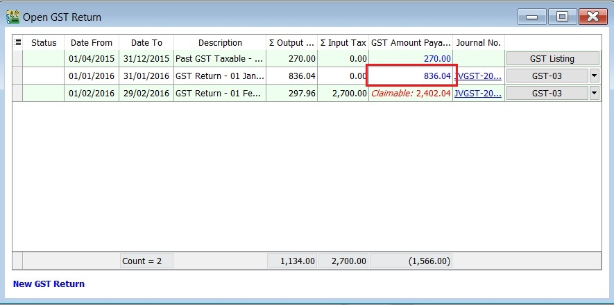 

6. Save it. See the screenshot below.

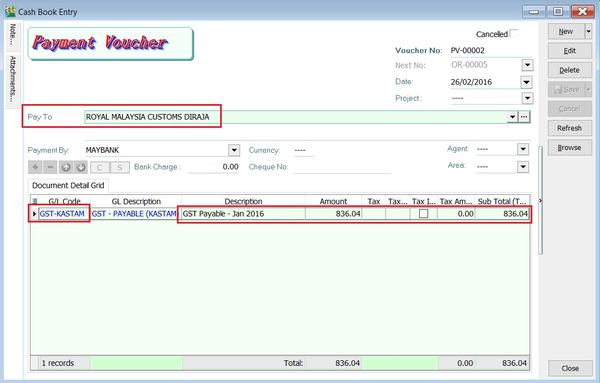 

### Refund From RMCD

1. Click on the **New** follow by select **Official Receipt**.
2. Enter the **ROYAL MALAYSIA CUSTOMS DIRAJA' into** Received From field.
3. At the detail, select GL Code: **GST-KASTAM**.
4. Enter the description to describe the GST Claimable for the period, eg. **GST Claimable - Feb 2016**.
5. Based on the GST Returns, enter the GST amount claimable **(Rm2,402.04)** into the **Amount** column.

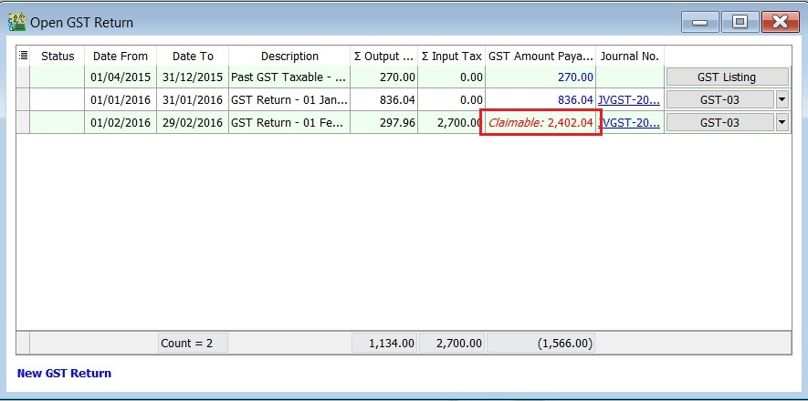 

6. Save it. See the screenshot below.

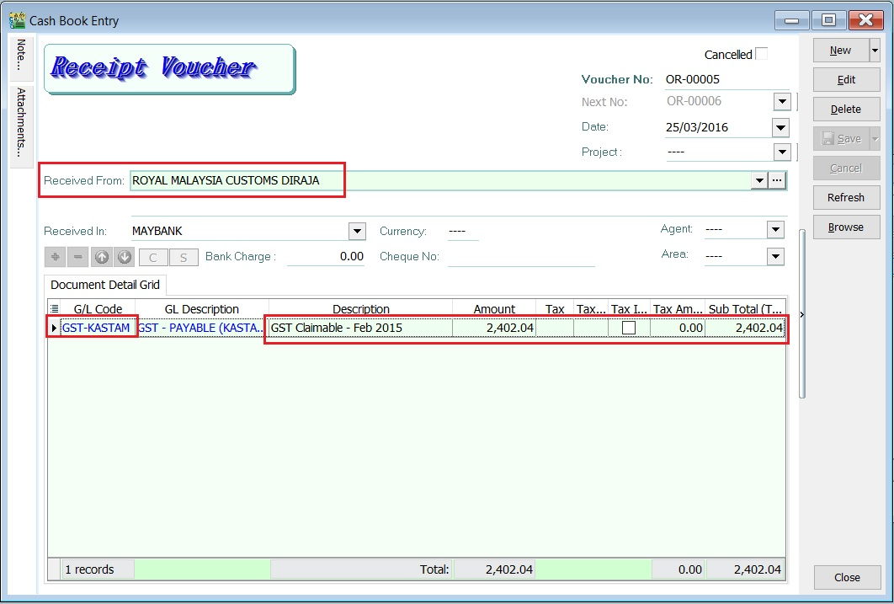 

### GST - Kastam Account Inquiry

1. Select the date range.
2. Select the GL Account code : **GST-KASTAM**.
3. Click **Apply**.
4. RMCD outstanding transactions will be display as below.

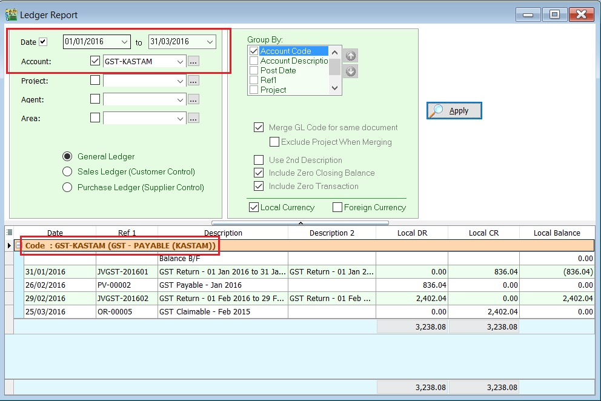 

## GST - GST-03 Amendment

For those company who might asked and self report to RMCD for the GST-03 amendment. It could be because of applying wrong tax code or others reasons.
Therefore, this guide will explain the features to perform amendment on the particular GST-03 and re-submit via TAP website.

#### NOTIFICATION ON GST 03 RETURN AMENDMENT

In accordance with **Regulation 69 of the GST Regulation 2014**, with **effect from 23 August 2016**, rules on return amendments are follows:  
  1. There is **no limit** on return amendments until due date of submission of return.
  2. Amendment are allowed once within 30 days **(for monthly taxable period)** or 90 days **(for quarterly taxable period)** after last day of submission of return. Subsequent amendment are subject to approval by GST Officer.
  3. Amendment after the period stated in PARA 2 above are subject to approval by GST Officer.
  4. Amendment can be made through TAP but are subject to approval by GST Officer.
  5. Return amendments which are not approved by GST Officer is considered invalid and previous return made before the amendment will be accepted.

### GST - 03 Amendment 

1. Highlight and right click on the GST-03 that you are required to resubmit as **amendment**.

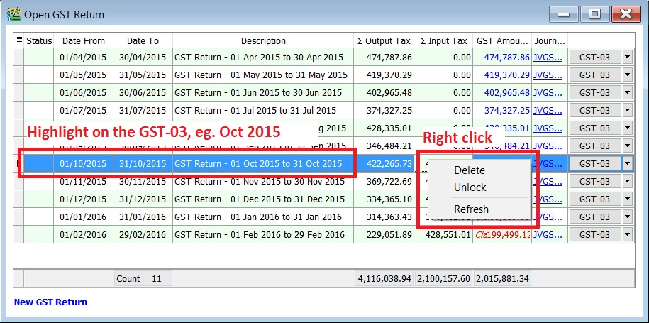 

2. Select **Unlock**.

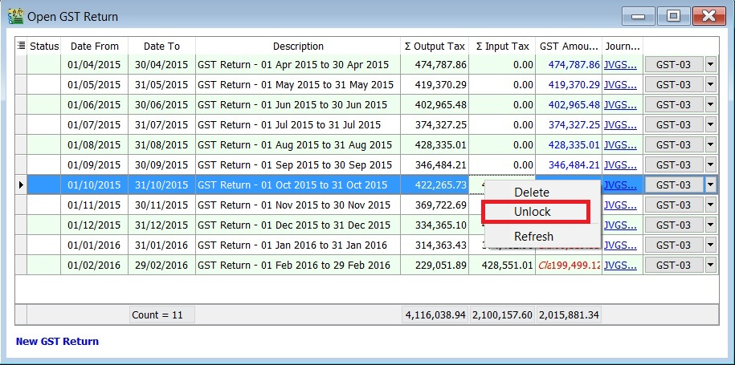 

3. Click on **No** to unlock this GST Return.

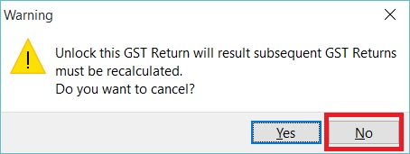 

:::note Important:
Read the message before take further actions.
:::

4. Enter the ADMIN password.

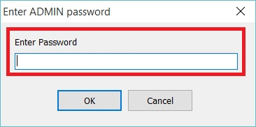 

:::note NOTE:
ADMIN password only
:::

5. Status will added **Unlock** icon. It means users are allow to amend the documents for the month unlock, eg. the documents are able to amend in Oct 2015 only.

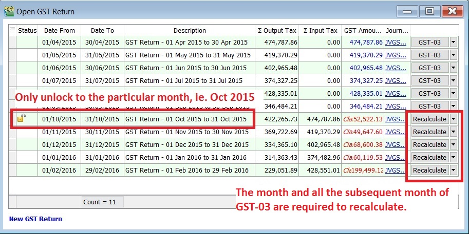 

:::note NOTE:
1. The month and all the subsequent month of GST-03 will converted to "Recalculate" action. It is depends on the amendment which might trigger the bad debt relief result changed.  
2. All the subsequent month of GST-03 are not allow to amend the documents (eg. invoice, credit note, supplied invoice, etc), unless you have **Unlock** it.  
:::

6. For example, to correct the tax code from ZRL to SR for the invoice amount Rm2,500.00.

   1. Edit the invoice (eg. IV-00014 and date: 02 Oct 2015)

   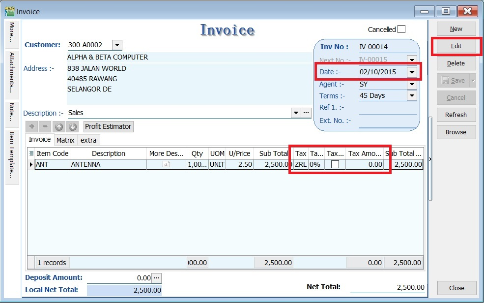 

   ::: NOTE:
   **Unlock** GST-03 is allow you to edit the documents only. 
   :::

   2. Change the tax code from **ZRL** to **SR**.
   3. It will will resulting the **output tax increased by Rm150.00** (Rm2,500.00 X 6%).

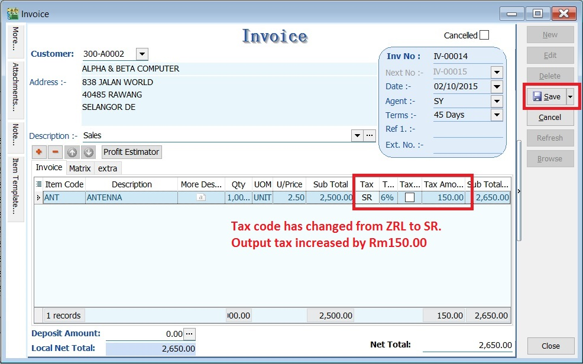 

7. Run **Recalculate** for the GST-03 (eg. Oct 2015)  
8. System will prompt **Recalculat3 successfully**.

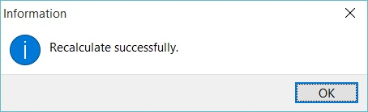

9. Press ok to proceed.  
10. A draft copy of GST-03 for Oct 2015 will create automatically. A previous GST-03 before perform any amendment to the taxable period will converted as **DRAFT** status.

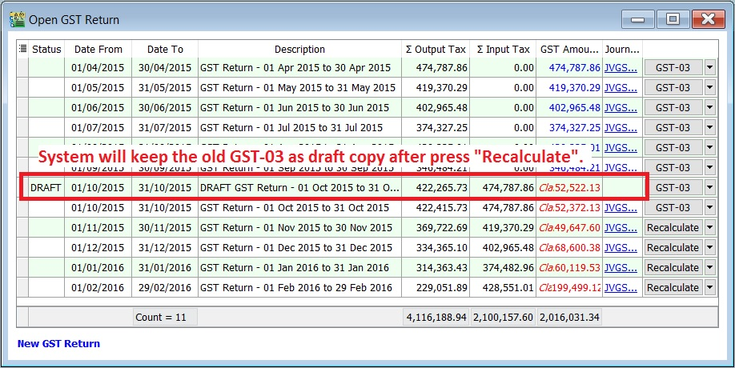

11. You can see the comparison in between **the draft (from Recalculate)** and **the Final GST-03** for the amendment taxable period.

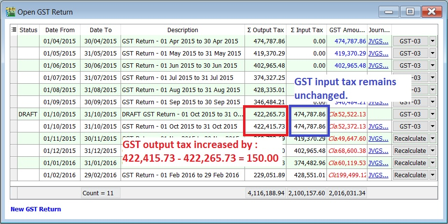

| Status                | Taxable Period     | Total Output Tax | Total Input Tax |
|------------------------|--------------------|------------------|-----------------|
|                   | 01 Oct - 31 Oct 2015 | 422,415.73       | 474,787.86      |
| Draft                  | 01 Oct - 31 Oct 2015 | 422,265.73       | 474,787.86      |
|   |  Increase/Decrease (-)                  | 150.00            | 0.00            |

### How to know the GST - 03 has performed amendment

1. You can find a **cross marked (X)** on the amendment column in the GST-03. See the screenshot below.

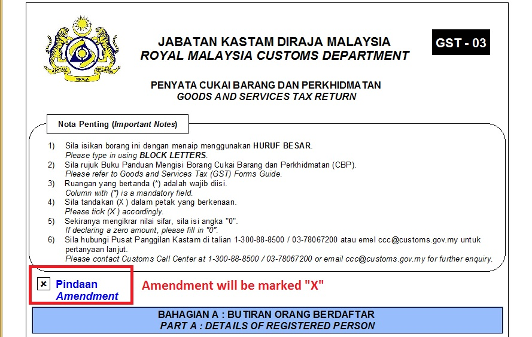

2. At the GST Returns, insert a grid column **Amendment**. Usually, you will found **the ticked on the amendment column** for both DRAFT and final GST-03.

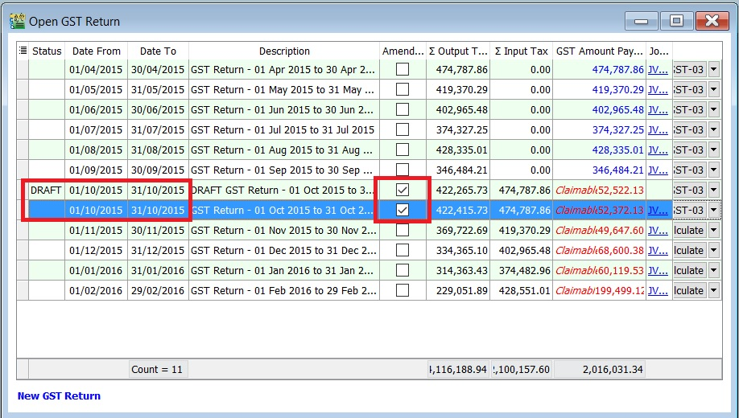

### How to unlock the subequent GST - 03 for amendment

1. Highlight on the subsequent GST-03, eg. for subsequent taxable period is 01 Nov - 30 Nov 2015.  
2. Right and **unlock** it.

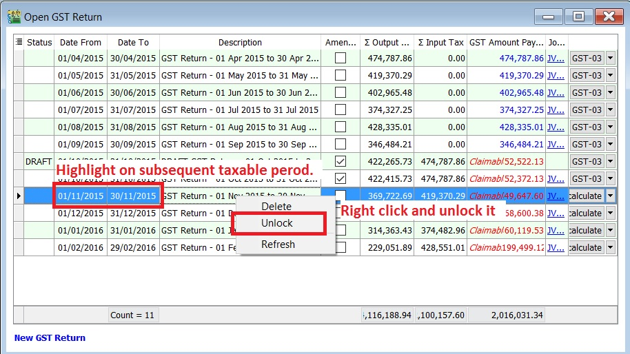

## How to Avoid Costly GST Errors

This guide will help you to easily identify the common GST errors in GST Returns. To minimize GST amendment and incorrect GST Returns to RMCD.
You may wish to take note the follow errors commonly made by businesses:
1. Standard Rated Supply (5a) and Output Tax (5b)
2. Stanadard Rate and Flat Rate Acquisitions (6a), and Input Tax (6b)
3. Local Zero-Rated Supplies
4. Export Supplies
5. Exempt Supplies
6. Supplies Granted GST Relief
7. Goods Imported Under Approved Trader Scheme and GST Suspended
8. Capital Goods Acquired
9. Bad Debt Relief
10. Bad Debt Recovered
11. Output tax value breakdown into Major Industries Code (MSIC Code)
12. Other important info required in GAF
13. GL Ledger vs GST-03
14. Foreign currency exchange rate

### Standard Rate Supply (5a) and Output Tax (5b)

**Mapping of GST Tax Code:**

| GST-03 | Description                                                              | Tax Code   |
|--------|--------------------------------------------------------------------------|------------|
| 5a     | Total Value of Standard Rated Supply                                     | **SR, DS**     |
| 5b     | Total Output Tax (Inclusive of Tax Value on Bad Debt Recovered & others adjustments) | **SR, DS, AJS** |

1. Sale or disposal of business assets
2. Goods given free as gift.
3. Inter-company transactions
4. Margin Scheme

### Standard Rate and Flat Rate Acquisitions (6a), and Input Tax (6b)

**Mapping of GST Tax Code:**

| GST-03 | Description                                                             | Tax Code                                                                                     |
|--------|-------------------------------------------------------------------------|----------------------------------------------------------------------------------------------|
| 6a     | Standard Rate and Flat Rate Acquisitions                                | **TX, TX-CG, TX-ES** (DMR is fulfilled only), **TX-IES** (Total/Full amount), **TX-RE, IM**              |
| 6b     | Total Input Tax (Inclusive of Tax Value on Bad Debt Relief & other Adjustments) | **TX, TX-CG, TX-ES** (DMR is fulfilled only), **TX-IES** (GST Claimable only based on IRR), **TX-RE, IM, AJP** |

Not all input tax claims are allowable. You can claim input tax on your purchases only if the below conditions are fulfilled.

1. Tax invoice / Simplified Tax Invoice / Custom K1 / Custom K9
   1. The buyer can use **simplified tax invoice** if the **total amount GST payable is RM30 or less**.
   2. if the **total amount of GST payable is more than RM30**, the buyer must request for a **tax invoice** with the name and address of the buyer.
   3. Tax invoice issued by approved person for Flat Rate Scheme.
   4. **K1** form for imported goods
   5. **K1** and **K9** for goods removed from bonded warehouse

2. Supplies made outside Malaysia which would be taxable supplies if **made in Malaysia**.
3. To be eligible for input tax claim relating to goods that are exported, a registered person (exporter) must ensure that:-
   1. prescribed customs form for export (K2 / K8) must have an endorsement on Remarks column in **Sistem Maklumat Kastam (SMK)** – “A claim for input tax under the GST Act 2014 will be made”; and
   2. Customs Official Receipt.

4. **Disregarded supplies** (supplies within group, supplies made in warehouse, supplies between venture operator and venturers and supplies between toll manufacturer and overseas principal).  
5. Directly attributable to taxable supplies (ie. standard rated supplies and zero rated supplies).  
6. Must not be disallowed expenses (or known as **Blocked Input Tax**).  
   1. Passenger motor cars (**not more than 9 passengers** including driver and unladen weight does not exceed 3,000 kg) including hiring of car
   2. Repair and maintenance for motor cars
   3. Family benefits
   4. Club subscription fee
   5. Medical and personal accident insurance
   6. Medical expenses
   7. Entertainment expenses for potential customer or others than employees.

7. Must be taxable purchases (ie. purchases made from GST registered suppliers)

### Local Zero - Rated Supplies

**Mapping of GST Tax Code:**

| GST-03 | Description                         | Tax Code   |
|--------|-------------------------------------|------------|
| 10     | Total Value of Local Zero-Rated Supplies | **ZRL, ZDA** |

This refer to the following types according to **GST (Zero Rate Supplies) Order 2014**:-

1. Local supply of goods and services (**ZRL**):

   1. Zero-rated supply of goods of any of the descriptions as in Appendix (Zerorated Supply) Order 2014 based on tariff code in such as milled-rice, fresh fruit, and live animals (cattle, buffalo, goat, sheep and swine),
   2. Medicaments and medical gases in the National Essential Medicines List issued by the Ministry of Health and approved by the Minister and put up in measured doses or in forms of packaging for retail sale,
   3. The supply of treated water by a person who is licensed under the Water Services Industry Act 2006 [Act 655] to domestic consumers irrespective of minimum or non-usage,
   4. The supply of raw materials and components made to a person who belongs in a country other than Malaysia for the treatment and processing of goods by any taxable person under the Approved Toll Manufacturer Scheme, and etc.

2. Supply of goods from Malaysia to Designated Area, ie. Pulau Langkawi, Labuan, & Pulau Tioman (**ZDA**)

### Export Supplies

**Mapping of GST Tax Code:**

| GST-03 | Description                  | Tax Code |
|--------|------------------------------|----------|
| 11     | Total Value of Export Supplies | **ZRE**      |

This refer to the Supply of goods or services **from Malaysia to Oversea** according to **GST (Zero Rate Supplies) Order 2014**.

1. Movement of goods is supported with **Customs K2** form which must stated the following:-
  a. Supplier's name and address as the consignor.
  b. Recipient's name and address in overseas recipient as the consignee.
  c. Supply of services must attached with supporting documents such as invoice for an international services. Examples includes sales of air-tickets and international freight charges.

**How to check the transactions correctly entered?**

At the invoice entry, please ensure the following are entered correctly:-

1. **Customer name** and **address** must be a **foreigner company**.
2. **Country** to define the destination of goods deliver.
3. **Permit No** to record the **Custom K2** no for supporting document reference.
4. Tax code must be **ZRE**.

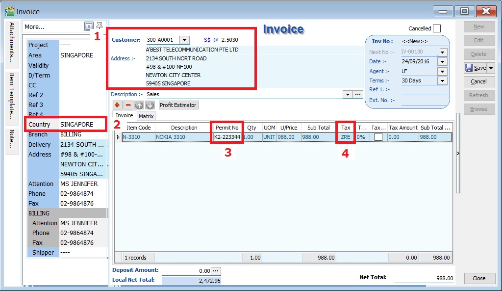

### Exempted Supplies

**Mapping of GST Tax Code:**

| GST-03 | Description                 | Tax Code  |
|--------|-----------------------------|-----------|
| 12     | Total Value of Exempt Supplies | **ES, IES** |

This refer to the following types according to **GST (Exempt Supplies) Order 2014:-**

1. **Services (ES):-**
   1. Private education
   2. Private health services
   3. Childcare services
   4. Domestic transportation of passengers for mass Public Transports (eg. by rail, ship, boat, ferry, express bus, stage bus, school bus, feeder bus, workers bus and taxi)
   5. Toll highway

2. **Financial Services (IES):-**
   1. Interest income from deposits placed with a financial institution in Malaysia
   2. Interest received from loans provided to employees (factoring receivables)

3. **Goods (ES):-**
   1. Residential properties
   2. Land for agricultural use
   3. Land for general user (ie. burial ground, playground or religious building)

#### How to check the transactions correctly entered?

**A. GST Listing**

1. After GST Return processed, go to **Print GST Listing....**

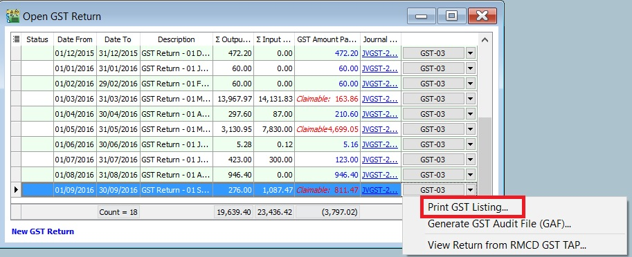

2. Preview and select the report name **GST Detail 2**.
3. To ensure the **document detail descriptions** are clearly stated and map to the correct tax code.

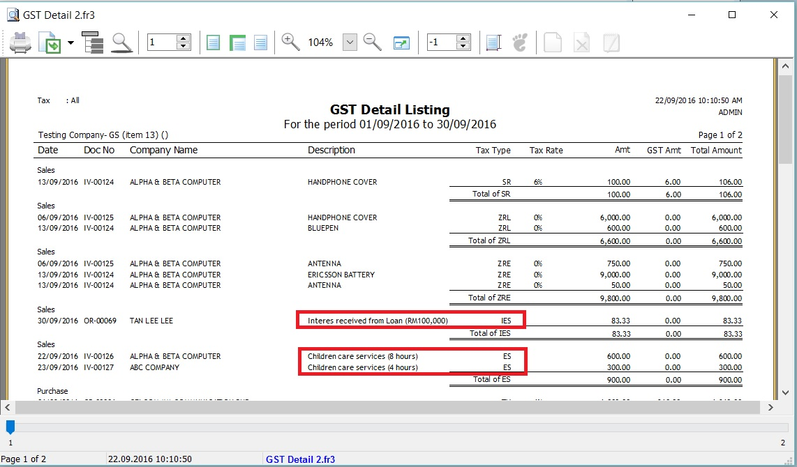

**B. GST-03**

1. To quick do amendment before submit the GST-03 to RMCD.
2. Double click on the item 12 in GST-03.

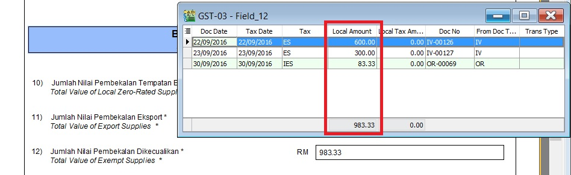

3. Drill down the documents to open and correct it accordingly.
4. Lastly, you have to **Recalculate** the amended GST Return.

### Supplies Grant GST Relief

**Mapping of GST Tax Code:**

| GST-03 | Description                              | Tax Code |
|--------|------------------------------------------|----------|
| 13     | Total Value of Supplies Granted GST Relief | **RS**       |

### Goods Imported Under Approved Trader Scheme and GST Susoended

**Mapping of GST Tax Code:**

| GST-03 | Description                                             | Tax Code     |
|--------|---------------------------------------------------------|--------------|
| 14     | Total Value of Goods Imported Under Approved Trader Scheme | **IS**           |
| 15     | Total Value of GST Suspended under item 14             | **IS** x Tax Rate |

### Capital Goods Acquired

**Mapping of GST Tax Code:**

| GST-03 | Description                        | Tax Code                                           |
|--------|------------------------------------|--------------------------------------------------|
| 16     | Total Value of Capital Goods Acquired | **TX-CG, TX, IM** (Transaction GL Account related to **Fixed Asset**) |

### Bad Debt Relief

**Mapping of GST Tax Code:**

| GST-03 | Description                                | Tax Code      |
|--------|--------------------------------------------|---------------|
| 17     | Total Value of Bad Debt Relief Inclusive Tax | **AJP (AR only)** |

### Bad Debt Recovered

**Mapping of GST Tax Code:**

| GST-03 | Description                                 | Tax Code      |
|--------|---------------------------------------------|---------------|
| 18     | Total Value of Bad Debt Recovered Inclusive Tax | **AJS (AR only)** |

### Output tax value breakdown into Major Indusctries Code (MSIC Code) 

1. This part usually require you to breakdown the total output tax reported in 5b according to your **main business**.
2. You have to map to [MSIC code](https://sites.google.com/site/sqlestream/sql-financial-accounting/9-good-and-service-tax-gst---malaysia/9-23-major-industries-code-msic).  

**Where to set the MSIC Code?**

1. Select and edit your main business supplies GL Account, eg. my main business is selling handphones.
2. Select an appropriate **Industries Code**.
3. You can change the search pattern to **-A-**. See screenshot below. So you can type-in the keywords, eg. Phone.

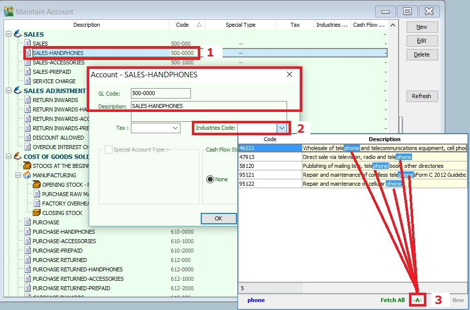

### Other important info required in GAF

The GST Audit file is a way for taxpayers to submit information relevant to auditors in response to an audit request on information for auditing purposes. The information provided includes company identifications, names, supply & purchases, and general ledger transactions. There is also a footer record to ensure file integrity.  

Record types are:-

| Record Type | Description | Where it update??? |
|-------------|-------------|-------------------|
| C           | Company     | Company Profile   |
| P           | Purchase    | Supplier Invoice (PI), Supplier Debit Note (SD), Supplier Credit Note (SC), Cash Book (PV), and Journal (JE) |
| S           | Supply      | Customer Invoice (IV), Customer Debit Note (DN), Customer Credit Note (CN), Cash Book (OR), Gift/Deemed Supply (GI), and Journal (JE) |
| L           | Ledger      | From the GL Ledger reports |
| F           | Footer      | GAF file integrity check |

### GL Ledger VS GST - 03

1. **GST-Ledger-Vs-GST-03** is a very useful report to identify the unrealized human errors immediately. Possible errors may be due to documents had selected:-

   1. Wrong tax code or category
   2. Wrong account code
   3. Use Tax Date which is different from Document Date
   4. 5 Cents rounding had selected Tax Code.

2. It comprises of 2 reports:-

| Report Name              | GL Acc                  | Explanation                                                             |
|--------------------------|------------------------|-------------------------------------------------------------------------|
| 1. GST-Ledger-Vs-GST-03_5b | GST-201 (GST - Payable) | To reconcile the GST Payable account between the GL Ledger and GST-03 |
| 2. GST-Ledger-Vs-GST-03_6b | GST-101 (GST - Claimable) | To reconcile the GST Claimable account between the GL Ledger and GST-03 |

3. For example,

Supplier invoice date (15 Sept 2016) received in Oct 2016 and GST-03 Sept 2016 has submitted. Input tax will be claim in Oct 2016 by set the tax date (31 Oct 2016). In GL Ledger, the input tax will be posted in Sept 2016. However, this input tax will be appear in GT-03 Oct 2016.
With this **GST-Ledger-Vs-GST-03** report, you can very easy identify out the reasons. See the screenshot below.

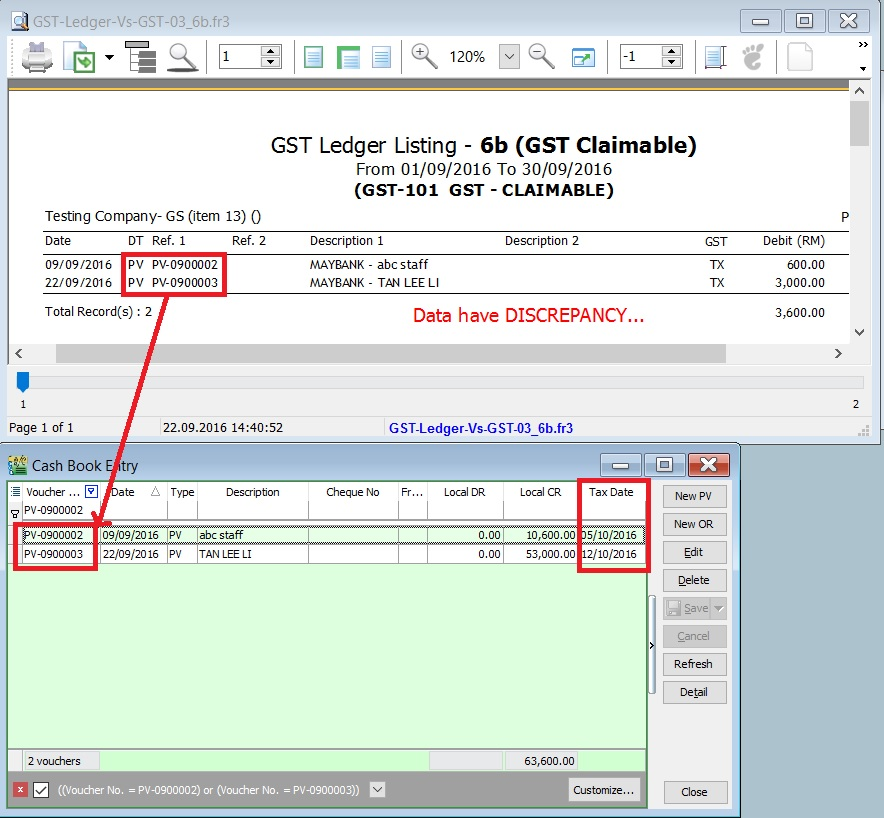

### Foreign Currency Exchange Rate

1. Always update the currency exchange rate at Tools | Maintain Currency.
2. Critical cost on output tax if bill in foreign currency to local customer:

| Currency | Status     | Exchange Rate | Amount   | Local Amount | Output Tax |
|----------|-----------|---------------|---------|--------------|------------|
| USD      | Outdated  | 3.8000        | 1,000.00 | 3,800.00     | 228.00     |
| USD      | Actual    | 4.3000        | 1,000.00 | 4,300.00     | 258.00     |
|  |           |               |         |    **Under declared**          | -30.00     |

## Adjustment to negative value in GST-03

1. Negative value in 5a5b and 6a6b.
2. TAP system not accept negative value.

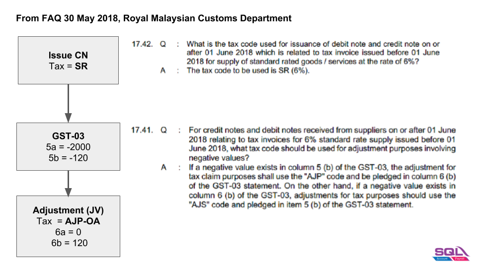

### Negative in 5a5b

1. **Output Tax (Negative)**

| GST-03 | Value  |
|--------|--------|
| 5a     | -2,000 |
| 5b     | -120   |

2. **Journal Adjustment:**

| GL Code  | Tax    | Tax Rate | Local DR | Local CR | Local DR(Tax) | Local CR(Tax) | GST-03       |
|----------|--------|----------|----------|----------|---------------|---------------|--------------|
| GST-103  | **AJP-OA** | 6%       | 2,000    |          | 2,120         |               | **6a = 0, 6b = 120** |
| GST-103  | **SR**     | 6%       |          | 2,000    |               | 2,120         | **5a = 0, 5b = 0**   |

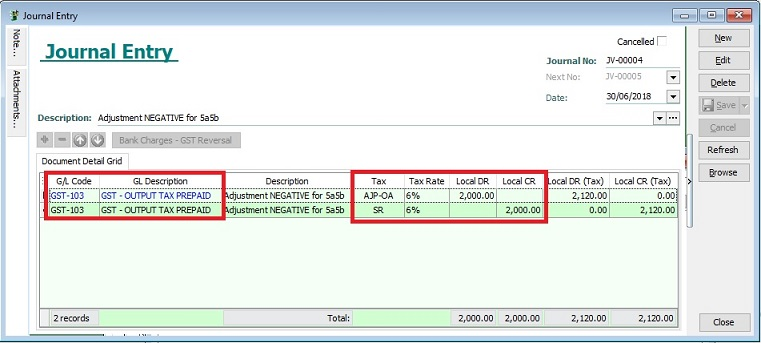

### Negative in 6a6b

1. **Input Tax (Negative)**

| Items | Value  |
|-------|--------|
| 6a    | -1,000 |
| 6b    | -60    |

2. **Journal Adjustment:**

| GL Code  | Tax    | Tax Rate | Local DR | Local CR | Local DR(Tax) | Local CR(Tax) | GST-03       |
|----------|--------|----------|----------|----------|---------------|---------------|--------------|
| GST-103  | **TX**     | **6%**       | 1,000    |          | 1,060         |               | **6a = 0, 6b = 0** |
| GST-103  | **AJS-OA** | **6%**       |          | 1,000    |               | 1,060         | **5a = 0, 5b = 60** |

## GST-Submission of Final GST Return

Pursuant to Section 6, **Goods and Service Tax (Repeal) Act 2018**, all GST Registrants are required to submit the GST-03 Return on the final taxable period **(ie. 31 Aug 2018)** and make full payment for the amount of tax payable in connection with the supply **for the last taxable period within 120 days (29 December 2018)** from 01 Sept 2018.

- Any input tax claimable from the purchase/supplier invoice received after 1 Sept 2018. It can be claim and must submit into the **Final GST Returns (31 Aug 2018)**.  
- Input tax claim will be subjected to verification and audit.  
- Refund will be made within 6 years.  

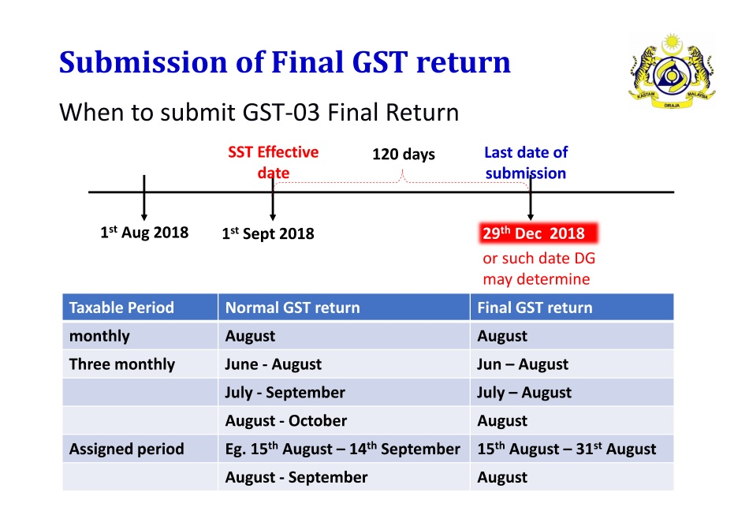

### How to enter the input tax 6% claimable from Purchase / Supplier invoice after 1st September 2018

For example, on **13 SEPT 2018**, my company has received a supplier tax invoice dated **07 MAY 2018** and amount inclusive GST is **RM10,600**.

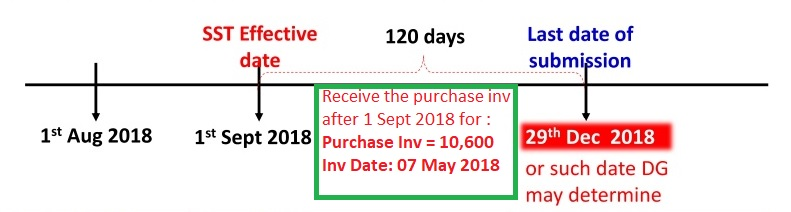

#### Enter at Purchase Invoice

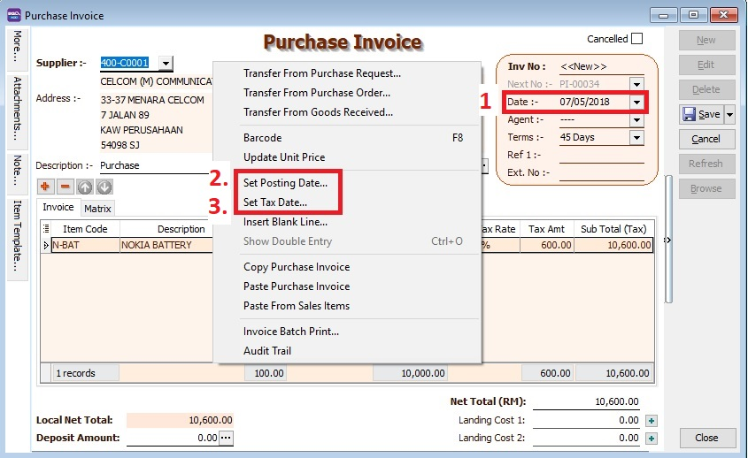

1. Set **Date**.... to record the original invoice date (eg. **07 MAY 2018**).
2. Set **Posting Date**... to post this transaction into GL reporting as at **13 SEP 2018**.

:::note Note: 
To enable to set Posting Date, the **Double Document Module** is required.
:::

3. Set **Tax Date**...to declare this GST input tax into **Final GST Returns (31 AUG 2018)**.

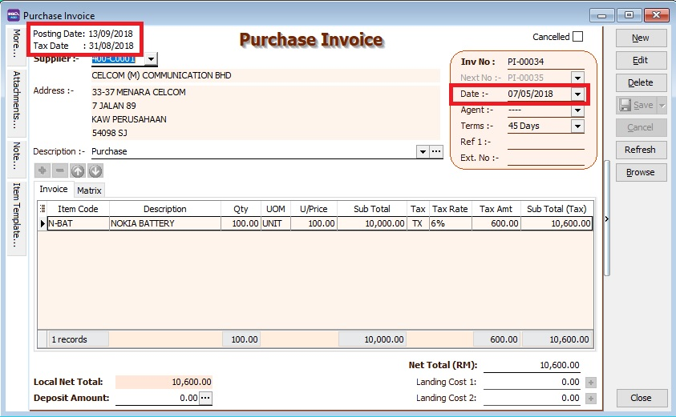

#### Enter at Supplier Invoice

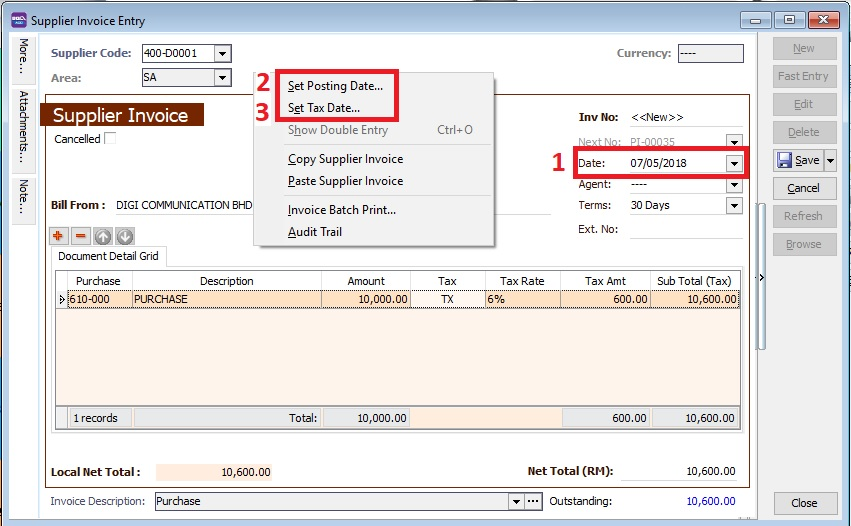

1. Set **Date**.... to record the original invoice date (eg. **07 MAY 2018**).
2. Set **Posting Date**... to post this transaction into GL reporting as **13 SEP 2018**.

:::note Note: 
To enable to set Posting Date, the **Double Document Module** is required.
:::

3. Set **Tax Date**...to declare this GST input tax into **Final GST Returns (31 AUG 2018)**.

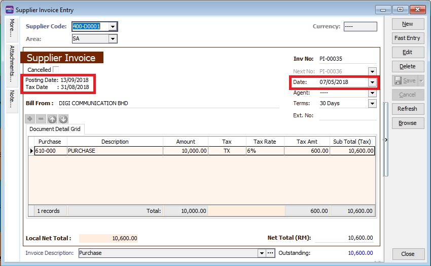

#### Enter at Cash Book (PV)

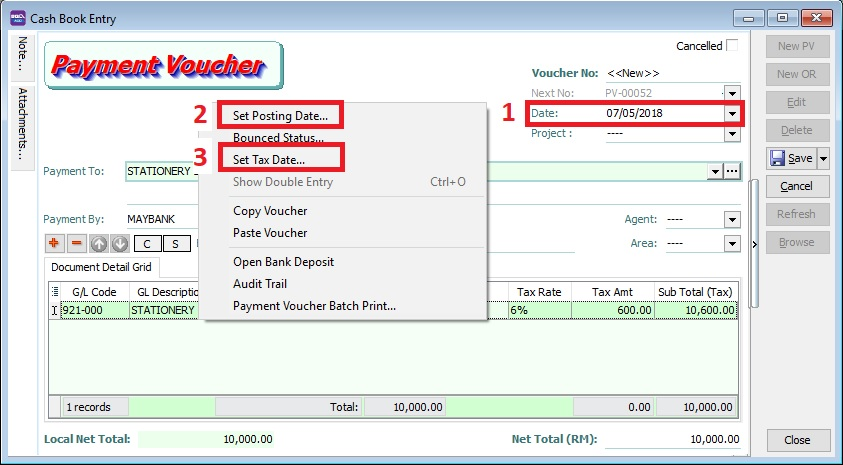

1. Set **Date**.... to record the original invoice date (eg. **07 MAY 2018**).
2. Set **Posting Date**... to post this transaction into GL reporting as at **13 SEP 2018**.
3. Set **Tax Date**...to declare this GST input tax into **Final GST Returns (31 AUG 2018)**.

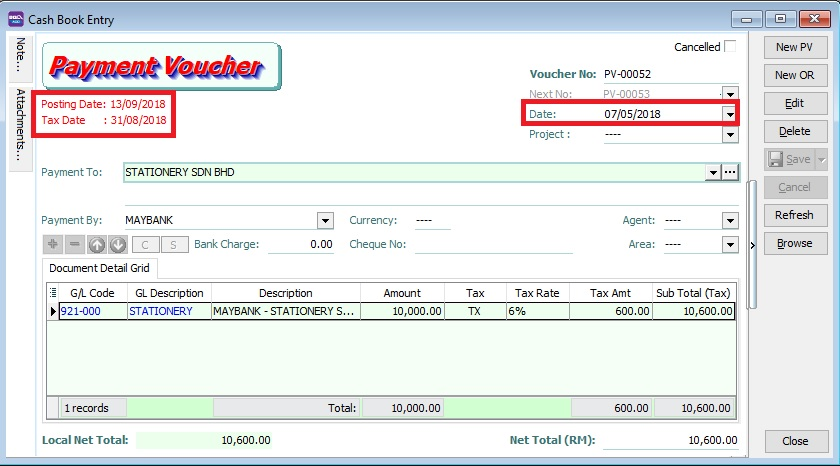

### Final GST Returns

Process GST Returns up to **31 AUG 2018**.

| Items | Value   |
|-------|---------|
| 6a    | 10,000  |
| 6b    | 600     |

:::note NOTE: 
* Final GST Returns until **31 AUG 2018**.
* Last date of submission for the **Final GST Returns is 29 DEC 2018**
:::

## Transitional (from GST to SST)

### Bad Debt Relief / Recovered

1. GST registered person is eligble to claim the bad debt relief even if it spans on or after 1 September 2018.  
2. Bad Debt Relief is allowed to be claimed within 120 days from the SST effective date (eg. 1 September 2018).  
3. Bad Debt Recovery made on or after 1 September 2018 must to be paid as output tax to RMCD within 120 days from the SST effective date by amending the Final GST Return.

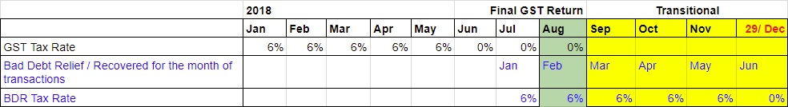

#### Final GST Return Processor

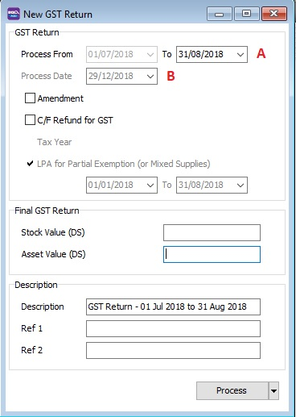

1. System will AUTO define the last taxable period **(A)**, eg...

| Process From | Process To |
|--------------|------------|
| 01/07/2018   | 31/08/2018 |

2. Set the Process Date **(B)** as the date submit the Final GST return before 29 December 2018 (within 120 days from the SST effective date).  

   1. For example,

   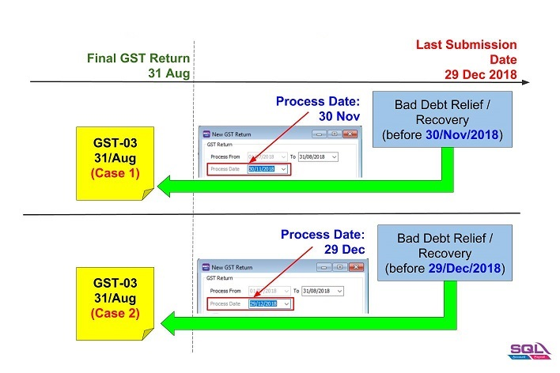

   2. Double entry for **Cases 1**.

   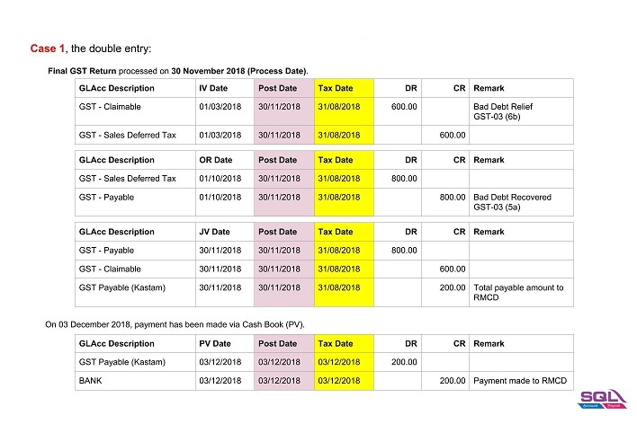

   3. Double entry for **Cases 2**.

   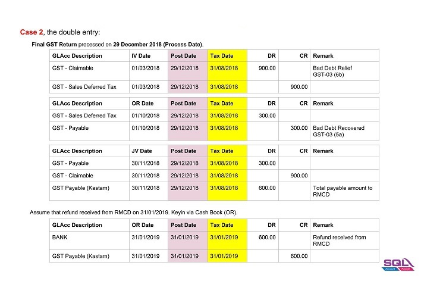

## GST Sales/Purchase Deferred Tax Journal Adjustment

1. Double entry adjustment for the balance of GST Sales / Purchase Deferred Tax (Bad Debt Relief) AFTER 29 December 2018.
2. Add the adjustment amount into Final GST Return (amendment).

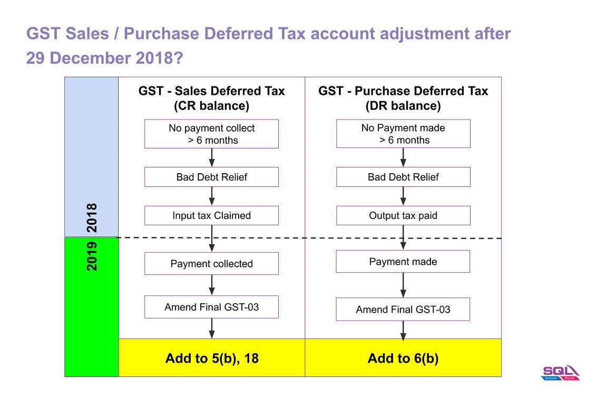

### How to check the Sales / Purchase Bad Debt Recovered Amount after Final GST Returns

1. Select a date **AFTER** the Final GST Return Date, eg. 28/02/2019.

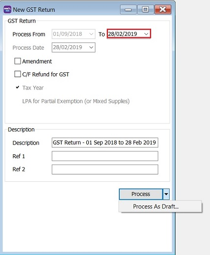

2. Choose **Process As Draft**.

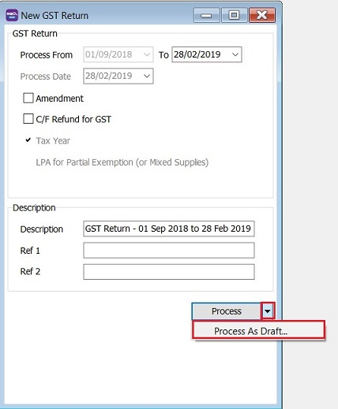

3. Click on **GST Return Draft** and **print GST Listing**.
4. Filter the **Tax Date** (ie. greater than or equal to 30 December 2018).

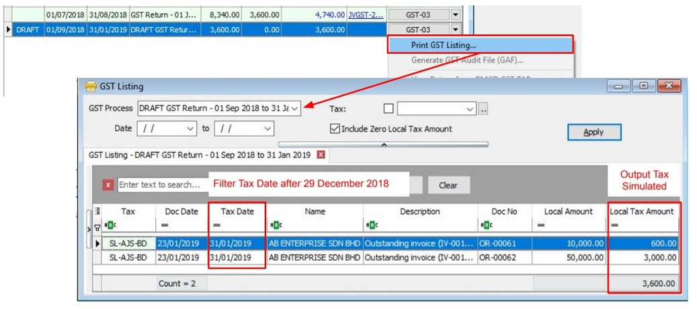

> **SL-AJS-BD** : Sales Bad Debt Recovered (Output Tax).  
> **PH-AJP-BD** : Purchase Bad Debt Recovered (Input Tax).  

### Adjustment for GST Sales Deferred Tax (SL-AJS-BD)

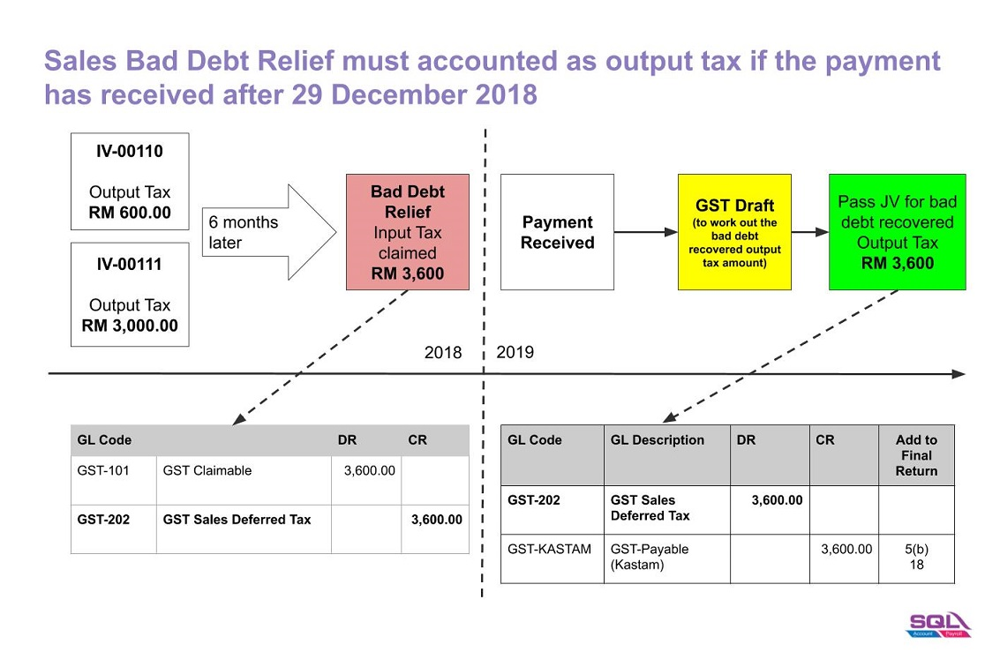

1. Based on the **GST Listing (Draft)**, post the GST Bad Debt Recovered double entry using **Journal Entry**.

| GL Code    | GL Description            | Local DR | Local CR | Add to Final GST-03 |
|------------|---------------------------|----------|----------|----------------------|
| GST-202    | GST - Sales Deferred Tax  | 3,600    |          |                      |
| GST-KASTAM | GST - Payable (KASTAM)    |          | 3,600    | 5(b), 18             |

2. Amend the Final GST Return (Aug 2018) at TAP.
3. Add the amount into
  a. 5(b)
  b. 18

### Adjustment for GST Purchase Deferred Tax (PH-AJP-BD)

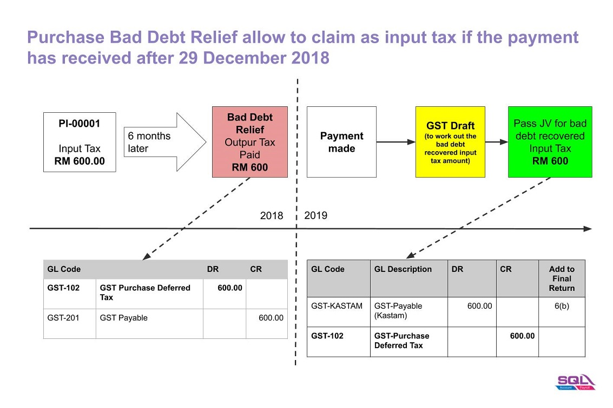

1. Based on the **GST Listing (Draft)**, post the GST Bad Debt Recovered double entry using **Journal Entry**.

| GL Code     | GL Description              | Local DR | Local CR | Add to Final GST-03 |
|-------------|-----------------------------|----------|----------|----------------------|
| GST-KASTAM  | GST - Payable (KASTAM)      | 600      |          | 6(b)                |
| GST-102     | GST - Purchase Deferred Tax |          | 600      |                      |

2. Amend the Final GST Return (Aug 2018) at TAP.
3. Add the amount into
  a. 6(b)

### Payment to RMCD

Made payment to RMCD, use **Cash Book Entry (PV)**.

| GL Code    | GL Description                        | Local DR | Local CR |
|------------|---------------------------------------|----------|----------|
| GST-KASTAM | GST - Payable (KASTAM) - Nett Balance | 3,000    |          |
| BANK       | Bank Name                             |          | 3,000    |
