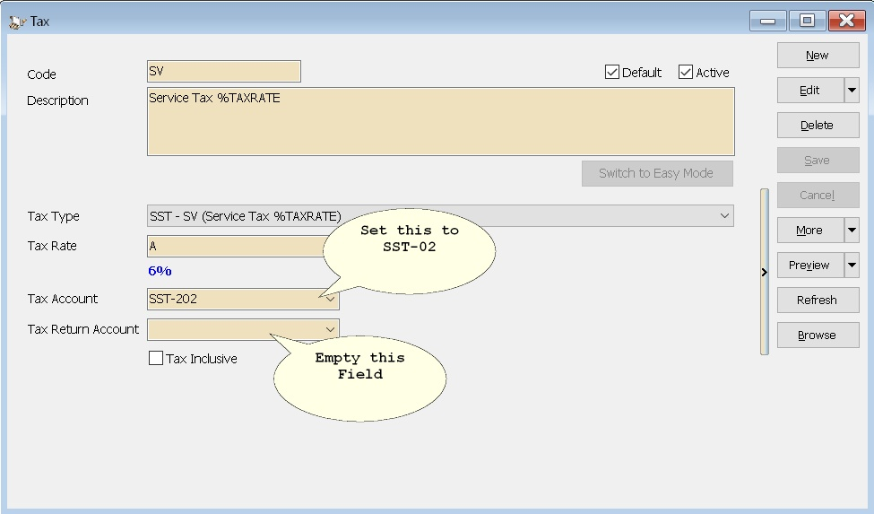
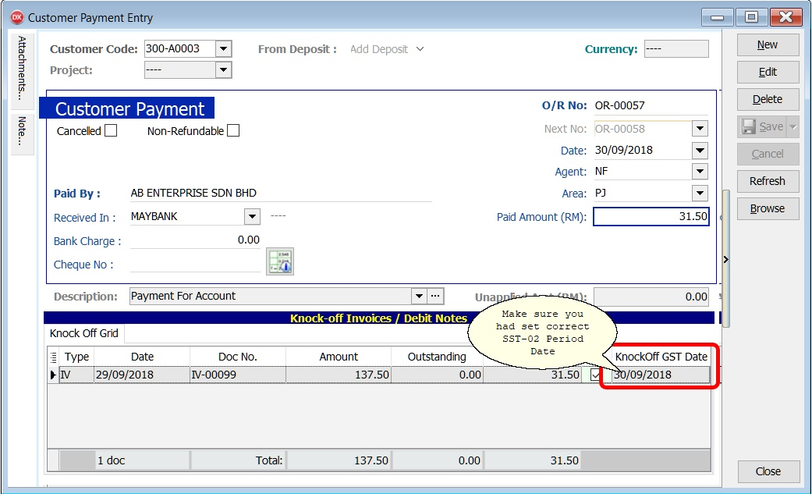
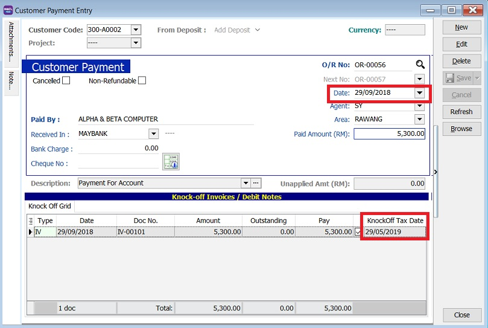

## 1 : Can I Change the Service Tax Type to Accrual Basis?

### Solution:

By Default System will use as Payment Basis for Service Tax Type  
To change to Accrual Basis(i.e. Pay Kastam even no payment), Just Set as below  

## 2 : Why preview my SST-02 report is no value even at screen had amount?

### Solution:

Make sure you had enter your **Service Tax** and/or **Sales Tax No.** in File | Company Profile

## 3: Why does the tax code (ST5) used in my sales invoices not appear in SST-02, but it shows up in the SST-02 listing?

### Solution:

Make sure you had enter your **Sales Tax no** instead of **Service Tax** no in File | Company Profile

## 4: Why Some Service Tax Transaction not shown in SST-02 even the document is fully paid?

### Solution:

Make sure you had select correct **Knock Off Date** in the Customer Payment

## 5: Why does the service invoice that was knocked off (paid) in Sept 2018 not appear in SST-02 for the period Sept–Oct 2018?

### Issue:

Knock-off tax date will follow the customer payment date if user has tick on an invoice.  
Change the customer payment date (eg. from 29/05/2019 to 29/09/2018), the knock-off date will remains unchanged.  

### Solution:

Change the **Knock-off Tax Date** (follow the payment date)

## 6: Can I mixed the sales tax and service tax in single invoice?

### Issue: 

Can I mixed the sales and service tax code in single document?

### Solution:

1. Customs officer has recommended the company should raise the invoice, debit note and credit note separately for sales and service invoice.  
2. Indicate the sales and service tax registration no on the invoice letter head separately as well.  
3. This is to ease the Customs audit operation purpose.  

Sales tax and service tax having different accounting basis as explained below.

1. **SALES TAX**  
    - Billing / accrual basis  
    - Sales Tax required to be accounted at the time when the goods are sold, disposed or first used  

2. **SERVICE TAX**
    - Payment basis  
    - Service Tax required to be accounted at the time when the payments is received.  
    - On the day following period of twelve month when any whole or part of the payment is not received from the date of the invoice for the taxable service provided  

## 7: What circumstanaces to use tax code SV and SVA for Credit Note?

### Issue: 

Service tax is based on payment basis.

### Solution:

There will be 2 cases of service tax where credit note has taken in place:

1. **Unpaid service tax**

    - Cancellation of service **before any payment**.  
    - use tax code: **SV** (follow the invoice tax code, eg. SV)  
    - system will **auto reverse the unpaid service tax amount** in the **SST - Deferred Tax (SST-203)**.  

2. **Paid service tax**

    - Cancellation of service **after payment and service tax has been paid** to RMCD.
    - Adjustment tax deduction for refund of service tax approved by RMCD.
    - use tax code: **SVA**
    - system will reduce the service tax payable to RMCD

## 8: What is Digital Service Tax

New service tax effectively come into operation on **1 January 2020**.

**Characterics**

   - delivered or subscribed over the **internet or other electronic network**
   - delivered through **information technology medium** (human eye cannot see and touch)
   - minimal or no human **intervention** (eg. automation, click to subscribe and consume)

**Scope on Digital Service**

   - Software, application & video games
   - music, e-book and film
   - advertisement and online platform
   - search engine and social network (facebook)
   - database and hosting (eg. website hosting, online data, file sharing, cloud storage)
   - internet based telecommunication (eg. VOIP)
   - Online training
   - Subscription to online newspapers
   - payment process services (paypal)

**Taxable Person**

1. Foreign Service Provider (FSP)

    - any person who is **outside Malaysia providing** any digital service to a consumer directly
    - any person who is **outside Malaysia operating an online platform** for buying and selling goods
    - providing services (whether or not such person provides any digital services) who makes transactions for provision of digital services **on behalf of any person**

2. Threshold exceed RM500,000 (historical or future 12 months)

**Accounting Basis**

   - Default is **Payment basis** (same to service tax)
   - Accrual Basis (billing) must apply to DG upon registration

**Exchange Rate**

   - Can use any exchange rate to calculate tax payable

**Taxable Period**

   - Three months (quarterly)

**Returns Form**

   - Digital Service Return [DST-02](https://drive.google.com/file/d/1n2rrcnGrYms9RWki20Rg9vukzzRNtHll/view)

**Exemption**

   - No exemption announced

**Claim Refund**

   - Digital service tax overpaid allowed to claim refund.
   - Need fill-in [JKDM-2](https://mysst.customs.gov.my/assets/document/SST%20Form/JKDM%20No.%202.pdf)

## 9: What invoice format should I use for service tax exempted services?

### Issue: 

What invoice format can be use for service tax exempted

### Solution:

1. Download the invoice format by click to [Sales Invoice 8 SST 1 (Exempted Taxable Service)](https://www.sql.com.my/webstore/templates/template-detail/?id=4769)
2. Go to **Tools | Report Designer**...
3. Click import the invoice format file.

## 10: What is the double entry for service tax invoice and CN issued using SV tax code?

### Issue: 

How should the double entry be recorded for a service tax invoice and credit note issued under the SV tax code?

### Solution: 

1. **Full Service Tax Invoice issue**

| GL Acc   | Desciption        | Tax | DR     | CR     |
|----------|-------------------|-----|--------|--------|
| 300-A0001| Customer ABC      |     | 1060.00|        |
| 500-000  | Service Sales     | SV  |        | 1000.00|
| SST-203  | SST - Deferred Tax| SV  |        | 60.00  |

2. **Partial Payment** knock-off with invoice

| GL Acc   | Desciption   | Tax | DR   | CR   |
|----------|--------------|-----|------|------|
| 330-000  | BANK         |     | 530.00|      |
| 300-A0001| Customer ABC |     |       | 530.00|

System auto reverse the SST-Deferred Tax after knock-off

| GL Acc  | Desciption        | Tax | DR   | CR   |
|---------|-------------------|-----|------|------|
| SST-203 | SST - Deferred Tax|     | 30.00|      |
| SST-202 | SST - Service Tax |     |      | 30.00|

3. Reduce/cancel the partly of the service amount. Issue CN using **tax code: SV**

| GL Acc   | Desciption     | Tax | DR    | CR    |
|----------|----------------|-----|-------|-------|
| 500-000  | Service Sales  | SV  | 500.00|       |
| SST-203  | SST - Deferred Tax | SV  | 30.00 |       |
| 300-A0001| Customer ABC   |     |       | 530.00|

Conclusion:

SST Deferred Tax account `=` **ZERO** if the **Full Service Tax Invoice** (eg. SV only) outstanding is **ZERO**.  
SST Deferred Tax account `<>` **ZERO** if the service tax invoice has **mixed tax type** (eg. ST, SV and empty tax code).   