## Understand on Toolbar

1. **Report Object**

    

2. **Align Toolbar**

    

## Sales Inovice Bands

1. Understand on Bands

   1. Group Header
      - Grouping Header
      - To Print on every page, right click on ***Group Header Band***, select ***reprint on new page***

   2. Master Data
      - The ***Main*** Dataset of the report
      - Normally Bind to Main Dataset
      - Each Page allows to have 1 ***Main Dataset Only***

   3. Detail Data
      - To display ***all Item Details***

   4. Group Footer
      - Grouping Footer
      - Display on ***Last Page*** only

   5. Page Footer
      - Display on ***Every Pages***

2. Sample Layout in Design Mode

    

3. Sample Layout on Preview Mode

    

4. Print Position

   - Group Footer content will be printed at the pixel value input.
   - Higher Value = Higher Footer
   - without setting with print position, the group footer will be printed after the document
   detail records.
   - Example Source Code:

        ```pascal
        if Engine.FreeSpace < (GroupFooter1.Height + PageFooter1.Height + 30) then Engine.NewPage;

        Engine.CurY := Engine.PageHeight - GroupFooter1.Height - PageFooter1.Height - **60** ;
        ```

        :::info[note]
        **60** -> Higher Value = Higher Footer
        :::

   1. How to do the Print Position setting in Report?

      1. Click on ***Group Footer*** -> Click on ***Properties*** -> ***Events*** Tab -> Double Click on ***OnbeforePrint*** event name

            

      2. Adjust the value

            

5. Stop Position vs Print Count

    | Stop Position | Print Count |
    | :---:          |    :----:   |
    | Details will stop at the input value| Details will stop by number of records inputs|
    | Recommend    | Not recommend if using More Description        |
    | Value in Pixel    | Number of Records |

   1. How to do the Stop Position in Report?

      1. Right click ***DetailData1*** -> Click on ***Events*** Tab -> Double click ***onAfterCalcHeight*** name

            

      2. Setting the stop position

            

            :::tip[SMALL TIPS]
            1. Set Either Print Count or Stop Position
            2. use // to disable the command
            3. When you set both Print Count and Stop Position, system will capture Print Count.
            :::

      3. Sample on Print Position / Stop Position

            

## How to design Simple Sales Invoice?

- Preview Invoice
- Click on Report Name to enter to Design Mode

1. **Add PICTURE**

   1. Click on Picture Object

        

   2. Place on Report Page

        

      - **Fix Picture**

         1. Click on Load

            

         2. Select the Picture on your local drive

         3. Click on 

            

         4. Adjust to the desire size

            

      - **Capture Picture from Report Dataset**

            

2. **Text Memo**

    **Add Customer Email Address**

      1. Click on Text Memo

            

      2. Place on Report Page

      3. Enter Text : Email

            

      4. Repeat Step i & ii

      5. Select Document_CompanyBranch -> Email Expression

            

3. **Rich Text Object**

    **Add Note**

   1. Click on RichText Object

        

   2. Place on Report Page

   3. Select Main -> Note

        

4. **System Text**

    - **Add Sum Qty**

        1. Click on System Text Object

            

        2. Place on the Report Page

        3. Select Aggregate value

            

5. **Draw Line**

   1. Click on Line

      

   2. Place on the Report Page

   3. Draw a line

      

6. **Center Horizontally in Band**

   - Display the object in center horizontal

     1. Click on Object you want to show in center horizontal

     2. Click on Center Horizontally In Band

         

7. **Align Left / Middle / Right**

   1. Click on the multiple Object to Align as same alignment. System will follow the first object as alignment

      

8. **Save the File**

   1. File -> Save As -> Enter Report Name -> Save

   2. Preview and see the result

   Result:

   

## How to create the Subreport in Report?

- Preview Invoice
- Click on ***Report Name*** to enter to Design Mode

   

  1. Click on **Subreport Object**

      

     1. Place on Report Page you want to show.

         

  2. System will prompt a new blank page for Subreport

      

  3. Click on **Insert Band** to design the layout or insert the data

      

      *\*\*May refer 2.1 Understand Bands at Page 4 on what band to use*

## Check Box

1. **Simple CheckBox**

   1. Click on CheckBox object

      

   2. Place on the place you want to show.

      

   3. Press on the button

      

   4. Select the frame design

      

   5. Change to False

      

   6. Save the File
      1. File -> Save As -> Enter Report Name -> Save
      2. Preview and see the result

   Result :

      

2. **Query to show Check Box either True to False**

   1. Click on CheckBox | Double Click OnBeforePrint

        

   2. Place a Query below

        

        Query:

        ```pascal
        procedure Check/box1OnBeforePRint(Sender: TfrxComponent);
        begin
            if (Main."UDF_updated") = 'T' then
                checkbox1.checked := true
            else
                checkbox1.checked := false;
        end;
        ```

## How to do Report Watermark?

1. Insert Band | Select Overlay

   

2. Insert Picture / Text to load in the water mark

   

3. Overlay size can drag the same size as A4/Letter, and place the watermark on the position you want to show.

   

4. File | Save As: Enter report name

5. Preview and see the Result :

   

## Fast Report - Doing Simple Calculation

* In Fast Report you can also do some simple calculation using the Memo (Red A Icon)

1. Below is example using Sales Invoice to get Net Unit Price (after Discount)

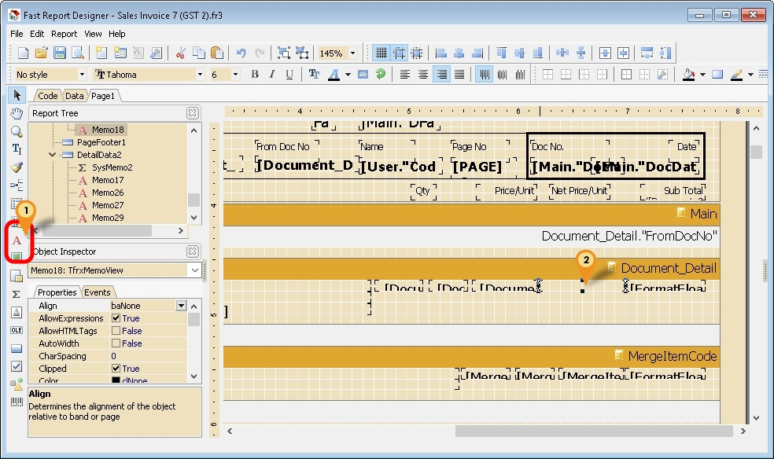

1. Click the Red A Icon.
2. Click on the place to be print/shown.

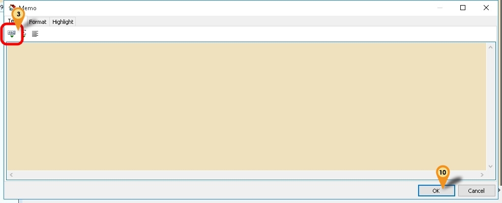

3. Click the ABC Icon

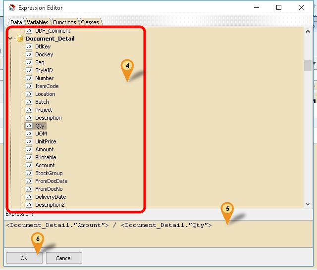

4. Scroll and look for Document_Detail Pipeline/Section & Double click the field to Insert (eg Amount & Qty)
5. Change the Expression or Formula here
6. Click Ok button.

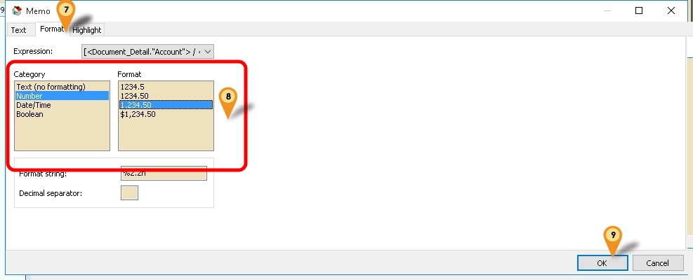

7. Click Format tab
8. Set Category to Number & Format to 1,234.50
9. Click Ok button.
10. Click Ok button again to close the Memo dialog.
11. Right Click the Memo.

## Fast Report - Get Data Directly from DB

Sometime in the report you might wanted some extra information but you not able to select in the report design. So you had to self query to get the extra information.

There are 2 ways to Get the data directly from Database

* Cache Query
* Get DB Data Query

## Cache Query

<details>
  <summary>Cache Query - click to expand</summary>

> Only available SQL Accounting Version 723 & above

- Pros

1. Easy to write

2. Can direct filter data from Local Pipeline

3.  Less data Loading

- Cons

1. Unable to Total the all result shown

2. Only support = in the Query

3. No pipeline is created

### Example 1 - Get Shelf Field from Maintain Item

 Below is Example are doing following actions :

* At Sales Invoice to get Shelf field from Maintain Item

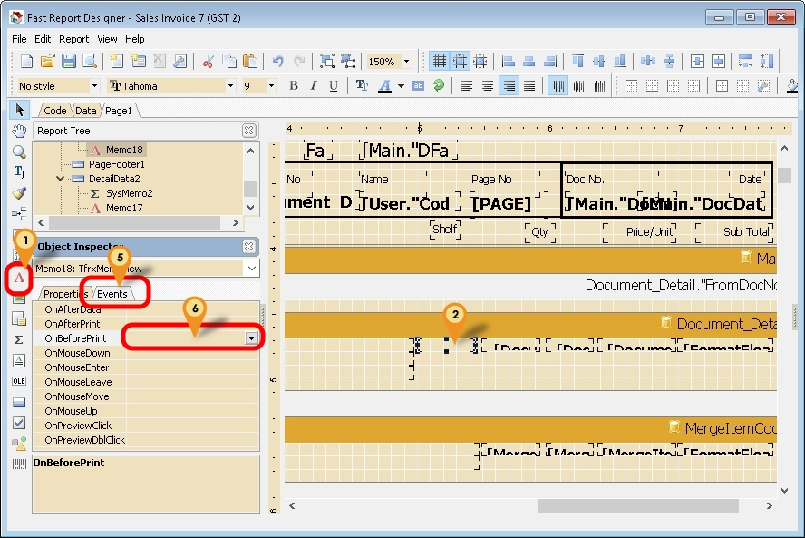

1. Click the Red A Icon.
2. Click on the place to be print/shown.
3. Right Click the Memo.

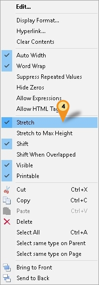

4. Select Stretch
5. Click on Events tab
6. Double Click OnBeforePrint
7. Enter below script

```pascal
procedure Memo18OnBeforePrint(Sender: TfrxComponent);
var V : Variant;
begin
  V := Null;
  //Get Shelf From ST_Item
  if Trim(<Document_Detail."ItemCode">) <> '' then
    V := CacheQuery_GetValue(pST_Item, [<Document_Detail."ItemCode">], 'Shelf');
    
  if not VarIsNull(V) then
    Memo18.Text := V else
    Memo18.Text := '';
end;
```

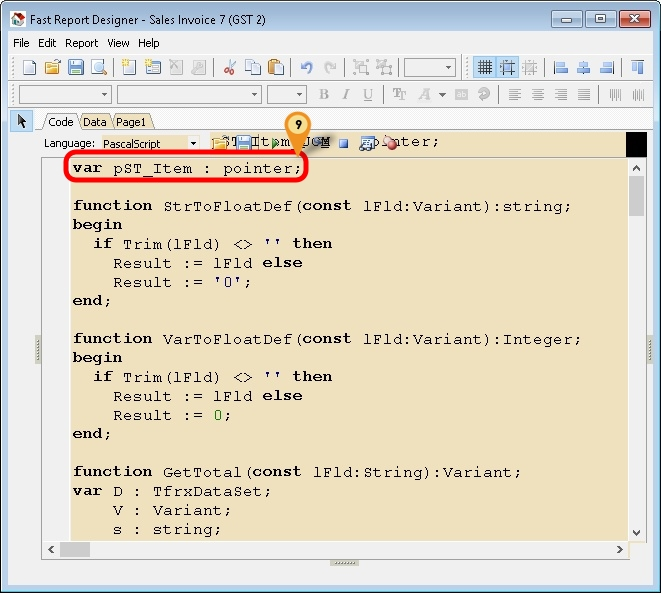

8. Scroll up till the top of the Code
9. Enter below script at the First line

```pascal
var pST_Item : pointer;
```

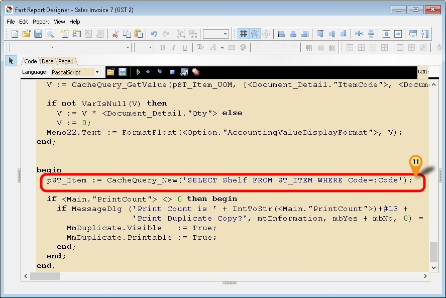

10. Scroll down till the end of the Code
11. Enter below script in between begin and end.

```pascal
pST_Item := CacheQuery_New('SELECT Shelf FROM ST_ITEM WHERE Code=:Code');
```

12. Save the report.


### Example 2 - Get RefCost Field from Maintain Item

Below is Example are doing following actions

* Sales Invoice to get RefCost field from Maintain Item
* Use RefCost * Qty in Sales Invoice

1. Click the Red A Icon.
2. Click on the place to be print/shown.
3. Right Click the Memo.
4. Select Stretch
5. Click on Events tab
6. Double Click OnBeforePrint
7. Enter below script

```pascal
procedure Memo18OnBeforePrint(Sender: TfrxComponent);
var V : Variant;                            
begin
  V := Null;
  //Get RefCost*Qty
  if Trim(<Document_Detail."ItemCode">) <> '' then
    V := CacheQuery_GetValue(pST_Item_UOM, [<Document_Detail."ItemCode">, <Document_Detail."UOM">], 'RefCost');        

  if not VarIsNull(V) then
    V := V * <Document_Detail."Qty"> else
    V := 0;
  Memo18.Text := FormatFloat(<Option."AccountingValueDisplayFormat">, V);
end;
```
8. Scroll up till the top of the Code
9. Enter below script at the First line

```pascal
var pST_Item_UOM : pointer;
```

10. Scroll down till the end of the Code
11. Enter below script in between begin and end.

```pascal
pST_Item_UOM := CacheQuery_New('SELECT RefCost FROM ST_ITEM_UOM WHERE Code=:Code AND UOM=:UOM');
```

12. Save the report.

### Example 3 - Get Picture Field from Maintain Item

Below is Example are doing following actions

* Sales Invoice to get Picture field from Maintain Item

> This function only available on Version 730 & above

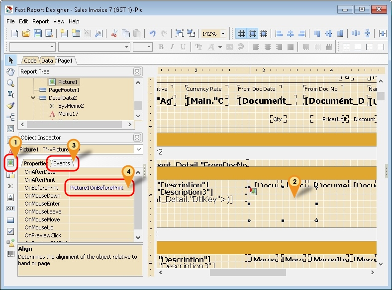

1. Click on Picture Icon (Below Red A icon)
2. Click on the place to be print/shown.
3. Click on Event tab on Object Inspector
4. Double Click OnBeforePrint
5. Enter below script

```pascal
procedure Picture1OnBeforePrint(Sender: TfrxComponent);
var V : Variant;
begin
  Picture1.Height := 0;    
  V := Null;
  V := CacheQuery_GetValue(pST_Item, [<Document_Detail."ItemCode">], 'Picture');
  if not VarIsNull(V) then begin                              
    Picture1.LoadPictureFromBytes(V);
    Picture1.Height := 48;                                            
  end;                
end;
```

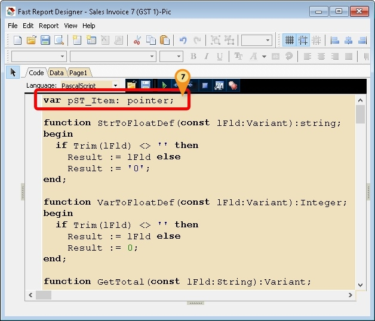

6. Scroll up till the top of the Code
7. Enter below script at the First line

```pascal
var pST_Item : pointer;
```
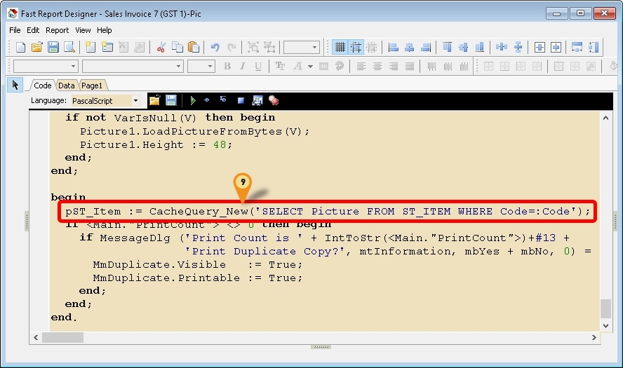

8. Scroll down till the end of the Code
9. Enter below script in between begin and end.

```pascal
pST_Item := CacheQuery_New('SELECT Picture FROM ST_ITEM WHERE Code=:Code');
```
10. Save the report.

### Example 4 - Get Document Created UserName from Audit

Below is Example is to Get the who created the Document from Audit Table.

1. Click the Red A Icon.
2. Click on the place to be print/shown.
3. Right Click the Memo.
4. Select Stretch
5. Click on Events tab
6. Double Click OnBeforePrint
7. Enter below script


```pascal
procedure Memo10OnBeforePrint(Sender: TfrxComponent);
var V : Variant;
    p : Pointer;
    s : String;                              
begin
  V := Null;
  if Trim(<Main."DocNo">) <> '' then begin
    //For AR, AP, SL & PH Only
    s := '%' + <Main."DocNo"> + '%Code: ' + <Main."Code"> + ',%';                                      
    //For JV & CB Only
    //s := '%' + <Main."DocNo"> + ',%';                                      
    V := CacheQuery_GetValue(p_Audit, [s], 'Code'); //for User Code
    //V := CacheQuery_GetValue(p_Audit, [s], 'Name'); //for User Name
  end;

  if not VarIsNull(V) then
    Memo10.Text := V else
    Memo10.Text := '';
end;
```

8. Scroll up till the top of the Code
9. Enter below script at the First line

```pascal
var p_Audit : pointer;
```
10. Scroll down till the end of the Code
11. Enter below script in between begin and end.

```pascal
p_Audit := CacheQuery_New('SELECT CODE, NAME FROM SY_USER WHERE CODE = (SELECT First 1 UserName FROM AUDIT WHERE UPDATEKIND=''I'' AND REFERENCE LIKE :DocNo) ');
```
12. Save the report.

### Example 5 - Get Transfer Information - QT to DO to IV

Below is Example are doing following action

* Quotation Transfer to Delivery Order to Invoice.
* Get the Quotation number & Date in the Invoice Detail

1. Click the Red A Icon.
2. Click on the place to be print/shown (In DetailData).
3. Right Click the Memo.
4. Select Stretch
5. Click on Events tab
6. Double Click OnBeforePrint
7. Enter below script (For DocNo)

```pascal
procedure Memo10OnBeforePrint(Sender: TfrxComponent);
var V : Variant;
begin
  V := Null;
  if Trim(<Document_Detail."FromDocType">) <> '' then
    V := CacheQuery_GetValue(pSL_QT, [<Document_Detail."FromDtlKey">], 'DocNo');

  if not VarIsNull(V) then
    Memo10.Text := V else
    Memo10.Text := '';
end;
```

8. Repeat again Steps 01 to 06
9. Enter below script (For DocDate)

```pascal
procedure Memo18OnBeforePrint(Sender: TfrxComponent);
var V : Variant;
begin
  V := Null;
  if Trim(<Document_Detail."FromDocType">) <> '' then                                      
    V := CacheQuery_GetValue(pSL_QT, [<Document_Detail."FromDtlKey">], 'DocDate');

  if not VarIsNull(V) then
    Memo18.Text := V else
    Memo18.Text := '';
end;
```

10. Scroll up till the top of the Code
11. Enter below script at the First line

```pascal
var pSL_QT : pointer;
```

12. Scroll down till the end of the Code
13. Enter below script in between begin and end.

```pascal
 pSL_QT := CacheQuery_New('SELECT A.DocNo, A.DocDate, B.Qty FROM SL_QT A '+
                           'INNER JOIN SL_QTDTL B ON (A.Dockey=B.Dockey) ' +
                           'WHERE B.Dockey=(SELECT FROMDOCKEY FROM SL_DODTL ' +
                           'WHERE Dtlkey=:Dtlkey) '+
                           'AND B.DtlKey=(SELECT FROMDTLKEY FROM SL_DODTL '+
                           'WHERE Dtlkey=:DtlKey)');
```

14. Save the report.

### Example 6 - Get Customer Branch Email & Attention

Below is Example are doing following actions

* Sales Invoice to get Branch Email field from Maintain Customer

1. Click the Red A Icon.
2. Click on the place to be print/shown.
3. Right Click the Memo.
4. Select Stretch
5. Click on Events tab
6. Double Click OnBeforePrint
7. Enter below script

```pascal
procedure Memo18OnBeforePrint(Sender: TfrxComponent);
var V : Variant;                            
begin
  V := Null;
  //For Email
  V := CacheQuery_GetValue(pAR_Branch, [<Main."Code">, <Main."BranchName">], 'EMail');
  //For Attention
  //V := CacheQuery_GetValue(pAR_Branch, [<Main."Code">, <Main."BranchName">], 'Attention');

  if VarIsNull(V) then
    V := '';
  Memo18.Text := V;
end;
```

8. Scroll up till the top of the Code
9. Enter below script at the First line

```pasacal
var pAR_Branch : pointer;
```

10. Scroll down till the end of the Code
11. Enter below script in between begin and end.

```pascal
  pAR_Branch := CacheQuery_New('SELECT EMail, Attention FROM AR_CustomerBranch WHERE Code=:Code AND BranchName=:BranchName');
```

12. Save the report.

</details>

## Get DB Data Query

<details>
  <summary>Get DB Data Query - click to expand</summary>

User can use this function to query & add new pipeline & also join/link the new pipeline to the existing/local pipeline.
The Steps is 99% same like **Fast Report - Get Data from Available Pipeline** the only different is the Script part.

Pros

* Can write complex query

Cons

1. Not Easy to write
2. Unable to filter data from Local Pipeline (i.e. Had to Select ALL data from the Table)
3. Might slow or Out of Memory on Print/Preview report if not careful

### Example 1 - Get Maintain Batch Information
Below is Example doing following actions

* Get data information From Stock Batch

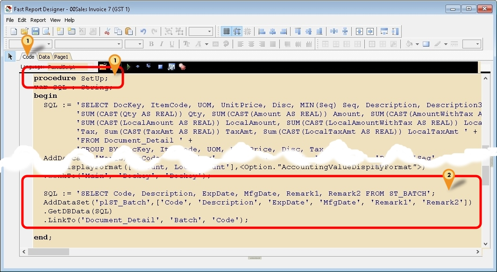

1. Click Code tab & scroll down look for procedure SetUp
2. Copy below script & paste it between the begin & end; in procedure SetUp

```pascal
  SQL := 'SELECT Code, Description, ExpDate, MfgDate, Remark1, Remark2 FROM ST_BATCH';
  AddDataSet('plST_Batch',['Code', 'Description', 'ExpDate', 'MfgDate', 'Remark1', 'Remark2'])
  .GetDBData(SQL)
  .LinkTo('Document_Detail', 'Batch', 'Code'); // Link to Detail
  ```

3. Click File | Save As... to save the file (eg Sales Invoice 7 (GST 2)-New)
4. Click File | Exit to exit the report design
5. Click Design again in the report designer for the file just save on Steps 3 (eg Sales Invoice 7 (GST 2)-New)

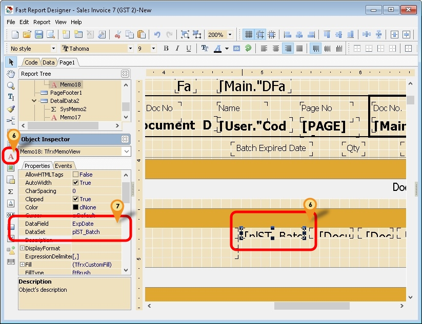

6. Click on Red A icon & click the place to print

7. Select the option for following setting
* Dataset : plST_Batch
* DataField : ExpDate

8. Repeat Steps 6 to 7 for other field if necessary
9. Save the Report

### Example 2 - Get Supplier Bank Information

Below is Example doing following actions

* Get Supplier Bank information From Maintain Supplier for Supplier Payment Voucher

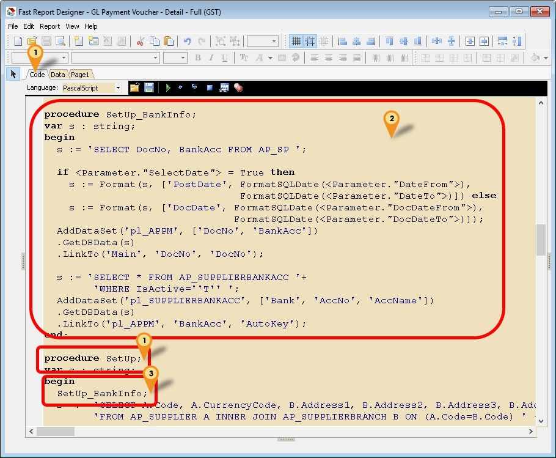

1. Click Code tab & scroll down look for procedure SetUp
2. Copy below script & paste it above the procedure SetUp

<details>
  <summary>Supplier Bank Info Script - click to expand</summary>

```pascal
function FormatSQLDate(D: TDateTime): String;
var AFormat: string;
begin
  AFormat := 'dd mmm yyyy'; //'dd/mmm/yyyy' if can't
  Result := QuotedStr(FormatDateTime(AFormat, D));
end;

function GetBankName(const lCode:String):String;
begin
  case lCode of
   'AIBBMY' : Result := 'Affin Bank Berhad';
   'RJHIMY' : Result := 'Al Rajhi Banking & Investment Corporation (Malaysia) Berhad';
   'MFBBMY' : Result := 'Alliance Bank Malaysia Berhad';
   'ARBKMY' : Result := 'AmBank (M) Berhad';
   'BNPAMY' : Result := 'BNP Paribas Malaysia Berhad';
   'BIMBMY' : Result := 'Bank Islam Malaysia Berhad';
   'BKRMMY' : Result := 'Bank Kerjasama Rakyat Malaysia Berhad';
   'BMMBMY' : Result := 'Bank Muamalat Malaysia Berhad';
   'BOFAMY' : Result := 'Bank of America Malaysia Berhad';
   'BOTKMY' : Result := 'Bank of Tokyo-Mitsubishi UFJ (Malaysia) Berhad';
   'AGOBMY' : Result := 'Bank Pertanian Malaysia Berhad';
   'BSNAMY' : Result := 'Bank Simpanan Nasional Berhad';
   'CIBBMY' : Result := 'CIMB Bank Berhad';
   'CITIMY' : Result := 'Citibank Berhad';
   'DEUTMY' : Result := 'Deutsche Bank (Malaysia) Berhad';
   'HLBBMY' : Result := 'Hong Leong Bank Berhad';
   'HBMBMY' : Result := 'HSBC Bank Malaysia Berhad';
   'ICBKMY' : Result := 'Industrial and Commercial Bank of China (Malaysia) Berhad';
   'CHASMY' : Result := 'J.P. Morgan Chase Bank Berhad';
   'KFHOMY' : Result := 'Kuwait Finance House (Malaysia) Berhad';
   'MBBEMY' : Result := 'Malayan Banking Berhad';
   'MHCBMY' : Result := 'Mizuho Bank (Malaysia) Berhad';
   'OCBCMY' : Result := 'OCBC Bank (Malaysia) Berhad';
   'PBBEMY' : Result := 'Public Bank Berhad';
   'RHBBMY' : Result := 'RHB Bank Berhad';
   'SCBLMY' : Result := 'Standard Chartered Bank Malaysia Berhad';
   'SMBCMY' : Result := 'Sumitomo Mitsui Banking Corporation Malaysia Berhad';
   'ABNAMY' : Result := 'The Royal Bank of Scotland Berhad';
   'UOVBMY' : Result := 'United Overseas Bank (Malaysia) Bhd';
   'ANZBSG' : Result := 'Australia and New Zealand Banking Group Limited';
   'BKKBSG' : Result := 'Bangkok Bank Public Company Limited';
   'BOFASG' : Result := 'Bank of America, National Association';
   'BKCHSG' : Result := 'Bank of China Limited';
   'BEASSG' : Result := 'The Bank of East Asia Limited';
   'BNINSG' : Result := 'P.T. Bank Negara Indonesia (Persero)';
   'BKIDSG' : Result := 'Bank of India';
   'BOTKSG' : Result := 'Bank Of Tokyo-Mitsubishi UFJ Limited';
   'BNPASG' : Result := 'BNP Paribas';
   'CTCBSG' : Result := 'Chinatrust Commercial Bank Corporation Limited';
   'CIBBSG' : Result := 'CIMB Bank Berhad';
   'CITISG' : Result := 'Citibank, National Association';
   'COBASG' : Result := 'Commerzbank AG';
   'AGRISG' : Result := 'Credit Agricole Corporate And Investment Bank';
   'DBSSSG' : Result := 'DBS Bank Limited';
   'DEUTSG' : Result := 'Deutsche Bank AG';
   'DNBASG' : Result := 'DNB Bank ASA';
   'FAEASG' : Result := 'Far Eastern Bank Limited';
   'FCBKSG' : Result := 'First Commercial Bank Limited';
   'HLBBSG' : Result := 'HL Bank';
   'HSBCSG' : Result := 'The Hongkong And Shanghai Banking Corporation Limited';
   'ICICSG' : Result := 'ICICI Bank Limited';
   'IDIBSG' : Result := 'Indian Bank';
   'IOBASG' : Result := 'Indian Overseas Bank';
   'iCBKSG' : Result := 'Industrial and Commercial Bank Of China';
   'BCITSG' : Result := 'Intesa Sanpaolo SpA';
   'CHASSG' : Result := 'JP Morgan Chase Bank, National Association';
   'KOEXSG' : Result := 'Korea Exchange Bank';
   'SOLASG' : Result := 'Landesbank Baden-Wurttemberg';
   'MBBESG' : Result := 'Malayan Banking Bhd';
   'MHCBSG' : Result := 'Mizuho Bank Limited';
   'NATASG' : Result := 'National Australia Bank Limited';
   'NDPBSG' : Result := 'Nordea Bank Finland PLC';
   'OCBCSG' : Result := 'Oversea-Chinese Banking Corporation Limited';
   'RHBBSG' : Result := 'RHB Bank Berhad';
   'ESSESG' : Result := 'Skandinaviska Enskilda Banken AB';
   'SOGESG' : Result := 'Societe Generale';
   'SBSASG' : Result := 'Standard Chartered Bank';
   'SBINSG' : Result := 'State Bank of India';
   'SMBCSG' : Result := 'Sumitomo Mitsui Banking Corporation';
   'HANDSG' : Result := 'Svenska Handelsbanken AB';
   'RBOSSG' : Result := 'The Royal Bank of Scotland PLC';
   'UBSWSG' : Result := 'UBS AG';
   'UCBASG' : Result := 'UCO Bank';
   'UOVBSG' : Result := 'United Overseas Bank Limited';
  end;
end;

procedure SetUp_BankInfo;
var s : string;
begin
  s := 'SELECT DocNo, BankAcc FROM AP_SP ';

  if <Parameter."SelectDate"> = True then
    s := Format(s, ['PostDate', FormatSQLDate(<Parameter."DateFrom">),
                                FormatSQLDate(<Parameter."DateTo">)]) else
    s := Format(s, ['DocDate', FormatSQLDate(<Parameter."DocDateFrom">),
                               FormatSQLDate(<Parameter."DocDateTo">)]);
  AddDataSet('pl_APPM', ['DocNo', 'BankAcc'])
  .GetDBData(s)
  .LinkTo('Main', 'DocNo', 'DocNo');

  s := 'SELECT * FROM AP_SUPPLIERBANKACC '+
        'WHERE IsActive=''T'' ';
  AddDataSet('pl_SUPPLIERBANKACC', ['Bank', 'AccNo', 'AccName'])
  .GetDBData(s)
  .LinkTo('pl_APPM', 'BankAcc', 'AutoKey');
end;
```

  </details>

3. Copy below script & paste it between the begin & end; in procedure SetUp

```pascal
  SetUp_BankInfo;
  ```

4. Click File | Save As... to save the file (eg GL Payment Voucher - Detail - Full (GST)-v BankInfo)
5. Click File | Exit to exit the report design
6. Click Design again in the report designer for the file just save on Steps 4 (eg GL Payment Voucher - Detail - Full (GST)-v BankInfo)

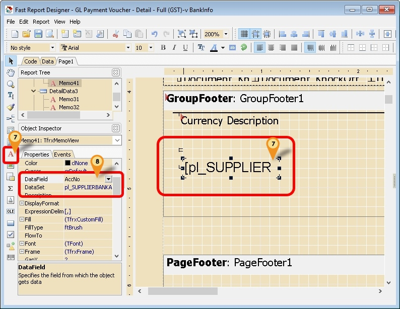

7. Click on Red A icon & click the place to print
8. Select the option for following setting
* Dataset : pl_SUPPLIERBANKACC
* DataField : AccNo
9. Repeat Step 7

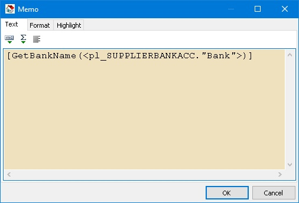

10. Copy below script & paste it in the Memo

```pascal
  [GetBankName(<pl_SUPPLIERBANKACC."Bank">)]
  ```

11. Click OK
12. Save the report

</details>

