### Can I set my first year financial period longer than 12 months (e.g., 18 months)?
Yes. You can set your first financial period for more than 12 months (e.g., from 1st July 2014 to 31st December 2015). --> [learn more here](#set-first-year-account-more-than-12-months)

## DIY Fields FAQ 

<details>
  <summary>DIY Fields FAQ - click to expand</summary>

### Can I show the detail fields in Header?

**Yes** , but with following condition
* Only available in Advance Form Design
* The Data will change/run base on last selected Record in the Detail Grid

1. Open the Form you wanted to Add (eg Sales | Sales Invoice)
2. Open The Advance form [Advance form](#design-layout)
3. Design as usual except need to select **DataSource**

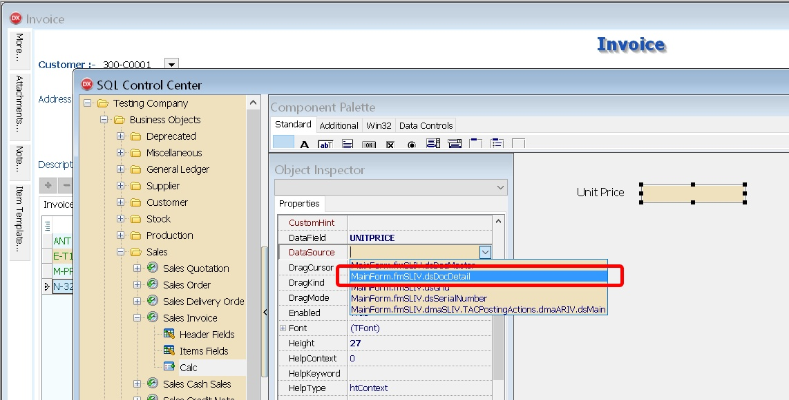

4. Select the XXXXX.YYYYY.dsDocDetail

### Can I have option selection for 1 UDF?

**Yes** , using **Advance Form Design**
Steps
01. Open the Form you wanted to Add (eg Sales | Sales Delivery Order)
02. Open The Advance form [Advance form](#design-layout)
03. Design as usual for Label
04. For the UDF you wanted to have option

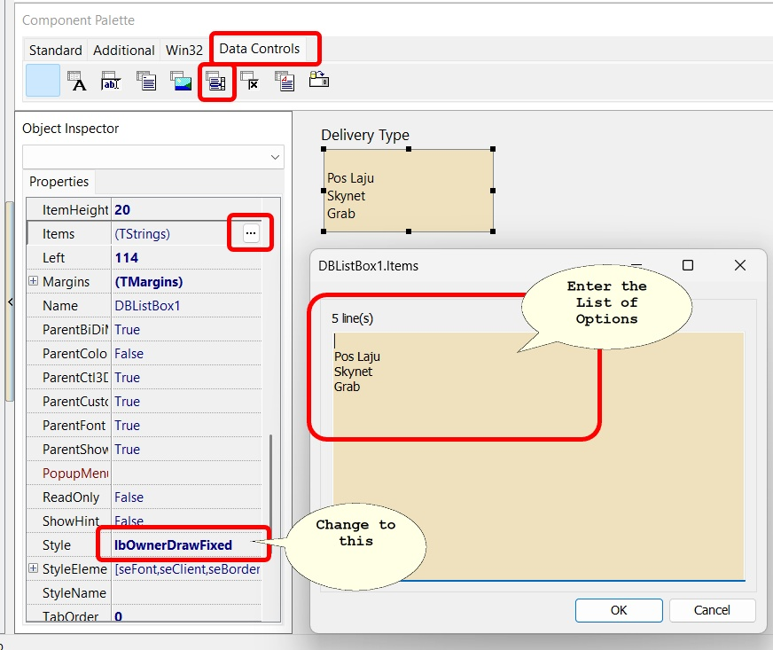

</details>


## Set First Year Account more than 12 Months

<details>
  <summary>Set First Year Account more than 12 Months - click to expand</summary>

* This guideline is to guide how to setup your first year account if it is more than 12 month , below example given is first year account in 18 months.

* First financial period will in 18 month which is from 1st July 2014 to 31st December 2015.

:::warning CAUTION
You are advise to set your financial start period and system conversion date as below.
:::

### Setup

1. Go Tools > Option > General Ledger

   - Setting your financial start period and system conversion date as 1/1/2014, so in the following year, you do not need to run year end to set again your financial start period & System conversion date.

    

2. Setting profit & loss statement print in 18 months

    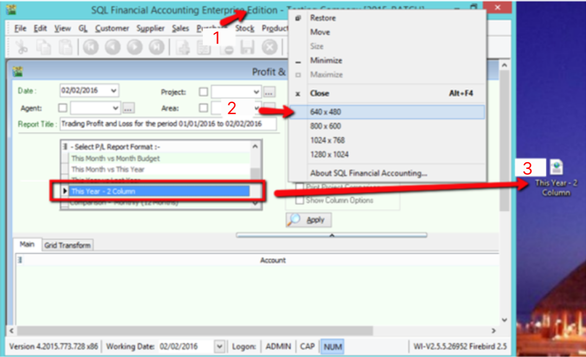

   1. Right click as pointed

   2. Select 640 x 480 to smaller your SQL Screen

   3. Highlight report name “this year-2column” click and drag it to desktop
       

   4. From desktop click the report “This Year-2Column” drag it back to SQL report section.

   5. Click ok
       

   6. Double click on the new report name “ This year 2 column” in blue color.

   7. Change Period Class to Fixed Date

       - Param 1 = Date from eg 1/7/2014
       - Param 2 = Date to eg 31/12/2015

   8. You can insert a report name for you easy to differentiate.

  </details>


## Advanced Currency Module

<details>
  <summary>Advanced Currency Module- click to expand</summary>

  :::info
  This module is required if you are using foreign banks.
  
  Related: [Payment from Foreign Customer](../../usage/tools/guide#maintain-currency)
  :::
  
  ### Setup Foreign Currency Payment Method
  
#### Steps

   1. GL > Maintain Account
  
  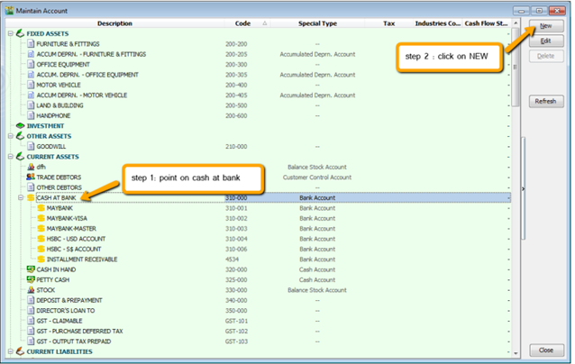
  
   2. Create your bank respectively
  
  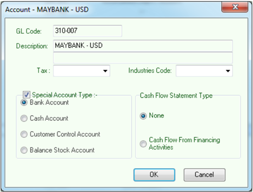
  
   3. Tools > Maintain Payment Method
  
  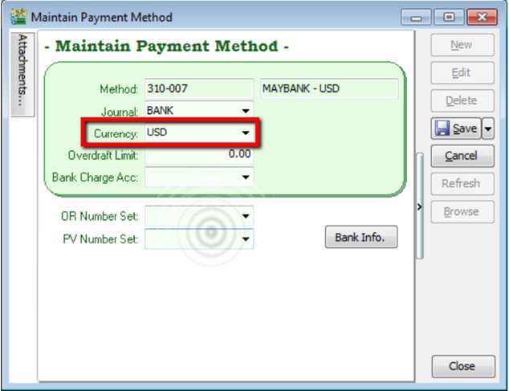

</details>

:::success Advanced Currency Module FAQ
 **How do I record transactions in a foreign bank account?***
 
 **Why can’t I receive payment from a foreign customer in their currency?**
 
 **How do I handle supplier payments in USD, EUR, etc.?**

 **Do I need to activate any module to use foreign currency in SQL Accounting?**
 
 **Why does my system show error when applying exchange rate in payment?**

These questions goes to one solution , which is  
[Advanced Currency Module](#advanced-currency-module)
:::

### Can I auto-post exchange gain/loss when using foreign banks?
Yes, via [Advanced Currency](#advanced-currency-module) Module and [Gain/Loss setup](../../usage/tools/guide#payment-from-foreign-customer)

## SQL Global Price Change

<a id="sql-global-price-change"></a>

SQL Global Price Change will help you mark down price for all items with few clicks

:::info
This is a **paid module**. Contact your SQL Service to get this standalone application.
:::


## Setup

1. Select your group of item

   1. <a id="select-group-category"></a>You can select on certain stock group/ category, if you want all items, then left stock group and category blank
   2. You can also choose only active item
   3. Once your group of item selected, click on Get Stock Items List

    

2. Setting on value to be adjust

    :::note
    Scenario: You are trying to reduce price due to removal of GST (6% > 0%)
    :::

    

    - Rounding Method (Assuming Round Decimal is 2)
      1. Normal : Example : 0.1234 => 0.12
      2. Round Up : Example : 0.1234 => 0.13
      3. Round Down : Example : 0.1274 => 0.12

    - Input Value = Sample Value
    - Output Result = Sample Result
    - Round decimal = No. of Decimal Point

    It may looks like a **6%** reduction but it is actually **5.66%**

    Example:

    ```text
    Item price = RM 100

    With 6% GST = RM 100 * 1.06 = RM 100 + 6% = RM 106
    Removal of 6% GST = RM 106 / 1.06 = RM 106 - 5.66% = RM 106
    ```

    - Mark down = 5.66 %
    - Why 5.66% instead of 6% ?
    - 30 May 2018 selling price = RM 106 GST Inclusive
    - 01 June 2018 selling Price RM 106 – 5.66% = RM 100
    - **NOT RM 106 – 6% = RM 99.64**

3. Select fields to be update

    

    - Tick on which option you want to adjust / update eg : Reference Price
    - You can also tick Record change history then system will update this changes history in your note
    - Once you complete setting, click on Change

### 4. Check & Post


**What is SQL Global Price Change and when should I use it?** → [SQL Global Price Change](#sql-global-price-change)

**Can I update prices for only specific stock groups or categories?** → [SQL Global Price Change by category](#select-group-category)

## How to do Customer One Cent Rounding ?

One Cent (0.01$) difference Rounding(Local Currency Fields) for all AR/SL(Subsidiary Ledger) Documents

### Setup

1. Go to Tools > Option > Customer

    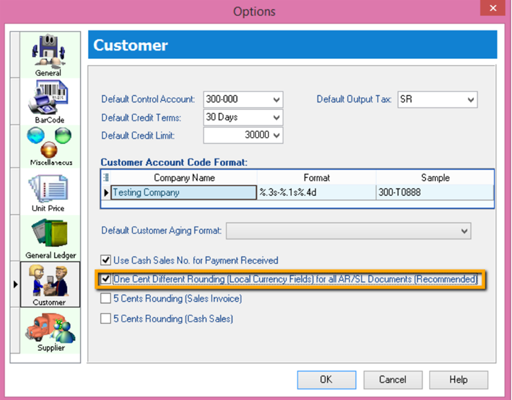

    1. Tick One Cent Different Rounding (Local Currency Fields) for all /AR/SL Documents **(Recommend)**

    2. Press OK

2. Sales Invoice > New > Refer below screen

    

    :::caution
    But once you save you will notice the first line of the Tax Amount will be different, this is because system
    using Total Amount of IV to calculate 6%. Refer below Screen:
    :::

    

    Formula: Sum up SubTotal with Tax, Multiple with 6% **(Note : system will exclude the Subtotal if the Tax Rate is 0%)**

    Tax Amount Calc = RM 15.54 * 6% = 0.93, mostly system will reverse on first line of the Item.

    :::note
    If you don’t want system to help you to do the One Cent Rounding, please refer **Step 1** to **un-tick** the option will do.
    :::

## How to do Password Policy (with 2 Steps Verification) ?

### Password Policy Setup

Go to menu : **Tools > Options…** click on **Password Policy**.

 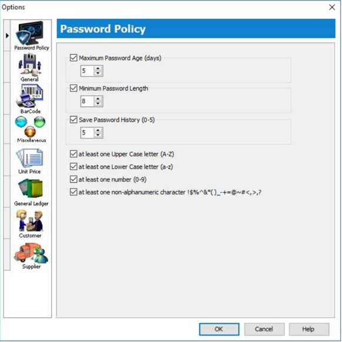

2. You can choose the following password requirement:

    - Maximum Password Age (days): number of days to **expire** and **change** password.
    - Minimum Password Length: password length **cannot less** than the minimum,eg. 8.
    -Save Password History (0-5): number of password history **not allow to re-use**
    - Password combination of
        - At least one Upper Case letter (A-Z)
        - At least one Lower Case letter (a-z)
        - At least one number (0-9)
        - At least one non-alphanumeric character \!\$\%\^\&\*\(\)_\-\+\=\@\~\#\<\,\>\.\?

## New User - Reset Password

1. Go to menu : **Tools > Maintain User**.

2. Click on More (arrow key down), click **Reset Password**.

    

3. New password auto generated.

    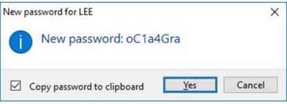

4. Press **Yes** (Copy password to clipboard = Tick).

5. You can press **Ctrl + V** to paste the New Password into email and send to the new user.

## 2-Steps Verifications Login

1. Go to menu : **File > 2-Steps Verification**.

    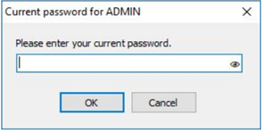

2. Enter your current password, press **Ok** to proceed.

3. Choose an Authenticator device.

    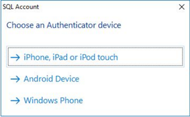

4. Follow the instructions to install and setup the Authenticator in your hand-phone.

5. Each time login, you will require to enter the verification code generated from the Authenticator in your mobile phone.

    


## How to set Running Document Number by Date/Year Format ?

:::tip Sample:
**PV0615/001** is actually (**PVmmyy/001**)
:::

### Steps and Instructions

 **Step 1**

Tools > Maintain Document No

 **Step 2**

Create New or amend from the existing


 :::caution
make sure the format is follow the sample attached
 :::

 **Step 3**

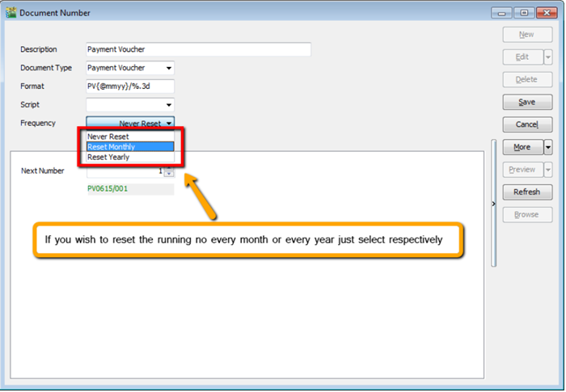

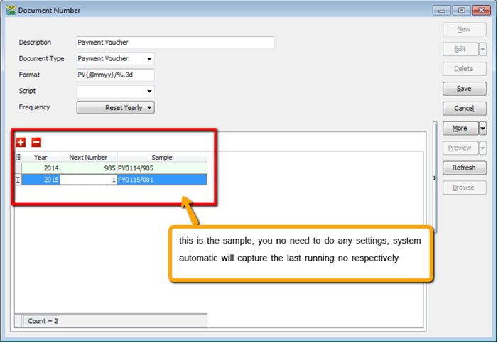

:::info
We can also set default running no at for default payment method
:::

 **Step 4**

Go to tools > Maintain Payment Method

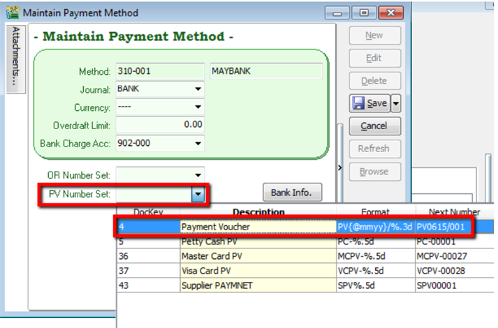


:::note
vice versa for Official Receipt
:::

