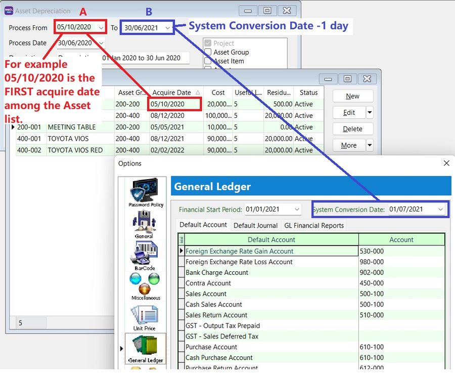
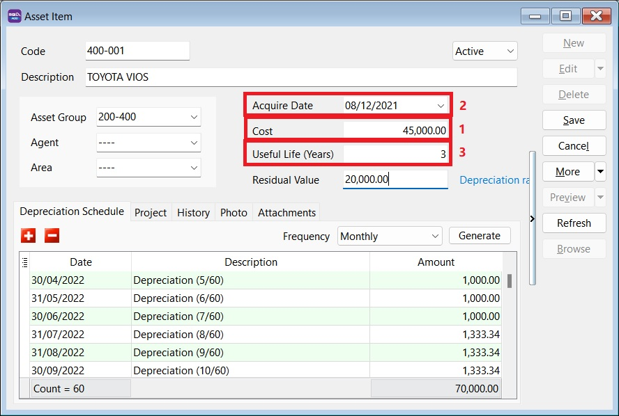
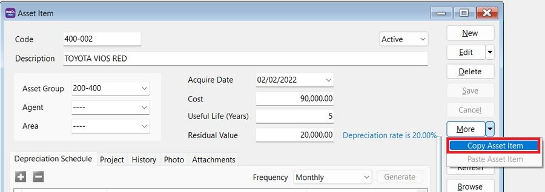
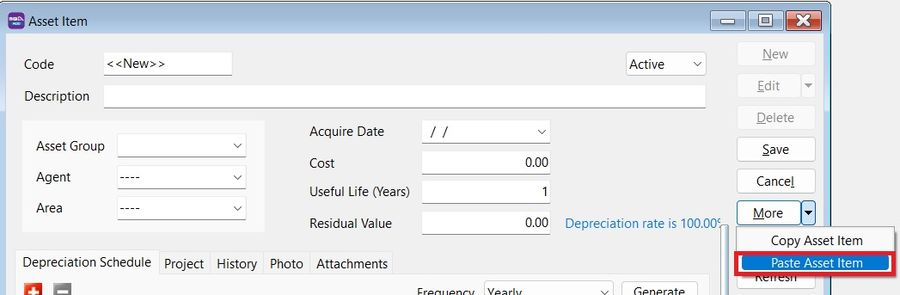

## How to process Asset Opening and tally with the GL Maintain Opening Balance

### Process Opening Depreciation

\*Menu: **Asset > Process Depreciation\***

You can process Asset Opening Depreciation **BEFORE** the System Conversion Date.

:::note Tips:

- **A** - FIRST acquire date of the asset
- **B** - System Conversion Date -1 day

:::

## I have posted the depreciation until December 2021. How do I record my new asset?

### Method 1: Use the Last Asset Net Book Value from Balance Sheet

Maintain the Asset Item as follows:

1. Enter the **Cost** as the **Net Book Value** (as of 31/12/2021).
2. Set the **Acquire Date**, e.g., 01/01/2022.
3. **Useful life** = **Remaining useful life** to be depreciated.
4. Start **Process Depreciation** from 01/01/2022.

### Method 2: Follow Original Cost and Acquire Date

Maintain the Asset as follows:

1. Enter the **Cost** as the **Original Cost**.
2. Set the **Acquire Date** as the **Original Purchase Date**.
3. **Useful life** = **Full useful life**.
4. Process Depreciation until 31/12/2021.
5. Tick **Cancelled** for the Journal Entry posted from Step 4.

## If the depreciation value differs from my previous Journal, can I edit the depreciation value calculated in Maintain Asset Item?

Yes, you can change the depreciation value in **Maintain Asset Item > Depreciation Schedule** tab.

## Can the amortization of Intangible Assets such as licenses, be managed in the Asset Module?

Yes, it can. Maintain it as you would a **Tangible Asset** (Fixed Asset).

For **Intangible Assets** (e.g., goodwill, license), the **amortization calculation** uses the **Straight Line Method**, which can be selected in the **Asset Group**. The calculation involves subtracting the asset's anticipated salvage or book value from its cost and dividing the result by the total number of years it will be used.

## Can I import the asset list using Excel instead of manually keying it in?

Yes, you can. The asset import function is available in SQL Account version 5.2022.948.826 and above.

Refer to [Importing Asset Master List](../../usage/asset/guide#importing-asset-master-list).

## How do I handle additional cost for the Fixed Asset?

Create a new asset code to handle additional costs, e.g.:

| **Asset Code** | **Description**       | **Remark**       |
| -------------- | --------------------- | ---------------- |
| MV-0001        | TOYOTA VIOS - BZZ 999 | Initial Purchase |
| MV-0001A       | TOYOTA VIOS - BZZ 999 | Additional Cost  |

:::info
Do not mix the depreciation value of the original asset and the additional cost.
:::

### Quick Steps

1. Copy the existing asset code.

    

2. Create a new asset.
3. Click on **More > Paste Asset Item**.

    

4. **Change the asset code** by appending characters to differentiate it.

    - **Acquire date** = Date the additional cost was incurred.
    - **Cost** = Additional Cost.

    

## Should the cost in Maintain Asset Item be key-in in local currency or the original currency (eg. purchase in USD)?

The cost should be key-in as the **Local value**. The depreciation value will then be calculated and posted in the local currency.
