## Asset

:::note Fixed Asset Module
This is an **additional module**.
:::

## Maintain Asset Group

*Menu: **Asset > Maintain Asset Group***

Group asset items based on the following considerations:

1. Type of assets, e.g., Motor Vehicle, Furniture, etc.
2. GL Account mapping.

    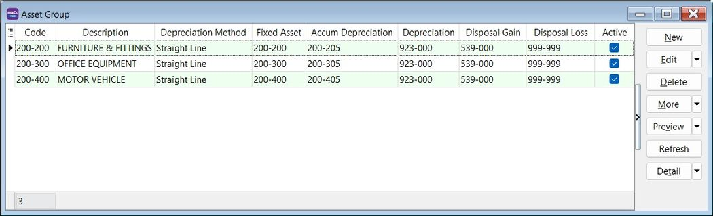

### Asset Group

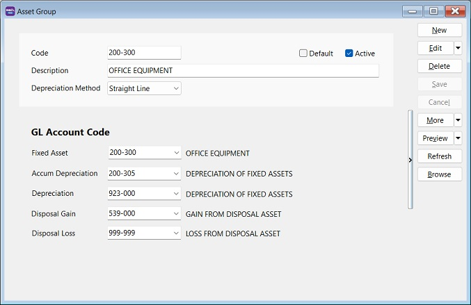

| **Field Name**          | **Explanation & Properties**                                                                                            |
| ----------------------- | ----------------------------------------------------------------------------------------------------------------------- |
| **Code**                | Input the new Asset Group Code. **Field type:** Alphanumerical; **Length:** 20.                                         |
| **Description**         | Input the Asset Group description, e.g., Furniture, Motor Vehicle. **Field type:** Alphanumerical; **Length:** 200.     |
| **Depreciation Method** | Select an appropriate Depreciation Method to generate the depreciation value.                                           |
| **Fixed Asset**         | Select the Balance Sheet GL Account code for Fixed Asset.                                                               |
| **Accum Depreciation**  | Select the Balance Sheet GL Account code for Accumulated Depreciation.                                                  |
| **Depreciation**        | Select the P&L GL Account for Depreciation of Asset.                                                                    |
| **Disposal Gain**       | Select the P&L GL Account for Gain from Disposal of Asset.                                                              |
| **Disposal Loss**       | Select the P&L GL Account for Loss from Disposal of Asset.                                                              |

## Maintain Asset Item

*Menu: **Asset > Maintain Asset Item***

Add new asset items:

### Asset Item

| **Field Name**          | **Field Type** | **Length** | **Explanation**                                                                        |
| ----------------------- | -------------- | ---------- | -------------------------------------------------------------------------------------- |
| **Code**                | Alphanumerical | 20         | Input the new Asset Item Code.                                                         |
| **Description**         | Alphanumerical | 200        | Input the Asset Item description, e.g., Meeting Table, Toyota Vios, Perodua MYVI.      |
| **Asset Group**         | Selection      | –          | Select an appropriate Asset Group for depreciation calculation and GL Account posting. |
| **Agent**               | Selection      | –          | Select the Agent using this Asset Item.                                                |
| **Area**                | Selection      | –          | Select where the asset is located.                                                     |
| **Acquire Date**        | Date           | –          | Set the acquire date for this asset.                                                   |
| **Cost**                | Currency       | –          | Set the purchase cost for this asset.                                                  |
| **Useful Life (Years)** | Integer/Float  | –          | Set the useful life of this asset.                                                     |
| **Residual Value**      | Currency/Float | –          | Set the residual value for this asset.                                                 |
| **Status**              | Selection      | –          | Default is Active. Can be set to Inactive with an inactive date.                       |

### Depreciation Schedule

1. Select the frequency to generate the depreciation schedule:

    1. Monthly
    2. Quarterly
    3. Half Yearly
    4. Yearly

2. Click the **Generate** button.

    

### Project

Set the depreciation allocation by **Project** (for departmental/cost center purposes).

### History

Add important remarks to the asset history. For example: 1. Who has borrowed/when has returned this asset? 2. Asset has been sent for repair or service... 3. Asset has been destroyed by flood.

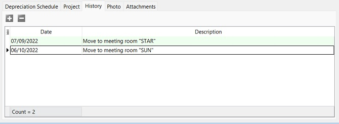

### Photo

Add an asset photo.

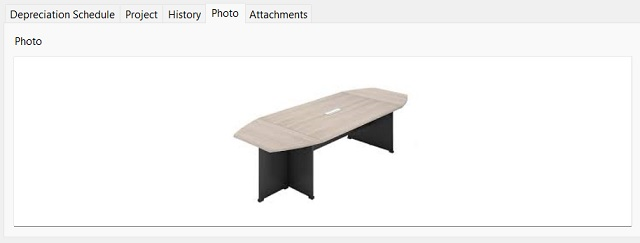

### Asset Item Attachments

Add attachments for an asset.

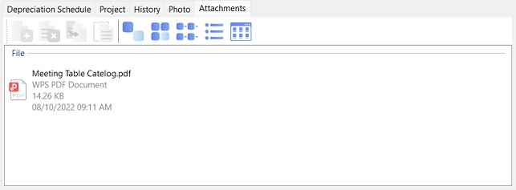

## Asset Depreciation

### Process Depreciation

*Menu: **Asset > Process Depreciation***

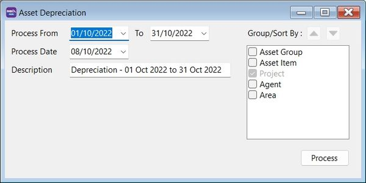

1. Select the process date range:

    :::note Tips:
    1. The process date range allows you to select more than one month or one year to process the depreciation.
    2. Allows you to process **BEFORE** the system conversion date (No update to Maintain Opening Balance).
    :::

2. Select the **Process Date**.

    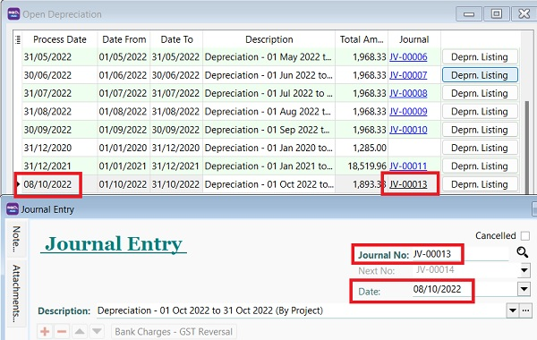

    :::note Tips:
    The Journal Voucher date will follow this **Process Date**.
    :::

3. The description will be captured in the Journal Voucher description.
4. Click **Process**.
5. Preview the asset's depreciation value and Net Book Value (NBV) before posting to the Journal Voucher. Click **Save** to post it.

    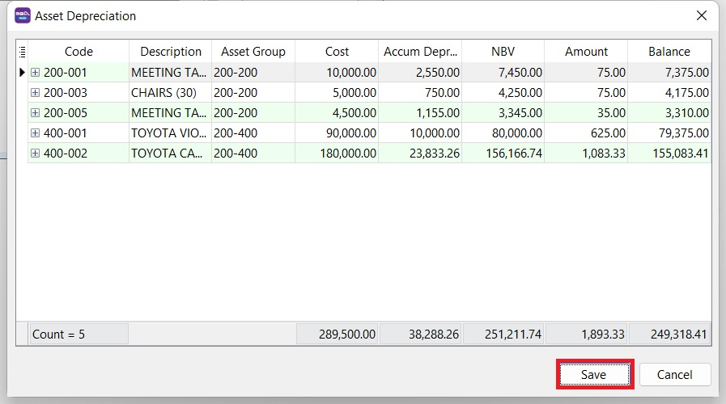

### Open Depreciation

*Menu: **Asset > Open Depreciation***

Open to view the historical **Depreciation Listing**.

## Asset Disposal

*Menu: **Asset > Asset Disposal***

### Asset Disposal Entry

1. Click **New**.
2. Enter **Date**.
3. Select the asset you wish to dispose.
4. Enter **Description**.
5. Enter **Ref1** (e.g., invoice number).
6. Enter **Ref2** (if any).
7. Select **Project**. Defaults to the **Asset Item**.
8. Select **Agent**. Defaults to the **Asset Item**.
9. Select **Area**. Defaults to the **Asset Item**.

    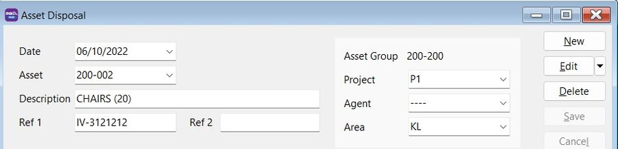

### General Tab

1. **Cost**, **Accum Depreciation**, and **Net Book Value** are automatically retrieved from **Maintain Asset Item**.
2. Enter the **Disposal** value.
3. Select the **Payment Method** to receive the disposal value.
4. The **(Gain)/Loss** is calculated automatically.
5. The **Gain/Loss Account** defaults to the one set in **Maintain Asset**. You may change the **(Gain)/Loss Account** if necessary.

    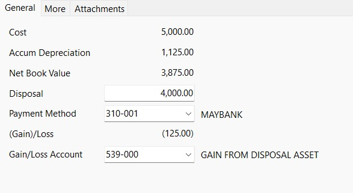

### More Tab

Enter a detailed **Note**.

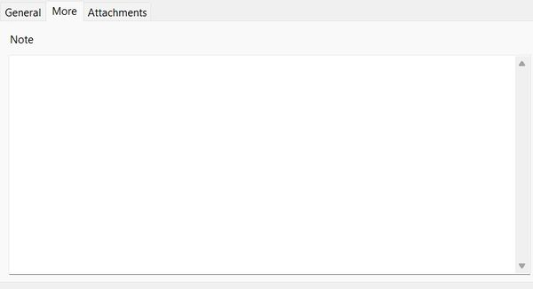

### Asset Disposal Attachments

Add more attachment files.

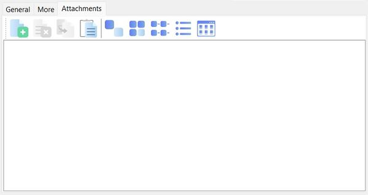

