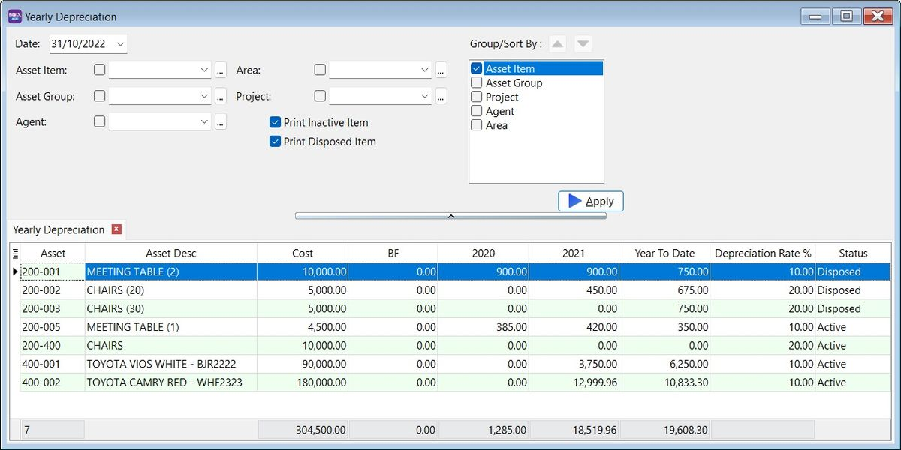
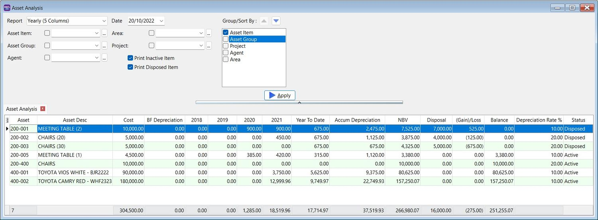
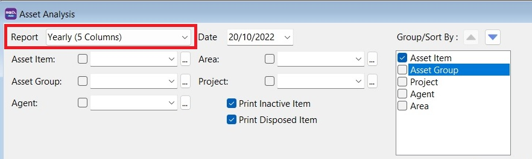
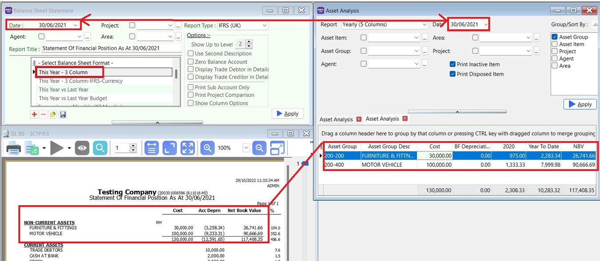
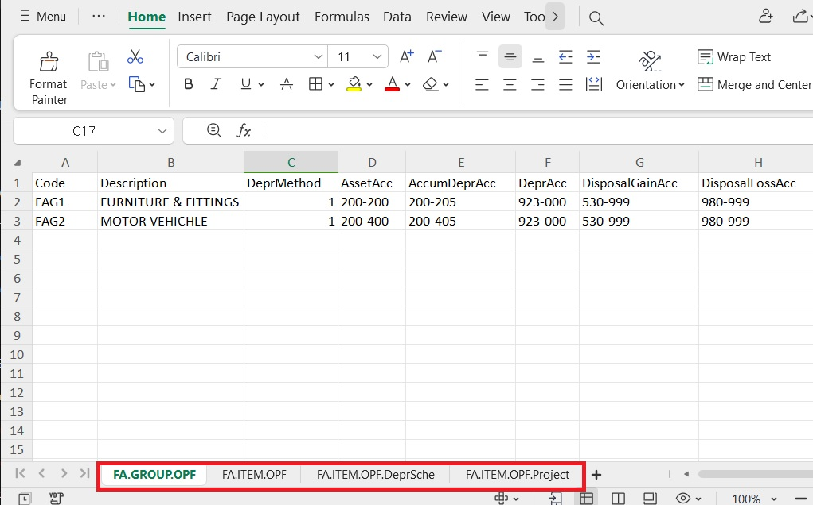
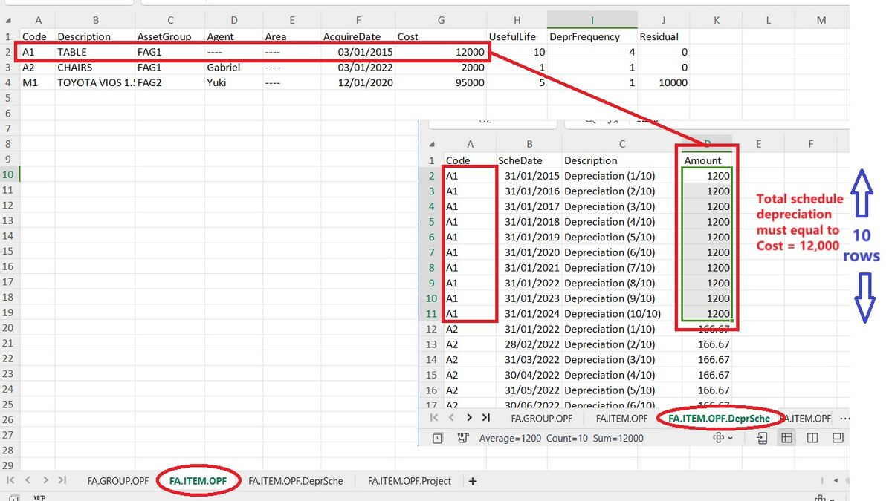
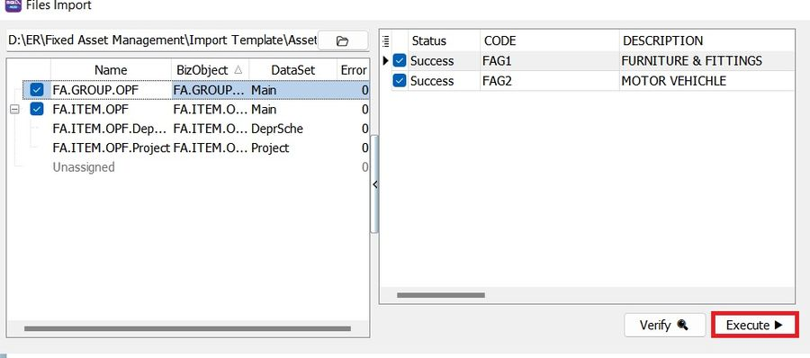
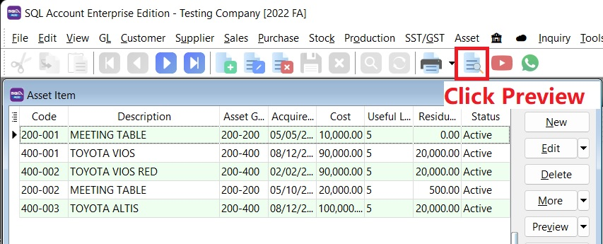
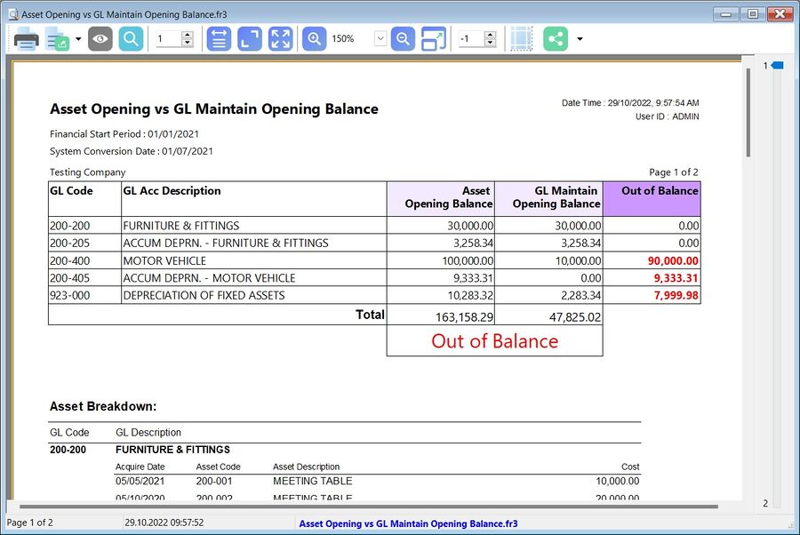
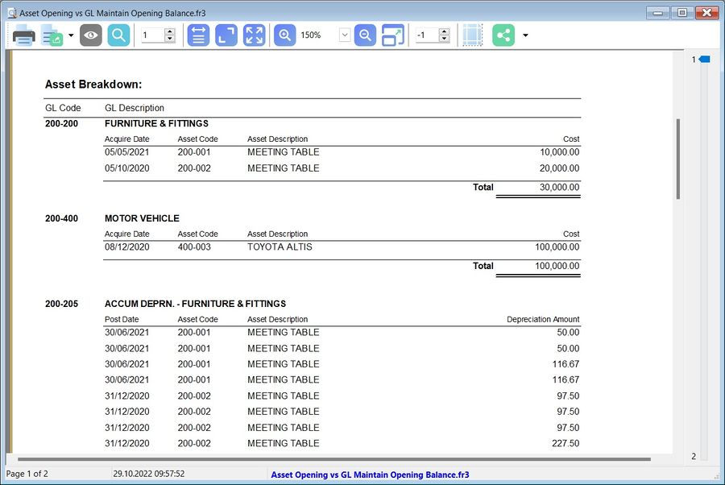

## Print Yearly Depreciation

*Menu: **Asset > Print Yearly Depreciation***

## Print Yearly Analysis

*Menu: **Asset > Print Asset Analysis***

### Reports Selection

1. This will analyze the asset's **Cost**, **Accumulated Depreciation**, **Net Book Value (NBV)**, and **Disposal Value**.
2. It allows you to choose and generate the following report formats:

    - Monthly (12 Months)
    - Quarterly (4 quarters)
    - Half Yearly (First Half and 2nd Half)
    - Yearly (5 Years)

    

### Asset Analysis vs GL Balance Sheet Report

1. At **GL > Print Balance Sheet Statement...**, choose the **Balance Sheet Format**: **This Year - 3 columns**.
2. At **Asset > Print Asset Analysis...**, choose **Report**: **Yearly (5 columns)**.

    

## Print Asset Disposal Listing

*Menu: **Asset > Print Asset Disposal Listing***

## Importing Asset Master List

### Preparation for Asset Master Import Excel Template

Download the [Asset Master Template](https://download.sql.com.my/customer/Asset/Asset_Master_Import.xlsx).

### Asset Master Template (xlsx)

| **Sheet Name**           | **Refer to**                                    |
| ------------------------ | ----------------------------------------------- |
| **FA.GROUP.OPF**         | Maintain Asset Group                            |
| **FA.ITEM.OPF**          | Maintain Asset Item                             |
| **FA.ITEM.OPF.DeprSche** | Maintain Asset Item – Depreciation Schedule tab |
| **FA.ITEM.OPF.Project**  | Maintain Asset Item – Project tab               |

:::warning NOTE:
**DO NOT** rename the **sheet** name.
:::

1. FA.GROUP.OPF (Maintain Asset Group)

    | **Column**          | **Length**  | **Note**                                                                              |
    | ------------------- | ----------- | ------------------------------------------------------------------------------------- |
    | **Code**            | 20          | Asset Group Code, e.g., Furniture.                                                    |
    | **Description**     | 160         | Asset Group Description, e.g., Furniture & Fittings.                                  |
    | **DeprMethod**      | 1 (Integer) | Depreciation Method, e.g., 1: Straight Line Method.                                   |
    | **AssetAcc**        | 10          | e.g., Furniture & Fittings under Non-Current Assets (B/S).                            |
    | **AccumDeprAcc**    | 10          | e.g., Accumulated Depreciation – Furniture & Fittings under Non-Current Assets (B/S). |
    | **DeprAcc**         | 10          | e.g., Depreciation account under Expenses (P&L).                                      |
    | **DisposalGainAcc** | 10          | e.g., Disposal Gain account under Other Income / Expenses (P&L).                      |
    | **DisposalLossAcc** | 10          | e.g., Disposal Loss account under Expenses (P&L).                                     |

    - **Example:**

    | **Code**  | **Description**      | **DeprMethod** | **AssetAcc** | **AccumDeprAcc** | **DeprAcc** | **DisposalGainAcc** | **DisposalLossAcc** |
    | --------- | -------------------- | -------------- | ------------ | ---------------- | ----------- | ------------------- | ------------------- |
    | Furniture | Furniture & Fittings | 1              | 200-200      | 200-205          | 923-000     | 530-999             | 980-999             |
    | MV        | Motor Vehicle        | 1              | 200-400      | 200-405          | 923-000     | 530-999             | 980-999             |

2. FA.ITEM.OPF (Maintain Asset Item)

        | **Column**       | **Length**  | **Note**                                                                 |

    |-------------------|-------------|--------------------------------------------------------------------------|
    | **Code** | 20 | Asset Code, e.g., FF-0001. |
    | **Description** | 160 | Asset Description, e.g., Chairs, Table. |
    | **Asset Group** | 20 | Asset Group, e.g., Furniture. |
    | **Agent** | 10 | Assigned an agent if any. |
    | **Area** | 10 | Assigned an area if any. |
    | **AcquireDate** | Date | Purchase date. |
    | **Cost** | Currency | Purchase cost. |
    | **UsefulLife** | Float | Useful life in years, e.g., 5 years, 3.3 years. |
    | **DeprFrequency** | 1 (Integer) | Depreciation frequency options: 1 = Monthly, 2 = Quarterly, 3 = Half Yearly, 4 = Yearly. |
    | **Residual** | Float | Re-sellable value. |

    - **Example:**

    | **Code** | **Description**       | **Asset Group** | **Agent** | **Area** | **AcquireDate** | **Cost**  | **UsefulLife** | **DeprFrequency** | **Residual** |
    | -------- | --------------------- | --------------- | --------- | -------- | --------------- | --------- | -------------- | ----------------- | ------------ |
    | FF-001   | Chairs                | Furniture       | ----      | KL       | 13/10/2022      | 12,000.00 | 10             | 1 (Monthly)       | 100.00       |
    | FF-002   | Meeting Table         | Furniture       | ----      | KL       | 23/01/2021      | 15,000.00 | 10             | 2 (Quarterly)     | 0.01         |
    | MV-001   | TOYOTA VIOS 1.5 / RED | MV              | YUKI      | SEL      | 17/03/2020      | 88,000.00 | 5              | 4 (Yearly)        | 30,000.00    |

3. FA.ITEM.OPF.DeprSche (Maintain Asset item-Depreciation Schedule)

    | **Column**      | **Length** | **Note**                                                 |
    | --------------- | ---------- | -------------------------------------------------------- |
    | **Code**        | 20         | Asset Code, e.g., FF-0001.                               |
    | **ScheDate**    | Date       | Scheduled depreciation posting date.                     |
    | **Description** | 160        | Depreciation description.                                |
    | **Amount**      | Currency   | Depreciation amount based on the depreciation frequency. |

    - **Depreciation Frequency**

    - **Monthly**

    | **Calculation**     | **Formula**                     | **Result**                      |
    | ------------------- | ------------------------------- | ------------------------------- |
    | No. of Rows         | Useful life × 12 months         | 5 × 12 = 60                     |
    | Amount per Row (RM) | (Cost – Residual) ÷ No. of Rows | (88,000 – 30,000) ÷ 60 = 966.67 |

    - **Quarterly**

    | **Calculation**     | **Formula**                     | **Result**                     |
    | ------------------- | ------------------------------- | ------------------------------ |
    | No. of Rows         | Useful life × 4 quarters        | 5 × 4 = 20                     |
    | Amount per Row (RM) | (Cost – Residual) ÷ No. of Rows | (88,000 – 30,000) ÷ 20 = 2,900 |

    - **Half-Yearly**

    | **Calculation**     | **Formula**                     | **Result**                     |
    | ------------------- | ------------------------------- | ------------------------------ |
    | No. of Rows         | Useful life × 2 half-years      | 5 × 2 = 10                     |
    | Amount per Row (RM) | (Cost – Residual) ÷ No. of Rows | (88,000 – 30,000) ÷ 10 = 5,800 |

    - **Yearly**

    | **Calculation**     | **Formula**                     | **Result**                     |
    | ------------------- | ------------------------------- | ------------------------------ |
    | No. of Rows         | Useful life (years)             | 5                              |
    | Amount per Row (RM) | (Cost – Residual) ÷ No. of Rows | (88,000 – 30,000) ÷ 5 = 11,600 |

    - **Example:**

    

    - **4. FA.ITEM.OPF.Project (Maintain Asset Item-Project)**

    | **Column**  | **Length** | **Note**                   |
    | ----------- | ---------- | -------------------------- |
    | **Code**    | 20         | Asset Code, e.g., FF-0001. |
    | **Project** | 20         | Project Code.              |
    | **Rate**    | Float      | Allocation percentage (%). |

    - **Example:**

    | **Code** | **Project** | **Rate** |
    | -------- | ----------- | -------- |
    | FF-001   | Project-A   | 30       |
    | FF-001   | Project-B   | 70       |
    | MV-001   | Project-A   | 100      |

### Quick Import Asset List

*Menu: **File > Import > Excel Files***

1. Click the **Open folder** button.

    

2. Select the Asset Template excel file...

3. Click **Execute (Direct Import)**. Click **Verify** if you wish to verify the excel data before import.

    

    :::note NOTE:
    Asset import function available in SQL Account version 5.2022.948.826 and above.
    :::

## Generate Asset Opening vs GL Maintain Opening Balance Report

*Menu: **Asset > Maintain Asset Item***

1. At **Maintain Asset Item**, click the **Preview** button.

    

2. For instance, the **Out of Balance** result is obtained by comparing the **Asset Opening Balance** and the **GL Maintain Opening Balance**.

    

3. The **Asset Opening Breakdown** in the report helps you ensure that asset data inputs are correctly recorded in **Maintain Asset Item**.

    

