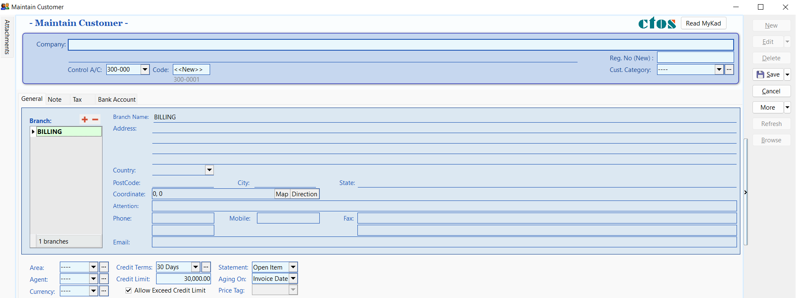

## Customer Guide (Account Receivable)

The **Customer (AR)** module allows you to manage customer profiles, track outstanding balances, and process payments.

## Customer Workflow

The following diagram illustrates the standard Customer (AR) process workflow in SQL Account:

**AR (Account Receivable)** is used to maintain customer profile data, including addresses, contact details, credit limits, and terms.

## Maintain Customer

To create a new customer record:

1. Go to **Customer** → **Maintain Customer**.
2. Click the **New** button.

   

3. Enter the customer's details in the entry screen.

   

### Key Fields in Maintain Customer

| Field Name | Explanation & Properties |
| :--- | :--- |
| **Company** | The customer's billing company name. (Alphanumeric, Max 100 chars) |
| **Description 2** | Optional field for translated names, former names, or registration numbers. (Alphanumeric, Max 100 chars) |
| **Control A/c** | The GL Control Account for posting customer documents. (Lookup from Maintain Accounts) |
| **Code** | The unique Customer Code (can be auto-generated or manual). |
| **Cust Category** | Used to categorize customers for reporting purposes. |

## Customer Profile Tabs

### General Tab

The **General** tab contains primary contact and credit information.

| Field Name | Description |
| :--- | :--- |
| **Branch Name** | Used to maintain multiple addresses (Default: BILLING). |
| **Address** | The company's billing or delivery address (4 lines). |
| **Attention** | The primary contact person. |
| **Phone / Fax** | Contact numbers for the customer. |
| **Email** | The customer's email address for correspondence. |
| **Area / Agent** | Default Area and Agent for sales tracking and reporting. |
| **Currency** | The default transaction currency for this customer. |
| **Credit Terms** | The default payment terms (e.g., 30 Days). |
| **Credit Limit** | The maximum credit allowed (for basic credit control). |
| **Statement** | **Brought Forward** (Summary) or **Open Item** (Detailed). |
| **Aging On** | Calculate aging based on **Invoice Date** or **Due Date**. |
| **Price Tag** | Assign a specific price level to the customer. |

### Note Tab

The **Note** tab is used for internal remarks and tracking account status.

| Field Name | Description |
| :--- | :--- |
| **Account Open Date** | The date the account was created. |
| **Remark** | Internal notes that appear in **Inquiry** → **Account Inquiry**. |
| **Reg No.** | New and old company registration numbers. |
| **Biz Nature** | The customer's industry or business type. |
| **Note** | A rich-text field for detailed knowledge base entries (supports **Date Stamp**). |
| **Status** | **Active**, **Inactive**, **Suspend**, **Prospect**, or **Pending**. |

:::info Account Status Definitions

- **Active**: Full access to documents and statements.
- **Inactive**: Cannot create documents or print statements.
- **Suspend**: Cannot create documents but can print statements.
- **Prospect/Pending**: Can create documents and print statements.

:::

### Tax Tab

Configure tax-related settings and exemptions for the customer.

| Field Name | Description |
| :--- | :--- |
| **Default Tax** | The default tax code applied to this customer's transactions. |
| **Sales/Service Tax No** | The customer's SST registration numbers. |
| **Exemption No** | The Sales Tax Exemption number provided by the customer. |
| **Expiry Date** | The date when the tax exemption expires. |

### Tariff Code Setting

This section is for customers who supply taxable goods under the Sales Tax (Person Exempted from Payment of Tax) Order 2018.

| Field Name | Description |
| :--- | :--- |
| **Tariff** | Add tariff codes for exempted goods. Find codes at [ezhs.customs.gov.my](https://ezhs.customs.gov.my/). |
| **Tax** | Select the appropriate exemption tax code (e.g., SE, SEB, SEC1-5). |

Click **Save** once all information is entered.

## Customer Code Format

Customer codes are unique identifiers. You can configure how they are automatically generated.

:::warning Duplicate Codes
If you attempt to save a duplicate code, the system will display a warning message.
:::

### Configuring Code Formats

Go to **Tools** → **Options** → **Customer** to set the code format.

**Format Explanation:**

**Examples:**

| Company Name | Control Acc | Format | Result |
| :--- | :--- | :--- | :--- |
| ABCD SDN BHD | 301-000 | `%.1s-%.1s%.1d` | 3-A-1 |
| ABCD SDN BHD | 301-000 | `%.2s-%.2s%.2d` | 30-AB-01 |
| ABCD SDN BHD | 301-000 | `%.3s-%.3s%.3d` | 301-ABC-001 |
| ABCD SDN BHD | 301-000 | `%.4s-%.4s%.4d` | 301-ABCD-0001 |

## Advance Credit Control

:::info Paid Module
This is a premium module that requires a separate license.
:::

**Credit Control** is used to manage customer outstanding balances within specific overdue and credit limits.

:::note Access Rights

- Access to Credit Control settings depends on user permissions.
- The ability to override credit limits can be granted in **User Access Control**.

:::

### Credit and Overdue Limits

- **Credit Limit**: Set based on the total outstanding balance.
- **Overdue Limit**: Set based only on the overdue outstanding balance.
- **Add PD Cheque to Credit Limit**: Check this to include post-dated payments when calculating the available credit limit.

### Exceeding Limits

Credit Control can be applied to the following document types:

1. **QT** - Quotation
2. **SO** - Sales Order
3. **DO** - Delivery Order
4. **IV** - Sales Invoice
5. **CS** - Cash Sales
6. **DN** - Debit Note

To control actions when limits are exceeded, check the **Apply To** box for the relevant document type and select an action:

| Control Type | Action | Allow Exceed |
| :--- | :--- | :--- |
| **Exceed Credit Limit** | **Unblock** | Yes |
| **Exceed Credit Limit** | **Block** | No |
| **Exceed Credit Limit** | **Override** | Password Required |
| **Exceed Overdue Limit** | **Unblock** | Yes |
| **Exceed Overdue Limit** | **Block** | No |
| **Exceed Overdue Limit** | **Override** | Password Required |

**Action Definitions:**

- **Unblock**: No restrictions applied.
- **Block**: Document cannot be saved by any user.
- **Override**: Authorized users can enter their credentials to proceed.
- **Suspended**: Blocked with a custom suspension message.

### Suspension Message

You can set a custom message to appear when a customer's account is suspended.

## Customer Invoice

### Customer Invoice vs. Sales Invoice

| Customer Invoice | Sales Invoice |
| :--- | :--- |
| Shows only GL account codes; does not track Qty or Unit Price. | Linked to Stock and Account modules. Tracks Qty and Unit Price. |
| Used for non-stock billing. | Recommended for stock-related billing. |

### Creating a Customer Invoice

1. Go to **Customer** → **Customer Invoice** → **New**.
2. Select the **Customer Code**.
3. Enter the transaction details and amount.
4. Click **Save**.

   

## Customer Payment

### Processing a Payment

:::tip Video Tutorial
Watch the tutorial here: [YouTube](https://www.youtube.com/watch?v=IjHX5ys846I)
:::

1. Go to **Customer** → **Customer Payment** → **New**.
2. Select the **Customer**.
3. Select the **Payment Method** (Bank/Cash) and enter the **Cheque No** if applicable.
4. Enter the **Payment Amount**.
5. Check the corresponding invoices or debit notes to **knock off** (match) the payment.
6. Click **Save**.

   

### Post-Dated Cheques (PDC)

1. Locate the payment and click **Edit**.
2. Right-click on the **Customer Payment** header and select **Set Posting Date**.

   

   

### Bounced Cheques

1. Locate the payment and click **Edit**.
2. Right-click on the **Customer Payment** header and select **Bounced Status**.

   

   

3. The system will automatically revert the payment and update the ledger.

   

## Customer Credit Note

### With Stock Return

If the customer is returning stock, use a **Sales Credit Note** first, then knock it off in **Customer Credit Note**.

1. Go to **Customer** → **Customer Credit Note**.
2. Click **Edit** and confirm with **Yes**.
3. Knock off the relevant documents.

   

### Without Stock Return (e.g., Discounts)

1. Go to **Customer** → **Customer Credit Note** → **New**.
2. Select the **Customer** and the **GL Account**.
3. Enter the **Amount** and knock off the relevant invoices.
4. Click **Save**.

   

## Customer Refund

Use this to refund a customer by knocking off unapplied payments or credit notes.

1. Go to **Customer** → **Customer Refund** → **New**.
2. Select the **Customer** and **Payment Method**.
3. Enter the **Refund Amount**.
4. Knock off the unapplied payment or credit note and click **Save**.

   

## Customer Contra

A **Contra Entry** is used to offset outstanding balances when a company is both a customer and a supplier.

> **Scenario:**
> You have a Sales Invoice for RM200 and a Purchase Invoice for RM150 for the same company. The contra amount is RM150, leaving a net balance of RM50.

### Setup: Contra Account

1. Go to **Tools** → **Options**.

   
2. Select **General Ledger** and ensure a valid **Contra Account** is selected.

   

### Processing a Contra Entry

1. Go to **Customer** → **Customer Contra** → **New**.

   

   

2. Fill in the corresponding details
   1. Select the **Customer Code**.
   2. Enter the **Contra Amount**.
   3. Knock off the Sales Invoice
   4. Click **Save**.
   5. Note the **Contra Number** generated by the system.

   

3. Go to **Supplier** → **Supplier Contra**.

   

4. Locate the same **Contra Number** and click **Edit**.
5. Select the **Supplier**.
6. Ensure the **Contra Amount** matches the Customer Contra.
7. Knock off the Purchase Invoice and click **Save**.

   

   

**Result:**

- The Sales Invoice balance is reduced (e.g., to RM50).
- The Purchase Invoice is fully settled.
- The remaining RM50 can be settled via a standard **Customer Payment**.
