:::warning

Any DIY Scripts in this page should be used in SQL Accounting x86 (32bit) instead of x64 (64bit) version

:::

## Shipping/Forwarding (S/F)

This Customisation is the simple calculation for the Shipping/Forwarding company.

[Sample Database](https://download.sql.com.my/customer/Fairy/ACC%20BK-%5bShipping%5d.zip)

[Video](https://www.youtube.com/watch?v=LPoz1h3hyvQ)

### Settings (S/F)

#### Maintain User (S/F)

*Menu: Tools > Maintain User...*

Untick the Access Right for Prompt Replace Unit Price Dialog under the Group : Sales

### Steps (S/F)

#### Invoice

*Menu: Sales > Invoice...*

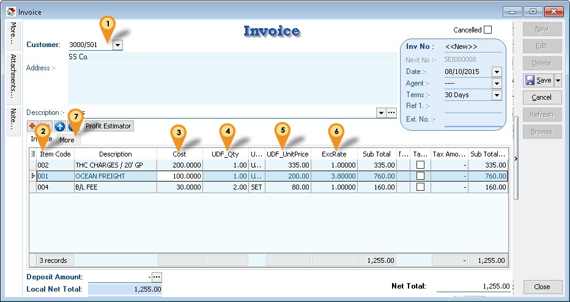

1. Select Customer Code
2. Select Item Code
3. Enter the Cost incurred for the selected item code (for the Profit & Loss By Document report)
4. Enter Qty
5. Enter UnitPrice
6. Enter Exchange Rate (if have)
7. Click More tab to enter extra/others Information

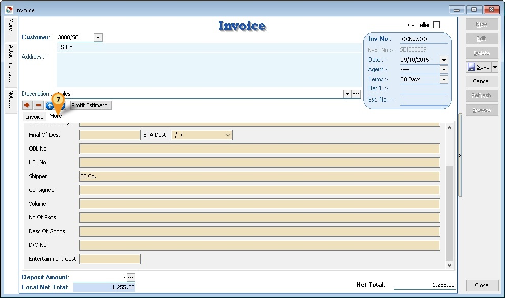

#### Profit & Loss By Document

*Menu: Sales > Print Profit and Loss By Document...*

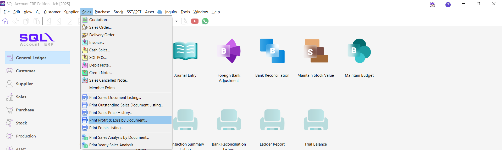

1. Select Invoice Listing & Range Date
2. Tick Group by Customer Code
3. Click Apply
4. Press F6 to preview
5. Select report name 0Sales Local - Invoice Listing - Level 1
6. Click Ok button

## Bonus Point System (BPS)

This Customisation is to calculate/maintain the Point/Bonus

* Pros
  * Able to set Claim Rate (i.e. 1 Point = How many RM eg 1 Point = RM0.01 so enter as 0.01)
  * Able to set Point Rate by item code (i.e. RM1 = How many point eg RM1 = 1 so enter as 1)
  * Point Rate can be calculate by Amount and/or Qty
  * Able to Claim like Voucher as Discount
  * Able to Claim Item
  * Claim Point Rate can be change runtime

* Cons
  * Unable to handle the cancel & Delete Invoice - Manually deduct the point using Update Button on Extra DO
  * If the customer no transaction within the month it unable to Generate Statement
  * No Auto Deduct Expiry Point - manually deduct the point using Update Button on Extra DO
  * Able to handle 2 decimal Point only
  * Batch Insert no checking (i.e. User may over deduct the point)
  * User had to manually Adjust for Opening after the Year End Purging had done.

[Sample Database](https://www.sql.com.my/document/ACC%20BK-%5BBonusVoucherPoint%5D.zip)

### History New/Updates/Changes (BPS)

25 Dec 2015

* Enable Support GST Version
* Add UnClaim Voucher Listing report
* Add Bonus-Sales Invoice 7 (GST 2) report
* Fix Bonus Statement show $ symbol
* Remove auto 5 cents rounding script

### Modules Required (BPS)

* DIY Field
* DIY Script
* Invoice ----> DO
* Multiple Document Number Set

### Settings (BPS)

#### Maintain User (BPS)

*Menu: Tools > Maintain User...*

Untick the Access Right for Prompt Replace Unit Price Dialog under the Group : Sales

#### Maintain Item

*Menu: Stock > Maintain Stock Item...*

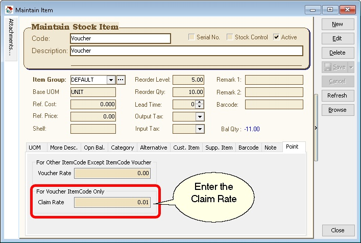

1. Item Code to be create - Voucher => For Claim use (eg 1 point = RM 0.01)

    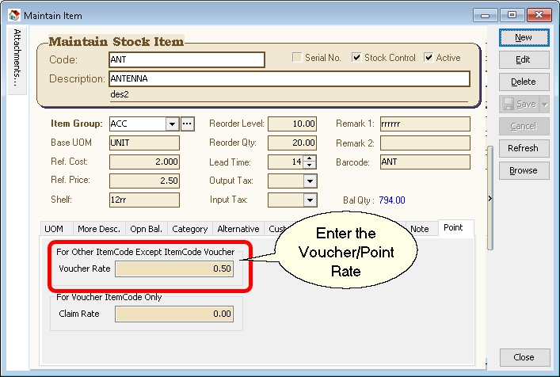

2. For each item code enter the Voucher Rate (eg 0.5 point = RM 1)

***Sales Invoice***

*Menu: Sales > Invoice...*

    This applicable also at Sales Debit Note, Sales Cash Sales & Sales Credit Note

| **UDF Field**      | **Description**                                                                 |
|---------------------|---------------------------------------------------------------------------------|
| **UDF_VoucherNo**  | Enter the Voucher Number (Extra DO DocNo). Amount will be based on the Extra DO DocAmt. Not applicable for Sales Credit Note. |
| **UDF_VoucherRate**| From maintain item. User can still adjust the rate if needed.                    |
| **UDF_UseQty**     | **Tick** → `UDF_Voucher = UDF_VoucherRate * Qty`. **UnTick** → `UDF_Voucher = UDF_VoucherRate * Amount`. |
| **UDF_Voucher**    | `Total current item point`.                                                      |

***Extra Delivery Order***

*Menu: Sales > Extra Delivery Order...*

    This is the center or Ledger for all Point IN & OUT.

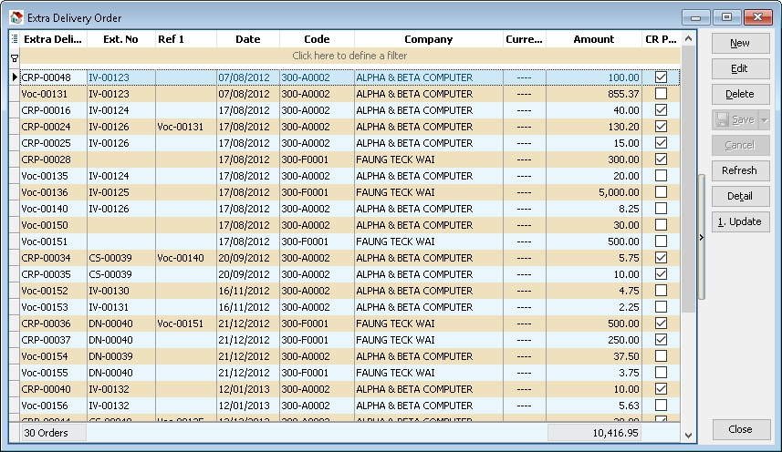

| **Field**       | **Description**                                                                 |
|------------------|---------------------------------------------------------------------------------|
| **DocNo**       | `CRP-XXXXX` → Claim/Deduct Transactions Point. `VOC-XXXXX` → In/Add Transactions Point. |
| **DocNoEx**     | Source document number from which this document is generated.                    |
| **DocRef1**     | Indicates which `VOC-XXXXX` is used for Claim/Deduct Point.                      |
| **DocAmt**      | Total point for each transaction.                                                |
| **UDF_CRPoint** | **Tick** → Claim/Deduct Transactions Point. **UnTick** → In/Add Transactions Point. |

### Steps (BPS)

***Sales Invoice***

Below is example in Sales Invoice with Voucher Claim
*Menu: Sales > Invoice...*

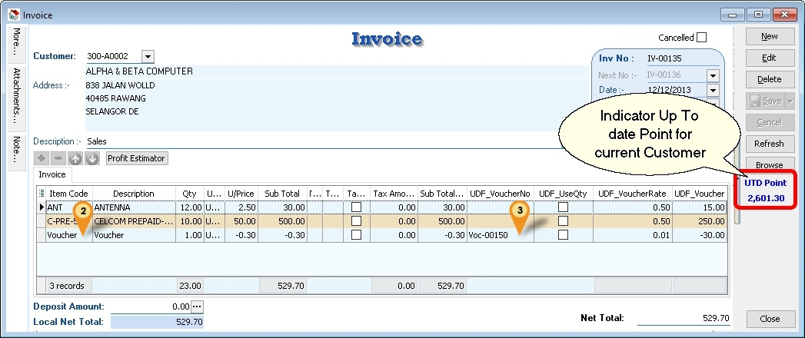

1. Enter all Information (eg Company Code, Date, ItemCode, etc) as norm for Normal Sales (i.e. Add Point).
2. Select itemcode Voucher.
3. Enter the Voucher Number.
4. Save.

:::success If no Voucher is use (i.e. Just deduct/redeem either fully/partly by Point)

* Just enter the UDF_VoucherRate as - (Negative Value) after enter the Negative UnitPrice
:::

***Extra Delivery Order***

*Menu: Sales > Extra Delivery Order...*

In here user can do adjustment for the point for each Customer.

1. Click Update Button

    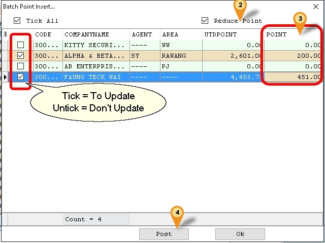

2. Untick this if you wanted to Add the point
3. Enter the Point to Add/Reduce.
4. Click Post Button

#### Extra Delivery Order Listing

*Menu: Sales > Print Sales Document Listing...*

    Here is for user to print the Bonus Statement or UnClaim Voucher Listing report

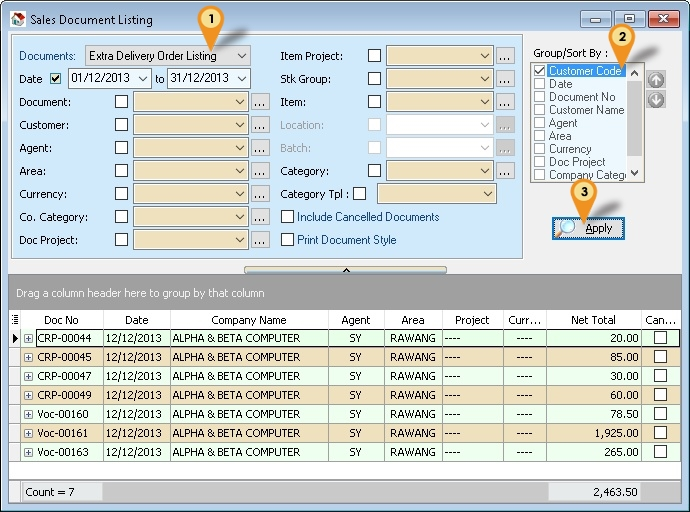

1. Select Extra Delivery Order Listing & Range Date
2. Tick Customer Code
3. Click Apply button
4. Press F6 to preview
5. Select report name Bonus Statement or UnClaim Voucher Listing
6. Click Ok button

## Branch Control

Branch Control Setting is done to prevent branch user from selecting Customer, Project, Stock Item or Location info that is not relevant to them.

### Restricted for

* Branch user only allows to select their own customer
* Preset default Agent, Project, Item Code, Location code for each branch user
* Reports only shows transactions issued by the branch user
* Filter reports only using information assigned to the branch user
* Generate accurate P&L, Stock Balance Report for branches

### Modules Required (Branch Control)

* DIY Field
* DIY Script

## Branch Control Module Features

### Project & Location

* Authorising each branch users to have the accessibility to their respective branch, SQL will automatically assign transactions created by the user to a specific branch to prevent human mistakes. Account entries, stock warehouse will automatically be posted to the appropriate branch.

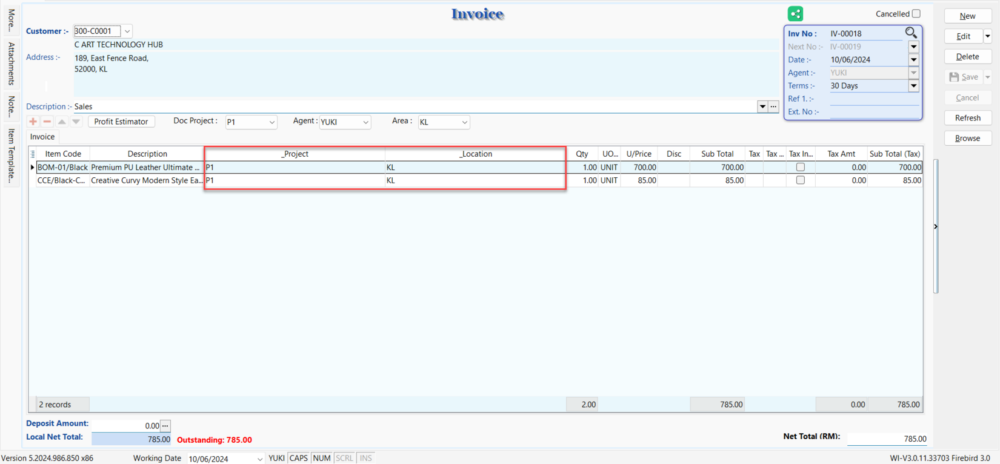

### Customer List

* The user can only select/access the customer information for the own branch and is not permitted to post transactions for any other branch. You can avoid information being shared to other branches at data entry staff’s level.

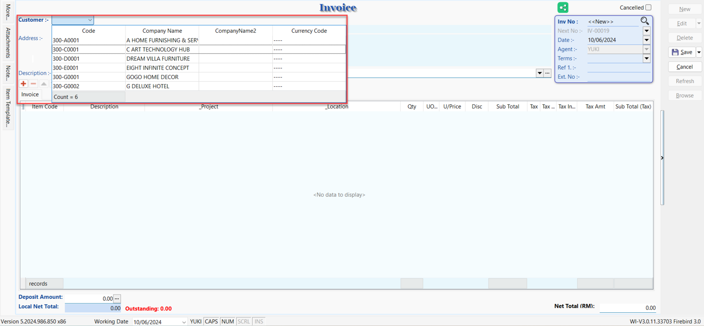

### Agent / Area List

* Automatically set the default agent/area code based on user login to ease the user's instead of requiring manual selection.

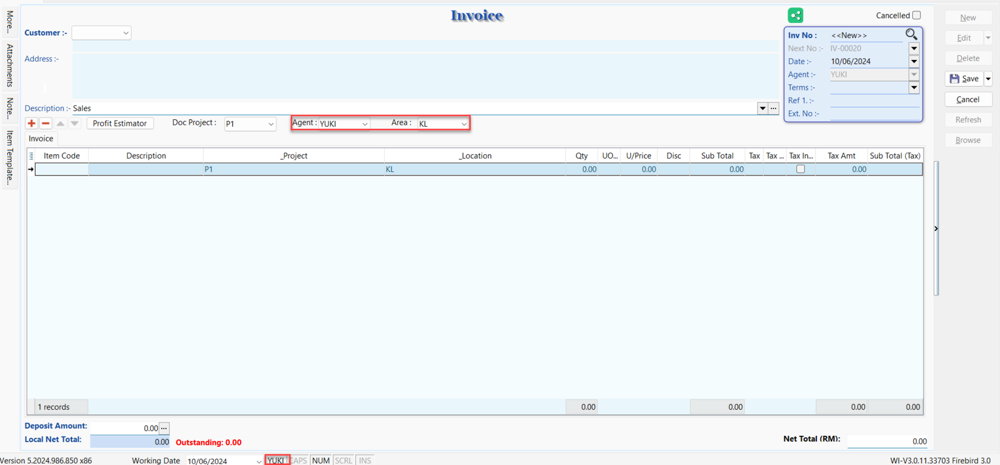

### Stock Item List

* The user only able to select the list of item code belong to their branch.

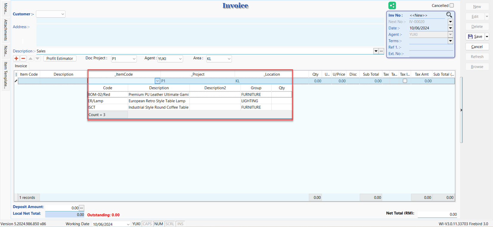

### Payment Method

* Restrict payment methods for each branch to prevent human error and posting to unnecessary accounts.

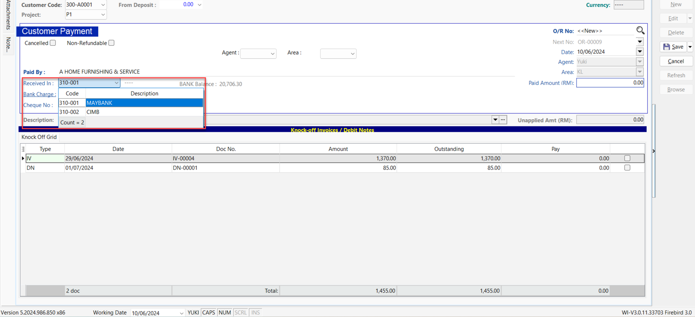

### Reporting

* Stay on top of your financial and operational transactions across all your branches with SQL. You can monitor all transactions happening in each branch. with this information, you can identify which branch is the most profitable and which branch that needs to monitor closely.

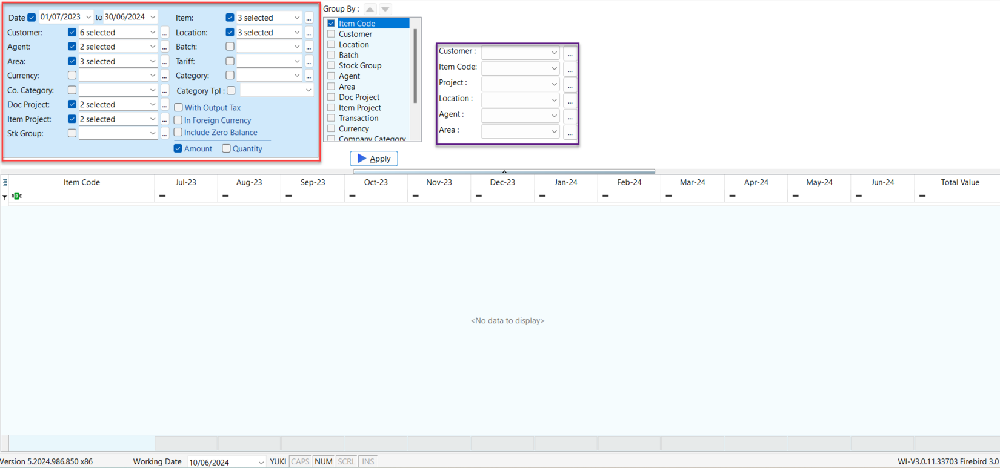

### Profit & Loss Project

* By consolidating headquarter accounts with branch accounts, SQL allows for the viewing of consolidated balance sheets, profit and loss accounts by authorised users to evaluate the company’s overall performance. Bosses are able to drill down to the transactions of each branch individually.

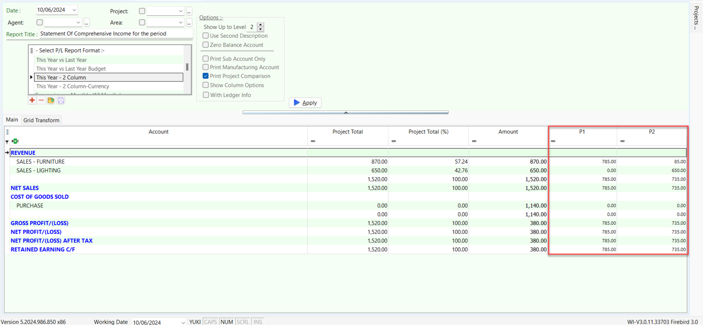

## One Time Setting

*Menu: Tools > Maintain User...*

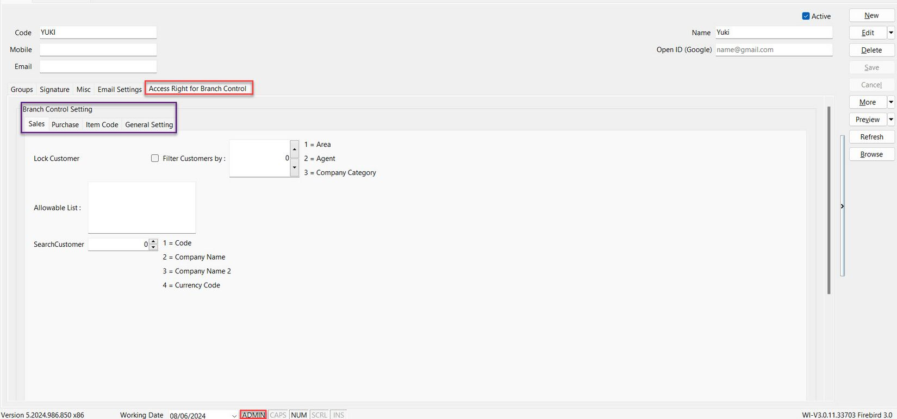

Here are the guidelines to set **Branch Control Setting**

1. **MUST** Logon as **ADMIN** account
2. Choose for the sub account, e.g. Yuki agent account
3. Go to **Access Right for Branch Control** tab
4. Choose the **Branch Control Settings** tab you need

### Sales

1. Tick Lock Customer
2. If want filter customers by :

    | **Filter By**       | **Number** |
    |----------------------|------------|
    | Area                | 1          |
    | Agent               | 2          |
    | Company Category    | 3          |

    The setting can only function within the range of **1 to 3**.

3. Enter the Area code for Area in Allowable List, you are allow to enter more than 1 area codes.
4. If want search customer by

| **Search By**     | **Number** |
|-------------------|------------|
| Code              | 1          |
| Company Name      | 2          |
| Company Name 2    | 3          |
| Currency Code     | 4          |

The setting can only function within the range of **1 to 4**.

:::note E.g.
Tick the **Lock Customer** Option and filtered customer list by area, enter as 1 in Filter Customers by. Enter Area code such as KL, JB, and SG in the allowable list column. User prefer to search for Customer Code, enter as 1 if would like to search Customer Column.
:::

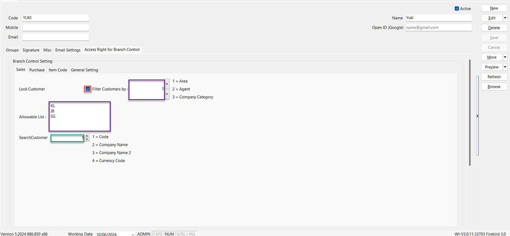

### Purchase

1. Tick Lock Supplier
2. If want filter suppliers by

    | **Filter By**        | **Number** |
    |-----------------------|------------|
    | Area                  | 1          |
    | Agent                 | 2          |
    | Company Category      | 3          |

    The setting can only function within the range of **1 to 3**.

3. Enter the Agent code for Agent in **Allowable List**, you are allow to enter more than 1 agent codes.
4. If want search supplier by :

| **Search By**     | **Number** |
|-------------------|------------|
| Code              | 1          |
| Company Name      | 2          |
| Company Name 2    | 3          |
| Currency Code     | 4          |

The setting can only function within the range of **1 to 4**.

:::note E.g.
Tick the Lock Supplier option and filter supplier list by agent, enter as 2 in Filter Suppliers by. Enter Agent code, such as YUKI, in the allowable list column, and user prefer to search for supplier code, enter as 1 in Search Supplier Column.
:::

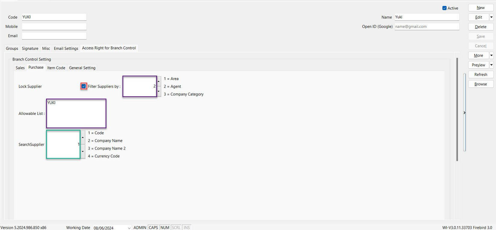

### Item Code

1. Tick Lock Item Code
2. If want filter stock item by

    | **Filter By**  | **Number** |
    |----------------|------------|
    | Stock Group    | 1          |
    | Category       | 2          |
    | Item Code      | 3          |

    The setting can only function within the range of **1 to 3**.

3. Enter the item code for Item Code in **Allowable Item Code**, you are allow to enter more than 1 item codes.
4. If want search item code by

| **Search By**   | **Number** |
|-----------------|------------|
| Item Code       | 1          |
| Description     | 2          |
| Description 2   | 3          |

The setting can only function within the range of **1 to 3**.

:::note E.g.
Tick the Lock Item Code option and filter by item code. Enter item codes, such as BOM-02/Red, ER/Lamp, and ISCT, in the column, and search for item descriptions by item code.
:::

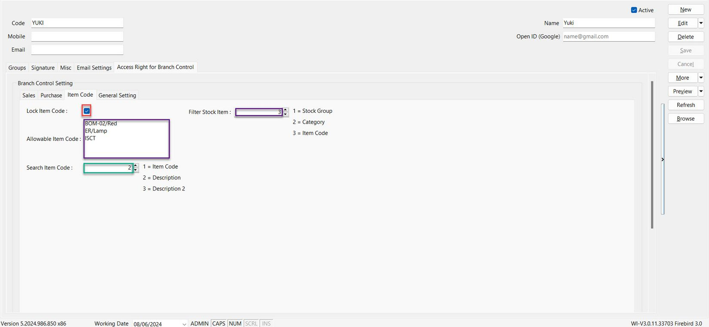

### General Setting

1. Tick Lock Project if you need to lock the project code
2. Tick if want search by Project Code, unticked will search by Project Description.
3. Enter the code for Project Code in Allowable ... columns, you are allow to enter more than 1 codes for Project Code
4. Repeat Step 1 to Step 3 for the remaining settings.

:::note E.g.
Tick the Lock Project option. Tick IsSearchProjectCode to allow searching by project code, and enter project codes, such as P1 and P2, in the column for search.
:::

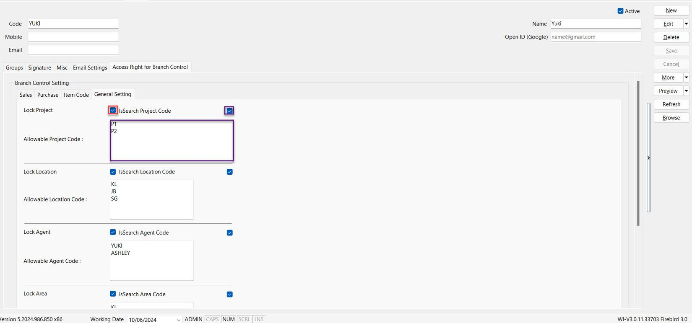

## Assignment 1 : To Create the Unit Price Calculation

* Create the DIY field such as UDF_mUnitPrice in Sales documents (eg. sales invoice)
* Purpose: User will key-in the base unit price to convert into new unit price based on the UOM rate in Maintain Stock Item.

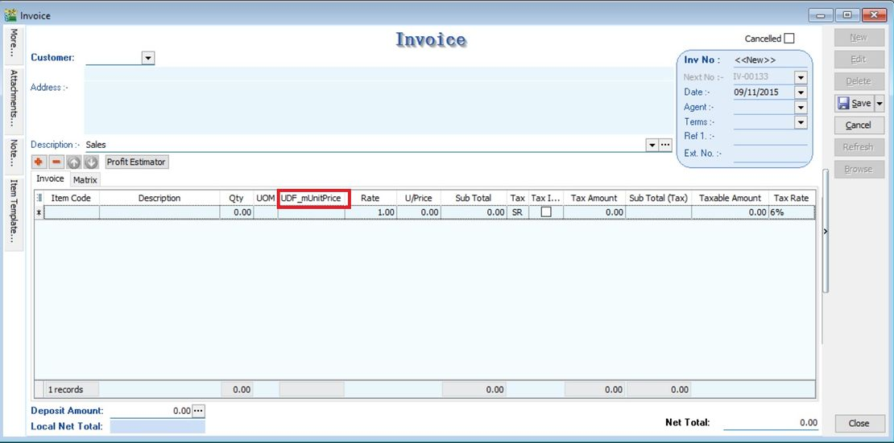

* Calculation for Unit Price := UDF_mUnitPrice x Rate

**Steps :**

### Insert DIY Field (Unit Price Calculation)

1. Click Tools > DIY > SQL Control Center...
2. At the left panel look for Sales Invoice.
3. Point to Items Fields.
4. On the right panel, insert the DIY field as per the TABLE below.

    | Name        | Data Type | Size | SubSize | Caption       | Required       | Default Value | Display Format    |
    |-------------|-----------|------|---------|---------------|----------------|---------------|------------------|
    | mUnitPrice  | Float     | 10   | 2       | UDF_mUnitPrice| FALSE (Untick) | BLANK         | #,0.00;-#,0.00   |

    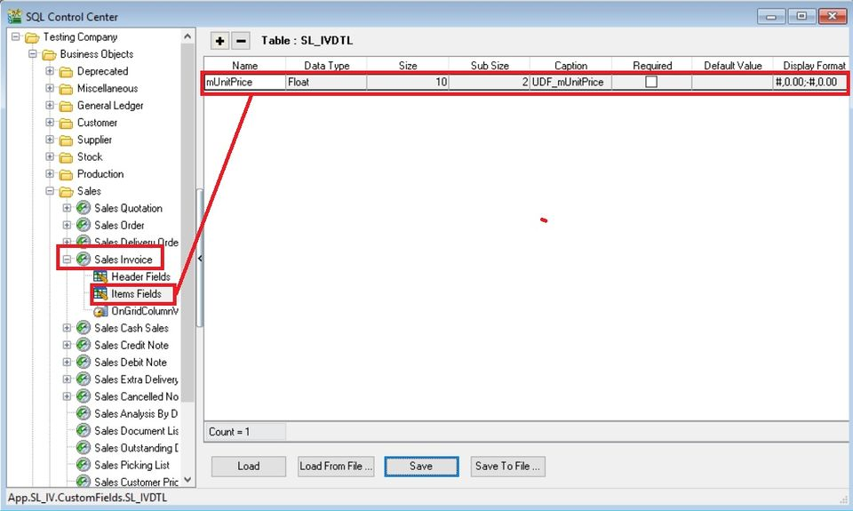

5. Click Save.
6. Update operation successful message. Click OK.
7. DONE

### Insert DIY Script (Unit Price Calculation)

1. Click Tools > DIY > SQL Control Center...
2. At the left panel look for Sales Invoice .
3. Right Click the Sales Invoice.

    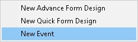

4. Select New Event.

    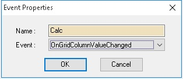

5. Enter any name (eg Calc) in the Name field (Only Alphanumeric & no spacing).
6. Select OnGridColumnValueChanged for Event field.
7. Click OK.
8. Click the Calc (name create at Step 5 above) on the left panel.

    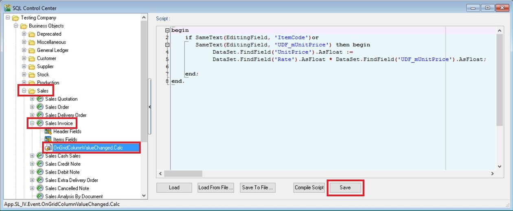

9. Copy below script & paste to the Right Panel (Script Section).

        ```vb
        begin
            if SameText(EditingField, 'ItemCode')or
              SameText(EditingField, 'UDF_mUnitPrice') then begin
                    DataSet.FindField('UnitPrice').AsFloat :=
                    DataSet.FindField('Rate').AsFloat * DataSet.FindField('UDF_mUnitPrice').AsFloat;

            end;
        end.
        ```

10. Click Save button.

:::warning
Avoid update the same existing field name Unit Price. You have to create different name ie. UDF_mUnitPrice.
:::

### Result Test (Unit Price Calculation)

1. Go to Stock > Maintain Stock Item...
2. Edit the item code ANT.
3. Insert additional UOM with different RATE, eg. 1 CARTON = 12 UNITS and 1 BOX = 60 UNITS.

    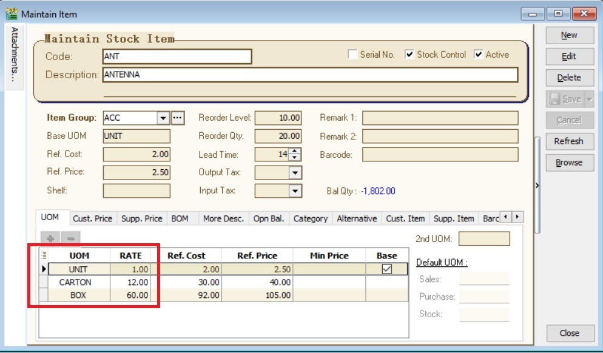

4. Create new sales invoice from Sales > Invoice...
5. Call out the columns name UDF_mUnitPrice and Rate.

    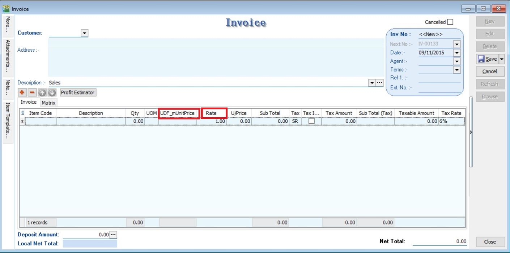

6. Insert and select the item code ANT.
7. Select the UOM to CARTON. Rate will be changed to 12.
8. Input the value into UDF_mUnitPrice. U/Price will be calculated from your DIY script formula (UDF_mUnitPrice x Rate).

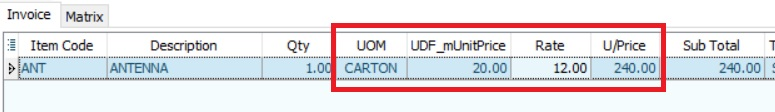

## Assignment 2 : How to get the data from Master Table into entry form?

* Create the DIY fields such as UDF_PCS, UDF_CTN in Maintain Stock Item; and
* UDF_Price in Sales Documents (eg. sales invoice).
* Purpose is:

      ```bash

      Get UDF_PCS & UDF_CTN from Maintain Item to Sales Invoice Detail UDF_Price

      If selected itemcode UOM is PCS then use UDF_PCS
      if selected itemcode UOM is CTN then use UDF_CTN
      if selected itemcode UOM not PCS or CTN then default is 1

      ```

* Calculation for Unit Price := UDF_Price * UDF_Rate

**Steps :**

### Insert DIY Field (Master Data)

1. Click Tools > DIY > SQL Control Center...
2. At the left panel look for Stock > Stock Item .
3. Point to Stock Items Fields.
4. On the right panel, insert the new field as per the table below.

    | Name | Data Type | Size | SubSize | Caption   | Required       | Default Value | Display Format       |
    |------|-----------|------|---------|-----------|----------------|---------------|----------------------|
    | PCS  | Float     | 10   | 2       | UDF_PCS   | FALSE (Untick) | BLANK         | #,0.00;-#,0.00       |
    | CTN  | Float     | 10   | 2       | UDF_CTN   | FALSE (Untick) | BLANK         | #,0.00;-#,0.00       |

    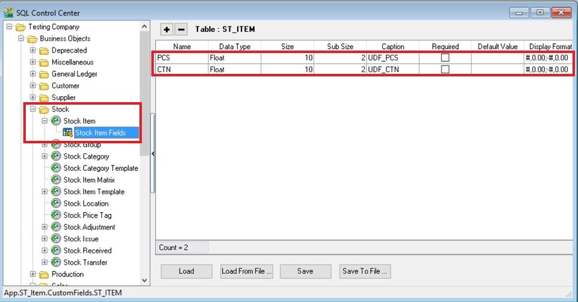

5. Click Save.
6. Update operation successful message. Click OK.
7. Next...
8. At the left panel look for Sales > Sales Invoice.
9. Point to Items Fields.
10. On the right panel, insert the new field as per the table below.

    | Name  | Data Type | Size | SubSize | Caption    | Required       | Default Value | Display Format       |
    |-------|-----------|------|---------|------------|----------------|---------------|----------------------|
    | Price | Float     | 10   | 2       | UDF_Price  | FALSE (Untick) | BLANK         | #,0.00;-#,0.00       |
    | Rate  | Float     | 10   | 2       | UDF_Rate   | FALSE (Untick) | BLANK         | #,0.00;-#,0.00       |

    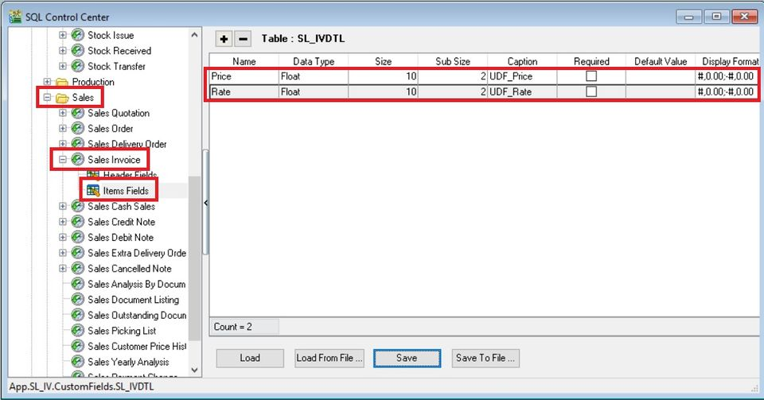

11. Click Save.
12. Update operation successful message. Click OK.
13. DONE.

### Create Quick Form (Master Data)

1. Click Tools > DIY > SQL Control Center...
2. At the left panel look for Stock > Stock Item .
3. Right click on te Stock Item.
4. Select New Quick Form Design.

    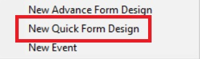

5. Enter the new name as EXTRA. Click OK.

    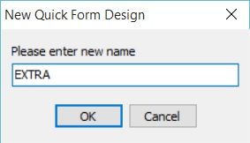

6. Click on the EXTRA follow by Customize button.
7. Drag the UDF_CTN adn UDF_PCS from right to the place marked X. See the screenshot below.

    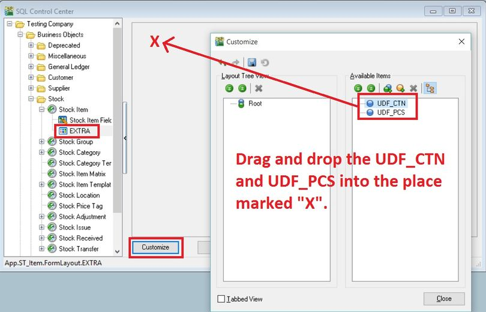

8. Both the UDF fields will be under the Root. Click CLOSE.

9. Click SAVE.

    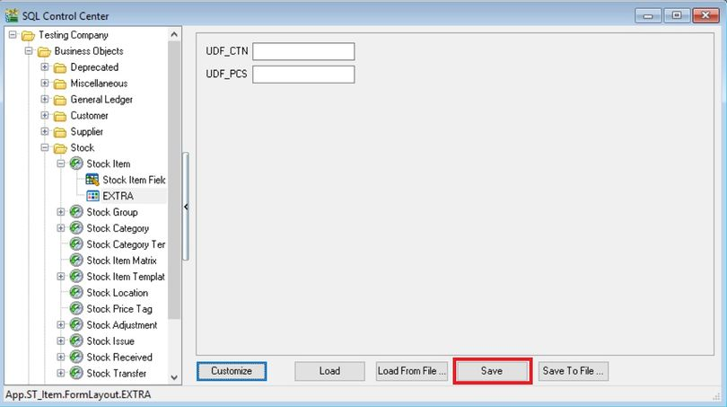

10. DONE.

### Insert DIY Script (Master Data)

1. Click Tools | DIY | SQL Control Center...
2. At the left panel look for Sales Invoice .
3. Right Click the Sales Invoice.

    

4. Select New Event.

    

5. Enter any name (eg Calc) in the Name field (Only Alphanumeric & no spacing).
6. Select OnGridColumnValueChanged for Event field.
7. Click OK.
8. Click the Calc (name create at Step 5 above) on the left panel.

    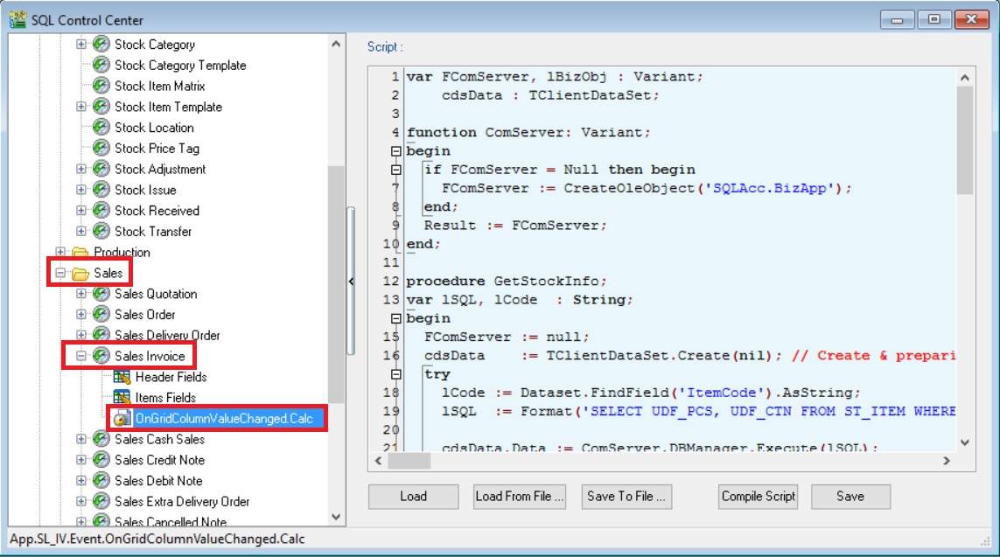

9. Copy below script & paste to the Right Panel (Script Section).

        ```bash
        var FComServer, lBizObj : Variant;
            cdsData : TClientDataSet;
            D : TDataSource;

        function ComServer: Variant;
        begin
          if FComServer = Null then begin
            FComServer := CreateOleObject('SQLAcc.BizApp');
          end;
          Result := FComServer;
        end;

        procedure GetStockInfo;
        var lSQL, lCode  : String;
        begin
          FComServer := null;
          cdsData    := TClientDataSet.Create(nil); // Create & preparing Component
          try
            lCode := D.Dataset.FindField('ItemCode').AsString;
            lSQL  := Format('SELECT UDF_PCS, UDF_CTN FROM ST_ITEM WHERE Code=%s',[QuotedStr(lCode)]);

            cdsData.Data := ComServer.DBManager.Execute(lSQL);
          finally
            lBizObj    := null;
            FComServer := null;
          end;
        end;

        begin
          D := TDataSource(Self.FindComponent('dsDocDetail'));

          if SameText(EditingField, 'ItemCode') or
            SameText(EditingField, 'UOM') or
            SameText(EditingField, 'UDF_Rate') then begin
            try
              GetStockInfo;
              if D.Dataset.FindField('UOM').AsString = 'PCS' then
                D.Dataset.FindField('UDF_Price').AsFloat := cdsData.FindField('UDF_PCS').AsFloat else
              if D.Dataset.FindField('UOM').AsString = 'CTN' then
                D.Dataset.FindField('UDF_Price').AsFloat := cdsData.FindField('UDF_CTN').AsFloat else
                D.Dataset.FindField('UDF_Price').AsFloat := 1;

              Dataset.FindField('UnitPrice').AsFloat := D.Dataset.FindField('UDF_Price').AsFloat *
                                                        D.Dataset.FindField('UDF_Rate').AsFloat;
            finally
              cdsData.Free;
            end;
          end;
        end.
        ```

10. Click Save button.

    :::warning
    Avoid update the same existing field name Unit Price and "Rate". You have to create different name ie. UDF_Price and UDF_Rate.

    Remember to Register the "Automation Server Registration" in Tools -> Options -> General -> Register.
    :::

### Result Test (Master Data)

1. Go to Stock > Maintain Stock Item...
2. Create a new item code called PEN.
3. Update the UOM tab. See the screenshot below.

    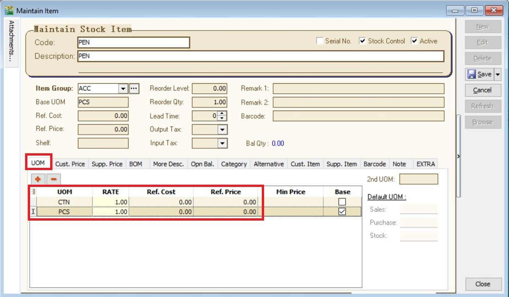

4. Click on EXTRA tab.
5. Input the UDF_CTN and UDF_PCS value.

    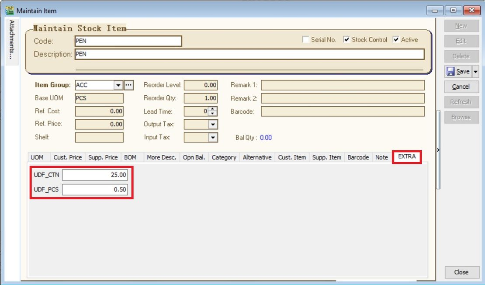

6. Create new sales invoice from Sales > Invoice...
7. Call out the columns name UDF_Price and UDF_Rate.

    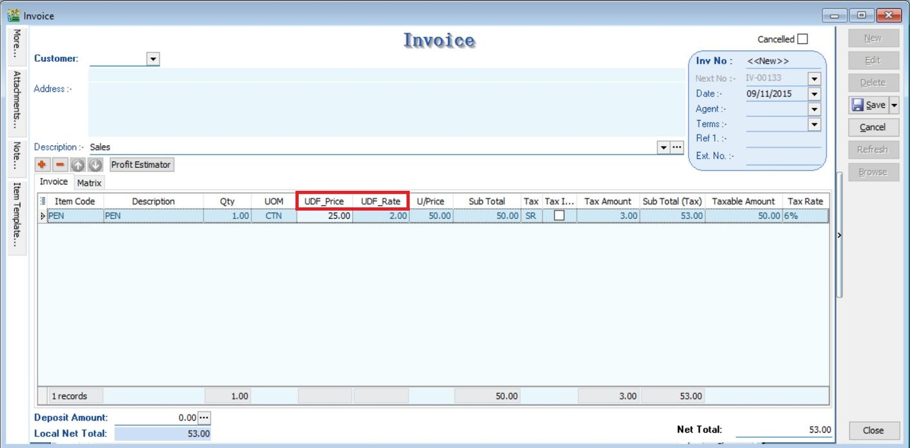

8. Insert and select the item code PEN.
9. Select the UOM to CTN.
10. UDF_Price will be changed to 50.00 (based on the UDF_CTN set for PEN).
11. Input the value into UDF_Rate. U/Price will be calculated from your DIY script formula (UDF_Price x UDF_Rate).

    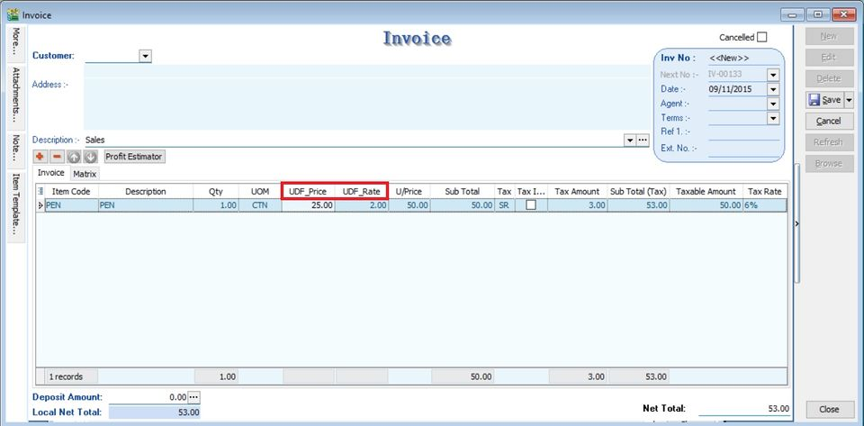

## Assignment 3 : How to get Outstanding IV amount & show below the Browse button at Sales Invoice?

* This assignment no need to create any DIY fields
* Purpose is to display the total outstanding balance for the customer selected at the Invoice

**Steps :**

### Insert DIY Script (Outstanding Amount)

1. Click Tools > DIY > SQL Control Center...
2. At the left panel look for Sales Invoice .
3. Right Click the Sales Invoice.

    

4. Select New Event.

    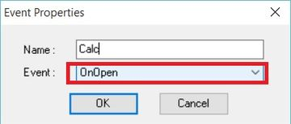

5. Enter any name (eg Calc) in the Name field (Only Alphanumeric & no spacing).
6. Select OnOpen for Event field.
7. Click OK.
8. Click the Calc (name create at Step 5 above) on the left panel.

    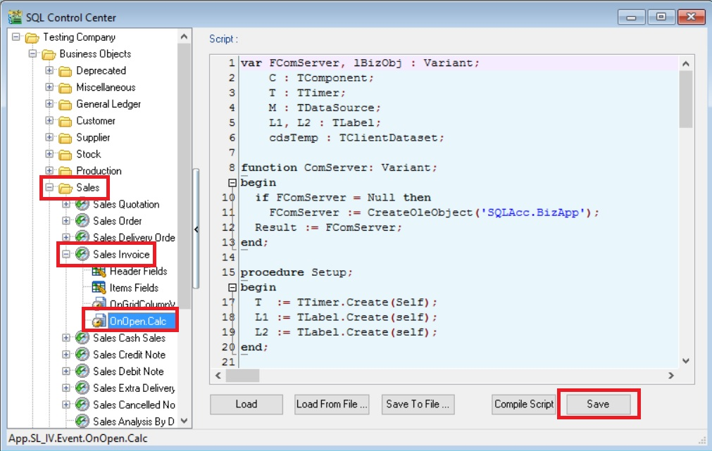

9. Copy below script & paste to the Right Panel (Script Section).

        ```bash
        var FComServer, lBizObj : Variant;
            C : TComponent;
            T : TTimer;
            M : TDataSource;
            L1, L2 : TLabel;
            cdsTemp : TClientDataset;

        function ComServer: Variant;
        begin
          if FComServer = Null then
            FComServer := CreateOleObject('SQLAcc.BizApp');
          Result := FComServer;
        end;

        procedure Setup;
        begin
          T  := TTimer.Create(Self);
          L1 := TLabel.Create(self);
          L2 := TLabel.Create(self);
        end;

        procedure DocInfo;
        var lSQL, lDocNo : String;
        begin
          lDocNo := M.Dataset.FindField('DocNo').AsString;

          FComServer := null;
          cdsTemp := TClientDataset.Create(nil);
          lSQL := Format('SELECT (DocAmt - PaymentAmt) OS FROM AR_IV '+
                        'WHERE DocNo=%s ',[QuotedStr(lDocNo)]);

          try
            cdsTemp.Data := ComServer.DBManager.Execute(lSQL);
          finally
            FComServer := null;
          end;
        end;

        procedure OnTimer(Sender: TObject);
        var AState : TDataSetState;
        begin
          AState := M.DataSet.State;
          if AState = dsBrowse then begin
            DocInfo;
            L2.Caption := '';
            try
              L2.Caption := FormatCurr('#,0.00;-#,0.00', cdsTemp.FindField('OS').AsFloat);
            finally
              cdsTemp.Free;
            end;
          end;
        end;

        begin
          M := TDataSource(Self.FindComponent('dsDocMaster'));
          C := Self.FindComponent('frDataSetButton1');

          if Assigned(C) then begin
            T.Enabled  := True;
            T.Interval := 1000; // = 1 sec
            T.OnTimer  := @OnTimer;

            with L1 do begin
              Parent     := TWinControl(C);
              Width      := 66;
              Left       := 6;
              Top        := 350;
              Caption    := 'Outstanding';
              Font.Color := clBlue;
              Font.Style := [fsBold];
            end;
            with L2 do begin
              Parent     := TWinControl(C);
              Width      := 66;
              Left       := 6;
              Top        := 365;
              Caption    := 'DocNo';
              Font.Color := clBlue;
              Font.Style := [fsBold];
            end;
          end;
        end.
        ```

10. Click Save button.

### Result Test (Outstanding Amount)

1. Create a new sales invoice, eg. Invoice Amount = Rm1060.00

    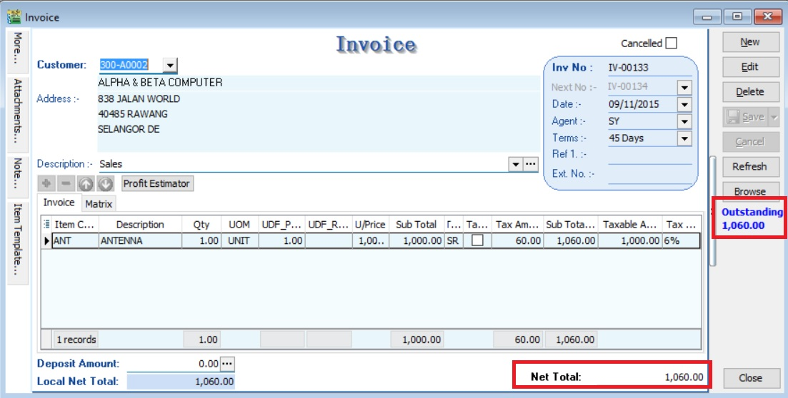

2. Make a payment amount = Rm636.00 and knock-off with the invoice created in step 01.

    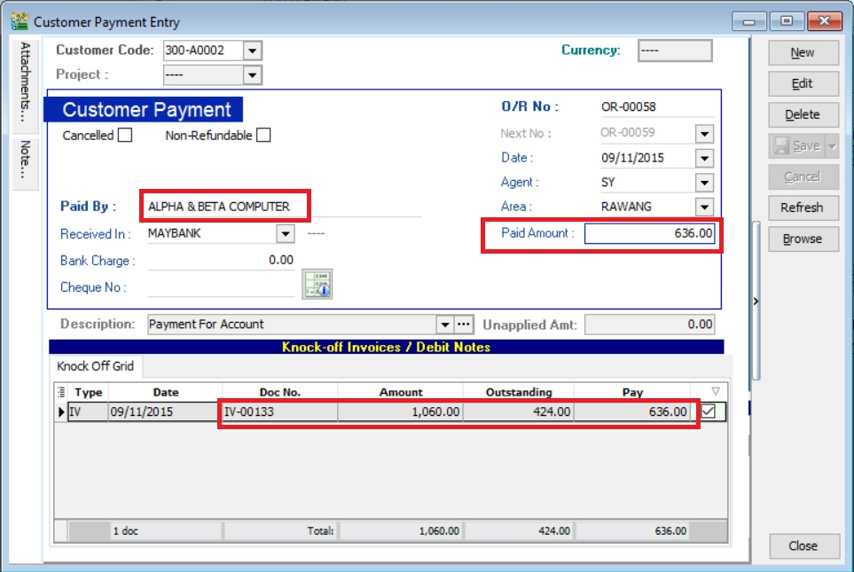

3. You can get the document outstanding balance (Rm1060.00 - Rm636.00 = Rm424.00) at Sales Invoice.

    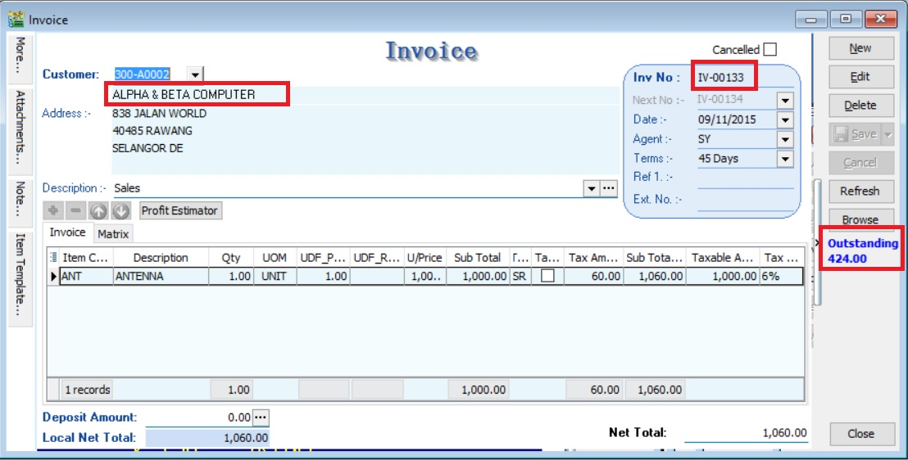
