## Financial Period & System Conversion Date

:::info
Watch the tutorial video here: [YouTube](https://www.youtube.com/watch?v=yH8VfNGjEr0&feature=youtu.be)
:::

1. **Tools** → **Options**

    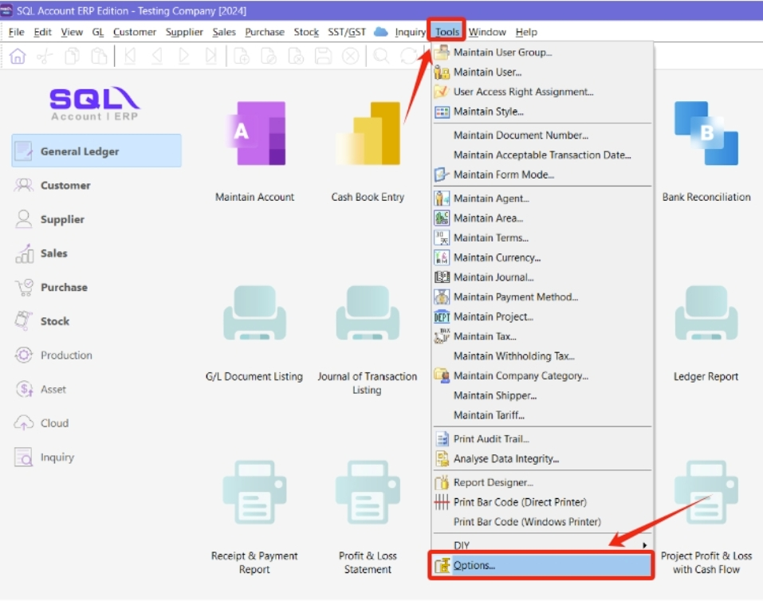

   :::note
   Once you have set up your Financial Start Period and System Conversion Date, it is not possible to change them later. This configuration can only be set once when creating a new database.
   :::

2. Select **General Ledger**

3. Select **Financial Start Period & System Conversion Date**

   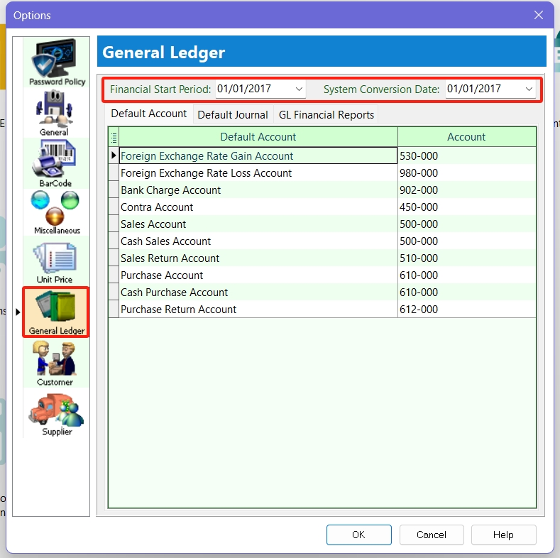

   :::note Scenario 1
   My financial period starts on 1 January every year. I started using SQL on 1/1/2015.

   **Financial Start Period** = 1/1/2015

   **System Conversion Date** = 1/1/2015
   :::

   :::note Scenario 2
   My financial period starts on 1 January every year. I started using SQL on 1/4/2015.

   **Financial Start Period** = 1/1/2015

   **System Conversion Date** = 1/4/2015
   :::

## SST

### Activate SST

1. In SQL Account, click the menu **SST/GST** → **Start SST now...**

   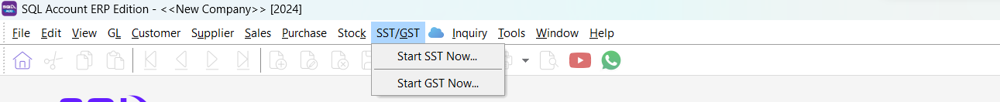

2. Select **Malaysia** as the country, then click **Next**.

   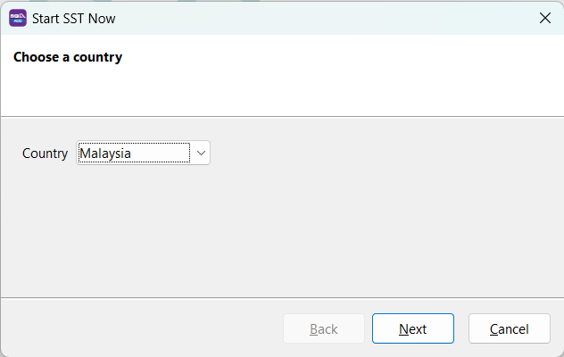

3. Fill in **SST Effective Date**

4. Tick **I have an SST registration number** if you have a valid SST registration number from the government (skip to *Step 6* if you don't).

   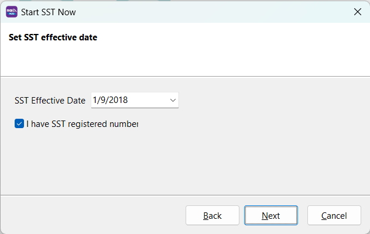

5. Fill in your **Sales Tax No** and **Service Tax No**. These details will be auto-updated in your company profile.

   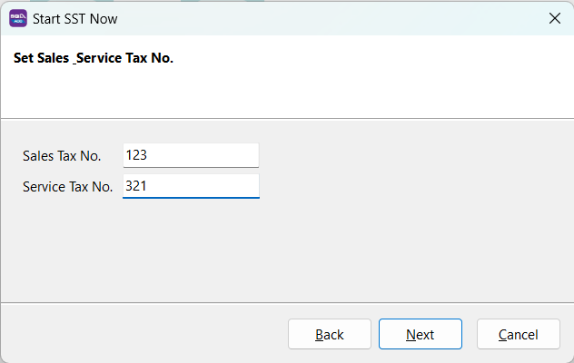

6. In the next step, click **Next** to auto-generate the **SST GL Account**.

   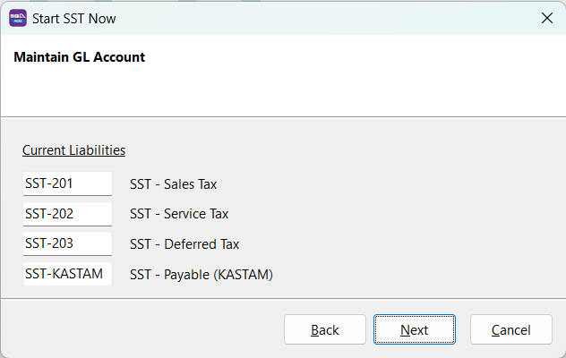

7. In the following screen, you can preset your tax code for billing (Sales Tax, Service Tax, Sales Tax Exempted, etc.)

   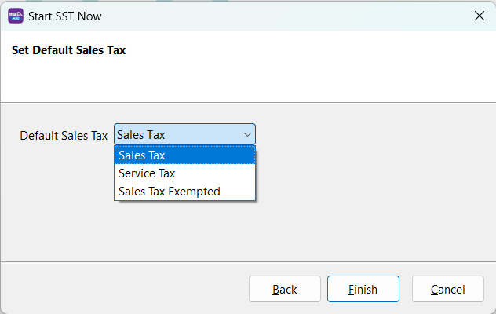

8. The system will prompt you to log in again; after that, you're ready to go.

9. After logging in, you will see a new drop-down list for SST functions. The SST setup is now complete.

### Maintain Tariff

Go to **Tools** → **Maintain tariff** → **New**

Insert your product tariff code here. You can also look up your product tariff code using the Malaysia Customs [JKDM HS Explorer](https://ezhs.customs.gov.my/)

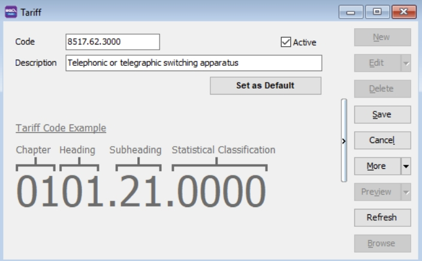

## Company Profile

1. Go to **File** → **Company Profile**

   Fill in your company particulars. If the company is subject to both sales and service tax, enter the Sales Tax and Service Tax numbers.

   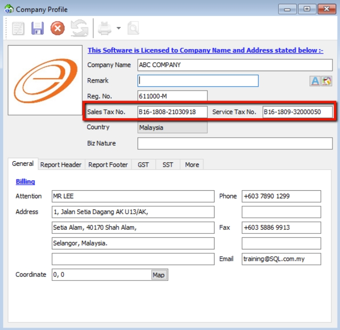

2. Select **Report Header** & **Set Report Header**

   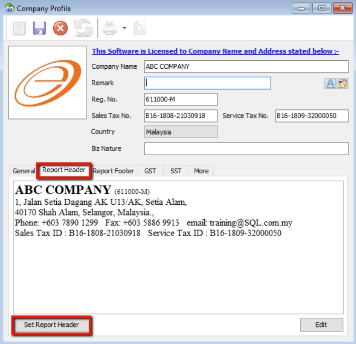
