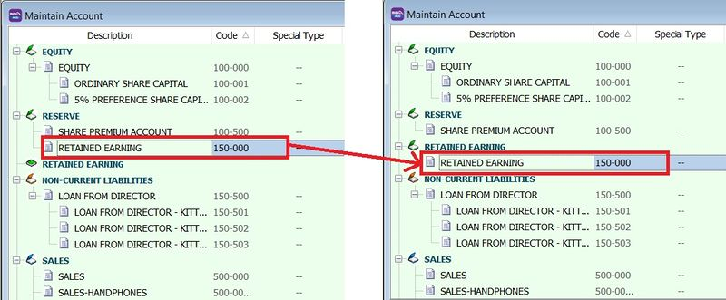
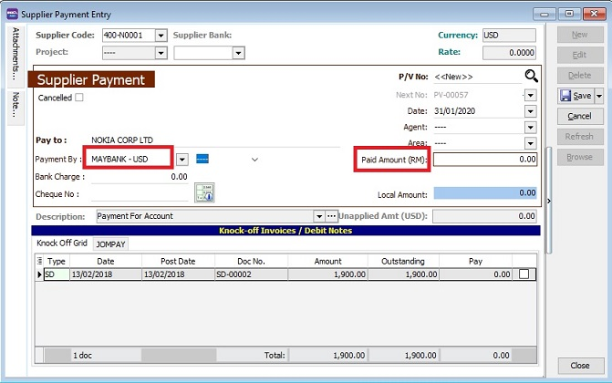

## Trial Balance Issues

### Trial Balance Does Not Balance in YTD (Year To Date)

**Issue:**

The Year To Date (YTD) Debit and Credit totals do not balance in the Trial Balance because the Retained Earnings account is missing.

**Solution:**

1. Go to **GL** → **Maintain Account...**
2. Restore the **Retained Earnings** account by dragging and dropping it into the **Retained Earnings** group (original).

    

3. Re-apply the Trial Balance.
4. Once the Retained Earnings account is restored, the YTD Debit and Credit totals should balance.

### Trial Balance is Not Balanced

If your Trial Balance does not balance, perform the following checks:

#### 1. Ensure Retained Earnings has a valid Account Code

Go to **GL** → **Maintain Account**.

:::note
If the Retained Earnings group is empty, create an account under **Reserve**, then drag it into the **Retained Earnings** group.
:::

#### 2. Ensure the Opening Balance is Balanced

1. Go to **GL** → **Maintain Opening Balance**.
2. Uncheck **Project** at the top left.
3. Ensure that **Local DR** and **Local CR** totals are balanced.

   

#### 3. Identify Imbalances in Current Transactions

:::tip
If the steps above are correct, the imbalance is likely caused by a current transaction.
:::

1. Go to **GL** → **Print Journal of Transaction Listing**.
2. Select the date period that is not balanced.
3. Click **Preview**.
4. Select the report named: **GL Journal-of-Transaction-Imbalance-Document**.
5. This report will list the specific documents causing the imbalance.
6. You may need to upload a backup file to support for further investigation.

## Bank and Currency Management

### Setting a Foreign Bank Account to USD

**Issue:**

I cannot enter foreign bank transactions in USD.

**Solution:**

Ensure you have the following add-on modules:

- **Multi-Currency**: Allows adding multiple currency codes (e.g., USD, SGD).
- **Advance Currency**: Allows bank accounts to use foreign currencies.

1. Go to **Tools** → **Maintain Payment Method...**
2. Edit the **Foreign Bank Account**.
3. Change the currency to **USD**.

    

4. The foreign bank account will now be valued in USD. See the example below in Supplier Payment.

### Foreign Bank Adjustment

1. Go to **GL** → **Foreign Bank Adjustment** → **New** → Click **Bank Revalue**.

    

2. In the Revalue window, select the **Bank Account Code** and **Date**.

    

3. The USD balance and local amount will be displayed based on the ledger report.

    

4. Enter the **Revalue to currency rate**. The system will automatically recalculate:
   - **New local balance amount**
   - **Gain/Loss Amount**

    

5. Click **OK**.

    

6. The system will automatically post the double entries.

    

7. Click **Save**.
8. Verify the adjustment in the ledger report.

## Fixed Assets and Depreciation

### Recording Accumulated Depreciation for Fixed Assets

1. Go to **GL** → **Journal Entry** → **New**.
2. Enter the double entry for recording accumulated depreciation.

   :::info
   **Example:** Recording motor vehicle depreciation for the year 2015:
   - **Debit:** Depreciation Expenses (RM 1,000)
   - **Credit:** Accumulated Depreciation of Motor Vehicle (RM 1,000)
   :::

3. Click **Save**.

   

### Copying Depreciation for Subsequent Years

1. Go to **GL** → **Journal Entry** and open the depreciation entry from the previous year (e.g., 2015).
2. Right-click on an empty space and select **Copy Journal Entry**.

   

3. Click **New**.
4. Right-click on an empty space and select **Paste Journal Entry**.

   

5. Update the date, description, and amount as needed.

   

6. Click **Save**.

## Stock Value Management

### Auto Maintain Stock Value with Project Setup

:::caution
Requires SQL Account version 839 or above.
:::

#### Step 1: Enable Auto Post GL Stock Value

1. Go to **Tools** → **Options**.

    

2. Select **Miscellaneous**.
3. Check **Auto Post GL Stock Value**.

    

#### Step 2: Map Balance Sheet Stock Account

1. Go to **Stock** → **Maintain Stock Group**.

    

2. Click **Edit**.
3. Select the **Account Code** for Stock Value Posting.
4. Click **Save**.

    

    :::note
    Ensure all Stock Groups are mapped to a **Balance Sheet Account Code**.
    :::

    

#### Step 3: Map Project Code in Maintain Location

1. Go to **Stock** → **Maintain Location**.

    

2. Click **Edit**.
3. Assign a stock project to each location.
4. Click **Save**.

    

    :::info
    Ensure all locations are mapped to a **Project Code**.
    :::

    

    :::note
    You may skip this step if you only use one project.
    :::

#### Step 4: Maintain Stock Month End

This step shows the total stock value for the default project and specific projects (e.g., P1).

:::info **Example A: Default Project**
Project Code: ----
Closing Stock: 308,534.22
:::

:::info **Example B: Project P1**
Project Code: P1
Closing Stock: 3,560.00
:::

#### Step 5: Automatic Stock Value Updates in Financial Reports

:::note
When you apply a **Profit & Loss Statement, Balance Sheet, or Trial Balance**, the system automatically retrieves the stock value from the **Stock Month End Balance** and updates the closing stock value in **Maintain Stock Value**.
:::

1. Example of a Balance Sheet Statement showing the **Closing Stock Value**.

    

:::info
If the date falls outside the **Maintain Acceptable Trans Date** range, the system will not retrieve the stock value or perform the update.
:::

### Auto Post Stock Month End Value Setup

:::warning
Requires SQL Account version 748 or above.
:::

This feature automatically posts the stock value from the Month End value to the GL Maintain Stock Value.

#### Step 1: Configure Stock Groups

Go to **Stock** → **Maintain Stock Group**.

#### Step 2: Generate Stock Month End Balance Report

Go to **Stock** → **Print Stock Month End Balance Report**.

:::info
You must fill in the **Balance Sheet Account** in the Stock Group to update the GL Stock Value.
:::

#### Step 3: Verify in Maintain Stock Value

Go to **GL** → **Maintain Stock Value**.

## Bank Reconciliation

### Auto Bank Reconciliation Example

#### Step 1: Create a New Bank Reconciliation

1. Go to **GL** → **Bank Reconciliation** → **New**.
2. Select the **Bank Statement Date**.
3. Select the **Account**.
4. Check **Show Current Recon Transactions**.
5. Click **Apply**.

   

6. Click **Load Statement**.

   

7. Select your **Bank Statement (PDF / CSV)**.

   

8. The system will detect your bank name and prompt a confirmation message. Click **Yes** if it is correct.

   

9. Once the statement is loaded, the bank closing amount will be automatically filled.

   

   :::info
   **Matching Criteria:**
   1. Cheque number + Amount
   2. Description + Amount
   :::

10. The system will automatically match transactions with the bank statement and check them (highlighted in yellow).

    Transactions that cannot be auto-matched will remain unchecked (indicated by the red box).

   

#### Step 2: Manually Match Unmatched Transactions

1. Select an unmatched transaction.
2. At the bottom, search for **SAME DR/CR AMOUNT**. You will see one or more **Match** buttons if matching amounts are found.

   

3. Click **Match** when you identify the correct bank transaction (e.g., Salary for Ali).

   

   The system will then check the transaction and display the date and bank description in the **Bank Statement (Match)** column.

### Manual Bank Reconciliation Example

:::note
For Opening Bank Reconciliation, please refer to this [Guide](../../usage/general-ledger/guide.md#bank-reconciliation).
:::

Bank reconciliation ensures that the company's records (check register, **General Ledger**, **Balance Sheet**, etc.) match the bank's records.

#### Reconciling Bank Transactions

1. Go to **GL** → **Bank Reconciliation**.

   

   

2. Select the **Bank Statement Date**.
3. Select the **Bank Account** (e.g., Hong Leong Bank).
4. Set the **Display Period** (typically, the 'From' date is left blank, and the 'To' date matches the Bank Statement Date).
5. Check the following options:
   - **Show Unticked Transaction**
   - **Show Current Recon Transaction**
   - **Merge Bank Charges**
6. Click **Apply**.
7. Check the transactions that match your bank statement and click **Save**.

   

   

#### Printing the Bank Reconciliation Report

After completing the reconciliation, you can save and preview the report.

:::tip
Press **F6** to preview the report.
:::

## Financial Analysis and Reporting

### How to Calculate P&L Percentages

:::note
**Formula:** (Account Amount / Total Sales) * 100
:::

#### Examples

- **Sales % (A):** (184,119.49 / 296,502.11) * 100 = **62.1%**
- **Purchase % (C):** (7,406.8 / 296,502.11) * 100 = **2.5%**
- **Gross Profit % (D):** (281,662.21 / 296,502.11) * 100 = **95.0%**
- **Expenses % (E):** (10,000 / 296,502.11) * 100 = **3.4%**
- **Net Profit % (F):** (271,805.66 / 296,502.11) * 100 = **91.7%**

:::info
Percentages are rounded to one decimal point.
:::

### P&L Statement for More Than 12 Months

1. Go to **GL** → **Print Profit & Loss Statement**.

    

2. Right-click the **SQL Icon** and select **800 x 600** to resize the screen.

    

3. Drag the report name **This Year - 2 Column** to your desktop.

    

4. Drag the report from your desktop back into the SQL Account window.

    

5. Click **OK** when prompted.

    

6. Double-click the report name **This Year - 2 Column** (displayed in blue).

    

   1. Enter a new report name.
   2. Change the period class to **Fixed Date**.
   3. Set **Param 1** (Date From) and **Param 2** (Date To).
   4. Click **OK**.

   

:::info
Apply the report as usual; the results will be based on the parameters set. You can repeat these steps for the **Balance Sheet Statement**.
:::

### P&L Statement with Appropriation Account

1. Go to **GL** → **Maintain Account**.

    

    1. Select the **Appropriation Account**.
    2. Click **New**.

        

    3. Enter the **GL Code** and **Description**, then click **OK**.

2. Go to **GL** → **Journal Entry** → **New**.

    

    **Example:** Debit Dividend (2,000), Credit Bank (2,000).

3. Go to **GL** → **Print P&L Statement**.
   1. Select the **Date**.
   2. Select the report format: **This Year – 2 Column**.
   3. Click **Apply**.

       

   4. Click **Preview**.

       

       

## Troubleshooting and Other FAQs

### General Ledger Report Ref1 (DocNo) Appears as `<<New>>`

If `Ref1(DocNo)` appears as `<<New>>` in the General Ledger Report, follow these steps to fix it:

1. Identify the document source and date (e.g., 31/03/2015).

    

2. Go to **Journal Entry** and locate the entries for that date.

    

3. Click **Edit** and then **Save** for all entries on that date.
4. Re-apply the ledger report to verify the fix.

    

### Budget Management

#### Budget Setting

1. Go to **GL** → **Maintain Budget**.

    

2. Select the **Year**.
3. Choose a **Project Code** or select 'Non Project'.
4. Click **Edit**.
5. Enter monthly budget amounts; quarterly, half-yearly, and yearly totals will update automatically.
6. Enter budgets by account code.
7. Click **Save**.

    

#### Profit & Loss Statement with Budget

You can compare actuals against monthly or yearly budgets using various report formats:

- This Month vs. Monthly Budget
- This Year vs. Yearly Budget
- This Year vs. Last Year Budget

    

#### Balance Sheet Statement with Budget

Similar to the P&L, the Balance Sheet supports budget comparisons:

- This Month vs. Monthly Budget
- This Year vs. Yearly Budget

    

### Withholding Tax

#### Setup Withholding Tax Account

Go to **GL** → **Maintain Account**. Create a **Withholding Tax Payable** account under **Current Liabilities**.

| GL Account | Description | Remark |
| :--- | :--- | :--- |
| 460-XXX | Withholding Tax Payable | Under Current Liabilities |

#### Maintain Withholding Tax Codes

Go to **Tools** → **Maintain Withholding Tax**.

1. Click **New**.
2. Enter the following details:
   - **Code:** e.g., WTH-TAX15
   - **Description:** e.g., Withholding Tax 15%
   - **Tax Rate:** 15%
   - **Tax Account (DR):** Leave blank to follow document accounts.
   - **Tax Account (CR):** Select the **Withholding Tax Payable** account.

    

3. Click **Save**.

#### Withholding Tax Purchase Entry

Available in **Purchase Invoice**, **Cash Purchase**, **Purchase Debit Note**, and **Purchase Returned**.

1. In the document entry, insert the following columns:
   - WH Local Tax Amt
   - WH Tax
   - WH Tax Rate

    

2. Select the **WH Tax** code.

    

3. The system will automatically post the double entry. Press **Ctrl + O** to verify.

    | GL Description | Local DR | Local CR |
    | :--- | :--- | :--- |
    | Expenses Account | XXX | |
    | Withholding Tax Payable | | XXX |

    

:::note
The withholding tax amount is not added to the purchase invoice total.
:::

#### Payment of Withholding Tax

1. Go to **GL** → **Cash Book Entry**.
2. Create a **New PV**.
3. Enter the Payee and select the bank account.
4. In the detail grid, select the **Withholding Tax Payable** account.
5. Enter the amount and click **Save**.

    

6. Check the ledger report for the outstanding balance of **Withholding Tax Payable**.
