## Maintain Chart of Account

1. Creating a New Account
    1. Select **GL** | **Maintain Account** | Select category (e.g. Fixed Assets) | **New**
    2. Enter the **GL Code** and **Description** (alphanumeric characters are acceptable)
    3. Check the **Special Account Type** if applicable, e.g. the account is belonging to Accumulated Deprn Account (Fixed Assets)
    4. Click **OK**. Your new account is now created.

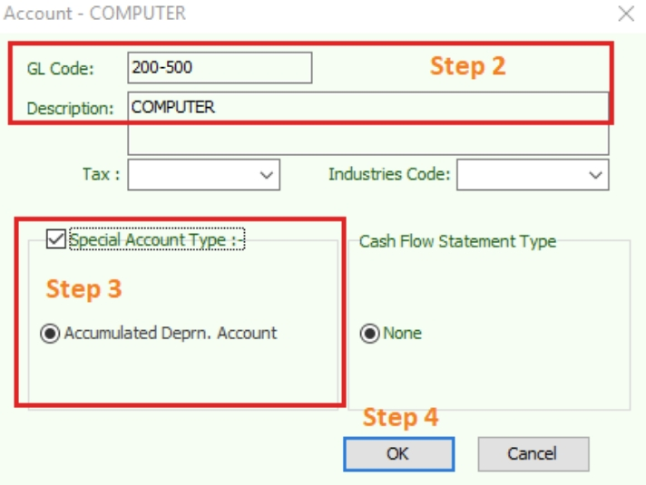

2. Creating a Sub Account
    1. Point to the parent account (e.g. Cash at Bank)
    2. Follow the same steps from **2.1.1 Create New Account**

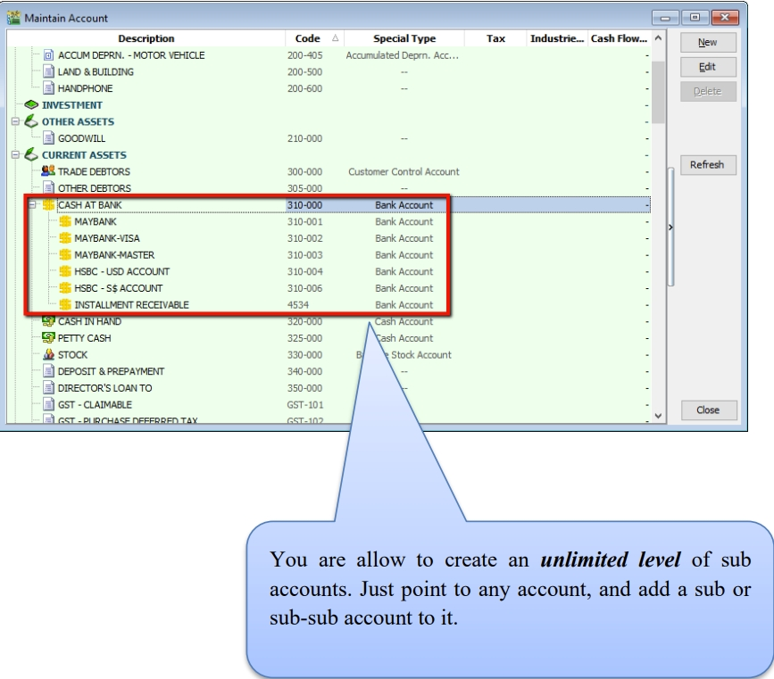

*You are allowed to create an unlimited level of sub accounts. Just point to any account, and add a sub or sub-sub account to it.

## Cash Book Entry

Cash book entry is normally used for a non-customer/ supplier payment or receipt e.g. payment for salaries, utilities etc.

1. **GL** > **Cash Book Entry** > **New** (choose between Payment Voucher or Official Receipt)

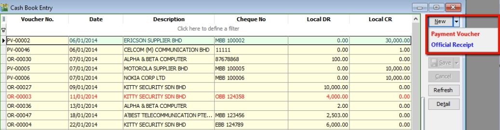

2.  **Insert Payable Name** > Select **GL Code > Tax > Amount**

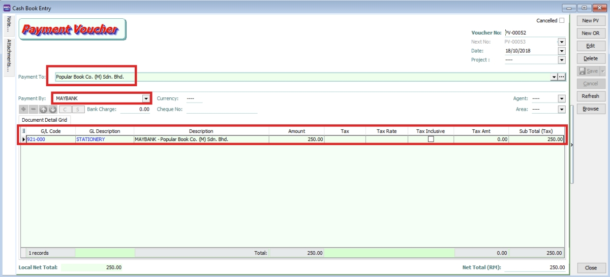

## Journal Entry

1. **GL > Journal Entry**
2. **Key in your double entry**
3. **Click on Save (System will blocked in Dr and Cr are not tally)**

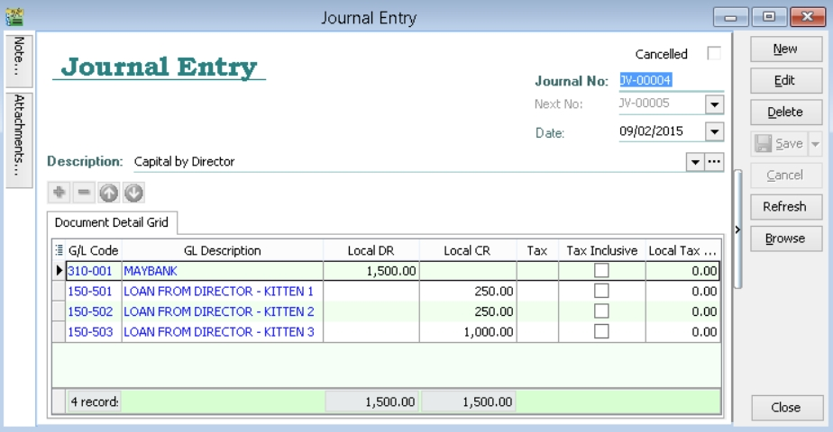

## Foreign Bank Adjustment (add)

Purpose:

- To revalue the foreign bank balance
- Calculate and post double entry for the unrealized FOREX gain/loss

Refer this ledger:

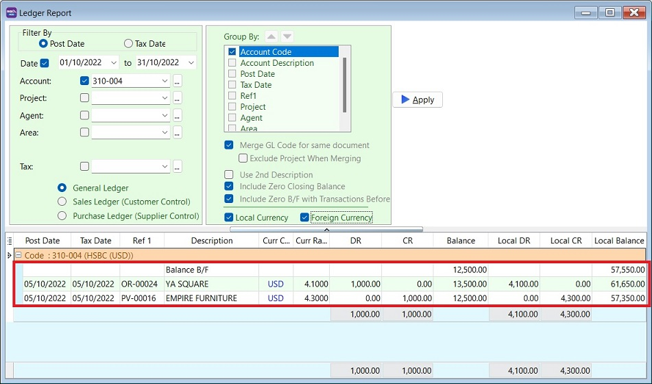

***Local Balance is now RM 57,350 and you wish to revalue it using a monthly exchange rate of 4.50000 to get the local balance RM 56,250. What should I do?**

## Foreign Bank Adjustment Entry (add)

1. Click on New
2. Enter the date, eg. end of the month
3. Click on Bank Revalue button

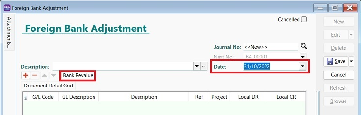

4. **Choose the foreign bank, the system will get the bank balance from the ledger as per the date.**
5.  **Enter the Revalue currency rate, eg. 4.5000. The system will auto calculate the unrealized FOREX gain/loss.**

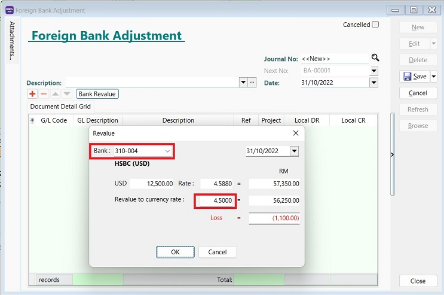

6.  **Click OK to proceed.**
7. **Click on Save**

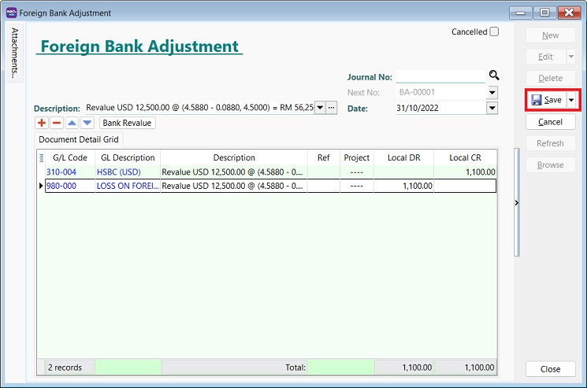

## Opening Balance General Ledger

1. **GL > Maintain Opening Balance**
2. **Highlight the account that you wish to key in as opening balance, and click Edit.**
3. **Insert the figure in local Dr or local Cr. Then Save.**
4. **Make sure the Dr and Cr figures tally**

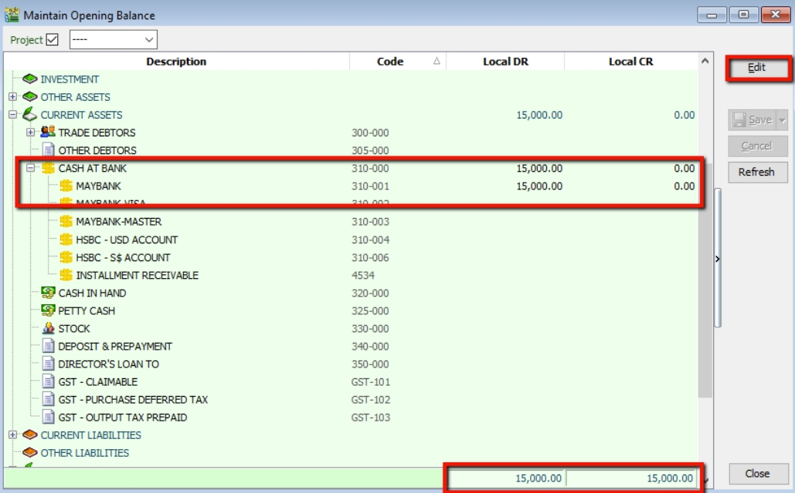

## Bank Reconciliation

1. **GL > Bank Reconciliation > New**
2. **Right click, to see Opening Bank Reconciliation**
3. **Set the Date (before System Conversion Date)**

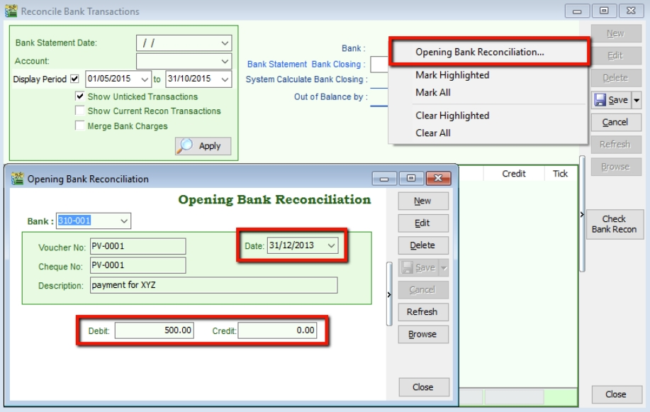

## Stock Value

1. **GL > Maintain Stock Value > Edit**
2. **Set the year**
3. **Insert the Opening Balance**

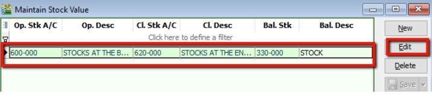
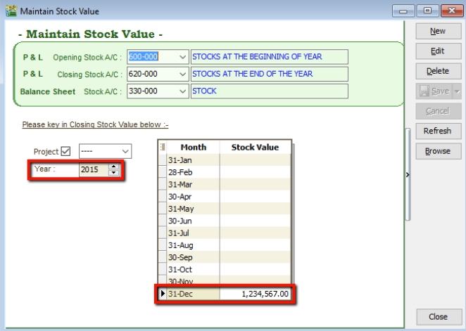

## Maintain Budget (add)

### Budget Maintenance

- **Press EDIT.**
- **Start input the budget value into each months.**
- **After input finished, SAVE it.**

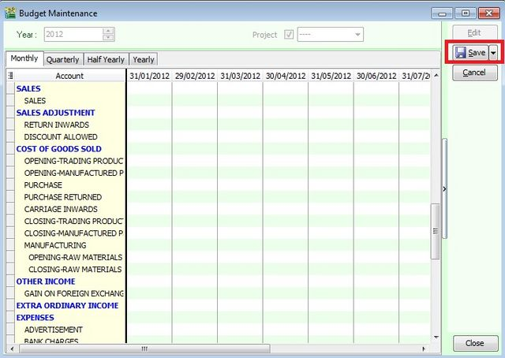