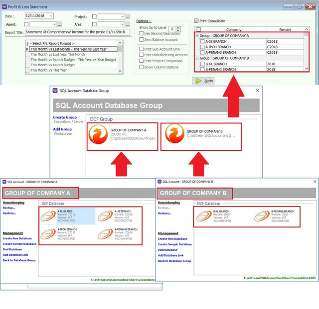
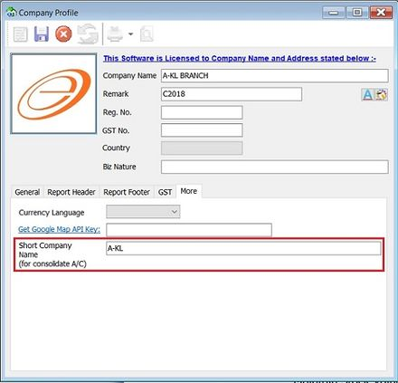

## Print Ledger Report

1. Go to **GL** → **Print Ledger Report** → Select the date range.
2. Filter by account, project, area, or agent (optional).
3. Select whether to view the General Ledger, Sales Ledger (Customer), or Purchase Ledger (Supplier).
4. The system can generate reports by group and provide a summary for each group (**Group/Sort by**).
5. **Upper Level Options**:
    1. **Merge GL Code for same document** – If the same account appears in a single transaction, the system automatically merges them. Uncheck this to separate account codes for the same document.
    2. **Exclude Project when merging** – Excludes the project when merging GL accounts.
    3. **Use second description** – Uses the second description maintained under **GL** → **Maintain Chart of Account**.
    4. **Include Zero Closing Balance** – Shows accounts in the report even if their balance is zero.
    5. **Include Zero Transaction** – Shows accounts in the report even if there are no transactions.
    6. **Local Currency & Foreign Currency** – For foreign currency transactions, check this to display figures in both foreign and local currencies for comparison.
    7. Click **Apply**.

      

## Print Balance Sheet Statement

1. Go to **GL** → **Print Balance Sheet Statement** → Select the date.
2. Choose your preferred format.
3. **Show Up to Level** (under Options) refers to the depth of sub-accounts in your **Maintain Chart of Account**. A higher value displays more levels of detail.
4. **Upper Level Options**:
    1. **Use second description** – Uses the second description managed in **GL** → **Maintain Chart of Account**.
    2. **Zero Balance Account** – Shows accounts in the report even if their balance is zero.
    3. **Display Trade Debtor/Creditor in Details** – Displays detailed information for each customer account.
5. **Bottom Level Options**:
    1. **Print Sub Account Only** – Select specific accounts to view.
    2. **Print Project Comparison** – Allows you to view the report by project (requires the Project module).
    3. **Show Column Options** – Configure column settings as needed.
6. Click **Apply**.

   

## Print Profit & Loss Statement

1. Go to **GL** → **Print Profit & Loss Statement** → Select the date.
2. Choose your preferred format.
3. **Upper Level Options**:
   1. **Use second description** – Uses the second description maintained under **GL** → **Maintain Chart of Account**.
   2. **Zero Balance Account** – Shows accounts in the report even if their balance is zero.
4. **Bottom Level Options**:
   1. **Print Sub Account Only** – Select specific accounts to view.
   2. **Print Manufacturing Account** – Only available if a manufacturing account is set up in **Maintain Chart of Account**.
   3. **Print Project Comparison** – Allows you to view the report by project (requires the Project module).
   4. **Show Column Options** – Refer to the Balance Sheet section.

5. Click **Apply**.

   

## Print Profit & Loss Statement (Consolidation)

- This requires the **Financial Consolidation** add-on module.
- **Consolidation** refers to the aggregation of financial statements from a group of companies into a single consolidated financial statement.
- Below is a quick summary of how to set up the group company database list for display in the Profit & Loss Statement.

   

1. Check **Print Consolidate**.

   

2. Select the company names from the different groups.
3. Click **Apply**.
4. The system will merge the financial data from the selected companies, using a **Short Company Name** for each.

   

:::info[TIPS]

1. The **Short Company Name** is displayed in the grid column when you apply Financial Consolidation.
2. This can be defined in **File** → **Company Profile...** (**More** tab).

   

:::

## Print Trial Balance

1. Go to **GL** → **Print Trial Balance** → Select the date.
2. Filter by project, area, or agent (optional).
3. Select whether to view the General Ledger, Sales Ledger (Customer), or Purchase Ledger (Supplier).
4. **Upper Level Options**:
   1. **Use second description** – Uses the second description maintained under **GL** → **Maintain Chart of Account**.
   2. **Zero Balance Account** – Shows accounts in the report even if their balance is zero.
5. Click **Apply**.

   
