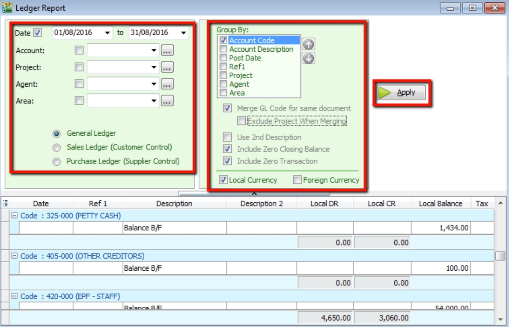
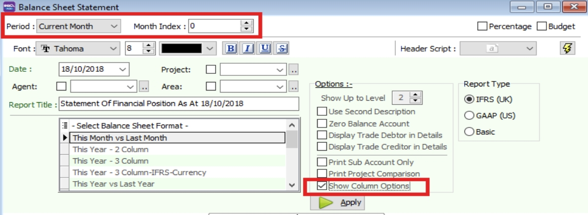
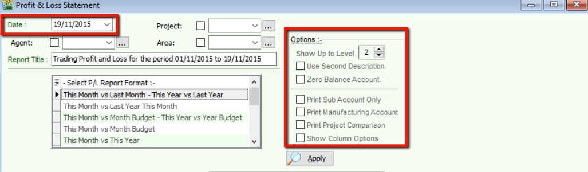
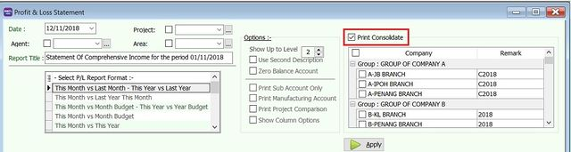
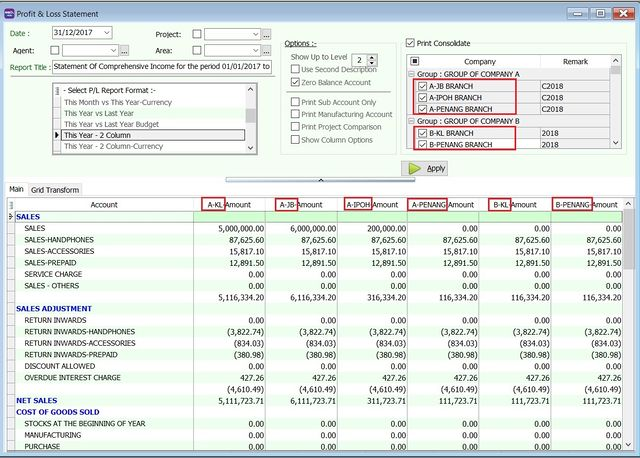
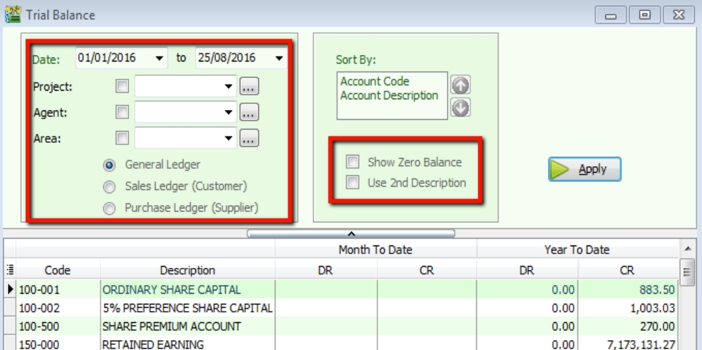

## Print Ledger Report

1. Go to **GL** > **Print Ledger Report** > Select your date
2. Filter by account, project, area, agent (optional)
3. Tick whether you want to view General Ledger, Sales Ledger (Customer) or Purchase Ledger (Supplier)
4. System can generate reports by group and provide a summary for each group (Group/Sort by)
5. In Option Upper Level

    1. **Merge GL Code for same document** – If you have the same account in one single transaction, the system will automatically merge, if you want to separate the account code for the same document, please un-tick.
    2. **Exclude Project when merging** – Exclude the project when merging GL Account.
    3. **Use second description** – Use second description which is maintained under GL > Maintain Chart of Account.
    4. **Include Zero Closing Balance** – Choose to show accounts in the report even if their amount is 0.
    5. **Include Zero Transaction** – Choose to show accounts in the report even if there are 0 transactions.
    6. **Local Currency & Foreign Currency** – If you have foreign currency transactions, you can tick the foreign currency so that the system will show the figures in foreign currency compare versus local currency.
    7. **Apply**

## Print Balance Sheet Statement

1. Go to **GL** > **Print Balance Sheet Statement** > Select your date

2. Choose your preferred format

3. “Show Up to Level” under Option refers to the depth of sub-accounts in your Maintain Chart of Account, the higher the value, the more level of detail will be shown.

4. In Option Upper Level

    1. **Use second description** – Use second description which is controlled at GL > Maintain Chart of Account.

    2. **Zero Balance Account** – Choose to show accounts in the report even if their amount is 0.

    3. **Display Trade Debtor/Creditor in Details** – Show detailed information for each customer account.

5. In Option Bottom Level

    1. **Print Sub Account Only** – Select a certain account to view.

    2. **Print Project Comparison** – You are allowed to view your report by project (project module requested).

    3. **Show Column Options** – You can preset setting as attached.

6. **Apply**

## Print Profit & Loss Statement

1. Go to **GL** > **Print Profit & Loss Statement** > Select your date

2. Choose your preferred format

3. In Option Upper Level

   1. **Use second description** – Use second description which is maintained under GL > Maintain Chart of Account.

   2. **Zero Balance Account** – Choose to show accounts in the report even if their amount is 0.

4. In Option Upper Level

   1. **Print Sub Account Only** – Select a certain account to view.

   2. **Print Manufacturing Account** – You are only allowed to view manufacturing account if you have set it up under Maintain Chart of Account.

   3. **Print Project Comparison** – You are allowed to view your report by project (project module requested).

   4. **Show Column Options** – refer Balance Sheet

5. **Apply**

   

## Print Profit & Loss Statement (Consolidation)

- **Consolidation** refers to the aggregation of financial statements of a group company as consolidated financial statements.
- New add-on module name : **Financial Consolidation**.
- **Quick summary** of setup the group of companies database list to be displayed in Profit & Loss Statement.

   

1. Tick Print Consolidate.

   

2. Select (tick) on the company name from different Groups of Companies.
3. Click Apply.
4. It will merge the financial data from the companies selected. Represent a Short Company Name for each company.

   

:::info[TIPS]

1. **Short Company Name** will be display in the grid column when you apply the Financial Consolidation.
2. It can be defined in File | Company Profile... **(More tab)**.

   

:::

## Print Trial Balance

1. Go to **GL** > **Print Trial Balance** > Select your date

2. Filter by project, area, agent (optional)

3. Tick whether you want to view General Ledger, Sales Ledger(Customer) or Purchase Ledger (Supplier)

4. In Option Upper Level

   1. **Use second description** – Use second description is which maintained under GL > Maintain Chart of Account.

   2. **Zero Balance Account** – Choose to show accounts in the report even if their amount is 0.

5. **Apply**

   
