## Generate Backup Script

SQL application may backup database via Command Line Switches operation. The command line operation may backup all databases or specified database store in DCF file with proper switches.

The command line backup script may generated via context menu command in DCF: **Generate Backup Script**. The script may execute in console or batch file.

A common usage of backup script is execute the script in Windows Task Scheduler to backup database periodically. This action automate backup operation to ease administrator's task. Tasks added to Task Scheduler starts each time you start Windows, and runs in the background. With Task Scheduler, you can schedule a backup databases task to run daily, weekly, monthly, or at certain times (such as system startup).

This command line backup script is only applicable for **Windows 7 & above** only.

### Generate Backup Script in Database Group

1. To generate backup script for all the databases under the selected database group.
2. Right click the database group that you want to generate backup script.

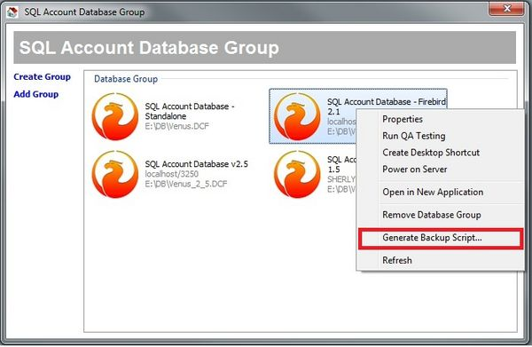

### Generate Backup Script in Database Item

1. To generate backup script for single database
2. Right click the database that you want to generate backup script

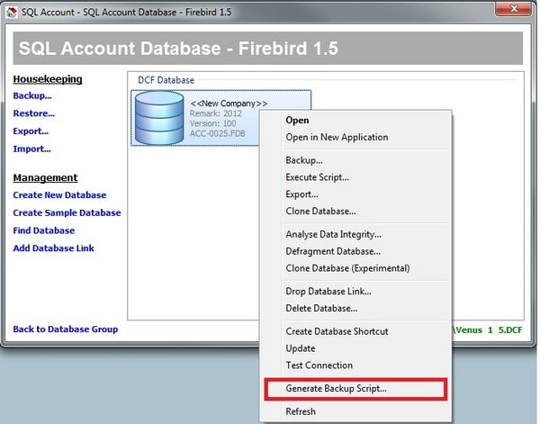

### Generate Backup Script

1. **Database (optional)**: If database is not specified, all databases under the database group will be backup
2. **Backup to**: Choose backup to directory
3. **Admin Password(s)**: Admin user passwords that login to the database(s). If database group contains more databases with different admin passwords, please separate each passwords with comma. The button beside this field is to toggle show password in plain text or asterisk
4. **Send Mail**: Tick if need to receive notification email of backup status
5. **Zip Backup**: Compress backup into zip file
6. **Test Email**: Click to test whether email sent successfully to receiver email accounts
7. **Copy**: The command text will be automatically copy to your clipboard, it is ready to paste in window Task Scheduler (there is a shortcut "Launch Window Task Scheduler")

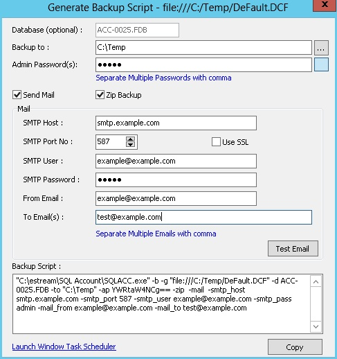

#### Email setting for TMNet

- SMTP Host: **smtp-proxy.tm.net.my**
- SMTP Port No: **25**
- SMTP User: n/a. Leave empty
- SMTP Password: n/a. Leave empty
- Use SSL: **False** (or unticked)

#### Email setting for TMNet

- SMTP Host: **smtp.gmail.com**
- SMTP Port No: **465**
- SMTP User: **e.g.: \<your-account>@gmail.com**
- SMTP Password: **\*\*\*\*\*\*\* \<app password>**
- Use SSL: **True** (or ticked)

:::success[note]
    1. [Guide to create & use app password](https://support.google.com/accounts/answer/185833?hl=en)
    2. [Google AppPassword](https://myaccount.google.com/apppasswords)
:::

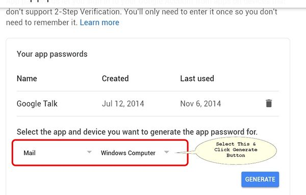

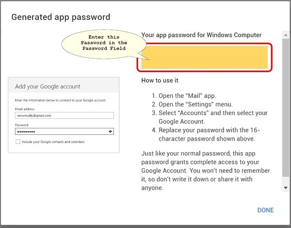

#### Email setting for Yahoo! Mail

- SMTP Host: **smtp.mail.yahoo.com**
- SMTP Port No: **465**
- SMTP User: **e.g.: \<your-account>@yahoo.com**
- SMTP Password: **\*\*\*\*\*\*\***
- Use SSL: **True** (or ticked)

#### Email setting for private mail server
The following a sample setting. Configure according to your private mail server setting.

- SMTP Host: **\<your-mail-server>**
- SMTP Port No: ****587**
- SMTP User: **e.g.: \<your-account>**
- SMTP Password: **\*\*\*\*\*\*\***
- Use SSL: **True or False**

#### Email setting for MSN live mail or Hotmail
Unsupported

### Add Backup task to Window 7 Task Scheduler

1. Click window menu **Start -> Accessories -> System Tools -> Task Scheduler**
2. Click **Action -> Create Basic Task**

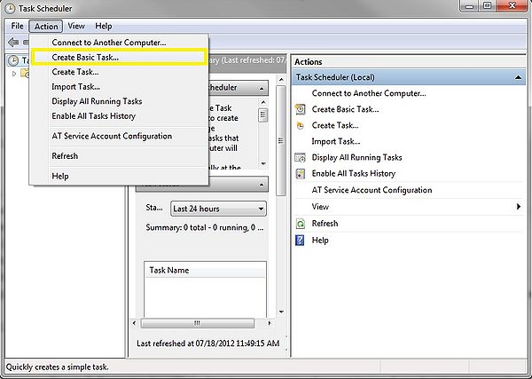

3. Enter Task name

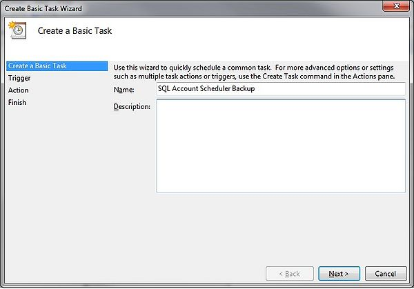

4. Click next, choose when you want to trigger the task (e.g Daily)

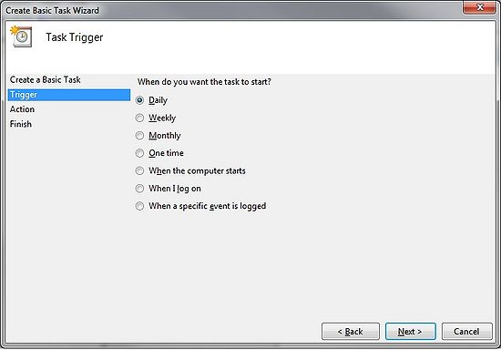

5. Click next, choose the start date and start time and recur every 1 day

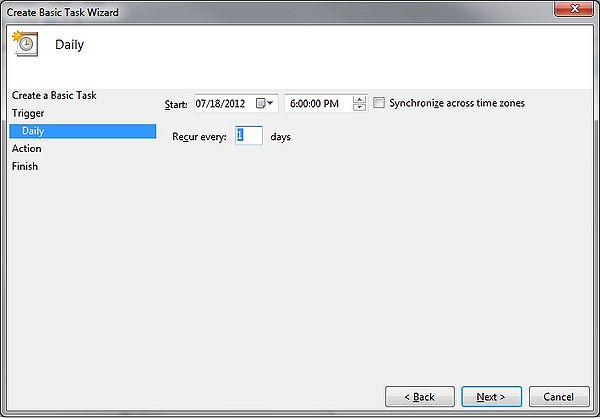

6. Click next, choose **Start a Program**

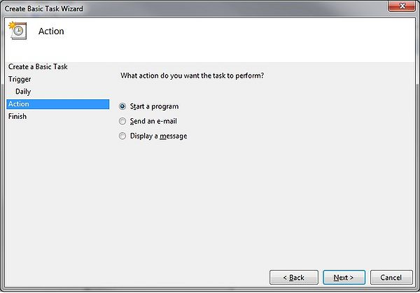

7. Click next, paste all the backup script text that you copied just now into ****"Program/Script"**

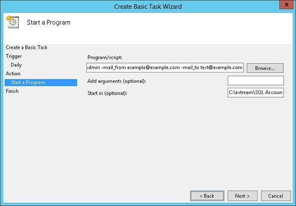

8. Set the Start in(optional) path to the Exe folder (eg. **C:\Estream\SQL Accounting**)
9. Click next, a dialog prompted and click **Yes**

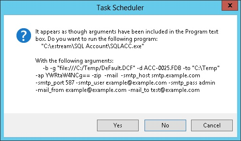

10. Click **Next**
11. Tick the option **Open the Properties dialog for this task when I click Finish**

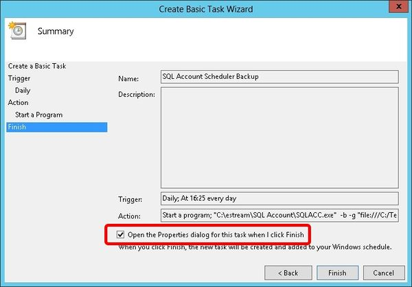

12. Click **Finish**
13. Select the option **Run whether user is logged on or not**

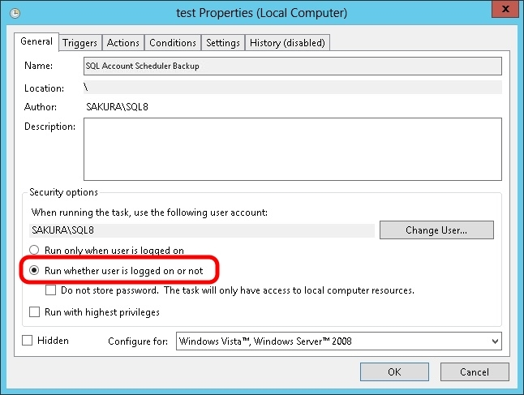

14. Click **Triggers** tab at top then click **Edit...** button

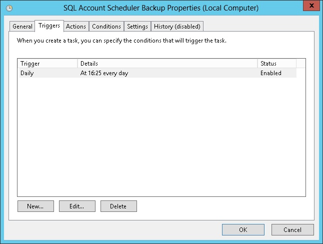

15. Change the time to run

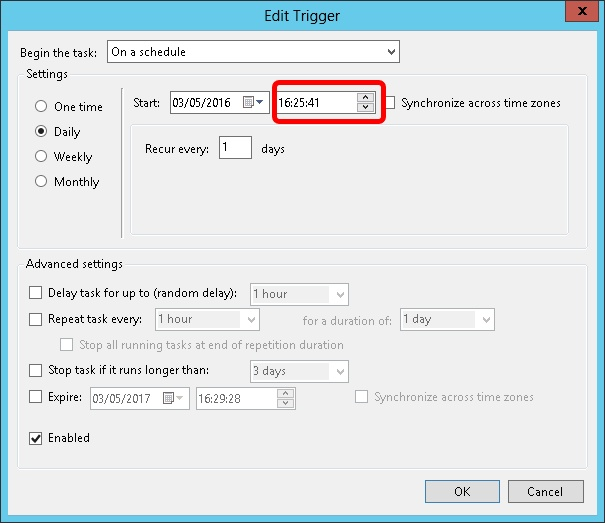

16. Click OK 2 times

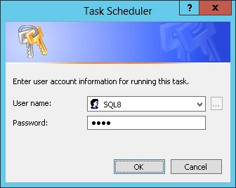

17. Enter the window **User Name & Password**
18. Click **Ok**

### Recommendations
- Try to set the backup schedule timer after working hours,eg. mid-night start from 1.00am.
- Do not shutdown the server while running the auto backup.
- You can set the schedule to shutdownn and wake-up the server during weekend.

## Navigator Toolbar

On top of every Grid Data entry user will see a list of some function buttons shown as below.

### Type 1

Below is the detail of each button (From Left)

### Type 2

Below is the detail of each button (From Left)

## Preview Menu

On each report grid output (after click apply) there is small arrow on the Preview Button on the right which can see a list of some function as shown below.

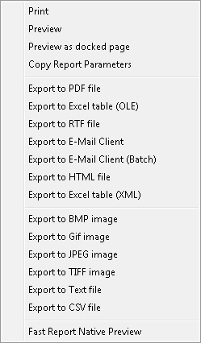

Below is the detail of each function (From Top)

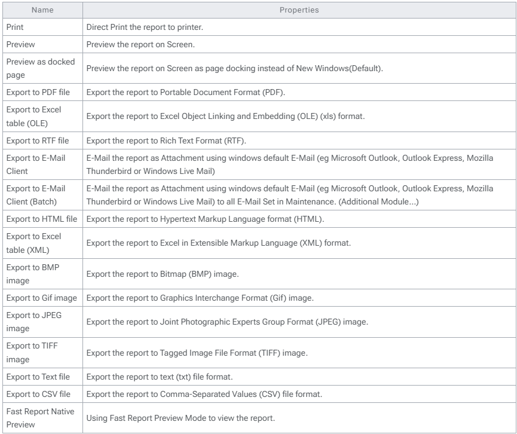

## Properties

By default firebird not fully utilies the RAM. Using this new function user can self allocate size of RAM to be use for each Database.

1. Pros
    1. Fully use the available RAM in server
    2. Increase the database performance
2. Cons
    1. Will slow down the Server Performance if not careful
    2. Not support for Standalone
3. Requirement
    1. Firebird Server
    2. Minimum 16 GB RAM
    3. A reliable Uninterrupted Power Supply or UPS (ie. backup power battery).
4. **Steps**
    1.  Click 3 dot button in the Login Screen
    2. **Right Click** the **Database** you wanted to set.
    3. Select **Properties**
    4. Enter **ADMIN** Password
    5. Enter the Size you wanted or Click Use recommended page buffers setting (Default is 300 MB)
    6. Click OK

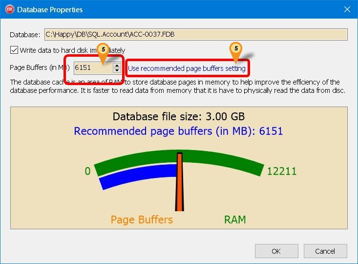

:::info
    Things to take note when you have untick - Write data to hard disc immediately:
    1. Server PC must protected by a reliable UPS (ie. backup power battery).
    2. Make sure the server properly shutdown.
    3. Operating System must at least minimum is Win7, Windows Server 2012 and above.
:::

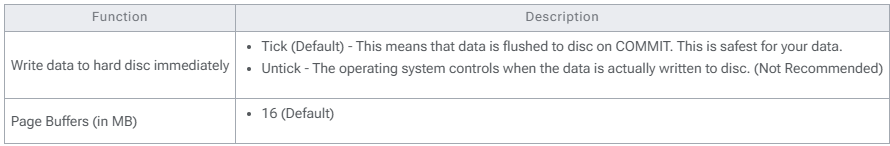

## Command Line Switches

The following switches are available when start SQL application from the command line.

You must precede all switches (unless otherwise noted) with a dash (-).

The switches are case-sensitive.

### Command switches

### General switches

### Unit testing switches

### Backup switches

### E-mail switches

