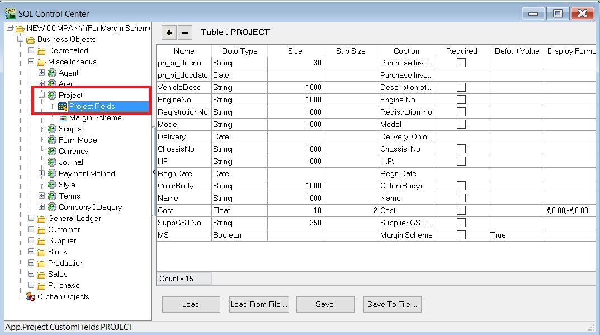
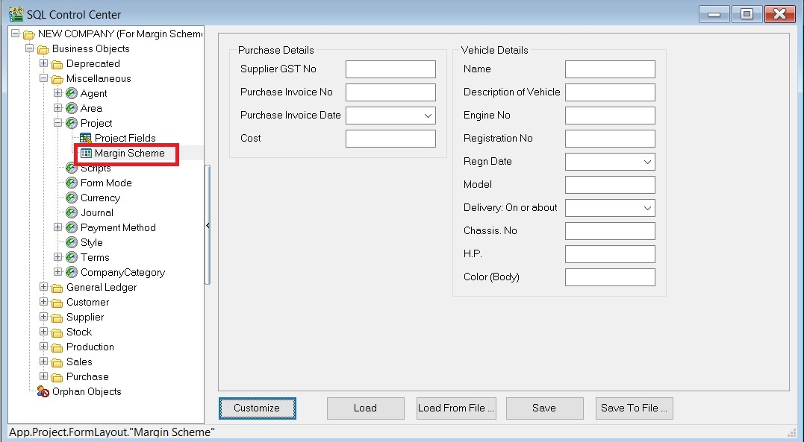
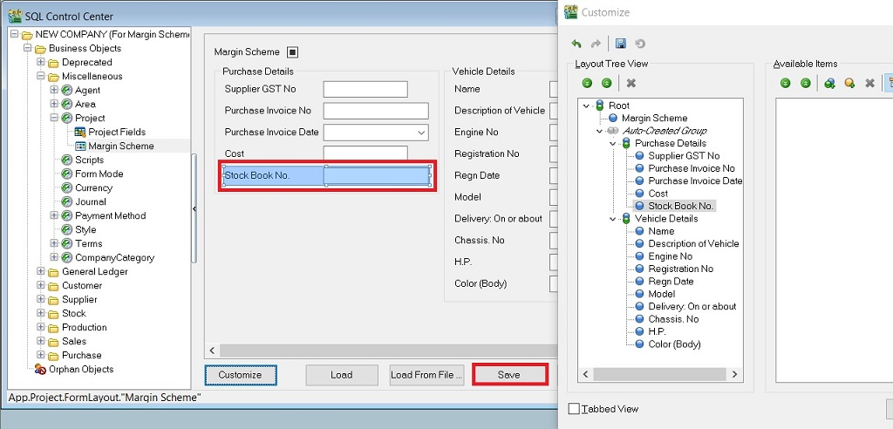
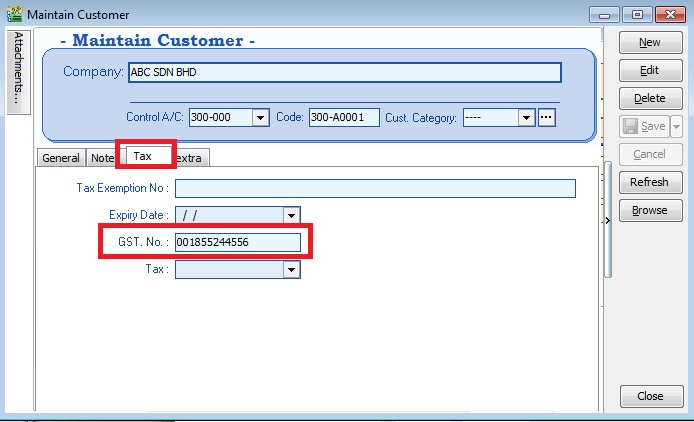
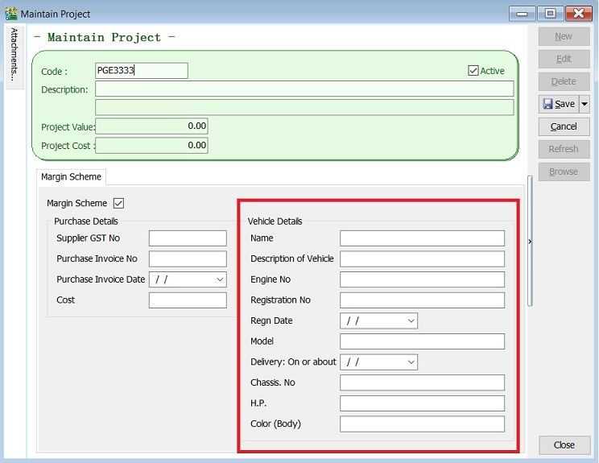
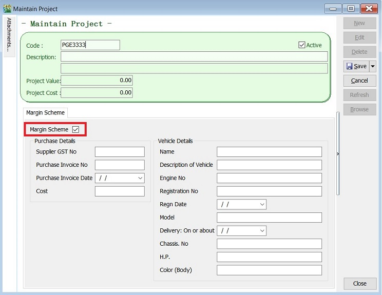

## GST Margin Scheme
### Introduction

GST is normally due on the full value of goods sold. The margin scheme allows a GST Margin Scheme registered person (GST MS registered person) who meets all the conditions to calculate and charge GST on the margin i.e. the difference between the price at which the goods were obtained and the selling price. If no margin is made (because the purchase price exceeds the selling price) then no GST is charged and payable.
For the purpose of GST, margin under this scheme means the difference between selling price and purchase price. If there is any value being added to the eligible goods such as cost for repairing, this cost is part of the margin other than profit. In other words, the value added must be included in the selling price and not the purchase price.
Therefore, we have designed a database structure specially for business which has margin scheme involvement.

### Model Require
1. SQL Accounting Basic (GST compliance)
2. DIY field
3. DIY script
4. Project (use to record Car Plate number)

See below the overview of Margin Scheme process flow:

#### Setup Margin Scheme Database
**Last Customisation Update : 13 Sep 2016**

1. Get the NEW database structure for Margin Scheme (in backup format) from this link NEW COMPANY (For Margin Scheme)
2. Restore this backup.
3. Enter the user ID and password with “ADMIN” to login.

### History New/Updates/Changes
**Last Customisation Update : 27 Nov 2015**
- Move Cars Information to Maintain Project
- Auto Capture Initial Cost on Select Project

**Last Customisation Update : 20 Feb 2016**
- Empty item code (eg. repairs) will not update the Project - Purchase Details.
- Run the SQL Accounting Diagnosis - DB Patch and apply the patch files can be download from Patch-Margin Scheme-20160220.zip
1. Select the database file (eg.ACC-XXXXX.FDB).
2. Drag the patch filename Patch-MarginScheme1.
3. Click Execute.
4. Repeat step 2 - 3 and apply with another patch filename Patch-MarginScheme-02-20160220.

**Last Customisation Update : 08 Mar 2016**
- Tax amount not equal to zero. Will prompt message "Cost will be tax excluded for GST Margin purpose" after save the purchase invoice.
- Run the SQL Accounting Diagnosis - DB Patch and apply the patch files can be download from Patch-MarginScheme-20160308.zip
1. Select the database file (eg.ACC-XXXXX.FDB).
2. Unzip the patch file downloaded.
3. Drag the patch filename DELETE_PHPI_OnAfterSave_08.03.2016.
4. Click Execute.
5. Repeat step 2 - 4 and apply with another patch filename UPDATE_PHPI_OnAfterSave_08.03.2016.

**Last Customisation Update : 08 Aug 2016**
- To remove the compulsory action to select project code other than Default Project (----).
- Run the SQL Accounting Diagnosis - DB Patch and apply the patch files can be download from http://www.sql.com.my/document/Patch-MarginScheme-20160808.zip
1. Select the database file (eg.ACC-XXXXX.FDB).
2. Unzip the patch file downloaded.
3. Drag the patch filename DELETE_SLIV_OnBeforerSave_2016.08.08.
4. Click Execute.

**Last Customisation Update : 13 Sep 2016**
- Margin Scheme options added in Maintain Project. It is allow to determine the car sold using GST margin scheme or GST standard calculation.
- Run the SQL Accounting Diagnosis - DB Patch and apply the patch files can be download from http://www.sql.com.my/document/Patch-MarginScheme-20160913.zip
1. Select the database file (eg.ACC-XXXXX.FDB).
2. Unzip the patch file downloaded.
3. Drag the patch filename DELETE_SLIV_OnGridColValChg_2016.09.13.
4. Click Execute.
5. Repeat step 2 - 4 and apply with another patch filename INSERT_SLIV_OnGridColValChg_2016.09.13.
- Add new field name MS in Maintain Project.
1. Go to Tools | DIY | SQL Control Center...
2. Browse to Business Objects | Miscellaneous | Project | Project Fields

3. Add new field name MS and the Data Type, Size, Sub Size, Caption, etc must follow the screenshot below. Click to Save button.

4. Next, click on the existing Margin Scheme form. See the screenshot below.

5. Click on Customize button.

6. Drag the Margin Scheme from Available Item list and drop under Purchase Details. See screenshow below.

7. Lastly, click to Save button.

:::info Note
Patch files are applicable to old margin scheme database.
:::

**Last Customisation Update : 09 Nov 2016**
- Added Stock Book Number into Maintain Project. It will auto update project Stock Book Number key-in at purchase invoice Ext. No.
- Fixed the bug update project from Purchase Invoice on the First line only.
- Run the SQL Accounting Diagnosis - DB Patch and apply the patch files can be download from http://www.sql.com.my/document/Patch-MarginScheme-20161109.zip
1. Select the database file (eg.ACC-XXXXX.FDB).
2. Unzip the patch file downloaded.
3. Drag the patch filename DELETE_PHPI_OnAfterSave_2016.11.09.
4. Click Execute.
5. Repeat step 2 - 4 and apply with another patch filename INSERT_PHPI_OnAfterSave_2016.11.09.
- Add new field name StkBookNo in Maintain Project.
1. Go to Tools | DIY | SQL Control Center...

2. Browse to Business Objects | Miscellaneous | Project | Project Fields

3. Add new field name StkBookNo and the Data Type, Size, Sub Size, Caption, etc must follow the screenshot below. Click to Save button.

4. Next, click on the existing Margin Scheme form. See the screenshot below.

5. Click on Customize button.

6. Drag the Stock Book No from Available Item list and drop under Purchase Details. See screenshow below.

7. Lastly, click to Save button.

:::info Note
Patch files are applicable to old margin scheme database.
:::

### Setup Master Data
#### Maintain Customer
[Customer | Maintain Customer…]

1. Create new buyer name (eg. company name or person name).
2. Click on Tax tab to input the GST No (if applicable).

3. Click on extra tab. You can enter the road tax, inspection and insurance reminder date for reference.

#### Maintain Supplier
[Supplier | Maintain Supplier…]

1. Create new seller name (eg. company name or person name).
2. Click on Tax tab to input the GST No (if applicable).

#### Maintain Stock Item
[Stock | Maintain Stock Item…]

1. Create the car model at Maintain Stock Item. For example, TOYOTA VIOS 1.5G(AT)
2. Click on Vehicle tab to define this item is a "Vehicle".

#### Maintain Project
[Tools | Maintain Project…]

1. Create the second car plate number in Maintain Project.
2. Update the Vehicle detail.

3. Tick on Margin Scheme if it is a second hand car plate number.

4. Leave BLANK to Purchase Invoice Date, Purchase Invoice No and Cost. It will auto update when you are select the project code and save at the Purchase Invoice.

### Record Purchase of Second Hand Car Value
[Purchase | Purchase Invoice…]

1. Enter the purchase value of second car at Purchase Invoice. (eg. RM30,000 )
2. You must select the correct car plate number from Project. (eg. PGE3333, AAA9999)
3. Supplier GST No, Purchase invoice number, date and cost will be update automatically after you have save the purchase invoice.

| Duration of migration from Sage UBS | 1000 Records | 10,000 Records |
| --- | --- | --- |
| Masterfile | 2-5 Mins | 8-10 Mins |
| AR/AP Opening Balance | 5-10 Mins | 15-30 Mins |
| Sales/ Purchase Price History | 5-10 Mins | 15-30 Mins |
| Sales/ Purchase Current Transactions | 30-50 Mins | 1.5-2 Hours |
| AR/AP Current Transactions | 30-40 Mins | 1.5-2 Hours |
| GL Current Transactions | 10-15 Mins | 25-40 Mins |

:::info Note
1. This information is required to show in Lampiran 07 -Monthly Report for Relief for Secondhand Goods or Margin Scheme (MS).

2. Auto update to project purchase detail (Purchase No, Purchase Date and Cost) if tax amount is zero.
:::

[Sales | Invoice…]

#### Margin Scheme Input
1. Enter the sale value of second car at Invoice. (eg.RM90,113.69)
2. You must select the correct car plate number from Project.(eg.PGE3333)
3. Initial Purchase Cost will auto upadate after select the project (car plate number).
4. Tax amount will be calculated based on Margin Scheme method.(See screenshot below)
    1. Sellng Price = 90,113.69
    2. Purchase Cost = 30,000.00
    3. Margin = 90,113.69 – 30,000.00 = 60,113.69
    4. Tax amount = 60,113.69 x 6/106 = 3,402.66

6. Invoice no, invoice date, selling price, margin, and margin tax amount will be shown in Lampiran 07 -Monthly Report for Relief for Secondhand Goods or Margin Scheme (MS)
#### Other Information
1. Customer Particular tab.

2. Deposit Info (For record purpose, no posting to account).

3. Vehichle Detail (Auto retrieve from Vehicle Detail in Maintain Project).

### Print for GST Lampiran 07 (Lampiran B0-Penyata=Pemantauan-SM-Syrikat)
[Sales | Print Sales Document Listing…]

1. Select document to “Invoice Listing” and click APPLY.

2. Click on preview or print. Select the report name “Lampiran B0-Penyata-Pemantauan-SM-Syarikat”.

