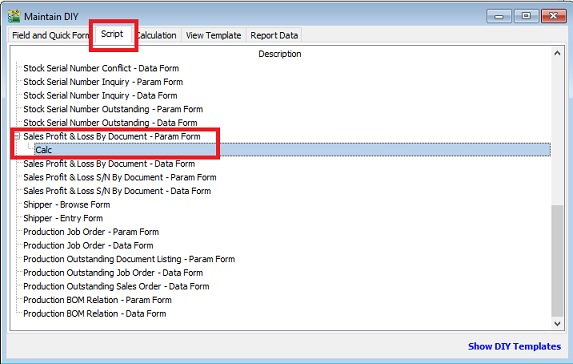

## Introduction

For some reason, the company managers wish to let users to check and view the report by themselves. They cannot access other users data, eg. agent A cannot see agent B sales value. Therefore, we have come out this script to lock at the report according to the user rights.

## Updates

Last Customisation Update : 07 Nov 2015

## Criterias

[Tools | Maintain User...]

1. Advanced Lock in Maintain User.

    | Types | Field Name | Data Types | Length | Usage |
    | --- | --- | --- | --- | --- |
    | STD | Code | String | 20  | User ID, eg. LEE |
    | STD | Name | String | 100 | User Name |
    | DIY-F | Agent_Lock | Boolean | False value: 0, True value: 1 | To lock the agent parameter in report |
    | DIY-F | Agent | String | 10  | Set an agent code to lock to this user |
    | DIY-F | Location_Lock | Boolean | False value: 0, True value: 1 | To lock the location parameter in report |
    | DIY-F | Location | String | 10  | Set a location code to lock to this user |

2. The above DIY fields are created at Tools | DIY | Maintain_DIY(link)

## Reporting

1. As long the report parameter has Project, Agent, Area, or Location, the reports able to lock based on user login. For instances:

    - Customer Aging (Agent, Area, Project)
    - Sales/Purchase Document Listing (Agent, Area, Doc Project)
    - Outstanding Sales/Purchase Document Listing (Agent, Area, Doc Project, Item Project, Location)
    - Stock Card (Location)
    - etc...

2. Insert and update the following DIY Script into Script tab (Report name - Param Form) in Tools | DIY | Maintain DIY

    For instance, apply the below script into Sales Profit & Loss By Document - Param Form.

    

    ```pascal
    uses SysUtils, Dialogs, Forms, ComObj, DBClient;

    var C, D : TWinControl;
        FComServer, lBizObj : Variant;
        lLock, lLock2 : Boolean;
        L, P : TStringList;

    function ComServer: Variant;
    begin
      if FComServer = Null then begin
          FComServer := CreateOleObject('SQLAcc.BizApp');
      end;
      Result := FComServer;
    end;

    procedure CheckLock;
    var cdsTemp : TClientDataset;
        lSQL : String;
    begin
      lLock := False;
      lLock2 := False;
      FComServer := null;
      cdsTemp := TClientDataset.Create(nil);
      lSQL := Format('SELECT UDF_Location_Lock, UDF_Agent_Lock, UDF_Agent, UDF_Location FROM SY_USER WHERE Code=%s',[QuotedStr(UserID)]);

      try
        cdsTemp.Data := ComServer.DBManager.Execute(lSQL);
        if cdsTemp.RecordCount > 0 then begin
          lLock := cdsTemp.FindField('UDF_Location_Lock').Value = 1;
          L.Text := cdsTemp.FindField('UDF_Location').AsString;
          lLock2 := cdsTemp.FindField('UDF_Agent_Lock').Value = 1;
          P.Text := cdsTemp.FindField('UDF_Agent').AsString;
        end;

      finally
        cdsTemp.Free;
        FComServer := null;
        end;
    end;

    begin

      C := Self.FindChildControl('edLocation_Panel') as TWinControl;
      D := Self.FindChildControl('edAgent_Panel') as TWinControl;
      L := TStringList.Create;
      P := TStringList.Create;

      CheckLock;
      try
        if C <> nil then C.Enabled := not lLock;
          if lLock then begin
          C := TWinControl(C).FindChildControl('edLocation_Edit') as TWinControl;
          (C as TControl).SetTextBuf(L.CommaText);
        end;

        if D <> nil then D.Enabled := not lLock2;
          if lLock2 then begin
          D := TWinControl(D).FindChildControl('edAgent_Edit') as TWinControl;
          (D as TControl).SetTextBuf(P.CommaText);
        end;

      finally
        L.Free;
        P.Free;
      end;
    end.
    ```
