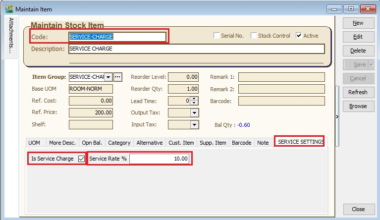
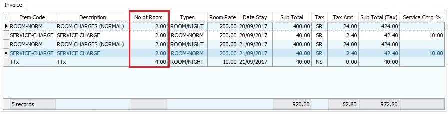

## Introduction

1. MYTTx implementation date : **01 September 2017**.

2. **TTx** is a tax charged and levied on a **tourist** staying at any **accommodation premises** made available by an **operator** at the rate fixed by the Minister. It is the duty of the tourist to pay TTx to the operator.

3. **Tourist** means any person, whether he is a Malaysian national or otherwise, visiting any place in Malaysia for any of the following purposes, namely:

    1. pleasure, recreation or holiday
    2. culture
    3. religion
    4. visiting friends or relatives
    5. sports
    6. business
    7. meetings, conferences, seminars or conventions
    8. studies or research
    9. any other purpose which is not related to an occupation that is remunerated from the place visited.

4. **Accommodation** premises means any building, including hostels, hotels, inns, boardinghouses, rest houses and lodging houses, held out by the proprietor, owner or manager, either wholly or partly, as offering lodging or sleeping accommodation to tourists for hire or any other form of reward, whether or not food or drink is also offered.

5. **Accommodation premises excludes** ‘innovative’ accommodations such as Apache-type hotels, caravan, container, bustel, boat house, tree house, sleeping tube, tents, cruise, and such similar accommodations. [added in the **GENERAL GUIDE ON TOURISM TAX** revised on 29 Aug 2017]

6. **Rate of tourism tax** is fixed at a flat rate of **RM10.00 per room per night**.

7. **Tourism Tax (Amendment) Act 2021:** Tourism tax shall be **charged and levied** on a tourist staying at any accommodation premises made available through service relating to online booking accommodation premises provided by a **digital platform service provider** at the rate fixed in accordance with section 8.

8. **Exemption from TTx** are:

    1. A **Malaysian national**; or a permanent resident of Malaysia who holds MyPR card.

    2. An operator who operates **homestay** as determined by the Ministry of Tourism and Culture Malaysia under the Pengalaman Homestay Malaysia Programme and is registered with Ministry of Tourism and Culture Malaysia.

    3. An operator who operates **kampungstay** determined by the Ministry of Tourism and Culture Malaysia under the Visit My Kampung Kampungstay Programme and is registered with Ministry of Tourism and Culture Malaysia.

    4. The Federal Government, State Government, statutory body, local authority or private higher educational institutions registered under Private Higher Educational Institutions Act 1996 [Act 555] operating accommodation premises that provide accommodation to any person for **educational, training or welfare purposes.**

        **Example 25**

        As an illustration of accommodation premises which are exempted from registration and collecting TTx under item (c) above are as follows:

        - Akademi Kastam Diraja Malaysia
        - Lanai Kijang Bank Negara Malaysia
        - Institut Latihan Dewan Bandaraya Kuala Lumpur
        - HELP Residence, HELP University
        - Pusat Transit Gelandangan Kuala Lumpur

    5. The employer operating accommodation premises as a facility to their employees.

        **Example 26** As an illustration of accommodation premises which are exempted from registration and collecting TTx under item (d) above are as follows:

        - Rumah Peranginan Persekutuan
        - Rumah Rehat Kerajaan Negeri
        - Rumah Peranginan Bank Negara Malaysia
        - Rumah Peranginan Tenaga Nasional Berhad

    6. Religious or welfare body who fully operates accommodation premises for the purpose of religious or welfare activities **not for commercial purpose** and registered under the written law and approved by the Minister responsible **for religious or welfare matters**.

    7. An operator of accommodation premises **having four or less than four rooms.** ( \<\= 4 rooms)

9. Therefore, we have designed a database structure specially for business which has provide accommodation to tourists.

    

    _Source from Royal Malaysian Customs Department official page_

List of Guidance about MYTTx :

1. [General Guide on Tourism Tax [Panduan Am Cukai Pelancongan]](https://www.myttx.customs.gov.my/wp-content/uploads/2024/12/Panduan-Am-Cukai-Pelancongan-V2-06122024.pdf)
2. [Guide on Registration](https://www.myttx.customs.gov.my/wp-content/uploads/2022/05/APPENDIX-B-Panduan-Pendaftaran-Cukai-Pelancongan.pdf)
3. [Guideline to fill up Form TTx-01 [Panduan Mengisi Borang TTx-01]](https://www.myttx.customs.gov.my/wp-content/uploads/2022/05/APPENDIX-C-Panduan-Mengisi-Borang-TTx-01.pdf)
4. [Guide on Return, Payment and Refund](https://www.myttx.customs.gov.my/wp-content/uploads/2022/05/APPENDIX-D-Panduan-Pengemukaan-Penyata-dan-Pembayaran-PUBLIC.pdf)
5. [Guideline to fill up Form TTx-03 [Panduan Mengisi Borang TTx-03]](https://www.myttx.customs.gov.my/wp-content/uploads/2022/05/APPENDIX-E-Panduan-Mengisi-Borang-TTx-03.pdf)
6. [Guideline to fill up Form TTx-04 [Panduan Mengisi Borang TTx-04]](https://www.myttx.customs.gov.my/wp-content/uploads/2022/05/APPENDIX-F-Panduan-Mengisi-Borang-TTx-04.pdf)
7. [Tourism Tax (Amendment) Act 2021](https://www.myttx.customs.gov.my/wp-content/uploads/2022/05/20210202_A1633_BI_Act-A1633.pdf)
8. [Guide On Tourism Tax [Digital Platform Service Provider]](https://www.myttx.customs.gov.my/wp-content/uploads/2025/03/Guide-on-DPSP-11032025.pdf)

## Modules Require

1. SQL Accounting (S&P)
2. DIY field
3. DIY script

## MyTTx Database

1. MyTTx database consists of:
    1. Compliance of Tax Invoice / Invoice format follow the MYTTx and GST standard.
    2. MYTTx preset setting ready.
    3. TTx-03 form.
2. Click on the link below and get the backup file for MYTTx database structure:
    1. [MYTTx-Testing Company](http://www.sql.com.my/document/MYTTx_TestingCompany-%5bTTx-01Sept2017%5d-2017-09-18-sqlacc.zip)
3. Restore this backup.
4. Enter the user ID and password with “ADMIN” to login.

## MyTTx Basic Settings (Compulsory)

### MyTTx - Maintain Account

Go to **[GL | Maintain Account...]**, under **Current Liabilities**, create a new GL Account for GL Code is **TTx-201**, description is **TTx - Payable**.

### MyTTx - Maintain Stock Group

Go to **[Stock | Maintain Stock Group... | New]** and setting like this:

### MyTTx - Maintain Stock Item

Go to **[Stock | Maintain Stock Item... | New]**

MyTTx list settings are compulsory to follow :

| No. | Code | Description  | Item Group | Base UOM   | Ref. Price | Output Tax | Stock Control |
| --- | ---- | ------------ | ---------- | ---------- | ---------- | ---------- | ------------- |
| 1.  | TTx  | TTx          | TTx        | ROOM/NIGHT | 10.00      | NS         | Untick        |
| 2.  | TTxE | TTx Exempted | TTx        | ROOM/NIGHT | 0.00       | NS         | Untick        |

:::info

1. For GST registered person, output tax must set to NS.
   NS - Matters to be treated as neither a supply of goods nor a supply of services, and no GST chargeable (0%)
2. For Non-GST registered person, output tax must LEAVE IT BLANK.

:::

## Room Settings

### Room - Maintain Account

Go to **[GL | Maintain Account...]** and make sure **GL Account 500-000** is set as **SALES**. If it is not, create one.

### Room - Maintain Stock Group

Go to **[Stock | Maintain Stock Group... | New]** and setting like this:

### Room - Maintain Stock Item

:::info
For GST or Non-GST registered person, output tax always LEAVE IT BLANK.
:::

Go to **[Stock | Maintain Stock Item... | New]**

1. You can create different room types as different item code.
2. Example of the room types settings list are:

| No. | Code       | Description            | Item Group | Base UOM   | Ref. Price | Output Tax | Stock Control |
| --- | ---------- | ---------------------- | ---------- | ---------- | ---------- | ---------- | ------------- |
| 1.  | ROOM-NORM  | NORMAL-ROOM CHARGES    | ROOM       | ROOM/NIGHT | 200.00     |            | Untick        |
| 2.  | ROOM-EXEC  | EXECUTIVE-ROOM CHARGES | ROOM       | ROOM/NIGHT | 400.00     |            | Untick        |
| 3.  | ROOM-DELUX | DELUXE-ROOM CHARGES    | ROOM       | ROOM/NIGHT | 600.00     |            | Untick        |

## Service Charge Settings

### Service Charge - Maintain Account

Go to **[GL | Maintain Account...]**, under **Revenue**, create a new GL Account for GL Code is **500-001**, description is **SERVICE CHARGES**.

### Service Charge - Maintain Stock Group

Go to **[Stock | Maintain Stock Group... | New]** and setting like this:

### Service Charge - Maintain Stock Item

:::info
For GST or Non-GST registered person, output tax always LEAVE IT BLANK.
:::

Go to **[Stock | Maintain Stock Item... | New]**

1. Example of the Service Charge setting:

    | No. | Code           | Description    | Item Group     | Output Tax | Stock Control |
    | --- | -------------- | -------------- | -------------- | ---------- | ------------- |
    | 1.  | SERVICE-CHARGE | Service Charge | SERVICE-CHARGE |            | Untick        |

2. **UOM Tab** can be use to preset the types of room rate.

    | No. | UOM        | Rate | Ref. Price |
    | --- | ---------- | ---- | ---------- |
    | 1.  | ROOM-NORM  | 1.00 | 200.00     |
    | 2.  | ROOM-EXEC  | 1.00 | 400.00     |
    | 3.  | ROOM-DELUX | 1.00 | 600.00     |

3. SERVICE SETTINGS

    1. Tick to confirm this is Service Charge code.
    2. Enter a service rate %. Example the screenshot below is 10%.

    

## New Guest Details

Go to **[Customer | Maintain Customer...]**

1. You can maintain all the guest particular details at Maintain Customer.
2. Record the **passport no** at company name 2. See the screenshot below.

    

3. Tick on TTX Payable checkbox if he/she is NOT a Malaysian national or a permanent resident who holds MyPR card.

    

## Record of Tax Invoice / Invoice

Go to **[Sales | Invoice...]**

1. Click on New.
2. Select a customer (guest).
3. Select an agent (eg. front desk agent).
4. Enter the room, service charges, date stay, TTx at the details parts.

    | No. | Field Name     | Original Field Name | DIY Field |
    | --- | -------------- | ------------------- | --------- |
    | 1   | Item Code      | Item Code           |           |
    | 2   | Description    | Description         |           |
    | 3   | No of Room     | UDF_Room_Qty        | YES       |
    | 4   | Types          | UOM                 |           |
    | 5   | Room Rate      | Unit Price          |           |
    | 6   | Date Stay      | Delivery Date       |           |
    | 7   | Sub Total      | Sub Total           |           |
    | 8   | Tax            | Tax                 |           |
    | 9   | Tax Amt        | Tax Amt             |           |
    | 10  | Sub Total(Tax) | Sub Total(Tax)      |           |
    | 11  | Service Chrg % | UDF_Service_Rate    | YES       |

    

5. Select the room, service charges and TTx at Item Code column.

    

6. Enter the number of rooms to be stay at No of Room column.

    

7. For **service charges**, select the **types of the room** (eg. room normal or executive) to calculate the service charge % on the room type rate.

    

8. Enter the Date Stay.

    

9. To confirm the Invoice, click on Save.
10. You can preview/print the Tax Invoice or Invoice.

### Sample of Full Tax Invoice (For GST Registered Person)

1. Full Tax Invoice requires the following information for operators **registered with GST**:
    1. the word ‘tax invoice’ in a prominent place;
    2. the tax invoice serial number;
    3. the date of issuance of the tax invoice;
    4. the name, address and identification number of the supplier;
    5. the name and address of the person to whom the goods or services are supplied;
    6. a description sufficient to identify the goods or services supplied;
    7. for each description, distinguish the type of supply for zero rate, standard rate and exempt, the quantity of the goods or the extent of the services supplied and the amount payable, excluding tax;
    8. any discount offered;
    9. the total amount payable excluding tax, the rate of tax and the total tax chargeable to be shown separately;
2. The **additional details** required in the tax invoices are as follows:
    1. the Tourism Tax Identification Number of the operator; and
    2. the rate and amount of TTx payable, separately from the charges for the accommodation provided by the operator.

### Sample of Invoice (For Non-GST Registered Person)

For operators **not registered for GST**, details to be include in the invoice, receipt or other document to the tourist are as follows:

1. The invoice serial number.
2. The date of the invoice.
3. The name, address and the Tourism Tax Identification Number of the operator.
4. The name and address of the person to whom the accommodation premises are provided.
5. The rate and amount of TTx payable, separately from the charges for the accommodation provided by the operator.

## Adjustment Using Debit/Credit Note

### Credit Note

Go to **[Sales | Credit Note | New...]**

1. Select a customer (guest).
2. Right click on the **Credit Note** title. See the screenshot below.

    

3. Select the tax invoice/invoice to transfer for CN adjustment.
4. State the reason at the document description. See the screenshot below.

    

### Debit Note

Go to **[Sales | Debit Note | New...]**

1. Select a customer (guest).
2. Select a Tax Invoice/Invoice at **From Doc**. See the screenshot below.

    

3. State the reason at the document description.

## Print TTX-03 Form

Go to **[Sales | Print Sales Price History...]**

1. Select the **date range (Taxable Period)**.
2. Tick the following document types:
    1. Invoice
    2. Cash Sale
    3. Debit Note (adjustment)
    4. Credit Note (adjustment)
3. Click **Apply**.
4. Preview / print the **TTx-03** form.

### Sample of TTx-03 generated from SQL Account

Page 1

Page 2

### TTx-03 Part A - Detail of Operator

Go to **[File | Company Profile...]**

1. Click **Edit** the Company Profile.
2. Click to the **More** tab.
3. Enter the **Tourism Tax Identification number** in ATS/ATMS Permit No.

### TTx-03 Part D - Declaration Part

Go to **[User | Maintain User...]**

Under **Misc** tab, you can update the following info as required in TTx-03 form:

1. IC (New)
2. IC (Old)
3. Passport
4. Nationality

