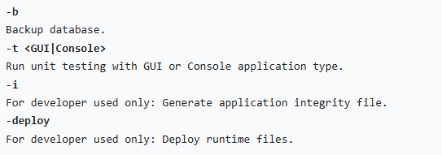
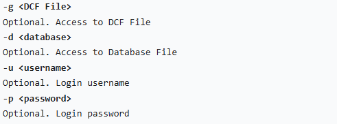
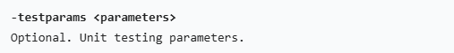
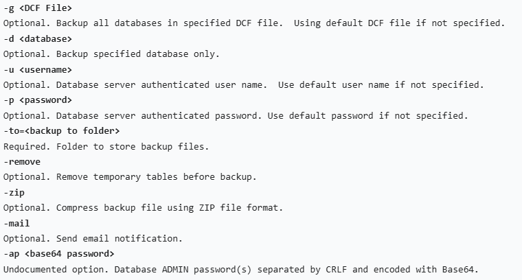
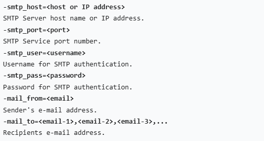

## Command Line Switches

The following switches are available when start SQL application from the command line.

You must precede all switches (unless otherwise noted) with a dash (-).

The switches are case-sensitive.

### Command switches

### General switches

### Unit testing switches

### Backup switches

### E-mail switches

