## Introduction

This is an External Utilities for other Application to Access Firebird Database.

1. **Pros**

    - Can direct Retrieve/Get, Delete and/or Modified the Information/Data From Connected Database.

2. **Cons**

    - User might lost concurrent license (i.e. need to buy double)
    - Might corrupt the database if not careful
    - Might cause unable to upgrade database due to database is "modified"
    - Setting need to reset if user change the database file name
    - Setting need to reset if estream change firebird version or table/field name

:::warning
Using this Application is at your own risk.
Estream will not responsible on any data corrupt or missing due to usage of this application.
No further support other then this but we will try our best to help.
:::

## Requirement

1. Firebird Server 3.0 & above:
    - [32 bits](https://github.com/FirebirdSQL/firebird/releases/download/R3_0_7/Firebird-3.0.7.33374_1_Win32.exe)
    - [64 bits](https://github.com/FirebirdSQL/firebird/releases/download/R3_0_7/Firebird-3.0.7.33374_1_x64.exe)
2. [SQL Accounting](https://www.sql.com.my/download/demo/sqlacc-setup.exe)

## Program

1. [Firebird ODBC 2.0.4.155 Win32](https://sourceforge.net/projects/firebird/files/firebird-ODBC-driver/2.0.4-Release/Firebird_ODBC_2.0.4.155_Win32.exe/download)
2. [Firebird ODBC 2.0.5.156 Win64](https://sourceforge.net/projects/firebird/files/firebird-ODBC-driver/2.0.5-Release/Firebird_ODBC_2.0.5.156_x64.exe/download)

## Setup

1. Open **Control Panel.**

2. Double Click **Administrative Tools |**
    - ODBC Data Sources (32-bit), or
    - ODBC Data Sources (64-bit)
3. Click on **System DSN** tab

4. Click **Add** button.

    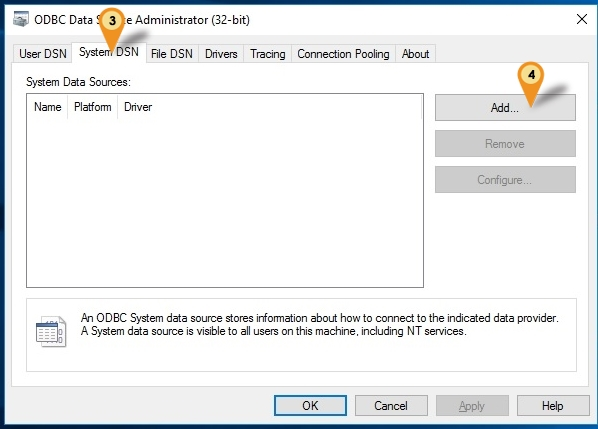

5. Select **Firebird/InterBase(r) Driver**

6. Click Finish button.

    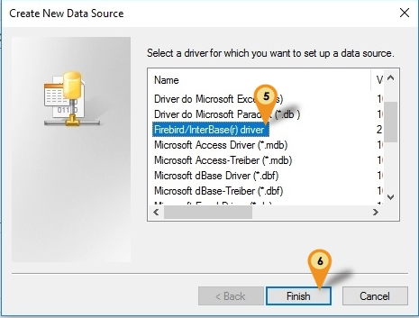

7. Under Firebird ODBC Setup, define the following info only and the rest by default :

    1. **Data Source Name (DSN)**: Can be any Name (eg. FB)
    2. **Description**: Can be any Description (eg. FB)
    3. **Database**:
        - The Firebird FDB file path
        - Can get it under SQLAccounting\DB or estream\DB Folder
    4. **Client**:
        - The Firebird fbclient.dll path
        - Can get it under SQLAccounting\firebird 3.0 or Firebird\Firebird 3_0 Folder
        - For 64 Bit can Leave it empty
    5. **Database Account**: Firebird user name (Default is **SYSDBA**)
    6. **Password**: Firebird password (Default is **masterkey**)
    7. **Character Set**: Set to **UTF8** (For FB3.0 & above)
    8. **Dialect**: Set to **3**
    9. **Read(default write)**: Check/Tick to make transactions read-only

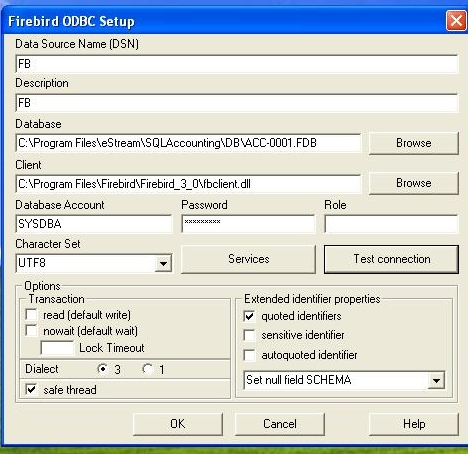

:::info

- Make sure when click **Test Connection** is shown Connection successful! then only continue others Steps
- To access the FDB with network environment you can enter the ServerName or ServerIPAddress:Database Path at Database field

Examples:

1. ServerPC: `C:\Program Files\estream\SQLAccounting\DB\ACC-0001.FDB`
2. 192.168.0.18: `C:\Program Files\estream\SQLAccounting\DB\ACC-0001.FDB`

:::

Below is example where to get the ServerName, Path & FDB

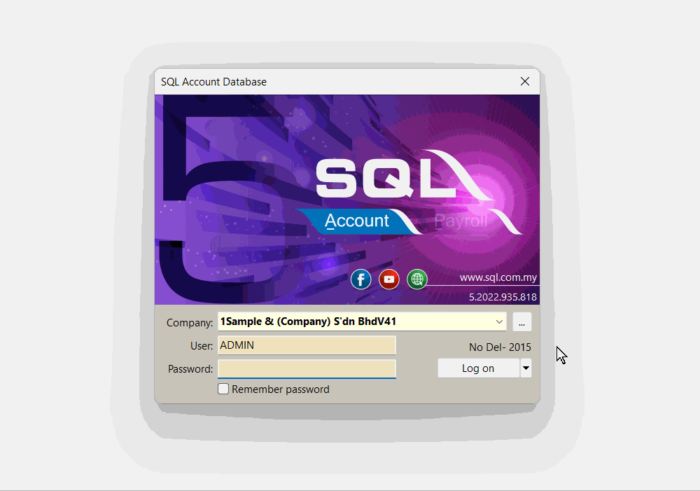

## Example Access From Microsoft Excel

Below example is using Microsoft Excel 2016 to get Firebird Data using ODBC

1. Create **New Worksheet**
2. Click **Data** Tab
3. Clcik **Get External Data | From Other Source | From Microsoft Query**

    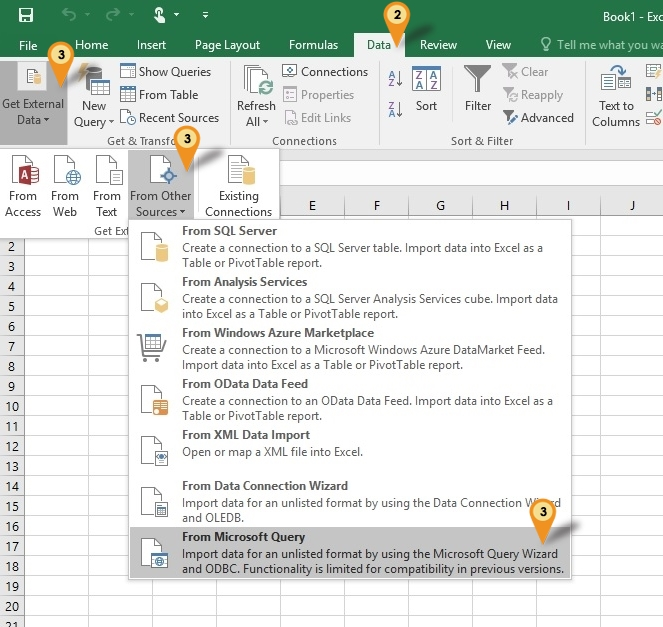

4. Select **FB\*** (The Data Source Name entered in ODBC)

5. Click **OK** button

    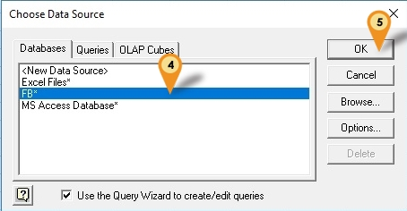

6. Select the table at the Available tables and columns field

7. Click the **>** button to select the Columns

8. Click **Next** button till you see below dialog

    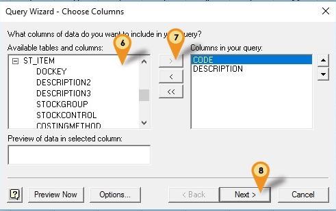

9. Select **View data or edit query** in Microsoft Query option

10. Click **Finish** button

    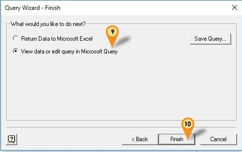

11. Click SQL button to edit your Query

12. Edit the **Query Statement here**

13. Click **OK button** when done

    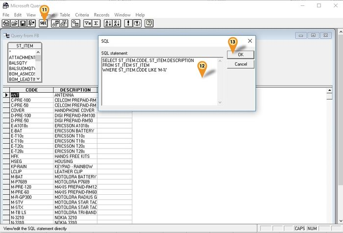

14. Click **File | Return Data to Microsoft Excel**

    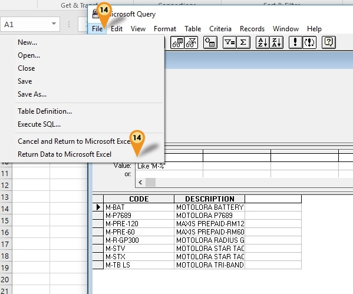

15. Click **Ok** button

    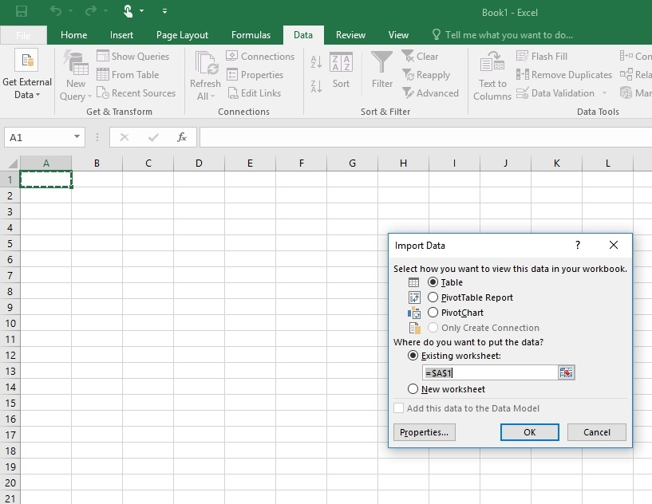

16. **Result**

    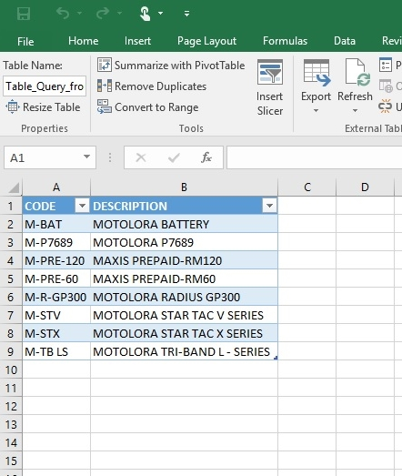
