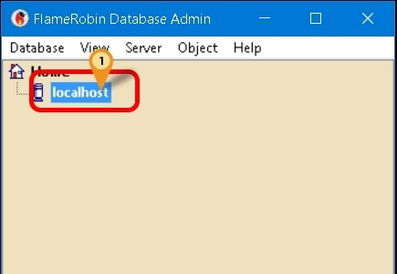
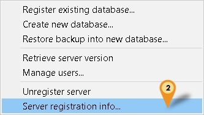
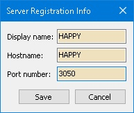
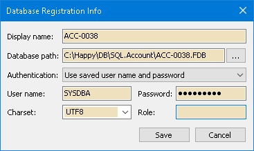
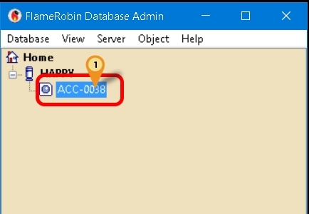
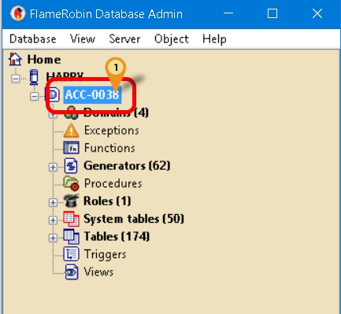
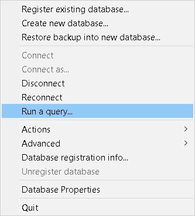
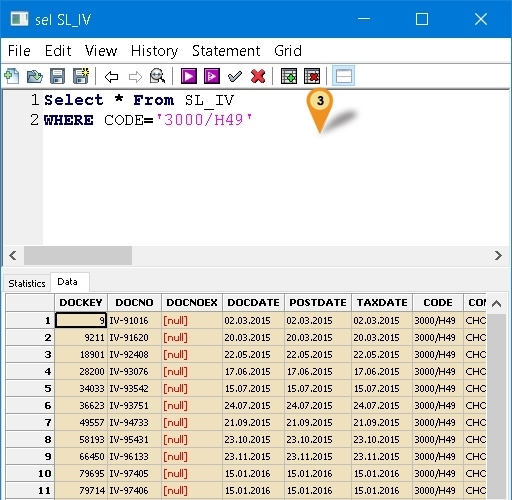

## Introduction

This is an External Firebird Console Application.

:::warning
Use of this application is at your own risk.
Estream is not responsible for any data corruption or loss resulting from the use of this application.
:::

## Requirement

1. Firebird Server

## Program

1. [Flame Robin Homepage](http://www.flamerobin.org/)
2. [Alternative Download](https://download.sql.com.my/customer/Fairy/FlameRobin(x64).zip)
3. MD5 : DCF5938386D92FE858803923CD171841 (Alternative Link Only)

## Installation

1. **Using Official Download**: Double-click the setup file and follow the Setup Wizard.
2. **Using Alternative Download**: Extract the files to your desired location.

## Steps

### Server Information

Only 1 time setting for each Firebird Version

1. Right Click Here

    

2. Select Server registration info...

    

3. Enter the following information:

    - **Display name**: Any name of your choice (e.g., Happy)
    - **Hostname**: Server Name or IP Address
    - **Port Number**: Firebird Port number (Default: **3050**)

    

4. Click **Save** button

### Register New Database

You can register multiple databases, but you can also register one and reuse its settings.

1. Click **Database | Register existing database...**

    

2. Enter the following information:

    - **Display name**: Any name of your choice (e.g., ACC-0038)
    - **Database path**: The Firebird FDB file path
    - **Authentication**: Select "Use saved username and password"
    - **Username**: Firebird username (Default: SYSDBA)
    - **Password**: Firebird password (Default: masterkey)
    - **Charset**: Set to UTF8 (For FB3.0 and above)
    - **Role**: Leave empty

3. Click **Save** button
4. Click **Database | Connect**

### Update/Reuse Registered Database

1. Select the database from the list:

    

2. Click **Database | Database Registration Info...**
3. You will see the same form as in Step 2 of "Register New Database" above
4. Update the **Display name** (optional) and **Database path** as needed
5. Click the **Save** button
6. Click **Database | Connect**

### Write Query

1. Select here

    

2. Click **Database | Run a query...**

    

3. Enter your SQL query in the query window:

    

4. Press **F4** to execute your query
5. Press **F5** to commit your query
