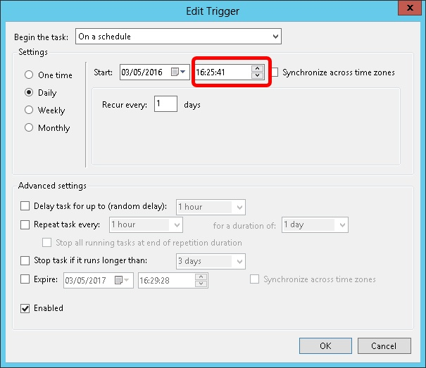

## Introduction

SQL application may backup database via Command Line Switches operation. The command line operation may backup all databases or specified database store in DCF file with proper switches.

The command line backup script may generated via context menu command in DCF: **Generate Backup Script**. The script may execute in console or batch file.

A common usage of backup script is execute the script in **Windows Task Scheduler** to backup database periodically. This action automate backup operation to ease administrator's task. Tasks added to Task Scheduler starts each time you start Windows, and runs in the background. With Task Scheduler, you can schedule a backup databases task to run daily, weekly, monthly, or at certain times (such as system startup).

This command line backup script is only applicable for **Windows 7 & above** only.

## Generate Backup Script for Database Group

1. To generate a backup script for all databases in the selected group:
2. Right-click the desired database group and select "Generate Backup Script"

## Generate Backup Script for Single Database

1. To generate a backup script for a single database:
2. Right-click the desired database and select "Generate Backup Script"

## Generate Backup Script

1. **Database (optional)**: If no database is specified, all databases in the group will be backed up
2. **Backup to**: Select the backup directory
3. **Admin Password(s)**: Enter admin user passwords for database access. For multiple databases with different admin passwords, separate passwords with commas. Use the adjacent button to toggle between plain text and masked password display
4. **Send Mail**: Enable to receive backup status notifications via email
5. **Zip Backup**: Enable to compress the backup into a zip file
6. **Test Email**: Click to verify successful email delivery to recipient accounts
7. **Copy**: The command text will be automatically copied to your clipboard for pasting into Windows Task Scheduler (accessible via the "Launch Window Task Scheduler" shortcut)

### Email setting for TMNet

- SMTP Host: **smtp-proxy.tm.net.my**
- SMTP Port No: **25**
- SMTP User: n/a. Leave empty
- SMTP Password: n/a. Leave empty
- Use SSL: **False** (or unticked)

### Email setting for Gmail

- SMTP Host: **smtp.gmail.com**
- SMTP Port No: **465**
- SMTP User: **e.g.: \<your-account>@gmail.com**
- SMTP Password: **\*\*\*\*\*\*\* \<app password>**
- Use SSL: **True** (or ticked)

:::success[note]
    1. [Guide to create & use app password](https://support.google.com/accounts/answer/185833?hl=en)
    2. [Google AppPassword](https://myaccount.google.com/apppasswords)
:::

### Email setting for Yahoo! Mail

- SMTP Host: **smtp.mail.yahoo.com**
- SMTP Port No: **465**
- SMTP User: **e.g.: \<your-account>@yahoo.com**
- SMTP Password: **\*\*\*\*\*\*\***
- Use SSL: **True** (or ticked)

### Email setting for private mail server

The following a sample setting. Configure according to your private mail server setting.

- SMTP Host: **\<your-mail-server>**
- SMTP Port No: **587**
- SMTP User: **e.g.: \<your-account>**
- SMTP Password: **\*\*\*\*\*\*\***
- Use SSL: **True or False**

### Email setting for MSN live mail or Hotmail

Unsupported

## Adding Backup Task to Windows Task Scheduler

1. Navigate to **Start > Accessories > System Tools > Task Scheduler**
2. Click **Action > Create Basic Task**

    

3. Enter a name for the task

    

4. Click Next and select when to trigger the task (e.g., Daily)

    

5. Click Next, then set the start date, start time, and daily recurrence

    

6. Click next, choose **Start a Program**

    

7. Click next, paste all the backup script text that you copied just now into ****"Program/Script"**

    

8. Set the Start in(optional) path to the Exe folder (eg. **C:\Estream\SQL Accounting**)
9. Click next, a dialog prompted and click **Yes**

    

10. Click **Next**
11. Tick the option **Open the Properties dialog for this task when I click Finish**

    

12. Click **Finish**
13. Select the option **Run whether user is logged on or not**

    

14. Click **Triggers** tab at top then click **Edit...** button

    

15. Change the time to run

    

16. Click OK 2 times

    

17. Enter the window **User Name & Password**
18. Click **Ok**

## Recommendations

- Schedule backups during off-hours (e.g., starting at 1:00 AM)
- Do not shut down the server while automatic backups are running
- Consider scheduling server shutdown and startup times for weekends as needed
