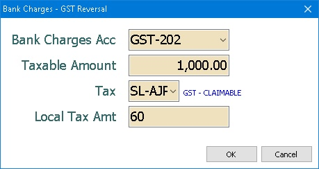
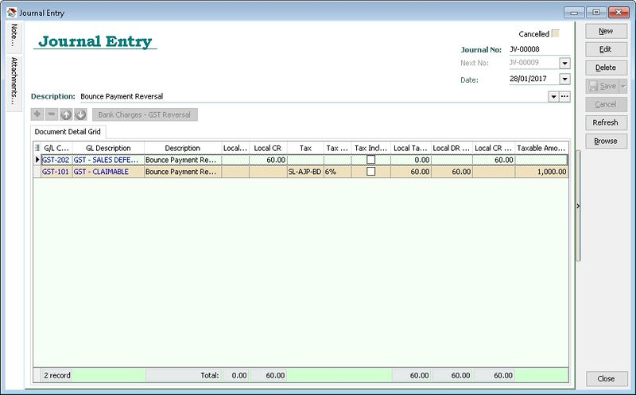
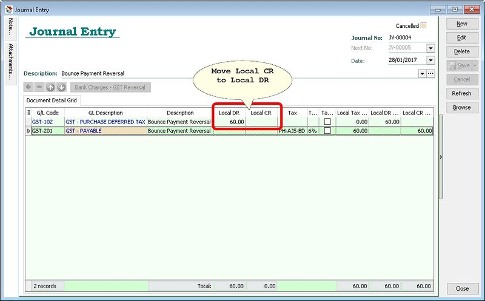

## Scenario

1. Invoice Date Jan 2016
2. Bad Debts Relief - Jul 2016 to Sep 2016
3. Payment Dec 2016
4. Bad Debts Recover - Oct 2016 to Dec 2016
5. **Payment Bounce - Jan 2017** \<--- Should do Adjustment on Bounce GST Period (before process GST-03)
6. Bad Debts Relief(after Adjustment) - Jan 2017 to Mar 2017
7. Replace New Cheque - Apr 2017
8. Bad Debts Recover - Apr 2017 to Jun 2017

## Solution

By using the GL Journal Voucher - Bank Charges - GST Reversal button

### Customer Side

At GST Period Jan 2017:

1. DR GST-101 - GST - CLAIMABLE --> (SL-AJP-BD)
2. CR GST-202 - GST - SALES DEFERRED TAX

### Supplier Side

For GST Period January 2017:

1. Debit: GST-102 - GST - PURCHASE DEFERRED TAX
2. Credit: GST-201 - GST - PAYABLE → (PH-AJS-BD)

