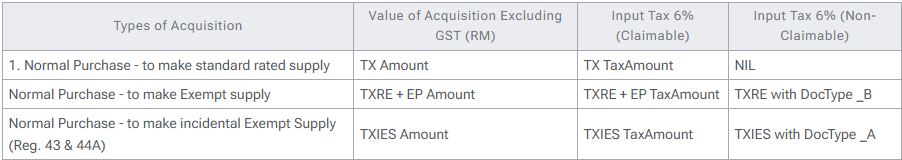

## Introduction

This report is available since 01 Apr 2015. It shown summary by the tax and transaction type. But this report unavailable in the latest GST Accounting Guidelines (02 Mar 2017). They is no detail on what to shown the amount from the Kastam web.

## Column Detail

Below is the column detail on how the amount is arrive from base on Users and Accountant Feedback:

### Input Tax

