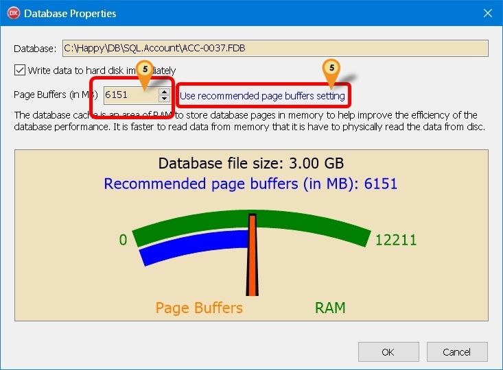

## Introduction

By default, Firebird does not fully utilize the available RAM. This feature allows you to manually allocate RAM size for each database, optimizing performance.

1. Pros
    1. Fully use the available RAM in server
    2. Increase the database performance
2. Cons
    1. Will slow down the Server Performance if not careful
    2. Not support for Standalone
3. Requirement
    1. Firebird Server
    2. Minimum 16 GB RAM
    3. A reliable Uninterrupted Power Supply or UPS (ie. backup power battery).

## Firebird Server Configuration

1. Browse to Firebird folder (Normally in `C:\Program Files\Firebird\Firebird_3_0` for Firebird 3).
2. Look for **firebird.conf** file & copy to Desktop.
3. Open the **firebird.conf** at Desktop.
4. Look for **#DefaultDbCachePages = 2048**.
5. Remove the **#** .
6. Change the **2048** to **1000000** for 16 GB RAM. (will use 8GB RAM)
7. Save the file.
8. Copy the **firebird.conf** at Desktop.
9. Paste & Replace it in the Firebird folder **firebird.conf** file.
10. Restart the Server.

## Client Configuration (SQL Account)

1. Click 3 dot button in the Login Screen
2. **Right Click** the **Database** you wanted to set.
3. Select **Properties**
4. Enter **ADMIN** Password
5. Enter the Size you wanted or Click Use recommended page buffers setting (Default is 300 MB)
6. Click OK

:::info
Important considerations when disabling "Write data to hard disk immediately":

1. Server must be protected by a reliable UPS (backup power supply)
2. Ensure proper server shutdown procedures are followed
3. Minimum operating system requirements:
    - Windows 11
    - Windows Server 2022
    - Or newer versions

:::

| Function                            | Description                                                                                                                                                                                    |
| ----------------------------------- | ---------------------------------------------------------------------------------------------------------------------------------------------------------------------------------------------- |
| Write data to hard disk immediately | **Enabled (Default):** Data is immediately written to disk on COMMIT — provides maximum data safety   **Disabled:** The operating system manages data writing to disk _(Not recommended)_ |
| Page Buffers (in MB)                | **Default: 16 MB** - Adjust based on your server's available RAM and performance requirements                                                                                                  |
