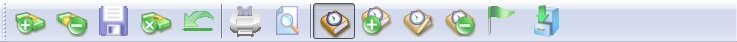
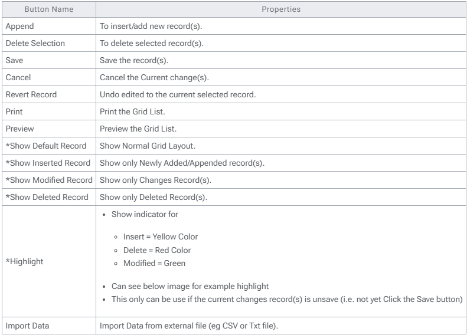
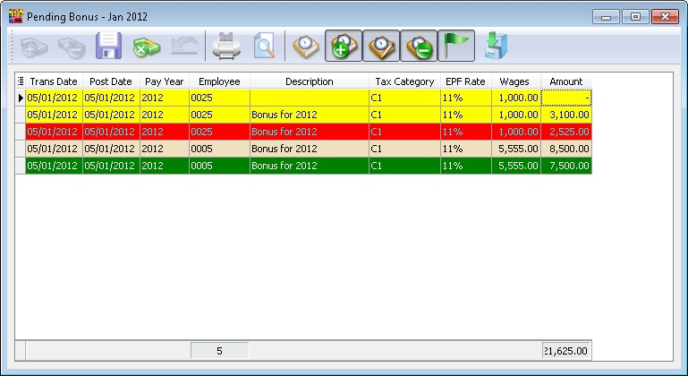
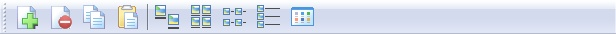
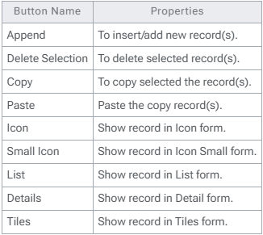

## Introduction

On top of every Grid Data entry user will see a list of some function buttons shown as below.

### Type 1

Below is the detail of each button (From Left)

### Type 2

Below is the detail of each button (From Left)

